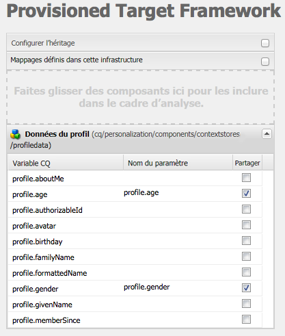
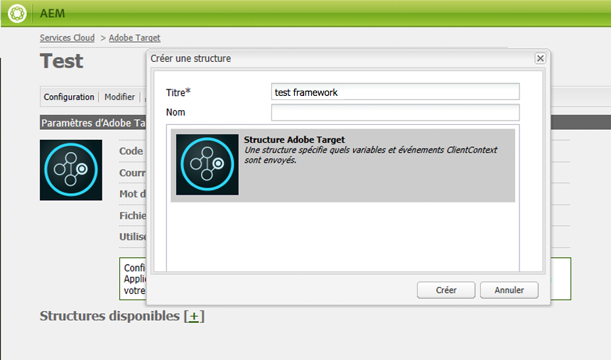
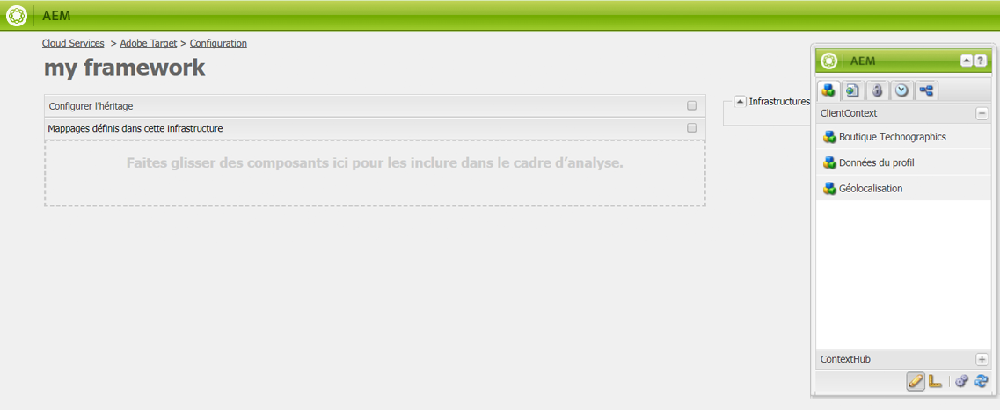
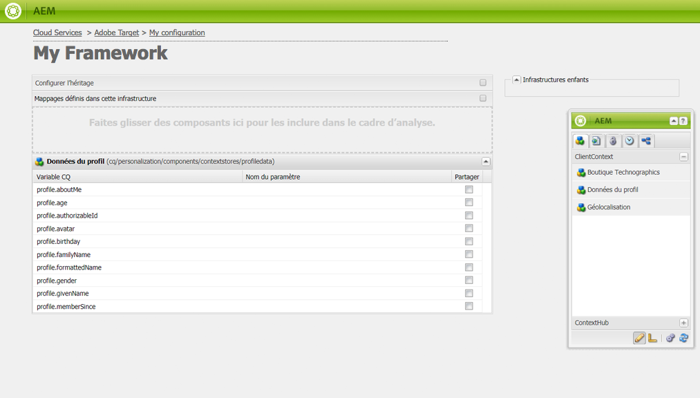
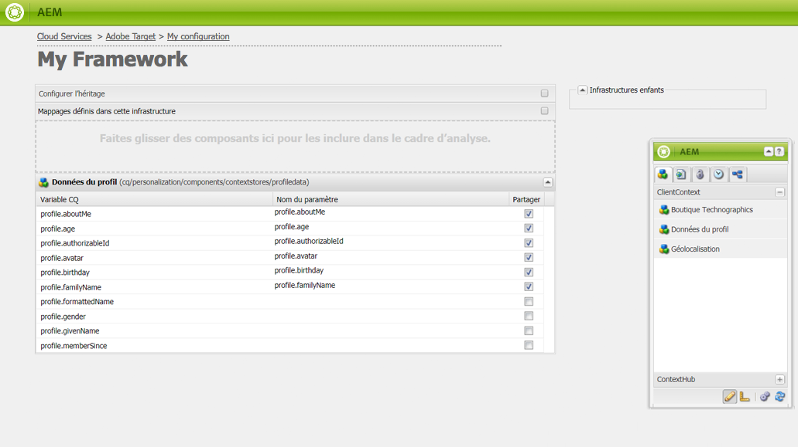
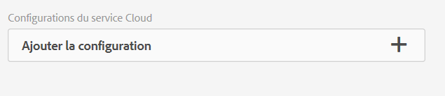

# Configuration manuelle de l’intégration à Adobe Target {#manually-configuring-the-integration-with-adobe-target}

Vous pouvez modifier les configurations de l’assistant de souscription que vous avez effectuées lors de l’utilisation de l’assistant, ou vous pouvez intégrer AEM manuellement à Adobe Target sans utiliser l’assistant.

## Modification des configurations de l’assistant de souscription {#modifying-the-opt-in-wizard-configurations}

The [Opt-in wizard](/help/sites-administering/opt-in.md) that [integrates AEM with Adobe Target](/help/sites-administering/target.md) automatically creates a Target cloud configuration named Provisioned Target Configuration. L’assistant crée également une structure Target pour la configuration de cloud appelée Structure Target mise en service. Vous pouvez modifier les propriétés de la configuration de cloud et de la structure si nécessaire.

Vous pouvez également configurer Adobe Target afin de l’utiliser en tant que source de création de rapports lors du ciblage du contenu en définissant la configuration d’A4T Analytics Cloud.

To locate the cloud configuration and the framework, Navigate to **Cloud Services** via **Tools** > **Deployment** > **Cloud**. ([http://localhost:4502/libs/cq/core/content/tools/cloudservices.html](http://localhost:4502/libs/cq/core/content/tools/cloudservices.html)) Sous Adobe Target, cliquez ou appuyez sur **Afficher les configurations**.

### Propriétés de configuration de Target mise en service {#provisioned-target-configuration-properties}

Les valeurs de propriétés suivantes sont utilisées dans la configuration de cloud de la configuration Target mise en service créée par l’assistant de souscription :

* **Code client :** Comme indiqué dans l’assistant d’ouverture de session.
* **Courriel :** Comme indiqué dans l’assistant d’ouverture de session.
* **Mot de passe :** Comme indiqué dans l’assistant d’ouverture de session.
* **Type d&#39;API :** REPOSE
* **Synchroniser les segments à partir de l&#39;Adobe Target :** Sélectionné.

* **Bibliothèque cliente :** mbox.js.
* **Utilisez la gestion dynamique des balises pour diffuser la bibliothèque cliente :** Non sélectionné. Select this option if you [use DTM](/help/sites-administering/dtm.md) or another tag management system to host the mbox.js or AT.js file. Adobe vous recommande d’utiliser la gestion dynamique des balises plutôt qu’AEM pour livrer la bibliothèque.

* **mbox.js personnalisé :** Aucun spécifié pour que le fichier mbox.js par défaut soit utilisé. Spécifiez un fichier mbox.js personnalisé selon vos besoins. S’affiche uniquement si vous avez sélectionné mbox.js.
* **Custom AT.js :** Aucun spécifié pour que le fichier AT.js par défaut soit utilisé. Spécifiez un fichier AT.js personnalisé selon vos besoins.  S’affiche uniquement si vous avez sélectionné AT.js.

>[!NOTE]
>
>In AEM 6.3, you can select the Target Library file, [AT.JS](https://docs.adobe.com/content/help/en/target/using/implement-target/client-side/mbox-implement/mbox-download.html), which is a new implementation library for Adobe Target that is designed for both typical web implementations and single-page applications.
>
>AT.js propose plusieurs améliorations par rapport à la bibliothèque mbox.js :
>
>* Temps de chargement des pages améliorés pour les mises en œuvre web
>* Sécurité renforcée
>* Meilleures options de mise en œuvre pour les applications d’une seule page
>* AT.js contient les composants qui étaient inclus dans target.js. Il n’y a donc plus d’appel à target.js.

### Propriétés de structure de Target mise en service {#provisioned-target-framework-properties}

La structure de Target mise en service créée par l’assistant de souscription est configurée pour envoyer des données contextuelles à partir du magasin de données de profil. Les éléments de données du magasin relatifs à l’âge et au sexe sont envoyés à Target par défaut. Votre solution requiert probablement l’envoi de paramètres supplémentaires.

Vous pouvez configurer la structure pour envoyer des informations contextuelles vers Target comme décrit dans [Ajout d’une structure de Target](/help/sites-administering/target-configuring.md#adding-a-target-framework).

### Définition de la configuration d’A4T Analytics Cloud {#configuring-a-t-analytics-cloud-configuration}

Vous pouvez configurer Adobe Target pour utiliser Adobe Analytics en tant que source de création de rapports lors du ciblage du contenu.

Pour ce faire, vous devez spécifier la configuration de cloud d’A4T pour connecter votre configuration de cloud Adobe Target de la façon suivante :

1. Navigate to **Cloud Services** via the **AEM logo** > **Tools** > **Deployment** > **Cloud Services**.
1. In the **Adobe Target** section, click **Configure Now**.
1. Reconnectez-vous à votre configuration Adobe Target.
1. Dans le menu déroulant **Configuration d’A4T Analytics Cloud**, sélectionnez la structure.

   >[!NOTE]
   >
   >Seules les fonctionnalités d’analyse qui sont activées pour A4T sont disponibles.
   >
   >En configurant A4T avec AEM, vous risquez de voir une entrée de référence de configuration manquante. Pour pouvoir sélectionner la structure d’analyse, procédez comme suit :
   >
   >1. Navigate to **Tools** > **General** > **CRXDE Lite**.
   1. Navigate to **/libs/cq/analytics/components/testandtargetpage/dialog/items/tabs/items/tab1_general/items/a4tAnalyticsConfig**
   1. Set the property **disable** to **false**.
   1. Appuyez ou cliquez sur **Tout enregistrer**.

   

   Cliquez sur **OK**. Lorsque vous ciblez le contenu avec Adobe Target, vous pouvez [choisir la source de rapport](/help/sites-authoring/content-targeting-touch.md).

## Intégration manuelle à Adobe Target {#manually-integrating-with-adobe-target}

Intégrez manuellement à Adobe Target au lieu d’utiliser l’assistant de souscription.

>[!NOTE]
The Target Library file, [AT.JS](https://docs.adobe.com/content/help/en/target/using/implement-target/client-side/mbox-implement/mbox-download.html), is a new implementation library for Adobe Target that is designed for both typical web implementations and single-page applications. Adobe recommande d’utiliser AT.js, au lieu de mbox.js, comme bibliothèque cliente.
AT.js propose plusieurs améliorations par rapport à la bibliothèque mbox.js :
* Temps de chargement des pages améliorés pour les mises en œuvre web
* Sécurité renforcée
* Meilleures options de mise en œuvre pour les applications d’une seule page
* AT.js contient les composants qui étaient inclus dans target.js. Il n’y a donc plus d’appel à target.js.

Vous pouvez sélectionner AT.js ou mbox.js dans le menu déroulant **Bibliothèque cliente**.

### Création d’une configuration de cloud Target {#creating-a-target-cloud-configuration}

Pour permettre à AEM d’interagir avec Adobe Target, créez une configuration de cloud Target. Pour créer la configuration, vous fournissez le code client et les informations d’identification d’utilisateur Adobe Target.

Vous créez la configuration de cloud Target une seule fois, car vous pouvez l’associer à plusieurs campagnes AEM. Si vous avez plusieurs codes client Adobe Target, créez une configuration pour chaque code client.

Vous pouvez configurer la configuration de cloud pour synchroniser les segments depuis Adobe Target. Si vous activez la synchronisation, les segments sont importés en arrière-plan à partir de Target dès que la configuration de cloud est enregistrée.

Utilisez la procédure suivante pour créer une configuration de cloud Target dans AEM :

1. Navigate to **Cloud Services** via the **AEM logo** > **Tools** > **Deployment** > **Cloud Services**. ([http://localhost:4502/libs/cq/core/content/tools/cloudservices.html](http://localhost:4502/libs/cq/core/content/tools/cloudservices.html))

   The **Adobe Marketing Cloud** overview page opens.

1. In the **Adobe Target** section, click **Configure Now**.
1. In the **Create Configuration** dialog:

   1. Give the configuration a **Title**.
   1. Select the **Adobe Target Configuration** template.
   1. Cliquez sur **Créer**.

   La boîte de dialogue de modification s’ouvre.

   

   >[!NOTE]
   En configurant A4T avec AEM, vous risquez de voir une entrée de référence de configuration manquante. Pour pouvoir sélectionner la structure d’analyse, procédez comme suit :
   1. Navigate to **Tools** > **General** > **CRXDE Lite**.
   1. Navigate to **/libs/cq/analytics/components/testandtargetpage/dialog/items/tabs/items/tab1_general/items/a4tAnalyticsConfig**
   1. Set the property **disable** to **false**.
   1. Appuyez ou cliquez sur **Tout enregistrer**.

1. Dans la boîte de dialogue, saisissez les valeurs pour ces propriétés.

   * **Code client** : code client du compte Target.
   * **Courrier électronique** : l’e-mail du compte Target.
   * **Mot de passe** : mot de passe du compte Target.
   * **Type d’API** : REST ou XML.
   * **Configuration d’A4T Analytics Cloud** : sélectionnez la configuration de cloud Analytics utilisée pour les objectifs et les mesures des activités de Target. Vous avez besoin de cette option si vous utilisez Adobe Analytics en tant que source de création de rapports lors du ciblage de contenu. If you do not see your cloud configuration, see note in [Configuring A4T Analytics Cloud Configuration](#configuring-a-t-analytics-cloud-configuration).

   * **Utiliser un ciblage précis :** Cette case à cocher est activée par défaut. Si cette option est sélectionnée, la configuration du service cloud attend le chargement du contexte avant de charger le contenu. Voir la remarque qui suit.
   * **Synchroniser les segments à partir d&#39;un Adobe Target :** Sélectionnez cette option pour télécharger les segments définis dans la Cible afin de les utiliser dans AEM. Vous devez sélectionner cette option lorsque la propriété Type d’API est REST, car les segments incorporés ne sont pas pris en charge, et vous devez toujours utiliser les segments de Target. (Notez que le terme « segment » d’AEM équivaut à « audience » dans Target.)
   * **Bibliothèque cliente :** Indiquez si vous souhaitez utiliser la bibliothèque cliente mbox.js ou AT.js.
   * **Utilisez la gestion dynamique des balises pour diffuser la bibliothèque** client : sélectionnez cette option pour utiliser AT.js ou mbox.js de la gestion dynamique des balises ou un autre système de gestion des balises. You must [configure the DTM integration](/help/sites-administering/dtm.md) to use this option. Adobe vous recommande d’utiliser la gestion dynamique des balises plutôt qu’AEM pour livrer la bibliothèque.
   * **Fichier mbox.js personnalisé** : laissez ce champ vierge si vous avez coché la case Gestion dynamique des balises ou pour utiliser le fichier mbox.js par défaut. Vous pouvez également télécharger votre fichier mbox.js personnalisé. S’affiche uniquement si vous avez sélectionné mbox.js.
   * **AT.js personnalisé** : laissez ce champ vierge si vous avez coché la case Gestion dynamique des balises ou pour utiliser le fichier AT.js par défaut. Vous pouvez également télécharger votre fichier AT.js personnalisé.  S’affiche uniquement si vous avez sélectionné AT.js.

   >[!NOTE]
   Par défaut, lorsque vous souscrivez à l’assistant de configuration Adobe Target, le ciblage précis est activé.
   Le ciblage précis implique que cette configuration du service cloud attend le chargement du contexte avant de charger le contenu. Par conséquent, en termes de performances, le ciblage précis peut entraîner un délai de quelques millisecondes avant le chargement du contenu.
   Le ciblage précis est toujours activé sur l’instance de création. Toutefois, sur l’instance de publication, vous pouvez choisir de le désactiver en désactivant la coche en regard de Ciblage précis dans la configuration du service cloud (**http://localhost:4502/etc/cloudservices.html**). Vous pouvez également toujours activer et désactiver le ciblage précis pour chaque composant, quel que soit le paramètre dans la configuration du service cloud.
   Si vous avez ***déjà*** créé les composants ciblés et si vous modifiez ce paramètre, vos modifications n’affectent pas ces composants. Vous devez effectuer toutes les modifications directement sur ces composants.

1. Cliquez sur **Se connecter à Target** pour lancer la connexion à Target. If the connection is successful, the message **Connection successful** is displayed. Cliquez sur **OK** dans le message et **OK** dans la boîte de dialogue.

   Si vous ne parvenez pas à vous connecter à Target, voir la section [Dépannage](/help/sites-administering/target-configuring.md#troubleshooting-target-connection-problems).

### Ajout d’une structure Target {#adding-a-target-framework}

Une fois que vous avez configuré la configuration de cloud Target, ajoutez une structure Target. La structure identifie les paramètres par défaut qui sont envoyés à Adobe Target à partir des composants [ClientContext](/help/sites-administering/client-context.md) ou [ContextHub](/help/sites-administering/contexthub-config.md). Target utilise les paramètres pour déterminer les segments qui s’appliquent au contexte actuel.

Vous pouvez créer des structures multiples pour une même configuration Target. Les structures multiples s’avèrent utiles lorsque vous devez envoyer un jeu de paramètres différent à Target pour différentes sections de votre site web. Créez une structure pour chaque jeu de paramètres que vous avez besoin d’envoyer. Associez chaque section de votre site web à la structure appropriée. Notez qu’une page web peut utiliser uniquement une structure à la fois.

1. On your Target configuration page, click the **+** (plus sign) next to Available Frameworks.
1. In the Create Framework dialog, specify a **Title**, select the **Adobe Target Framework**, and click **Create**.

   

   La page de structure s’ouvre. Sidekick provides components that represent information from the [Client Context](/help/sites-administering/client-context.md) or [ContextHub](/help/sites-administering/contexthub-config.md) that you can map.

   

1. Faites glisser le composant ClientContext représentant les données que vous souhaitez utiliser pour mettre en correspondance avec la cible de dépôt. Vous pouvez également faire glisser le composant **Boutique ContextHub** vers la structure.

   >[!NOTE]
   Lors de la mise en correspondance, les paramètres sont transmis à un mbox via des chaînes simples. Vous ne pouvez pas mettre en correspondance des tableaux à partir de ContextHub.

   For example, to use **Profile Data** about your site vistors to control your Target campaign, drag the **Profile Data** component to the page. Les variables de données de profil disponibles pour le mappage aux paramètres de Cible s’affichent.

   

1. Sélectionnez les variables que vous souhaitez rendre visibles au système Adobe Target en cochant la case **Partager** dans les colonnes appropriées.

   

   >[!NOTE]
   La synchronisation des paramètres est unidirectionnelle uniquement, d’AEM à Adobe Target.

La structure est créée. Pour répliquer la structure sur l’instance de publication, utilisez l’option **Activer le cadre** dans le sidekick.

### Association des activités à la configuration de cloud Target  {#associating-activities-with-the-target-cloud-configuration}

Associate your [AEM activities](/help/sites-authoring/activitylib.md) with your Target cloud configuration so that you can mirror the activities in [Adobe Target](https://docs.adobe.com/content/help/en/target/using/experiences/offers/manage-content.html).

>[!NOTE]
Les types d’activités disponibles sont déterminés par ce qui suit :
* Si l’option **xt_only** est activée sur le client Adobe Target (clientcode) utilisé sur AEM pour se connecter à Adobe Target, vous pouvez créer **uniquement** des activités XT dans AEM.

* Si les options **xt_only** **ne sont pas** activées sur le client Adobe Target (clientcode), vous pouvez créer **à la fois** des activités XT et A/B dans AEM.

**Remarque :** L’option **xt_only** est un paramètre appliqué à un certain client Adobe Target (clientcode) et peut uniquement être modifiée directement dans Adobe Target. Vous ne pouvez pas activer ou désactiver cette option dans AEM.

### Association de la structure Target à votre site {#associating-the-target-framework-with-your-site}

Après avoir créé une structure Target dans AEM, associez vos pages web à la structure. Les composants ciblés sur les pages envoient les données définies par la structure vers Adobe Target pour le suivi. (voir [Ciblage de contenu](/help/sites-authoring/content-targeting-touch.md)). 

Lorsque vous associez une page à la structure, les pages enfants héritent de l’association.

1. In the **Sites** console, navigate to the site that you want to configure.
1. Using either [quick actions](/help/sites-authoring/basic-handling.md#quick-actions) or [selection mode](/help/sites-authoring/basic-handling.md), select **View Properties.**
1. Sélectionnez l’onglet **Services cloud**.
1. Appuyez/cliquez sur **Modifier**.
1. Appuyez/cliquez sur **Ajouter la configuration** sous **Configurations du service cloud** et sélectionnez **Adobe Target**.

   

1. Sélectionnez la structure souhaitée sous **Référence de configuration**.

   >[!NOTE]
   Veillez à sélectionner la **structure** que vous avez créée et non la configuration cloud Target dans laquelle elle a été créée.

1. Appuyez/cliquez sur **Terminé.**
1. Activez la page racine du site web pour la répliquer sur le serveur de publication. (Voir [Publication de pages](/help/sites-authoring/publishing-pages.md).)

   >[!NOTE]
   Si la structure que vous avez jointe à la page n’était pas encore activée, un assistant s’ouvre pour vous permettre de la publier.

## Dépannage des problèmes de connexion à Target {#troubleshooting-target-connection-problems}

Effectuez les tâches suivantes pour résoudre les problèmes qui se produisent lors de la connexion à Target :

* Assurez-vous que les informations d’identification de l’utilisateur fournies sont correctes.
* Assurez-vous que l’instance AEM peut se connecter au serveur Target. Par exemple, assurez-vous que les règles de pare-feu ne bloquent pas les connexions AEM sortantes, ou qu’AEM est configuré pour utiliser les proxys nécessaires.
* Recherchez des messages utiles dans le journal d’erreurs d’AEM. Le fichier error.log situé dans le répertoire **crx-quickstart/logs** où AEM est installé.
* Lors de la modification de l’activité dans Adobe Target, l’URL pointe sur localhost. Pour contourner ce problème, définissez l’externaliseur AEM sur l’URL adéquate.

