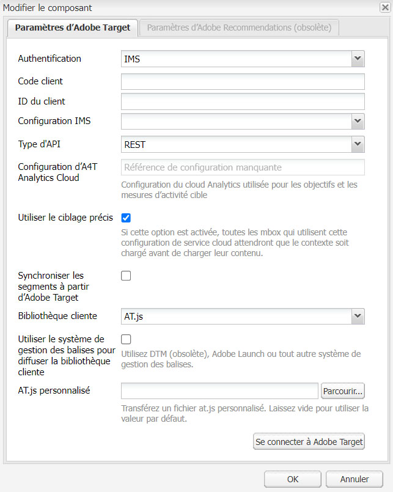

# Configuration manuelle de l’intégration à Adobe Target {#manually-configuring-the-integration-with-adobe-target}

Vous pouvez soit modifier les configurations de l’assistant d’accord préalable que vous avez effectuées lors de l’utilisation de l’assistant, soit intégrer manuellement Adobe Target sans utiliser l’assistant.

## Modification des configurations de l’assistant de souscription {#modifying-the-opt-in-wizard-configurations}

L’[assistant de souscription](/help/sites-administering/opt-in.md) qui [intègre AEM à Adobe Target](/help/sites-administering/target.md) crée automatiquement une configuration de cloud Target appelée Configuration Target mise en service. L’assistant crée également une structure Target pour la configuration de cloud appelée Structure Target mise en service. Si nécessaire, vous pouvez modifier les propriétés de la configuration et du framework cloud.

Vous pouvez également configurer Adobe Target pour utiliser Adobe Target en tant que source de création de rapports lors du ciblage de contenu en configurant la configuration d’Analytics Cloud A4T.

Pour trouver la configuration et le framework de cloud, accédez à **Services cloud** via **Outils** > **Déploiement** > **Cloud**. ([http://localhost:4502/libs/cq/core/content/tools/cloudservices.html](http://localhost:4502/libs/cq/core/content/tools/cloudservices.html)) Sous Adobe Target, cliquez sur **Afficher les configurations**.

### Propriétés de configuration de Target configurée {#provisioned-target-configuration-properties}

Les valeurs de propriété suivantes sont utilisées dans la configuration cloud Configuration de Target configurée créée par l’assistant d’accord préalable :

* **Code client :** tel que saisi dans l’assistant de souscription.
* **E-mail :** tel que saisi dans l’assistant de souscription.
* **Mot de passe :** tel que saisi dans l’assistant de souscription.
* **Type d’API :** REST.
* **Synchroniser les segments à partir d’Adobe Target :** sélectionné.

* **Bibliothèque cliente :** mbox.js.
* **Utiliser la gestion dynamique des balises pour diffuser la bibliothèque cliente :** non sélectionné. Sélectionnez cette option si vous [utilisez la gestion dynamique des balises](/help/sites-administering/dtm.md) ou un autre système de gestion des balises pour héberger le fichier mbox.js ou AT.js. Adobe vous recommande d’utiliser la gestion dynamique des balises plutôt qu’AEM pour livrer la bibliothèque.

* **Fichier mbox.js personnalisé :** aucun fichier n’est spécifié, pour que le fichier mbox.js par défaut soit utilisé. Spécifiez un fichier mbox.js personnalisé que vous souhaitez utiliser, selon vos besoins. Il s’affiche uniquement si vous avez sélectionné mbox.js.
* **AT.js personnalisé :** aucun fichier n’est spécifié, pour que le fichier AT.js par défaut soit utilisé. Spécifiez un fichier AT.js personnalisé que vous souhaitez utiliser, selon vos besoins.  S’affiche uniquement si vous avez sélectionné AT.js.

>[!NOTE]
>
>Dans AEM 6.3, vous pouvez sélectionner le fichier de bibliothèque cible, [AT.JS](https://developer.adobe.com/target/implement/client-side/atjs/atjs-functions/mboxcreate-atjs/), qui est une nouvelle bibliothèque de mise en œuvre pour Adobe Target conçue à la fois pour les mises en œuvre web standard et les applications d’une seule page.
>
>AT.js offre plusieurs améliorations par rapport à la bibliothèque mbox.js :
>
>* Amélioration des temps de chargement des pages pour les implémentations web
>* Amélioration de la sécurité
>* Meilleures options d’implémentation pour les applications d’une seule page
>* AT.js contient les composants qui étaient inclus dans target.js. Il n’y a donc plus d’appel à target.

<!-- OLD URL WHICH IS 404 https://experienceleague.adobe.com/docs/target/using/implement-target/client-side/mbox-implement/mbox-download.html -->

### Propriétés de cadre Target configurées {#provisioned-target-framework-properties}

La structure de Target mise en service créée par l’assistant de souscription est configurée pour envoyer des données contextuelles à partir du magasin de données de profil. Les éléments de données du magasin relatifs à l’âge et au sexe sont envoyés à Target par défaut. Votre solution nécessite probablement l’envoi de paramètres supplémentaires.


Vous pouvez configurer le framework pour envoyer des informations contextuelles supplémentaires à Target, comme décrit dans la section [Ajout d’un framework Target](/help/sites-administering/target-configuring.md#adding-a-target-framework).

### Configuration d’Analytics Cloud A4T {#configuring-a-t-analytics-cloud-configuration}

Vous pouvez configurer Adobe Target pour qu’il utilise Adobe Analytics comme source de création de rapports lors du ciblage du contenu.

>[!NOTE]
>
>L’authentification des informations d’identification d’utilisateur (héritée) ne fonctionne pas avec A4T (pour Target et Analytics). Par conséquent, les clients doivent utiliser l’authentification IMS plutôt que l’authentification avec les informations d’identification de l’utilisateur.

Pour ce faire, vous devez spécifier quelle configuration cloud d’A4T à connecter à votre configuration cloud Adobe Target :

1. Accédez à **Services cloud** via le **logo AEM** > **Outils** > **Déploiement** > **Services cloud**.
1. Dans la section **Adobe Target**, cliquez sur **Configurer maintenant**.
1. Reconnectez-vous à votre configuration Adobe Target.
1. Dans la **configuration d’Analytics Cloud A4T**, sélectionnez le framework.

   >[!NOTE]
   >
   >Seules les configurations d’analyse activées pour A4T sont disponibles.
   >
   >En configurant A4T avec AEM, vous risquez de voir une entrée de référence de configuration manquante. Pour sélectionner le framework d’analyse, procédez comme suit :
   >
   >1. Accédez à **Outils** > **Général** > **CRXDE Lite**.
   1. Accédez à la [Boîte de dialogue de configuration A4T Analytics](#a4t-analytics-config-dialog) (voir ci-dessous)
   1. Définissez la propriété **désactiver** sur **false**.
   1. Cliquez sur **Enregistrer tout**.

#### Boîte de dialogue de configuration A4T Analytics {#a4t-analytics-config-dialog}

```xml
/libs/cq/analytics/components/testandtargetpage/dialog/items/tabs/items/tab1_general/items/a4tAnalyticsConfig
```



Cliquez sur **OK**. Lorsque vous ciblez du contenu avec Adobe Target, vous pouvez [sélectionner la source de votre rapport](/help/sites-authoring/content-targeting-touch.md).

## Intégration manuelle avec Adobe Target {#manually-integrating-with-adobe-target}

Intégration manuelle avec Adobe Target au lieu d’utiliser l’assistant d’accord préalable.

>[!NOTE]
>
Le fichier de bibliothèque cible, [AT.JS](https://developer.adobe.com/target/implement/client-side/atjs/atjs-functions/mboxcreate-atjs/), est une nouvelle bibliothèque d’implémentation pour Adobe Target qui a été conçue pour les implémentations web classiques et les applications d’une seule page. Adobe vous recommande d’utiliser AT.js comme bibliothèque cliente au lieu de mbox.js.
>
AT.js offre plusieurs améliorations par rapport à la bibliothèque mbox.js :
>
* Amélioration des temps de chargement des pages pour les implémentations web
* Amélioration de la sécurité
* Meilleures options d’implémentation pour les applications d’une seule page
* AT.js contient les composants qui étaient inclus dans target.js. Il n’y a donc plus d’appel à target.js.
>
Vous pouvez sélectionner AT.js ou mbox.js dans le menu déroulant **Bibliothèque cliente**.

<!-- OLD URL from above was 404 https://experienceleague.adobe.com/docs/target/using/implement-target/client-side/mbox-implement/mbox-download.html -->

### Création d’une configuration du cloud Target {#creating-a-target-cloud-configuration}

Pour permettre à AEM d’interagir avec Adobe Target, créez une configuration de cloud Target. Pour créer la configuration, vous fournissez le code client Adobe Target et les informations d’identification de l’utilisateur.

Vous créez la configuration de cloud Target une seule fois, car vous pouvez l’associer à plusieurs campagnes AEM. Si vous disposez de plusieurs codes client Adobe Target, créez une configuration pour chaque code client.

Vous pouvez configurer la configuration de cloud pour synchroniser les segments depuis Adobe Target. Si vous activez la synchronisation, les segments sont importés de Target en arrière-plan lorsque la configuration cloud est enregistrée.

Pour créer une configuration cloud Target dans AEM, procédez come suit :

1. Accédez aux **Services cloud** via le **logo AEM** > **Outils** >**Services cloud** > **Services cloud hérités**. ([http://localhost:4502/libs/cq/core/content/tools/cloudservices.html](http://localhost:4502/libs/cq/core/content/tools/cloudservices.html))

   La page d’aperçu **Services cloud** s’ouvre.

1. Dans la section **Adobe Target**, cliquez sur **Configurer maintenant**.
1. Dans la boîte de dialogue **Créer une configuration** :

   1. Donnez un **titre** à la configuration.
   1. Sélectionnez le modèle **Configuration d’Adobe Target**.
   1. Cliquez sur **Créer**.

   La boîte de dialogue de modification s’ouvre.

   

   >[!NOTE]
   >
   En configurant A4T avec AEM, vous risquez de voir une entrée de référence de configuration manquante. Pour sélectionner le framework d’analyse, procédez comme suit :
   >
   1. Accédez à **Outils** > **Général** > **CRXDE Lite**.
   1. Accédez à **/libs/cq/analytics/components/testandtargetpage/dialog/items/tabs/items/tab1_general/items/a4tAnalyticsConfig**.
   1. Définissez la propriété **désactiver** sur **false**.
   1. Cliquez sur **Enregistrer tout**.

1. Dans la boîte de dialogue, saisissez les valeurs pour ces propriétés.

   * **Code client** : code client du compte Target.
   * **Adresse e-mail** : l’adresse e-mail du compte Target.
   * **Mot de passe** : le mot de passe du compte Target.
   * **Type d’API** : REST ou XML.
   * **Configuration Analytics Cloud A4T** : sélectionnez la configuration d’Analytics Cloud utilisée pour les objectifs et les mesures des activités de Target. Vous avez besoin de cette configuration si vous utilisez Adobe Analytics en tant que source de création de rapports lors du ciblage de contenu. Si vous ne voyez pas votre configuration cloud, consultez la remarque à ce sujet dans [Définition de la configuration cloud A4T Analytics](#configuring-a-t-analytics-cloud-configuration).

   * **Utiliser le ciblage précis** : par défaut, cette case est cochée. Si cette option est sélectionnée, la configuration du service cloud attend le chargement du contexte avant de charger le contenu. Lisez la remarque qui suivant.
   * **Synchroniser les segments à partir d’Adobe Target** : sélectionnez cette option pour télécharger les segments définis dans Target pour les utiliser dans AEM. Sélectionnez cette option lorsque la propriété Type d’API est REST, car les segments incorporés ne sont pas pris en charge, et vous devez utiliser les segments de Target. (Le terme AEM « segment » est l’équivalent d’« audience » dans Target.)
   * **Bibliothèque cliente** : indiquez si vous voulez la bibliothèque cliente mbox.js ou AT.js.
   * **Utiliser la gestion dynamique des balises pour diffuser la bibliothèque cliente** : sélectionnez cette option pour utiliser le mbox.js ou l’AT.js de la gestion dynamique des balises ou tout autre système de gestion des balises. Configurez l’[intégration de la gestion dynamique des balises](/help/sites-administering/dtm.md) pour utiliser cette option. Adobe vous recommande d’utiliser la gestion dynamique des balises plutôt qu’AEM pour livrer la bibliothèque.
   * **Fichier mbox.js personnalisé** : laissez ce champ vierge si vous avez coché la case Gestion dynamique des balises ou pour utiliser le fichier mbox.js par défaut. Vous pouvez également télécharger votre fichier mbox.js personnalisé. Il s’affiche uniquement si vous avez sélectionné mbox.js.
   * **AT.js personnalisé** : laissez ce champ vierge si vous avez coché la case Gestion dynamique des balises ou pour utiliser le fichier AT.js par défaut. Vous pouvez également télécharger votre fichier AT.js personnalisé. S’affiche uniquement si vous avez sélectionné AT.js.

   >[!NOTE]
   >
   Par défaut, lorsque vous souscrivez à l’assistant de configuration Adobe Target, le ciblage précis est activé.
   >
   Le ciblage précis implique que cette configuration du service cloud attend le chargement du contexte avant de charger le contenu. Par conséquent, en termes de performances, un ciblage précis peut créer un délai de quelques millisecondes avant le chargement du contenu.
   >
   Le ciblage précis est toujours activé sur l’instance de création. Toutefois, sur l’instance de publication, vous pouvez choisir de le désactiver en désactivant la coche en regard de Ciblage précis dans la configuration du service cloud (**http://localhost:4502/etc/cloudservices.html**). Vous pouvez également activer et désactiver le ciblage précis pour chaque composant, quel que soit votre paramètre dans la configuration du service cloud.
   >
   Si vous avez ***déjà*** créé les composants ciblés et si vous modifiez ce paramètre, vos modifications n’affectent pas ces composants. Modifiez directement ces composants.

1. Cliquez sur **Se connecter à Target** pour lancer la connexion à Target. Si la connexion est réussie, le message **Connexion réussie** s’affiche. Cliquez sur **OK** dans le message et **OK** dans la boîte de dialogue.

   Si vous ne pouvez pas vous connecter à Target, reportez-vous à la section [dépannage](/help/sites-administering/target-configuring.md#troubleshooting-target-connection-problems).

### Ajout d’un framework Target {#adding-a-target-framework}

Une fois que vous avez configuré la configuration de cloud Target, ajoutez une structure Target. La structure identifie les paramètres par défaut qui sont envoyés à Adobe Target à partir des composants [ClientContext](/help/sites-administering/client-context.md) ou [ContextHub](/help/sites-developing/ch-configuring.md). Target utilise les paramètres pour déterminer les segments qui s’appliquent au contexte actuel.

Vous pouvez créer des structures multiples pour une même configuration Target. Les structures multiples s’avèrent utiles lorsque vous devez envoyer un jeu de paramètres différent à Target pour différentes sections de votre site web. Créez un cadre pour chaque jeu de paramètres que vous envoyez. Associez chaque section de votre site web au cadre approprié. Une page web ne peut utiliser qu’un seul cadre à la fois.

1. Sur la page de configuration Target, cliquez sur le signe **+** en regard de Frameworks disponibles.
1. Dans la boîte de dialogue Créer un framework, spécifiez un **titre**, sélectionnez le **Framework Adobe Target** et cliquez sur **Créer**.

   

   La page de framework s’ouvre. Le sidekick fournit des composants qui représentent les informations de [ClientContext](/help/sites-administering/client-context.md) ou [ContextHub](/help/sites-developing/ch-configuring.md) que vous pouvez mettre en correspondance.

   

1. Faites glisser le composant ClientContext représentant les données que vous souhaitez utiliser pour mapper avec la cible de dépôt. Vous pouvez également faire glisser le composant **Boutique ContextHub** vers le framework.

   >[!NOTE]
   >
   Lors de la mise en correspondance, les paramètres sont transmis à un mbox via des chaînes simples. Vous ne pouvez pas mapper des tableaux à partir de ContextHub.

   Par exemple, pour utiliser les **données de profil** des visiteurs ou visiteuses de votre site afin de contrôler votre campagne Target, faites glisser le composant **Données de profil** vers la page. Les variables de données de profil qui sont disponibles pour la mise en correspondance des paramètres Target s’affichent.

   

1. Sélectionnez les variables que vous souhaitez rendre visibles pour le système Adobe Target en cochant la case **Partager** dans les colonnes appropriées.

   

   >[!NOTE]
   >
   La synchronisation des paramètres ne fonctionne que dans un sens : d’AEM à Adobe Target.

La structure est créée. Pour répliquer le framework sur l’instance de publication, utilisez la méthode **Activation du framework** dans le sidekick.

### Association d’activités à la configuration cloud Target  {#associating-activities-with-the-target-cloud-configuration}

Associez vos [activités AEM](/help/sites-authoring/activitylib.md) à la configuration de cloud Target afin de refléter les activités dans [Adobe Target](https://experienceleague.adobe.com/docs/target/using/experiences/offers/manage-content.html?=lang=fr).

>[!NOTE]
>
Les types d’activités disponibles sont déterminés par ce qui suit :
>
>
* Si l’option **xt_only** est activée sur le client Adobe Target (clientcode) utilisé sur AEM pour se connecter à Adobe Target, vous pouvez créer **uniquement** des activités XT dans AEM.
>
* Si l’option **xt_only** **n’est pas** activée sur le client Adobe Target (clientcode), vous pouvez créer **à la fois** des activités XT et A/B dans AEM.
>
**Remarque :** l’option **xt_only** est un paramètre appliqué à un certain client Adobe Target (clientcode) et peut uniquement être modifiée directement dans Adobe Target. Vous ne pouvez pas activer ni désactiver cette option dans AEM.

### Association du cadre Target à votre site {#associating-the-target-framework-with-your-site}

Après avoir créé une structure Target dans AEM, associez vos pages web à la structure. Les composants ciblés sur les pages envoient les données définies par la structure vers Adobe Target pour le suivi. (voir [Ciblage de contenu](/help/sites-authoring/content-targeting-touch.md)). 

Lorsque vous associez une page au framework, les pages enfants héritent de l’association.

1. Dans la console **Sites**, accédez au site à configurer.
1. À l’aide des [actions rapides](/help/sites-authoring/basic-handling.md#quick-actions) ou du [mode de sélection](/help/sites-authoring/basic-handling.md), sélectionnez **Afficher les propriétés.**
1. Sélectionnez l’onglet **Services cloud**.
1. Cliquez sur **Modifier**.
1. Cliquez sur **Ajouter une configuration** under **Configurations de Cloud Service** et sélectionnez **Adobe Target**.

   

1. Sélectionnez le cadre que vous souhaitez sous **Référence de configuration**.

   >[!NOTE]
   >
   Veillez à sélectionner le **cadre** spécifique que vous avez créé et non la configuration cloud Target dans laquelle il a été créé.

1. Cliquez sur **Terminé**.
1. Activez la page racine du site web pour la répliquer sur le serveur de publication. (Voir [Publication de pages](/help/sites-authoring/publishing-pages.md).)

   >[!NOTE]
   >
   Si la structure que vous avez jointe à la page n’a pas encore été activée, un assistant s’ouvre, vous permettant de la publier également.

## Résolution des problèmes de connexion à Target {#troubleshooting-target-connection-problems}

Pour résoudre les problèmes qui se produisent lors de la connexion à Target, vous pouvez effectuer les tâches suivantes :

* Assurez-vous que les informations d’identification que vous fournissez sont correctes.
* Assurez-vous que l’instance AEM peut se connecter au serveur Target. Par exemple, assurez-vous que les règles de pare-feu ne bloquent pas les connexions AEM sortantes ou qu’AEM est configuré pour utiliser les proxys nécessaires.
* Recherchez des messages utiles dans le journal d’erreurs d’AEM. Le fichier error.log se trouve dans le répertoire **crx-quickstart/logs** dans lequel AEM est installé.
* Lors de la modification de l’activité dans Adobe Target, l’URL pointe sur localhost. Pour contourner cette compréhension, définissez l’externaliseur d’AEM sur l’URL correcte.
