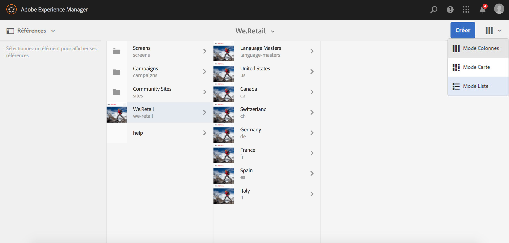

# Amélioration des traductions{#translation-enhancements}

Cette page présente les améliorations et les perfectionnements incrémentiels apportés aux capacités de gestion des traductions d’AEM.

## Automatisation des projets de traduction {#translation-project-automation}

Des options ont été ajoutées pour améliorer la productivité du travail avec les projets de traduction, telles que la promotion et la suppression automatiques des lancements de traduction et la planification de l’exécution récurrente d’un projet de traduction.

1. Dans votre projet de traduction, cliquez ou appuyez sur les points de suspension en bas de la mosaïque **Résumé de traduction**.

   

1. Passez dans l’onglet **Avancé**. En bas, vous pouvez sélectionner **Promouvoir automatiquement les lancements de traduction**.

   

1. Vous pouvez éventuellement sélectionner si, après avoir reçu du contenu traduit, les lancements de traduction doivent être automatiquement promus et supprimés.

   

1. Pour sélectionner l’exécution périodique d’un projet de traduction, sélectionnez la fréquence avec la liste déroulante sous **Répéter la traduction**. L&#39;exécution périodique du projet créera et exécutera automatiquement des tâches de traduction aux intervalles spécifiés.

   

## Projets de traduction multilingues {#multilingual-translation-projects}

Il est possible de configurer plusieurs langues de cible dans un projet de traduction, afin de réduire le nombre total de projets de traduction créés.

1. Dans votre projet de traduction, cliquez ou appuyez sur les points de suspension au bas de la mosaïque **Résumé de traduction**.

   

1. Passez dans l’onglet **Avancé**. Vous pouvez ajouter plusieurs langues sous **Langue de la Cible**.

   

1. Autrement, si vous lancez la traduction via le rail de références dans Sites, ajoutez vos langues et sélectionnez **Créer un projet de traduction multilingue**.

   

1. Les tâches de traduction sont créées dans le projet pour chaque langue cible. Elles peuvent être démarrées soit une par une au sein du projet, soit simultanément en exécutant le projet globalement dans l’administrateur de projets.

   

## Mise à jour des mémoires de traduction {#translation-memory-updates}

Les modifications manuelles du contenu traduit peuvent être synchronisées à nouveau dans le système de gestion de la traduction (TMS) pour former sa mémoire de traduction.

1. Dans la console Sites, après avoir mis à jour le contenu textuel dans une page traduite, sélectionnez **Mettre à jour la mémoire de traduction**.

   

1. Un mode Liste affiche côte à côte une comparaison de la source et de la traduction pour chaque composant de texte qui a été modifié. Sélectionnez les mises à jour de traduction à synchroniser avec la mémoire de traduction, puis sélectionnez **Mettre à jour la mémoire**.

   

   >[!NOTE]
   >
   >AEM enverra les chaînes sélectionnées vers le système de gestion de traduction.

## Copies de langue à plusieurs niveaux {#language-copies-on-multiple-levels}

Les racines de langues peuvent désormais être regroupées sous des nœuds, par exemple, par région, tout en étant toujours reconnues comme des racines de copies de langue.

>[!CAUTION]
>
>Un seul niveau est autorisé. Par exemple, les adresses suivantes ne permettent pas à la page « es » de se résoudre en une copie de langue :
>
>* `/content/we-retail/language-masters/en`
>* `/content/we-retail/language-masters/americas/central-america/es`

>
>
Cette copie de la langue `es` n’est pas détectée, car elle se trouve à deux niveaux (americas/central-america) du nœud `en`.

>[!NOTE]
>
>Les racines de langues peuvent avoir n’importe quel nom de page, plutôt que simplement le code ISO de la langue en question. AEM commence toujours par vérifier le chemin et le nom, mais si le nom de la page n’indique pas de langue, AEM vérifie la propriété cq:language de la page afin d’identifier la langue.

## Créations de rapports d’état de traduction {#translation-status-reporting}

Une propriété peut désormais être sélectionnée dans le mode Liste de Sites. Cette propriété indique si une page a été traduite, si elle est en cours de traduction ou si elle n’a pas encore été traduite. Pour l’afficher :

1. Dans Sites, passez en **mode Liste.**

   

1. Cliquez ou appuyez sur **Paramètres**.

   

1. Cochez la case **Traduit** sous **Traduction** et appuyez/cliquez sur **Mettre à jour**.

   

Vous voyez désormais une colonne **Traduit** qui indique l’état de traduction des pages.

