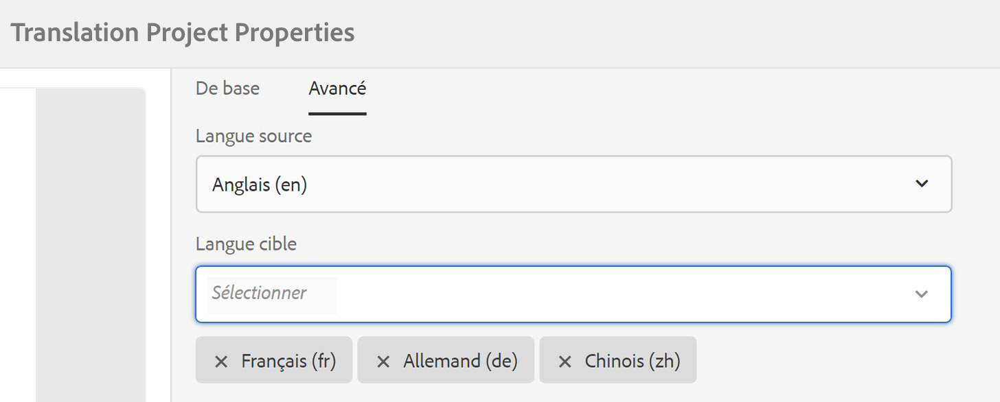

# Amélioration des traductions{#translation-enhancements}

Cette page présente des améliorations et des améliorations incrémentielles apportées aux fonctionnalités AEM gestion des traductions.

## Automatisation des projets de traduction {#translation-project-automation}

Des options pour améliorer la productivité des projets de traduction ont été ajoutées, telles que la promotion et la suppression automatiques des lancements de traduction, et la planification de l’exécution périodique d’un projet de traduction.

1. Dans votre projet de traduction, cliquez ou appuyez sur les points de suspension en bas de la mosaïque **Résumé de traduction**.

   

1. Passez dans l’onglet **Avancé**. En bas, vous pouvez sélectionner **Promouvoir automatiquement les lancements de traduction**.

   

1. Vous pouvez éventuellement choisir si, après réception du contenu traduit, les lancements de traduction doivent être automatiquement promus et supprimés.

   

1. Pour sélectionner l’exécution périodique d’un projet de traduction, sélectionnez la fréquence avec la liste déroulante sous **Répéter la traduction**. L’exécution périodique de projet crée et exécute automatiquement les tâches de traduction selon les intervalles spécifiés.

   

## Projets de traduction multilingues {#multilingual-translation-projects}

Il est possible de configurer plusieurs langues cibles dans un projet de traduction, afin de réduire le nombre total de projets de traduction créés.

1. Dans votre projet de traduction, cliquez ou appuyez sur les points de suspension en bas de la mosaïque **Résumé de traduction**.

   

1. Passez dans l’onglet **Avancé**. Vous pouvez ajouter plusieurs langues sous **Langue cible**.

   

1. Autrement, si vous lancez la traduction via le rail de références dans Sites, ajoutez vos langues et sélectionnez **Créer un projet de traduction multilingue**.

   

1. Les tâches de traduction sont créées dans le projet pour chaque langue cible. Elles peuvent être démarrées soit une par une au sein du projet, soit simultanément en exécutant le projet globalement dans l’administrateur de projets.

   

## Mise à jour des mémoires de traduction {#translation-memory-updates}

Les modifications manuelles du contenu traduit peuvent être synchronisées avec le système de gestion de traduction (TMS) pour entraîner sa mémoire de traduction.

1. Dans la console Sites, après la mise à jour de contenu textuel sur une page traduite, sélectionnez **Mettre à jour la mémoire de traduction**.

   

1. Une vue Liste affiche côte à côte une comparaison de la source et de la traduction pour chaque composant de texte qui a été modifié. Sélectionnez les mises à jour de traduction qui doivent être synchronisées avec la mémoire de traduction et sélectionnez **Mettre à jour la mémoire**.

   

AEM met à jour la traduction des chaînes existantes dans la mémoire de traduction du TMS configuré.

* L’action met à jour la traduction des chaînes existantes dans la mémoire de traduction du TMS configuré.
* Il ne crée pas de nouvelles tâches de traduction.
* Il renvoie les traductions au TMS, via l’API de traduction d’AEM (voir ci-dessous).

Pour utiliser cette fonctionnalité :

* Un TMS doit être configuré pour être utilisé avec AEM.
* Le connecteur doit implémenter la méthode [`storeTranslation`](https://developer.adobe.com/experience-manager/reference-materials/cloud-service/javadoc/com/adobe/granite/translation/api/TranslationService.html).
   * Le code de cette méthode détermine ce qui se passe avec la demande de mise à jour de la mémoire de traduction.
   * Le framework de traduction AEM renvoie les paires de valeurs de chaîne (traduction d’origine et mise à jour) au TMS via cette implémentation de méthode.

Les mises à jour de la mémoire de traduction peuvent être interceptées et envoyées vers une destination personnalisée, dans les cas où une mémoire de traduction propriétaire est utilisée.

## Copies de langue à plusieurs niveaux {#language-copies-on-multiple-levels}

Les racines de langues peuvent désormais être regroupées sous des nœuds, par exemple, par région, tout en étant toujours reconnues comme des racines de copies de langue.

>[!CAUTION]
>
>Un seul niveau est autorisé. Par exemple, les éléments suivants ne permettent pas à la page &quot;es&quot; de se résoudre sur une copie de langue :
>
>* `/content/we-retail/language-masters/en`
>* `/content/we-retail/language-masters/americas/central-america/es`
>
>Cette copie de la langue `es` n’est pas détectée, car elle se trouve à deux niveaux (americas/central-america) du nœud `en`.

>[!NOTE]
>
>Les racines de langues peuvent avoir n’importe quel nom de page, plutôt que simplement le code ISO de la langue en question. AEM vérifie toujours d’abord le chemin et le nom, mais si le nom de page n’identifie pas de langue, AEM vérifie la propriété cq:language de la page pour l’identification de la langue.

## Rapports d’état de traduction {#translation-status-reporting}

Une propriété peut désormais être sélectionnée dans la vue Liste de Sites. Cette propriété indique si une page a été traduite, si elle est en cours de traduction ou si elle n’a pas encore été traduite. Pour l’afficher, procédez comme suit :

1. Dans Sites, basculez vers la vue **Liste**.

   

1. Cliquez ou appuyez sur **Paramètres**.

   

1. Cochez la case **Traduit** sous **Traduction** et appuyez/cliquez sur **Mettre à jour**.

   

Vous voyez désormais une colonne **Traduit** qui indique le statut de traduction des pages.

