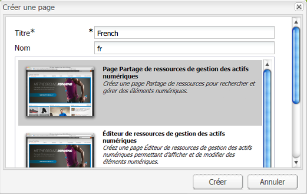
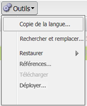
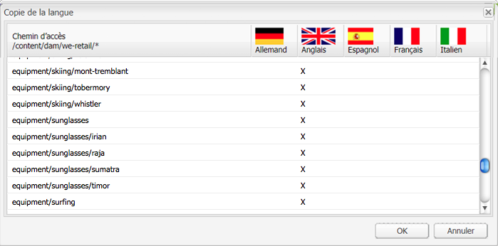

# Création d’une racine de langue à l’aide de l’interface utilisateur classique{#creating-a-language-root-using-the-classic-ui}

La procédure ci-dessous utilise l’interface utilisateur classique pour créer la racine de langue d’un site. Pour plus d’informations, voir [Création d’une racine de langue](/help/sites-administering/tc-prep.md#creating-a-language-root).

1. Dans la console Sites web, dans l’arborescence des sites web, sélectionnez la page racine du site. ([http://localhost:4502/siteadmin#](http://localhost:4502/siteadmin#))
1. Ajoutez une nouvelle page enfant représentant la version de langue du site :

   1. Sélectionnez Nouveau > Nouvelle page.
   1. Dans la boîte de dialogue, spécifiez le titre et le nom. Le nom doit être au format `<language-code>` ou `<language-code>_<country-code>`, par exemple en, en_US, en_us, en_GB, en_gb.

      * Le code langue pris en charge est un code à deux lettres en minuscules, défini par la norme ISO-639-1.
      * Le code pays pris en charge est un code à deux lettres en minuscules ou en majuscules, défini par la norme ISO-3166.
   1. Sélectionnez le modèle et cliquez sur Créer.

   

1. Dans la console Sites web, dans l’arborescence des sites web, sélectionnez la page racine du site.
1. Dans le menu Outils, sélectionnez Copie de la langue.

   

   La boîte de dialogue Copie de la langue affiche un tableau des versions linguistiques et des pages web disponibles. Une croix, « x », dans une colonne de langue signifie que la page est disponible dans cette langue.

   

1. Pour copier une page existante ou une arborescence de pages d’une version de langue, sélectionnez la cellule de la page en question dans la colonne de langue. Cliquez sur la flèche et sélectionnez le type de copie à créer.

   Dans l’exemple ci-dessous, la page équipement/lunettes/irian est copiée dans la version de langue française.

   

   | Type de copie de langue | Description |
   |---|---|
   | auto | Utilise le comportement des pages parents |
   | ignore | Ne crée pas de copie de cette page et de ses enfants |
   | `<language>+` (p. ex. Français+) | Copie la page et tous ses enfants de cette langue |
   | `<language>` (français, par exemple) | Copie uniquement la page de cette langue |

1. Cliquez sur OK pour fermer la boîte de dialogue.
1. Dans la boîte de dialogue suivante, cliquez sur Oui pour confirmer la copie.

