# Gestion de projets de traduction {#managing-translation-projects}

Après avoir préparé le contenu à traduire, vous devez compléter la structure linguistique en créant des copies de langue manquantes et créer des projets de traduction.

Les projets de traduction permettent de gérer la traduction du contenu d’AEM. Un projet de traduction est un type de [projet](/help/sites-authoring/projects.md) AEM, qui contient des ressources à traduire dans d’autres langues. Ces ressources sont les pages et les actifs des [copies de langue](/help/sites-administering/tc-prep.md) créées à partir du gabarit de langue.

Lorsque des ressources sont ajoutées à un projet de traduction, une tâche de traduction est créée pour ces ressources. Les tâches comportent les commandes et les informations sur le statut utilisées pour gérer les workflows de traduction humaine et automatique exécutés sur les ressources.

>[!NOTE]
>
>Un projet de traduction peut contenir plusieurs tâches de traduction.

Les projets de traduction sont des éléments dont l’exécution est longue, définis par langue et par méthode/fournisseur de traduction afin d’être en phase avec la gouvernance organisationnelle en matière d’internationalisation. Ils doivent être lancés une seule fois, que ce soit lors de la traduction initiale ou manuellement, et restent en vigueur pendant toute la durée des activités de mise à jour du contenu et de la traduction.

Les projets et les tâches de traduction sont créés avec des processus de préparation de la traduction. Ces workflows possèdent trois options pour la traduction initiale (Créer et traduire) comme pour les mises à jour (Mettre à jour une traduction) :

1. [Créer un projet](#creating-translation-projects-using-the-references-panel)
1. [Ajouter à un projet existant](#adding-pages-to-a-translation-project)
1. [Structure de contenu uniquement](#creating-the-structure-of-a-language-copy)

>[!NOTE]
>
>L’option 3 est indépendante de la tâche/du projet de traduction. Elle permet de copier les modifications apportées au contenu et à la structure du gabarit de langue aux copies de langue (non traduites). Vous pouvez l’utiliser pour préserver la synchronisation des gabarits de langue, même sans traduction.

## Réalisation de traductions initiales et mise à jour de traductions existantes {#performing-initial-translations-and-updating-existing-translations}

AEM détecte si un projet de traduction est créé pour la traduction initiale du contenu ou pour mettre à jour des copies de langue déjà traduites. Lorsque vous créez un projet de traduction d’une page et indiquez les copies de langue pour lesquelles vous effectuez la traduction, AEM détecte si la page source existe déjà dans les copies de langue ciblées :

* **La copie de langue n’inclut pas la page :** AEM traite cette situation comme une traduction initiale. La page est copiée immédiatement dans la copie de langue et incorporée au projet. Lorsque la page traduite est importée dans AEM, AEM la copie directement dans la copie de langue.
* **La copie de langue inclut déjà la page :** AEM traite cette situation comme une traduction mise à jour. Un lancement est créé, et une copie de la page est ajoutée au lancement et incorporée au projet. Les lancements vous permettent de passer en revue les traductions mises à jour avant de les valider dans la copie de langue :

   * Lorsque la page traduite est importée dans AEM, elle remplace la page du lancement.
   * La page traduite ne remplace la copie de langue que lorsque le lancement est converti.

Par exemple, la racine de la langue /content/geometrixx/fr est créée pour la traduction française de la langue principale /content/geometrixx/en. Il n’y a pas d’autres pages dans la copie de langue française.

* Un projet de traduction est créé pour la page /content/geometrixx/en/products et toutes les pages enfants, ciblant la copie de langue française. Comme la copie de langue ne comprend pas la page /content/geometrixx/fr/products, AEM copie immédiatement la page /content/geometrixx/en/products et toutes les pages enfants dans la copie de langue en français. Les copies sont également incluses dans le projet de traduction.
* Un projet de traduction est créé pour la page /content/geometrixx/en et toutes les pages enfants, ciblant la copie de langue en français. Comme la copie de langue comprend la page correspondant à la page /content/geometrixx/en (racine de langue), AEM copie la page /content/geometrixx/en et toutes les pages enfants et les ajoute à un lancement. Les copies sont également incluses dans le projet de traduction.

## Création de projets de traduction à l’aide du panneau Références {#creating-translation-projects-using-the-references-panel}

Créez des projets de traduction afin de pouvoir exécuter et gérer le processus pour traduire les ressources de votre gabarit de langue. Lorsque vous créez des projets, vous spécifiez la page dans le gabarit de langue que vous traduisez et les copies de langue pour lesquelles vous effectuez la traduction :

* La configuration cloud du framework d’intégration de traduction associé à la page sélectionnée détermine de nombreuses propriétés des projets de traduction, telles que le workflow de traduction à utiliser.
* Un projet est créé pour chaque copie de langue sélectionnée.
* Une copie de la page sélectionnée et des ressources associées est créée et ajoutée à chaque projet. Ces copies sont ensuite envoyées au fournisseur de traduction pour traduction.

Vous pouvez spécifier que les pages enfants de la page sélectionnée soient elles aussi sélectionnées. Dans ce cas, les copies des pages enfants sont également ajoutées à chaque projet afin d’être traduites. Lorsque des pages enfants sont associées à différentes configurations de la structure d’intégration de traduction, AEM crée des projets supplémentaires.

Vous pouvez également [créer manuellement des projets de traduction](#creating-a-translation-project-using-the-projects-console).

>[!NOTE]
>
>Pour créer un projet, votre compte doit être membre du groupe `project-administrators`.

**Traductions initiales et mise à jour de traductions**

Le panneau Références indique si vous mettez à jour les copies de langue existantes ou si vous créez la première version des copies de langue. Lorsqu’il existe une copie de langue pour la page sélectionnée, l’onglet Mettre à jour les copies de langue s’affiche pour donner accès aux commandes liées au projet.

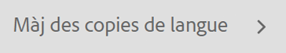

Après la traduction, vous pouvez [réviser la traduction](#reviewing-and-promoting-updated-content) avant de remplacer la copie de langue. Lorsqu’il n’existe aucune copie de langue pour la page sélectionnée, l’onglet Créer et traduire s’affiche pour donner accès aux commandes liées au projet.

### Création de projets de traduction pour une nouvelle copie de langue {#create-translation-projects-for-a-new-language-copy}

1. Utilisez la console Sites pour sélectionner la page que vous ajoutez aux projets de traduction.

   Par exemple, pour traduire les pages anglaises du site de démonstration de Geometrixx, sélectionnez Site de démonstration Geometrixx > Anglais.

1. Dans la barre d’outils, cliquez sur Références.

   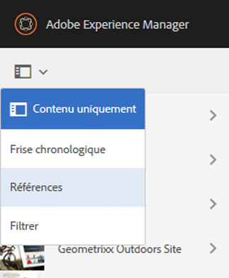

1. Sélectionnez Copies de langue, puis sélectionnez les copies de langue pour lesquelles vous traduisez les pages source.
1. Cliquez sur Créer et traduire, puis configurez la tâche de traduction :

   * Utilisez la liste déroulante Langues pour sélectionner une copie de langue à traduire. Sélectionnez d’autres langues, au besoin. Les langues qui apparaissent dans la liste correspondent aux [racines de langue que vous avez créées](/help/sites-administering/tc-prep.md#creating-a-language-root).
   * Pour traduire la page sélectionnée et toutes les pages enfant, sélectionnez « Sélectionner toutes les pages secondaires ». Pour ne traduire que la page sélectionnée, désélectionnez cette option.
   * Pour les projets, sélectionnez Créer un projet de traduction.
   * Saisissez un nom pour le projet.

   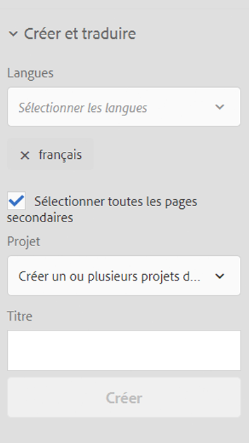

1. Cliquez sur Créer.

### Création de projets de traduction pour une copie de langue existante {#create-translation-projects-for-an-existing-language-copy}

1. Utilisez la console Sites pour sélectionner la page que vous ajoutez aux projets de traduction.

   Par exemple, pour traduire les pages anglaises du site de démonstration de Geometrixx, sélectionnez Site de démonstration Geometrixx > Anglais.

1. Dans la barre d’outils, cliquez sur Références.

   

1. Sélectionnez Copies de langue, puis sélectionnez les copies de langue pour lesquelles vous traduisez les pages source.
1. Cliquez sur Mettre à jour des copies de langue, puis configurez la tâche de traduction :

   * Pour traduire la page sélectionnée et toutes les pages enfant, sélectionnez « Sélectionner toutes les pages secondaires ». Pour ne traduire que la page sélectionnée, désélectionnez cette option.
   * Pour les projets, sélectionnez Créer un projet de traduction.
   * Saisissez un nom pour le projet.

   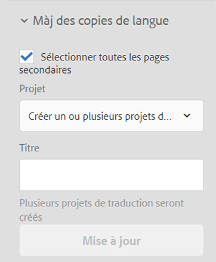

1. Cliquez sur Démarrer.

## Ajout de pages à un projet de traduction {#adding-pages-to-a-translation-project}

Après avoir créé un projet de traduction, vous pouvez utiliser le volet Ressources pour ajouter des pages au projet. Il est utile d’ajouter des pages lorsque vous incorporez des pages de différentes branches dans le même projet.

Lorsque vous ajoutez des pages à un projet de traduction, les pages sont incorporées à une nouvelle tâche de traduction. Vous pouvez également [ajouter des pages à une tâche existante](#adding-pages-assets-to-a-translation-job).

Comme lors de la création d’un projet, lorsque vous ajoutez des pages, des copies de pages sont ajoutées à un lancement, si nécessaire, afin d’éviter de remplacer des copies de langue. (Voir [Création de projets de traduction pour des copies de langue existantes](#performing-initial-translations-and-updating-existing-translations).)

1. Utilisez la console Sites pour sélectionner la page que vous ajoutez au projet de traduction.

   Par exemple, pour traduire les pages anglaises du site de démonstration de Geometrixx, sélectionnez Site de démonstration Geometrixx > Anglais.

1. Dans la barre d’outils, cliquez sur Références.

   

1. Sélectionnez Copies de langue, puis sélectionnez les copies de langue pour lesquelles vous traduisez les pages source.

   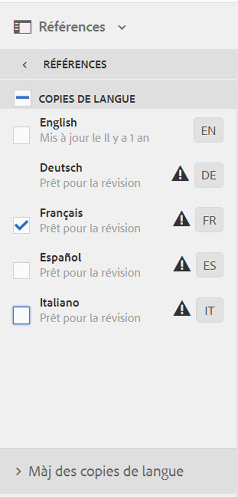

1. Cliquez sur Mettre à jour les copies de langue, puis configurez les propriétés :

   * Pour traduire la page sélectionnée et toutes les pages enfant, sélectionnez « Sélectionner toutes les pages secondaires ». Pour ne traduire que la page sélectionnée, désélectionnez cette option.
   * Pour le projet, sélectionnez Ajouter à un projet de traduction existant.
   * Sélectionnez le projet.

   >[!NOTE]
   >
   >La langue cible définie dans le projet de traduction doit correspondre au chemin d’accès à la copie de langue, comme indiqué dans le panneau Références.

   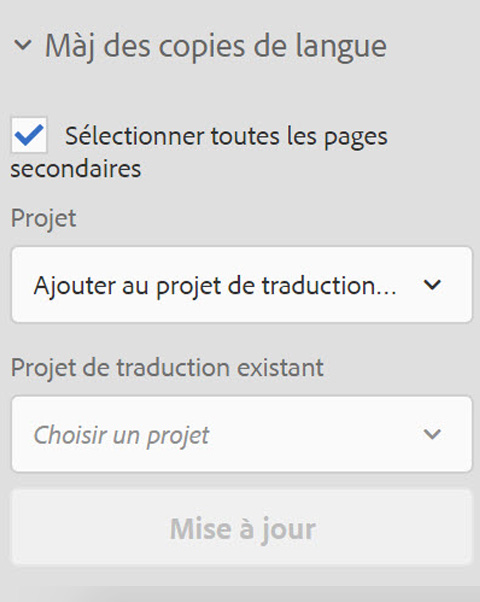

1. Cliquez sur Démarrer.

## Ajout de pages et/ou de ressources à une tâche de traduction {#adding-pages-assets-to-a-translation-job}

Vous pouvez ajouter des pages, des ressources, des balises ou des dictionnaires d’internationalisation (i18n) à la tâche de traduction de votre projet de traduction. Pour ajouter des pages ou des ressources, procédez comme suit :

1. Dans la partie inférieure de la vignette Tâche de traduction du projet de traduction, cliquez sur le bouton représentant des points de suspension.

   

1. Cliquez sur Ajouter et Pages/ressources.

   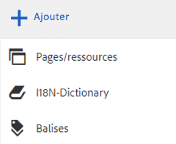

1. Sélectionnez l’élément le plus élevé de la branche à ajouter, puis cliquez sur l’icône de coche. Vous pouvez effectuer une sélection multiple.

   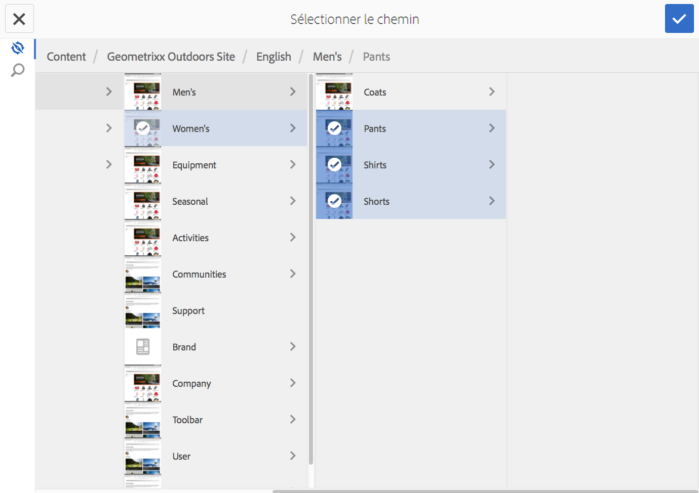

1. Vous pouvez également choisir l’icône de recherche pour rechercher des pages ou des ressources à ajouter à la tâche de traduction.

   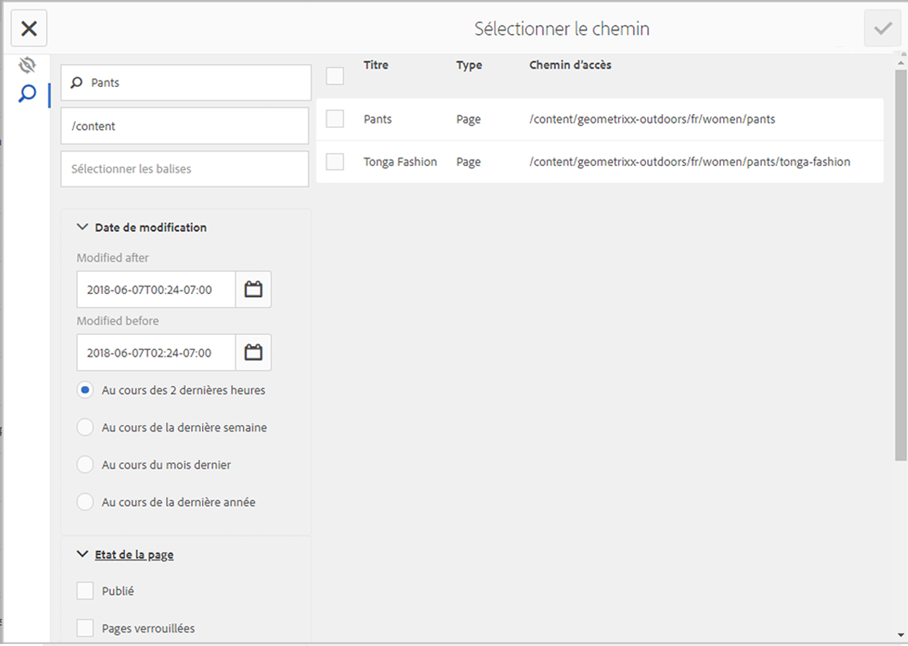

Les pages et/ou les ressources sont ajoutées à la tâche de traduction.

## Ajout de dictionnaires i18n à une tâche de traduction {#adding-i-n-dictionaries-to-a-translation-job}

Vous pouvez ajouter des pages, des ressources, des balises ou des dictionnaires d’internationalisation (i18n) à la tâche de traduction de votre projet de traduction. Pour ajouter un dictionnaire i18n :

1. Dans la partie inférieure de la vignette Tâche de traduction du projet de traduction, cliquez sur le bouton représentant des points de suspension.

   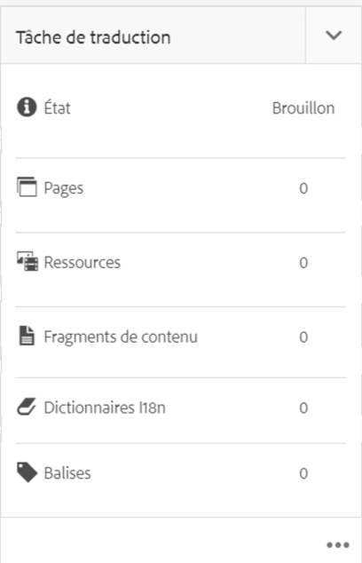

1. Cliquez sur Ajouter et dictionnaire I18N.

   

1. Sélectionnez le **répertoire racine** et le dictionnaire (si nécessaire) que vous souhaitez ajouter, puis sélectionnez **Ajouter**.

   

1. Si nécessaire, sélectionnez la nature de la mise à jour :

   

Le dictionnaire se trouve maintenant dans la tâche de traduction.

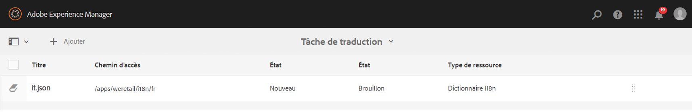

>[!NOTE]
>
>Pour plus d’informations sur les dictionnaires i18N, consultez [Utilisation du traducteur pour gérer des dictionnaires](/help/sites-developing/i18n-translator.md).

## Ajout de balises à une tâche de traduction {#adding-tags-to-a-translation-job}

Vous pouvez ajouter des pages, des ressources, des balises ou des dictionnaires d’internationalisation (i18n) à la tâche de traduction de votre projet de traduction. Pour ajouter des balises :

1. Dans la partie inférieure de la vignette Tâche de traduction du projet de traduction, cliquez sur le bouton représentant des points de suspension.

   

1. Cliquez sur Ajouter, puis sur Balises.

   

1. Sélectionnez les balises à ajouter, puis cliquez sur l’icône de coche. Vous pouvez effectuer une sélection multiple.

   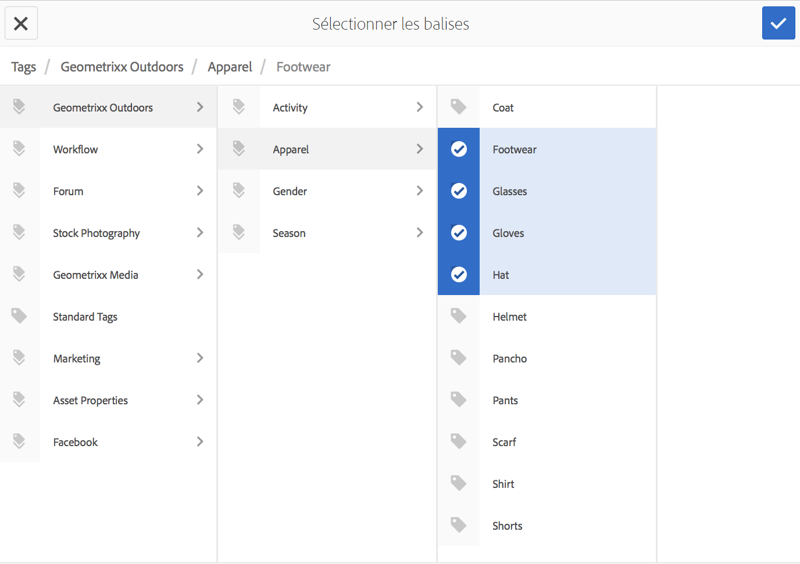

Les balises sont maintenant ajoutées à la tâche de traduction.

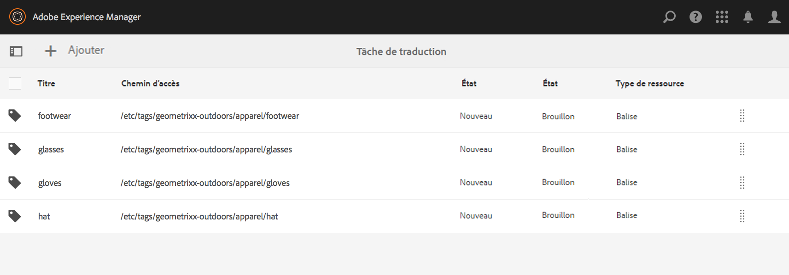

## Affichage des détails d’un projet de traduction {#seeing-translation-project-details}

La mosaïque Résumé de traduction contient les propriétés configurées pour un projet de traduction. Outre les [informations génériques du projet](/help/sites-authoring/projects.md#project-info), l’onglet Traduction contient des propriétés spécifiques à la traduction :

* Langue source : langue des pages en cours de traduction.
* Langue cible : langue vers laquelle les pages sont traduites.
* Méthode de traduction : processus de traduction. La traduction humaine ou la traduction automatique est prise en charge.
* Fournisseur de traduction : prestataire de services de traduction qui effectue la traduction.
* Catégorie de contenu : (traduction automatique) – La catégorie de contenu utilisée pour la traduction.
* Configuration cloud : configuration cloud du connecteur du service de traduction utilisé pour le projet.

Lors de la création d’un projet à l’aide du volet Ressources d’une page, ces propriétés sont configurées automatiquement en fonction des propriétés de la page source.

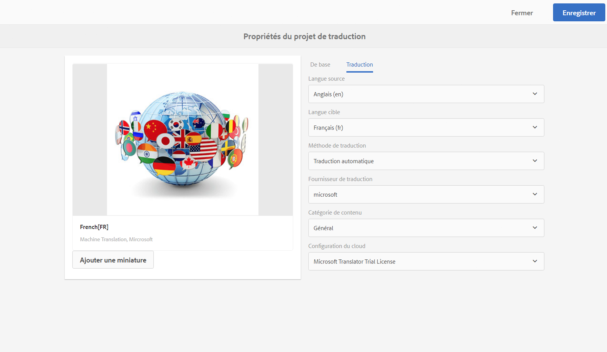

## Suivi du statut d’une tâche de traduction {#monitoring-the-status-of-a-translation-job}

La vignette Tâche de traduction d’un projet de traduction fournit le statut d’une tâche de traduction, ainsi que le nombre de pages et les ressources de la tâche.

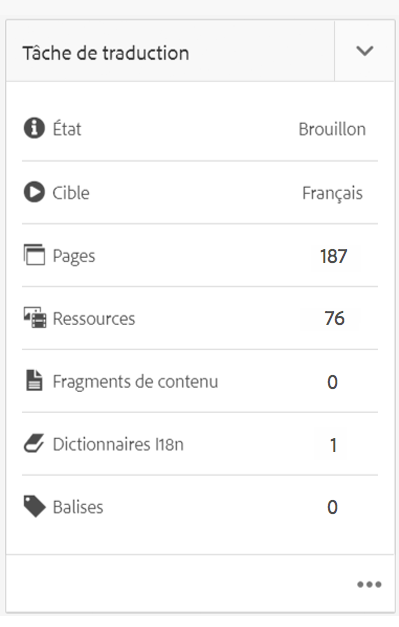

Le tableau ci-dessous décrit les différents statuts qu’une tâche ou un élément de la tâche peut avoir :

| État | Description |
|---|---|
| Brouillon | La tâche de traduction n’a pas été démarrée. Lors de leur création, les tâches de traduction présentent le statut BROUILLON. |
| Envoyé | Les fichiers de la tâche de traduction ont ce statut lorsqu’ils ont été correctement envoyés au service de traduction. Ce statut est défini après l’exécution de la commande Demander la portée ou Commencer. |
| Demander la portée | Pour le workflow de traduction humaine, les fichiers de la tâche ont été soumis au fournisseur de traduction pour la définition de la portée. Ce statut est défini après l’exécution de la commande Demander la portée. |
| Portée terminée | Le fournisseur a défini la portée de la tâche de traduction. |
| Engagé pour traduction | Le propriétaire du projet a accepté la portée. Ce statut indique que le fournisseur de traduction doit commencer à traduire les fichiers de la tâche. |
| Traduction en cours | Pour une tâche, la traduction d’un ou plusieurs fichiers de la tâche n’est pas encore terminée. Pour un élément de la tâche, l’élément est en cours de traduction. |
| Traduit | Pour une tâche, la traduction de tous les fichiers de la tâche est terminée. Pour un élément de la tâche, l’élément est traduit. |
| Prêt pour la révision | L’élément de la tâche est traduit et le fichier a été importé dans AEM. |
| Terminé | Le propriétaire du projet a indiqué que le contrat de traduction était terminé. |
| Annuler | Indique que le fournisseur de traduction doit arrêter de travailler sur une tâche de traduction. |
| Erreur de mise à jour | Une erreur s’est produite lors du transfert de fichiers entre AEM et le service de traduction. |
| Statut indéterminé | Une erreur inconnue est survenue. |

Pour afficher le statut des différents fichiers de la tâche, cliquez sur les trois points au bas de la vignette.

## Définition du délai des tâches de traduction {#setting-the-due-date-of-translation-jobs}

Spécifiez la date à laquelle le fournisseur de traduction doit renvoyer les fichiers traduits. Vous pouvez définir la date d’échéance du projet ou d’une tâche spécifique :

* **Projet :** les tâches de traduction du projet héritent de la date d’échéance.
* **Tâche :** la date d’échéance que vous définissez pour la tâche remplace la date d’échéance définie pour le projet.

La définition du délai ne fonctionne correctement que lorsque le fournisseur de traduction auquel vous faites appel prend en charge cette fonctionnalité.

La procédure suivante définit la date d’échéance d’un projet.

1. Cliquez sur le bouton représentant des points de suspension de la vignette Résumé de traduction.

   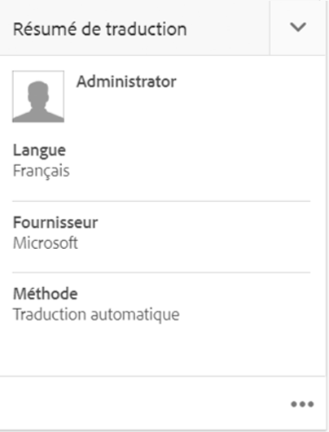

1. Sur l’onglet De base, utilisez le sélecteur de date de la propriété Échéance pour sélectionner le délai.

   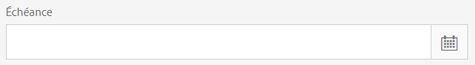

1. Cliquez sur Terminé.

La procédure suivante définit la date d’échéance d’une tâche de traduction.

1. Sur la vignette Tâche de traduction, cliquez le menu Commandes, puis sur Date d’échéance.

   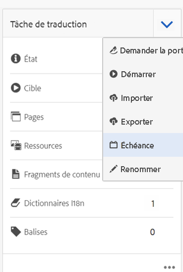

1. Dans la boîte de dialogue, cliquez sur l’icône de calendrier, sélectionnez la date et l’heure à utiliser comme date d’échéance, puis cliquez sur Enregistrer.

   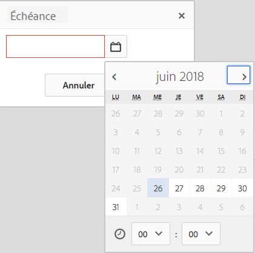

## Définition de la portée d’une tâche de traduction {#scoping-a-translation-job}

Définissez la portée de la tâche de traduction afin que le prestataire de services de traduction vous fournisse une estimation du coût de la traduction. Lorsque vous définissez la portée d’une tâche, les fichiers source sont envoyés au fournisseur de traduction, qui compare le texte à son pool de traductions stockées (mémoire de traduction). En règle générale, la portée (ou scope) correspond au nombre de mots à traduire.

Pour obtenir plus d’informations sur les résultats de la portée, contactez votre fournisseur de traduction.

>[!NOTE]
>
>La définition de la portée est facultative. Vous pouvez démarrer une tâche de traduction sans définir de portée.

Lorsque vous définissez la portée d’une tâche de traduction, le statut de la tâche est `Scope Requested`. Lorsque le fournisseur de traduction renvoie la définition de la portée, le statut devient `Scope Completed`. Lorsque la définition de la portée est terminée, vous pouvez utiliser la commande Afficher la portée pour consulter les résultats de la définition de la portée.

La définition de la portée ne fonctionne correctement que lorsque le fournisseur de traduction auquel vous faites appel prend en charge cette fonctionnalité.

1. Dans la console Projets, ouvrez votre projet de traduction.
1. Sur la vignette Tâche de traduction, cliquez le menu Commandes, puis sur Portée de la requête.

   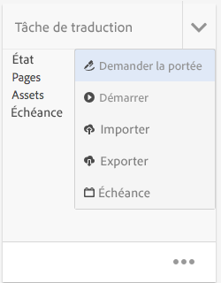

1. Lorsque le statut de la tâche devient SCOPE_COMPLETED, cliquez sur le menu Commandes dans la vignette Tâche de traduction, puis cliquez sur Afficher la portée.

## Commencer une tâche de traduction {#starting-a-translation-job}

Commencez une tâche de traduction pour traduire les pages source dans la langue cible. La traduction est effectuée selon les valeurs des propriétés de la mosaïque Résumé de traduction.

Une fois que vous avez commencé la tâche de traduction, la mosaïque Tâche de traduction affiche le statut Traduction en cours.

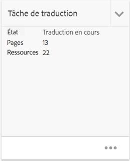

1. Dans la console Projets, ouvrez le projet de traduction.
1. Sur la vignette Tâche de traduction, cliquez le menu Commandes, puis sur Démarrer.

   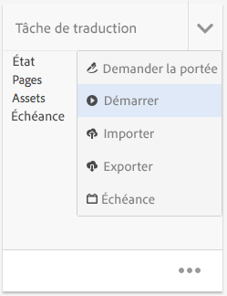

1. Dans la boîte de dialogue Action qui confirme le début de la traduction, cliquez sur Fermer.

## Annulation d’une tâche de traduction {#canceling-a-translation-job}

Annulez une tâche de traduction pour suspendre le processus de traduction et empêcher le fournisseur de traduction d’effectuer d’autres traductions. Vous pouvez annuler une tâche lorsque la tâche dispose du statut `Committed For Translation` ou `Translation In Progress`.

1. Dans la console Projets, ouvrez le projet de traduction.
1. Sur la vignette Tâche de traduction, cliquez le menu Commandes, puis sur Annuler.
1. Dans la boîte de dialogue Action qui confirme l’annulation de la traduction, cliquez sur OK.

## Workflow Accepter/Rejeter {#accept-reject-workflow}

Lorsque le contenu revient après traduction et possède le statut Prêt pour la révision, vous pouvez passer à la tâche de traduction et accepter/rejeter le contenu.

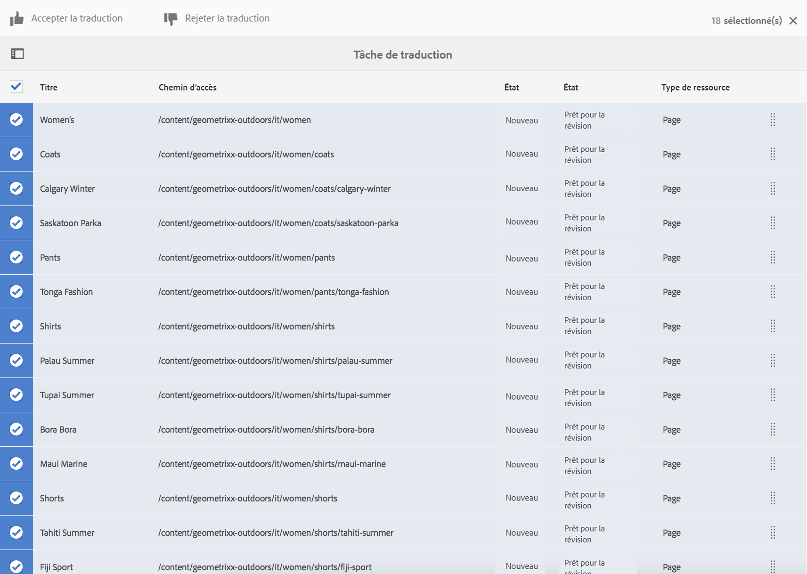

Si vous sélectionnez Rejeter la traduction, vous avez la possibilité d’ajouter un commentaire.

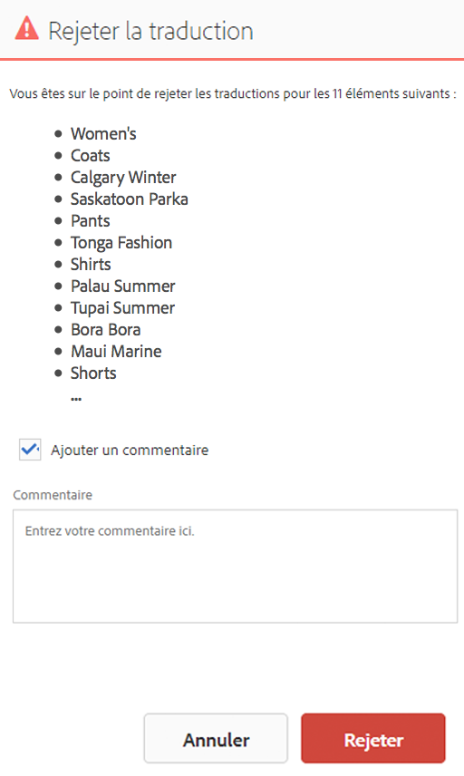

Le rejet du contenu le renvoie au fournisseur de traduction, qui peut consulter le commentaire.

## Vérifier et promouvoir du contenu mis à jour {#reviewing-and-promoting-updated-content}

Lorsque le contenu est traduit pour une copie de langue existante, révisez les traductions, apportez-y des modifications, si nécessaire, puis convertissez les traductions pour les déplacer vers la copie de langue. Vous pouvez réviser les fichiers traduits lorsque la tâche de traduction possède le statut Prêt pour la révision.

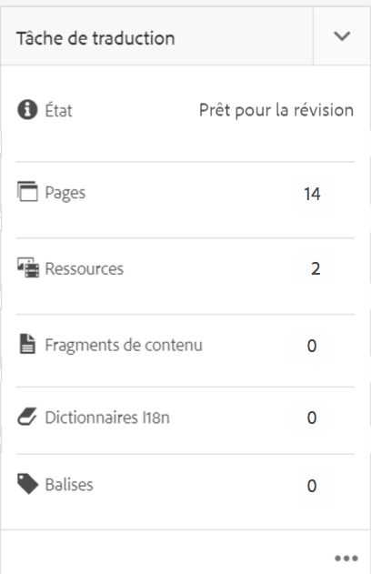

1. Sélectionnez la page dans le gabarit de langue, cliquez sur Référence, puis sur Copies de langue.
1. Cliquez sur la copie de langue à réviser.

   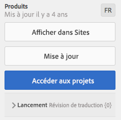

1. Cliquez sur Lancement pour afficher les commandes liées au lancement.

   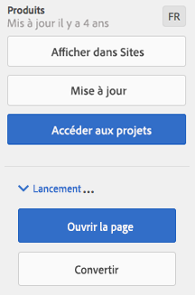

1. Pour ouvrir la copie de lancement de la page pour réviser et modifier le contenu, cliquez sur Ouvrir la page.
1. Après avoir révisé le contenu et apporté les modifications nécessaires, pour convertir la copie du lancement, cliquez sur Convertir.
1. Dans la page Promouvoir le lancement, spécifiez les pages à convertir, puis cliquez sur Convertir.

## Comparaison des copies de langue {#comparing-language-copies}

Pour comparer des copies de langue au gabarit de langue :

1. Dans la console **Sites**, accédez à la copie de langue à comparer.
1. Ouvrez le panneau **[Références](/help/sites-authoring/basic-handling.md#references)**.
1. Sous le titre **Copies**, sélectionnez **Copies de langue**.
1. Sélectionnez votre copie de langue. Ensuite, vous pouvez cliquer sur **Comparer au gabarit** ou **Comparer au précédent**, le cas échéant.

   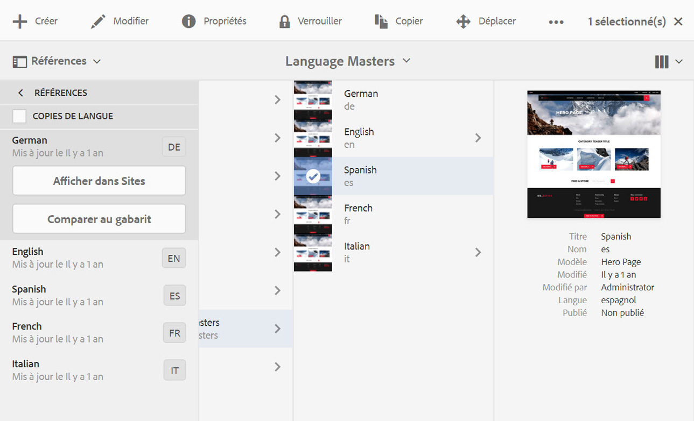

1. Les deux pages (lancement et source) s’ouvrent côte à côte.

   Pour des informations complètes sur l’utilisation de cette fonction, consultez [Différence entre les pages](/help/sites-authoring/page-diff.md).

## Fin et archivage des tâches de traduction {#completing-and-archiving-translation-jobs}

Terminez une tâche de traduction après avoir révisé les fichiers traduits du fournisseur. Pour les workflows de traduction humaine, la réalisation d’une traduction indique au fournisseur que le contrat de traduction est terminé et qu’il doit enregistrer la traduction dans sa mémoire de traduction.

Une fois que vous avez terminé la tâche, celle-ci a le statut Terminé.

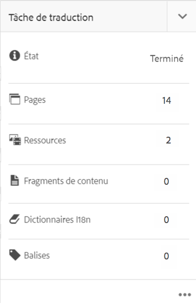

Archivez une tâche de traduction une fois qu’elle est terminée et que vous n’avez plus besoin de consulter les détails du statut de cette tâche. Lorsque vous archivez la tâche, la mosaïque Tâche de traduction est supprimée du projet.

## Création de la structure d’une copie de langue {#creating-the-structure-of-a-language-copy}

Remplissez la copie de langue afin qu’elle contienne le contenu de la langue principale que vous traduisez. Avant de remplir la copie de langue, vous devez avoir [créé la racine de langue](/help/sites-administering/tc-prep.md#creating-a-language-root) de la copie de langue.

1. Utilisez la console Sites pour sélectionner la racine de langue de la langue principale utilisée comme source. Par exemple, pour traduire les pages en anglais du site de démonstration Geometrixx, sélectionnez Contenu > Site de démonstration Geometrixx > Anglais.
1. Dans la barre d’outils, cliquez sur Références.

   

1. Sélectionnez Copies de langue, puis sélectionnez les copies de langue à remplir.

   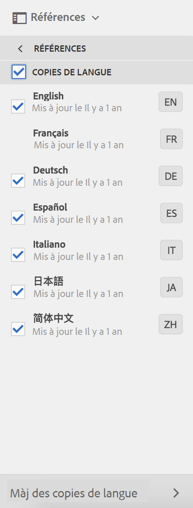

1. Cliquez sur Mettre à jour des copies de langue pour afficher les outils de traduction et configurez les propriétés :

   * Sélectionnez l’option Sélectionner toutes les pages secondaires.
   * Pour un Projet, sélectionnez Créer uniquement la structure.

   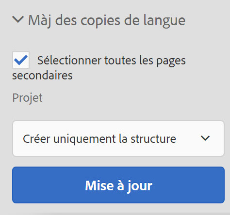

1. Cliquez sur Démarrer.

## Déplacement ou modification du nom d’une page source {#move-source}

Si une page source déjà traduite doit être [renommée ou déplacée](/help/sites-authoring/managing-pages.md#moving-or-renaming-a-page), la traduction de la page après le déplacement crée une copie dans la langue en fonction du nouveau nom ou emplacement de la page. L’ancienne copie dans la langue basée sur le nom et l’emplacement précédent est toujours là. Pour éviter cela, vous pouvez utiliser la fonctionnalité de mise à jour de la copie de langue après le déplacement :

1. Déplacez une page qui comporte une copie de langue.
1. Sélectionnez la racine de la copie de langue.
1. Ouvrez le panneau **Références**.
1. Sélectionnez **Copies de langue**.
1. Sélectionnez les langues cibles à mettre à jour.
1. Sélectionnez **Mettre à jour les copies de langue**.

   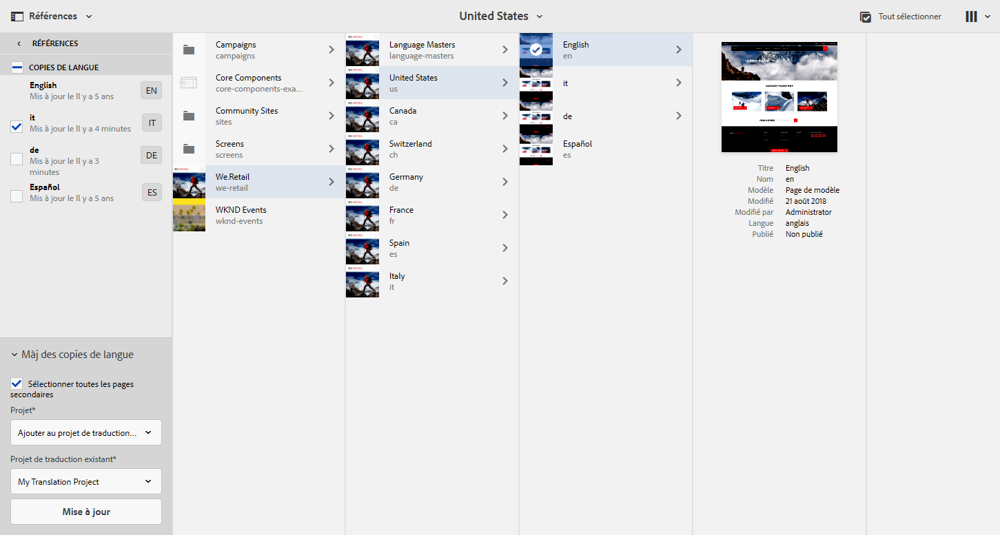

1. Cliquez sur **Mettre à jour**. Un [lancement](/help/sites-authoring/launches-promoting.md) est créé.
1. Accédez à la racine de langue requise et sélectionnez-la.
1. Dans le panneau **Références**, sélectionnez **Lancements**.

   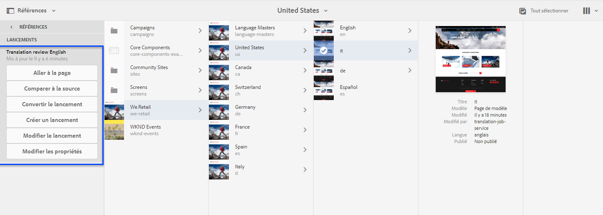

1. Cliquez sur le lancement que avez créé, puis sur **Promouvoir le lancement**.

Désormais, la page source a été déplacée, ainsi que la copie de langue associée.

## Création d’un projet de traduction à l’aide de la console Projets {#creating-a-translation-project-using-the-projects-console}

Vous pouvez créer manuellement un projet de traduction si vous préférez utiliser la console Projets.

>[!NOTE]
>
>Pour créer un projet, votre compte doit être membre du groupe `projects-administrators`.

Lorsque vous créez manuellement un projet de traduction, vous devez fournir des valeurs pour les propriétés associées à la traduction ci-dessous en complément des [propriétés de base](/help/sites-authoring/touch-ui-managing-projects.md#creating-a-project) :

* **Nom** : nom du projet.
* **Langue source** : langue du contenu source.
* **Langue cible** : langue vers laquelle le contenu est traduit.
* **Méthode de conversion** : sélectionnez Traduction humaine pour indiquer que la traduction doit être effectuée manuellement.

1. Dans la barre d’outils de la console Projets, cliquez sur Créer.
1. Sélectionnez le modèle Projet de traduction, puis cliquez sur Suivant.
1. Saisissez les valeurs pour les propriétés de base.
1. Cliquez sur Avancé et saisissez les valeurs pour les propriétés liées à la traduction.
1. Cliquez sur Créer. Dans la boîte de dialogue de confirmation, cliquez sur Terminé pour revenir à la console Projets, ou cliquez sur Ouvrir un projet pour ouvrir le projet et commencer à le gérer.

## Exportation d’une tâche de traduction {#exporting-a-translation-job}

Vous pouvez télécharger le contenu d’une tâche de traduction, par exemple, pour l’envoyer à un fournisseur de traduction qui n’est pas intégré à AEM par le biais d’un connecteur ou pour réviser le contenu.

1. Dans le menu déroulant de la vignette Tâche de traduction, cliquez sur Exporter.
1. Dans la boîte de dialogue Exporter, cliquez sur Télécharger le fichier exporté et, si nécessaire, utilisez la boîte de dialogue du navigateur web pour enregistrer le fichier.
1. Dans la boîte de dialogue Exporter, cliquez sur Fermer.

## Importation d’une tâche de traduction {#importing-a-translation-job}

Vous pouvez importer du contenu traduit dans AEM, par exemple, lorsque votre fournisseur de traduction vous l’envoie, car il n’est pas intégré à AEM par le biais d’un connecteur.

1. Dans le menu déroulant de la vignette Tâche de traduction, cliquez sur Importer.
1. Utilisez la boîte de dialogue du navigateur web pour sélectionner le fichier à importer.
1. Dans la boîte de dialogue Importer, cliquez sur Fermer.
