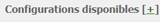
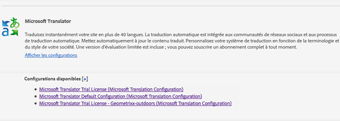
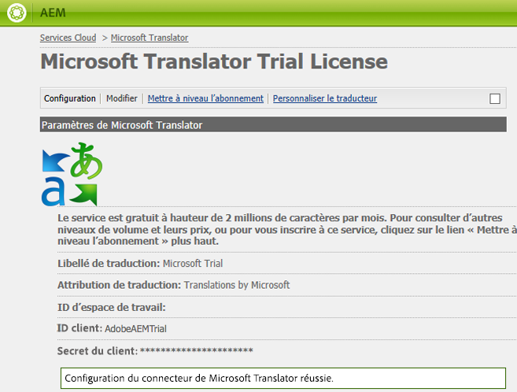

# Connexion à Microsoft Translator{#connecting-to-microsoft-translator}

Créez une configuration pour que le service cloud Microsoft Translator utilise votre compte Microsoft Traduction pour traduire le contenu des pages ou des communautés, ou des ressources AEM.

| Propriété | Description |
|---|---|
| Libellé de traduction | Nom d’affichage du service de traduction. |
| Attribution de traduction | (Facultatif) Pour le contenu généré par l’utilisateur, attribution qui s’affiche en regard du texte traduit, par exemple `Translations by Microsoft`. |
| ID d’espace de travail | (Facultatif) ID de votre moteur Microsoft Translator personnalisé à utiliser. |
| Clé d’abonnement | Votre clé d’abonnement Microsoft pour Microsoft Translator. |

Après avoir créé la configuration, vous devez [l&#39;activer](/help/sites-administering/tc-msconf.md#activating-the-translator-service-configurations).

La procédure suivante utilise l’interface utilisateur optimisée pour les écrans tactiles afin de créer une configuration Microsoft Translator.

1. Sur le rail, cliquez ou appuyez sur Outils > Services cloud.
1. Dans la zone Microsoft Translator, cliquez ou appuyez sur Afficher les configurations.
1. Cliquez sur le lien + en regard de Configurations disponibles.

   

1. Indiquez un titre pour votre configuration. Le titre identifie la configuration dans la console Services cloud, ainsi que dans les listes déroulantes de propriétés de la page. Le nom par défaut est dérivé du titre. Éventuellement, saisissez un nom à utiliser pour le nœud du référentiel qui stocke la configuration. Vous devez utiliser la valeur par défaut de la propriété de la configuration parente qui est le chemin du nœud de référentiel.
1. Cliquez sur Créer.
1. Dans la boîte de dialogue qui s’affiche, saisissez les valeurs des propriétés et cliquez sur OK.

## Exemples de configurations du service cloud Microsoft Translator {#sample-microsoft-translator-cloud-service-configurations}

Les configurations suivantes du service cloud Microsoft Translator sont installées avec les exemples de Geometrixx. Certains exemples de configuration utilisent un compte Microsoft Translation d&#39;évaluation qui permet de traduire gratuitement jusqu&#39;à 2 000 000 caractères par mois.

### Licence d’évaluation de Microsoft Translator {#microsoft-translator-trial-license}

La configuration Licence d’évaluation de Microsoft Translator est un exemple de configuration est installé avec le module d’exemple Geometrixx Outdoors. Cette configuration utilise un compte Microsoft Translator doté d&#39;un abonnement gratuit qui permet 2 000 000 caractères traduits par mois.

### Licence d’évaluation de Microsoft Translator – Geometrixx-outdoors {#microsoft-translator-trial-license-geometrixx-outdoors}

La configuration Licence d’évaluation de Microsoft Translator – Geometrixx-outdoors est un exemple de configuration qui est installé avec Geometrixx Outdoors. Cette configuration utilise le même compte Microsoft Translator gratuit que la configuration Licence d’évaluation de Microsoft Translator. Le compte a un abonnement gratuit qui permet 2 000 000 caractères traduits par mois.

Cette configuration de Microsoft Translator est optimisée pour l’utilisation avec le type de contenu de l’exemple de site Geometrixx Outdoors.

### Mise à niveau de la configuration Licence d’évaluation de Microsoft Translator  {#upgrading-the-microsoft-translator-trial-license-configuration}

Les pages de configuration Microsoft Traduction fournissent un lien pratique vers le site web Microsoft pour obtenir un abonnement de compte qui est adapté aux systèmes de production.

1. Sur le rail, cliquez ou appuyez sur Outils > Opérations > Cloud > Services cloud.
1. Dans la zone Microsoft Translator, cliquez ou appuyez sur Afficher les configurations, puis cliquez ou appuyez sur Licence d’évaluation de Microsoft Translator (configuration Microsoft Traduction).

   

1. Sur la page de configuration, cliquez sur Mettre à niveau l’abonnement. Utilisez la page web de Microsoft qui s’ouvre pour configurer votre compte.

   

### Personnalisation de votre moteur Microsoft Translator {#customizing-your-microsoft-translator-engine}

Les pages de configuration de Microsoft Traduction fournissent un lien pratique vers le site web Microsoft pour personnaliser votre moteur Microsoft Translator. ([https://hub.microsofttranslator.com](https://hub.microsofttranslator.com/))

1. Sur le rail, cliquez ou appuyez sur Outils > Opérations > Cloud > Services cloud.
1. Dans la zone Microsoft Translator, cliquez ou appuyez sur Afficher les configurations, puis cliquez ou appuyez sur la configuration que vous souhaitez personnaliser.
1. Sur la page de configuration, cliquez sur Personnaliser le traducteur. Utilisez la page web de Microsoft qui s’ouvre pour personnaliser votre service.

## Activation des configurations du service de traducteur  {#activating-the-translator-service-configurations}

Vous devez activer les configurations de service cloud pour prendre en charge le contenu traduit qui est répliqué vers l’instance de publication. Utilisez la méthode [d&#39;activation d&#39;une section complète (arborescence)](/help/sites-authoring/publishing-pages.md#publishing-and-unpublishing-a-tree) pour activer les noeuds de référentiel qui stockent les configurations de service cloud tiers ou Microsoft Translator. Les nœuds se trouvent sous les nœuds parents suivants :

* Service de traduction Microsoft : /libs/settings/cloudconfigs/translation/msft-translation
* Traduction tierce : /etc/cloudservices/machine-translation

