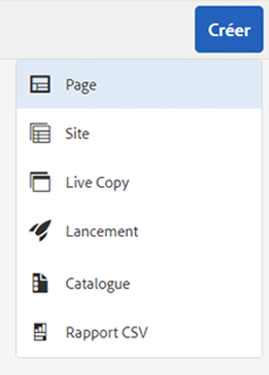
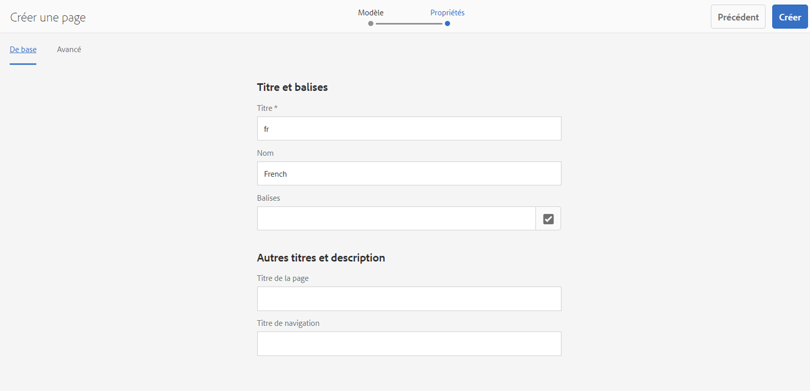
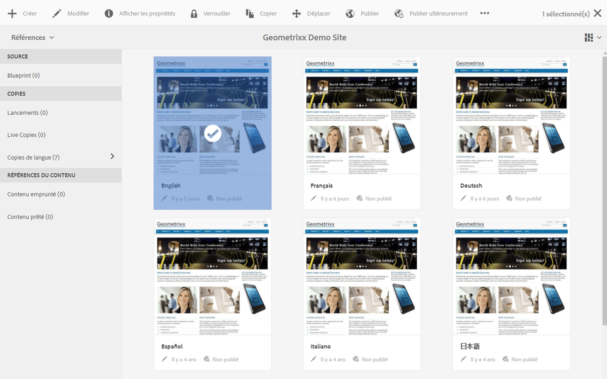

# Préparation du contenu à traduire{#preparing-content-for-translation}

Les sites web multilingues fournissent généralement une certaine quantité de contenu dans plusieurs langues. Le site est créé dans une langue, puis traduit dans d’autres langues. En général, les sites multilingues comportent des branches de pages, chaque branche contenant les pages du site dans une langue distincte.

L’exemple de site de démonstration Geometrixx comprend plusieurs branches de langue et utilise la structure suivante :

```xml
/content
    |- geometrixx
             |- en
             |- fr
             |- de
             |- es
             |- it
             |- ja
             |- zh
```

Chaque branche de langue d’un site est appelée « copie de langue ». La page racine d’une copie de langue, appelée « racine de langue », identifie la langue du contenu de la copie de langue. Par exemple, `/content/geometrixx/fr` est la racine de langue de la copie de langue française. Les copies de langue doivent utiliser une [racine de langue configurée correctement](/help/sites-administering/tc-prep.md#creating-a-language-root) afin que la langue appropriée soit ciblée lorsque des sources sont traduites.

La copie de langue pour laquelle vous créez initialement le contenu du site est le gabarit de langue. Le gabarit de langue est la source qui est traduite dans d’autres langues.

Pour préparer la traduction du site, procédez comme suit :

1. Créez la racine de langue de votre gabarit de langue. Par exemple, la racine de langue du site de démonstration Geometrixx en anglais est /content/geometrixx/en. Assurez-vous que la racine de la langue est correctement configurée en fonction des informations de [Création d’une racine de langue](/help/sites-administering/tc-prep.md#creating-a-language-root).
1. Créez le contenu de votre gabarit de langue.
1. Créez la racine de langue de chaque copie de langue pour votre site. Par exemple, la copie de langue française de l’exemple de site Geometrixx est /content/geometrixx/fr.

Après avoir préparé le contenu à traduire, vous pouvez créer automatiquement les pages manquantes dans les copies de langue et les projets de traduction associés. (Voir [Création d’un projet de traduction](/help/sites-administering/tc-manage.md).) Pour un aperçu du processus de traduction de contenu en AEM, voir [Traduction de contenu pour les sites Web multilingues](/help/sites-administering/translation.md).

## Création d’une racine de langue {#creating-a-language-root}

Créez une racine de langue comme page racine d’une copie de langue qui identifie la langue du contenu. Après avoir créé la racine de langue, vous pouvez créer des projets de traduction incluant la copie de langue.

Pour créer la racine de langue, créez une page, puis utilisez le code de langue ISO comme valeur de la propriété Nom. Le code de la langue doit être dans l’un des formats suivants :

* `<language-code>`Le code de langue pris charge est un code à deux lettres défini par la norme ISO-639-1, par exemple en`en`.

* `<language-code>_<country-code>` ou  `<language-code>-<country-code>`Le code de pays pris en charge est un code à deux lettres minuscules ou majuscules, comme défini par ISO 3166, par exemple  `en_US`,  `en_us`,  `en_GB`,  `en-gb`.

Vous pouvez utiliser l’un de ces formats en fonction de la structure choisie pour votre site international.  Par exemple, la propriété Nom de la page racine de la copie de langue française de l’exemple de site Geometrixx est définie sur `fr`. Notez que la propriété Nom est utilisée comme nom du nœud de page dans le référentiel et détermine donc le chemin d’accès à la page. (http://localhost:4502/content/geometrixx/fr.html)

La procédure ci-dessous utilise l’interface utilisateur optimisée pour les écrans tactiles pour créer une copie de langue d’un site web. Pour obtenir des instructions relatives à l’interface utilisateur classique, voir [Création d’une racine de langue à l’aide de l’interface utilisateur classique](/help/sites-administering/tc-lroot-classic.md).

1. Accédez à Sites.
1. Cliquez ou appuyez sur le site pour lequel vous souhaitez créer une copie de langue.

   Par exemple, pour créer une copie de langue du site Geometrixx Outdoors, cliquez ou appuyez sur ce dernier.

1. Cliquez ou appuyez sur Créer, puis sur Créer une page.

   

1. Sélectionnez le modèle de page, puis cliquez ou appuyez sur Suivant.
1. Dans le champ Nom, tapez le code de pays au format `<language-code>` ou `<language-code>_<country-code>`, par exemple `en`, `en_US`, `en_us`, `en_GB`, `en_gb`. Saisissez un titre pour la page.

   

1. Cliquez ou appuyez sur Créer. Dans la boîte de dialogue de confirmation, cliquez ou appuyez sur **Terminé** pour revenir à la console Sites ou sur **Ouvrir** pour ouvrir la copie de langue.

## Affichage de l’état des racines de langue {#seeing-the-status-of-language-roots}

L’interface utilisateur optimisée pour les écrans tactiles contient un panneau Références, qui affiche une liste des racines de langue créées.



La procédure ci-dessous utilise l’interface utilisateur optimisée pour les écrans tactiles afin d’afficher le panneau Références d’une page.

1. Dans la console Sites, sélectionnez une page du site, puis cliquez ou appuyez sur **Références**.

   

1. Dans le panneau Références, cliquez ou appuyez sur **Copies de langue**. Le panneau Copies de langue répertorie les copies de langue du site web.

