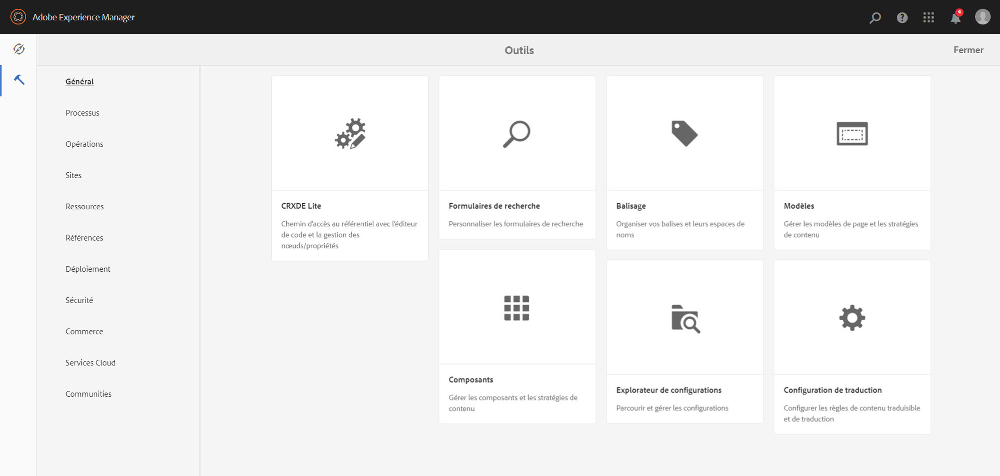
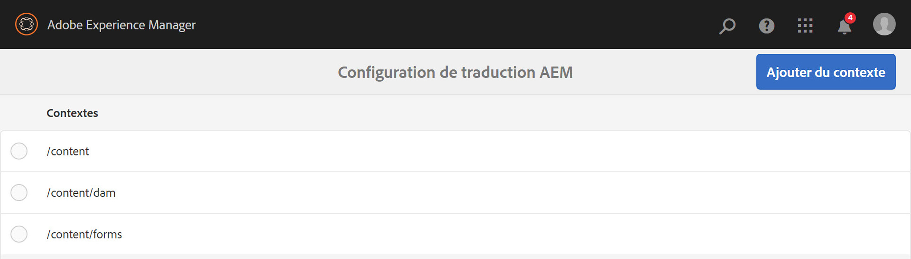
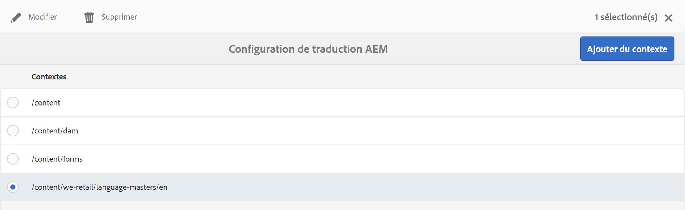
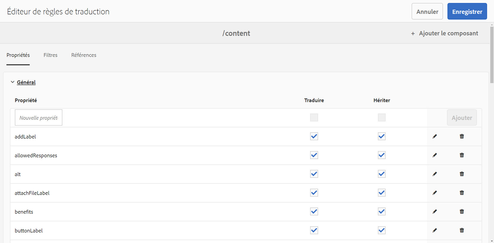
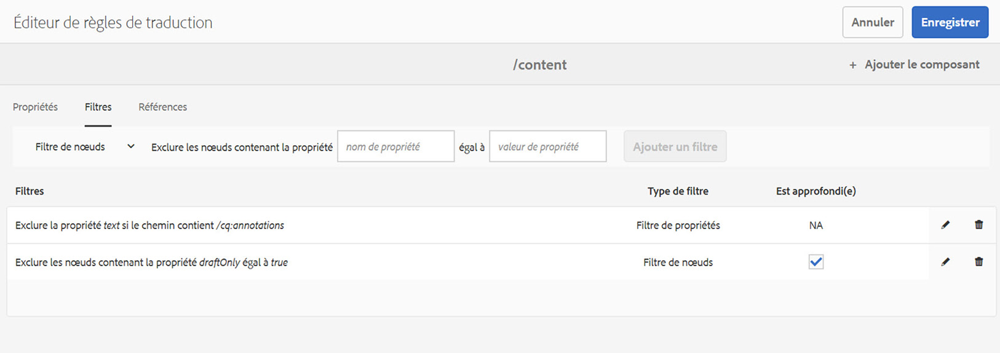
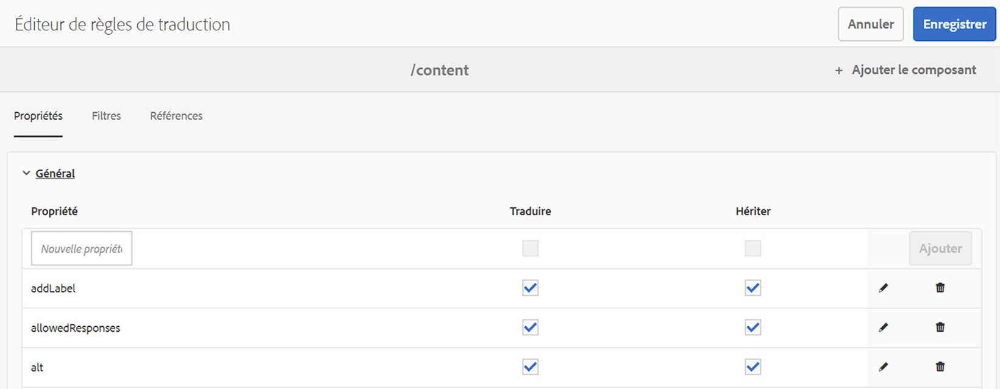
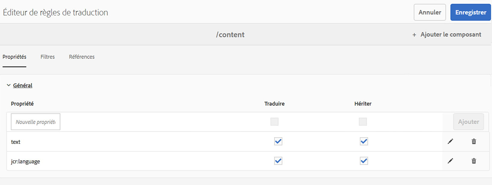

# Identification du contenu à traduire{#identifying-content-to-translate}

Les règles de traduction identifient le contenu à traduire pour les pages, les composants et les ressources incluses ou exclues dans les projets de traduction. Lorsqu’une page ou une ressource est en cours de traduction, AEM extrait ce contenu pour qu’il puisse être envoyé au service de traduction.

Les pages et les ressources sont représentées sous forme de nœuds dans le référentiel JCR. Le contenu qui est extrait est constitué d’une ou plusieurs valeurs de propriété des nœuds. Les règles de traduction identifient les propriétés qui contiennent le contenu à extraire.

Elles sont exprimées au format XML et stockées dans l’un des emplacements suivants :

* `/libs/settings/translation/rules/translation_rules.xml`
* `/apps/settings/translation/rules/translation_rules.xml`
* `/conf/global/settings/translation/rules/translation_rules.xml`

Le fichier s’applique à tous les projets de traduction.

>[!NOTE]
>
>Après une mise à niveau vers la version 6.4, il est recommandé de déplacer le fichier depuis /etc. Pour plus d&#39;informations, consultez la section [Restructuration du référentiel commun dans AEM 6.5](/help/sites-deploying/all-repository-restructuring-in-aem-6-5.md#translation-rules).

Les règles comprennent les informations suivantes :

* Le chemin d’accès au nœud auquel la règle s’applique. La règle s’applique également aux descendants du nœud.
* Les noms des propriétés de nœud contenant le contenu à traduire. Cette propriété peut être spécifique à un type de ressource en particulier ou à tous les types de ressource.

Par exemple, vous pouvez créer une règle traduisant le contenu que les auteurs ajoutent à tous les composants Texte de base d’AEM sur vos pages. La règle peut identifier le noeud `/content` et la propriété `text` du composant `foundation/components/text`.

Une [console](#translation-rules-ui) a été ajoutée pour configurer les règles de traduction. Les définitions dans l’interface utilisateur renseignent le fichier pour vous.

Pour une vue d&#39;ensemble des fonctionnalités de traduction de contenu dans AEM, voir [Traduction de contenu pour les sites multilingues](/help/sites-administering/translation.md).

>[!NOTE]
>
>AEM prend en charge le mappage direct entre les types de ressources et les attributs de référence pour la traduction du contenu référencé sur une page.

## Syntaxe de règle pour les pages, les composants et les ressources {#rule-syntax-for-pages-components-and-assets}

Une règle est un élément `node` ayant un ou plusieurs éléments `property` enfants et zéro ou plusieurs éléments `node` enfants :

```xml
<node path="content path">
          <property name="property name" [translate="false"]/>
          <node resourceType="component path" >
               <property name="property name" [translate="false"]/>
          </node>
</node>
```

Chacun de ces éléments `node` présente les caractéristiques suivantes :

* L&#39;attribut `path` contient le chemin d&#39;accès au noeud racine de la branche à laquelle s&#39;appliquent les règles.
* Les éléments `property` enfants identifient les propriétés de nœud à traduire pour tous les types de ressources :

   * L’attribut `name` contient le nom de la propriété.
   * L&#39;attribut facultatif `translate` est égal à `false` si la propriété n&#39;est pas traduite. Par défaut, la valeur est `true`. Cet attribut est utile lorsque vous remplacez des règles précédentes.

* Les éléments `node` enfants identifient les propriétés de nœud à traduire pour certains types de ressources :

   * L’attribut `resourceType` contient le chemin d’accès qui correspond au composant implémentant le type de ressource.
   * Les éléments `property` enfants identifient la propriété node à traduire. Utilisez ce noeud de la même manière que les éléments enfant `property` pour les règles de noeud.

L&#39;exemple de règle suivant fait traduire le contenu de toutes les propriétés `text` pour toutes les pages situées sous le noeud `/content`. La règle est effective pour tout composant qui stocke le contenu dans une propriété `text` (par exemple, le composant Text de base et le composant Image de base).

```xml
<node path="/content">
          <property name="text"/>
</node>
```

L’exemple suivant traduit le contenu de toutes les propriétés `text` et traduit également d’autres propriétés du composant Image de base. Si d’autres composants présentent des propriétés du même nom, la règle ne s’applique pas à eux.

```xml
<node path="/content">
      <property name="text"/>
      <node resourceType="foundation/components/textimage">
         <property name="image/alt"/>
         <property name="image/jcr:description"/>
         <property name="image/jcr:title"/>
      </node>
</node>
```

## Syntaxe de règle pour extraire des ressources à partir de pages  {#rule-syntax-for-extracting-assets-from-pages}

Utilisez la syntaxe de règle suivante pour inclure les ressources qui sont incorporées dans des composants ou référencées à partir de composants :

```xml
<assetNode resourceType="path to component" assetReferenceAttribute="property that stores asset"/>
```

Chaque élément `assetNode` présente les caractéristiques suivantes :

* Un attribut `resourceType` qui est égal au chemin d&#39;accès qui correspond au composant.
* Un attribut `assetReferenceAttribute` qui est égal au nom de la propriété stockant le fichier binaire de ressource (pour les ressources incorporées) ou le chemin d’accès à la ressource référencée.

L’exemple suivant extrait les images à partir du composant Image de base :

```xml
<assetNode resourceType="foundation/components/image" assetReferenceAttribute="fileReference"/>
```

## Règles de remplacement {#overriding-rules}

Le fichier translation_rules.xml est constitué d’un élément `nodelist` ayant plusieurs éléments `node` enfants. AEM lit la liste des nœuds de haut en bas. Lorsque plusieurs règles ciblent le même nœud, la règle inférieure dans le fichier est utilisée. Par exemple, les règles suivantes font traduire tout le contenu des propriétés `text`, à l’exception de la branche `/content/mysite/en` des pages :

```xml
<nodelist>
     <node path="/content”>
           <property name="text" />
     </node>
     <node path=“/content/mysite/en”>
          <property name=“text” translate=“false" />
     </node>
<nodelist>
```

## Filtrage de propriétés {#filtering-properties}

Vous pouvez filtrer les nœuds ayant une propriété spécifique à l’aide d’un élément `filter`.

Par exemple, les règles suivantes entraînent la traduction de tout le contenu des propriétés `text`, à l’exception des nœuds dont la propriété `draft` est définie sur `true`.

```xml
<nodelist>
    <node path="/content”>
     <filter>
   <node containsProperty="draft" propertyValue="true" />
     </filter>
        <property name="text" />
    </node>
<nodelist>
```

## Interface utilisateur des règles de traduction {#translation-rules-ui}

Une console est également disponible pour configurer les règles de traduction.

Pour y accéder :

1. Accédez à **Outils** puis **Général**.

   

1. Sélectionnez **Configuration de traduction**.

   

À partir de là, vous pouvez **Ajouter le contexte**. Ceci vous permet d’ajouter un chemin d’accès.



Ensuite, vous devez sélectionner votre contexte, puis cliquer sur **Modifier**. Cette action ouvre l’éditeur de règles de traduction.



Il existe 4 attributs que vous pouvez modifier via l’interface utilisateur : `isDeep`, `inherit`, `translate` et `updateDestinationLanguage`.

**** isDeepCet attribut est applicable sur les filtres de noeud et est true par défaut. Il vérifie si le nœud (ou ses ancêtres) contient cette propriété avec la valeur de propriété spécifiée dans le filtre. S’il a la valeur false, il vérifie uniquement le nœud actuel.

Par exemple, les noeuds enfants sont ajoutés à une tâche de traduction même si la propriété `draftOnly` du noeud parent est définie sur true pour marquer le contenu de brouillon. `isDeep` entre ici en jeu et vérifie si les nœuds parents disposent de la propriété `draftOnly` définie sur true et exclut ces nœuds enfants.

Dans l’éditeur, vous pouvez vérifier/décocher **Est profond** dans l’onglet **Filtres**.



Voici un exemple du fichier xml obtenu lorsque l’option **isDeep** n’est pas cochée dans l’interface utilisateur :

```xml
 <filter>
    <node containsProperty="draftOnly" isDeep="false" propertyValue="true"/>
</filter>
```

**** inheritCeci s’applique aux propriétés. Par défaut, chaque propriété est héritée, mais si vous souhaitez qu’une propriété ne soit pas héritée sur l’enfant, vous pouvez marquer cette propriété comme étant égale à « false » pour qu’elle soit appliquée uniquement sur ce nœud spécifique.

Dans l’interface utilisateur, vous pouvez cocher/décocher **Hériter** dans l’onglet **Propriétés**.



**** translateL’attribut translate est simplement utilisé pour spécifier si une propriété doit être traduite ou non.

Dans l’interface utilisateur, vous pouvez vérifier/décocher **Traduire** dans l’onglet **Propriétés**.

**** updateDestinationLanguageCet attribut est utilisé pour les propriétés qui n’ont pas de texte mais des codes de langue, par exemple jcr:language. L’utilisateur ne traduit pas le texte, mais le paramètre régional de langue de la source vers la cible. Ces propriétés ne sont pas envoyées en traduction.

Dans l’interface utilisateur, vous pouvez vérifier/décocher **Traduire** dans l’onglet **Propriétés**, mais pour les propriétés spécifiques dont les codes de langue sont des valeurs.

Pour aider à clarifier la différence entre `updateDestinationLanguage` et `translate`, voici l’exemple simple d’un contexte ne comportant que deux règles :



Le résultat dans le fichier xml ressemble à ce qui suit :

```xml
<property inherit="true" name="text" translate="true" updateDestinationLanguage="false"/>
<property inherit="true" name="jcr:language" translate="false" updateDestinationLanguage="true"/>
```

## Modification manuelle du fichier de règles  {#editing-the-rules-file-manually}

Le fichier translation_rules.xml qui est installé avec AEM contient un ensemble par défaut de règles de traduction. Vous pouvez modifier le fichier pour prendre en charge les exigences de vos projets de traduction. Par exemple, vous pouvez ajouter des règles de sorte que le contenu de vos composants personnalisés soit traduit.

Si vous modifiez le fichier translation_rules.xml, conservez une copie de sauvegarde dans un module de contenu. L’installation des service packs AEM ou la réinstallation de certains modules AEM peut remplacer le fichier translation_rules.xml actuel par la version originale. Pour restaurer vos règles dans cette situation, vous pouvez installer le module contenant votre copie de sauvegarde.

>[!NOTE]
>
>Après avoir créé le module de contenu, recréez le module chaque fois que vous modifiez le fichier.

## Exemple de fichier de règles de traduction  {#example-translation-rules-file}

```xml
<nodelist>
    <!-- translation rules for Geometrixx Demo site (example) -->
    <node path="/content/geometrixx">
        <!-- list all node properties that should be translated -->
        <property name="jcr:title" /> <!-- translation workflows running on content saved in /content/geometrixx, will extract jcr:title values independent of the component. -->
        <property name="jcr:description" />
        <node resourceType ="foundation/components/image"> <!-- translation workflows running on content saved in /content/geometrixx, will extract alternateText values only for Image component. -->
            <property name="alternateText"/>
        </node>
        <node resourceType ="geometrixx/components/title">
            <property name="richText"/>
            <property name="jcr:title" translate="false"/> <!-- translation workflows running on content saved in /content/geometrixx, will not extract jcr:title for Title component, but instead use richText. -->
        </node>
        <node pathContains="/cq:annotations">
            <property name="text" translate="false"/> <!-- translation workflows running on content saved in /content/geometrixx, will not extract text if part of cq:annotations node. -->
        </node>
    </node>
    <!-- translation rules for Geometrixx Outdoors site (example) -->
    <node path="/content/geometrixx-outdoors">
        <node resourceType ="foundation/components/image">
            <property name="alternateText"/>
            <property name="jcr:title" />
        </node>
        <node resourceType ="geometrixx-outdoors/components/title">
            <property name="richText"/>
        </node>
    </node>
    <!-- translation rules for ASSETS (example) -->
    <node path="/content/dam">
        <!-- configure list of metadata properties here -->
        <property name="dc:title" />
        <property name="dc:description" />
    </node>
    <!-- translation rules for extracting ASSETS from SITES content, configure all components that embed or reference assets -->
    <assetNode resourceType="foundation/components/image" assetReferenceAttribute="fileReference"/>
    <assetNode resourceType="foundation/components/video" assetReferenceAttribute="asset"/>
    <assetNode resourceType="foundation/components/download" assetReferenceAttribute="fileReference"/>
    <assetNode resourceType="foundation/components/mobileimage" assetReferenceAttribute="fileReference"/>
    <assetNode resourceType="wcm/foundation/components/image" assetReferenceAttribute="fileReference"/>
</nodelist>
```

