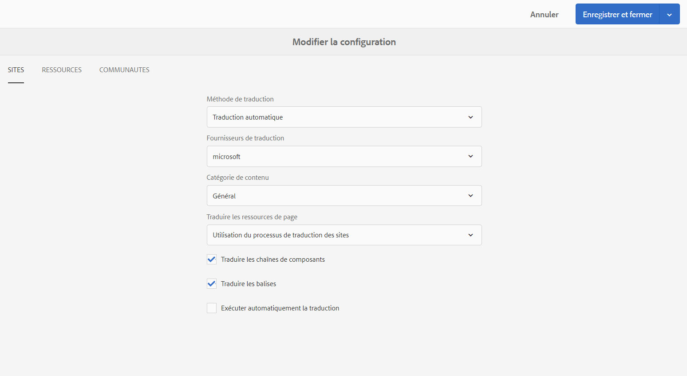

# Configuration de la structure d’intégration de traduction{#configuring-the-translation-integration-framework}

La structure d’intégration de traduction s’intègre à des services de traduction tiers pour orchestrer la traduction du contenu d’AEM.

* Connectez-vous à un fournisseur de services de traduction.
* Créez une configuration de structure d’intégration de traduction.
* Associez les configurations de cloud à vos pages.

Pour une présentation des fonctions de traduction de contenu d’AEM, voir [Traduction de contenu pour les sites multilingues](/help/sites-administering/translation.md).

## Connexion à un fournisseur de services de traduction {#connecting-to-a-translation-service-provider}

Créez une configuration de cloud qui connecte AEM à votre fournisseur de services de traduction. AEM permet d’établir par défaut une connexion à Microsoft Translator.
 Les fournisseurs de services de traduction ci-dessous fournissent une mise en œuvre de la nouvelle API pour les projets de traduction. Liens pour en savoir plus sur l’intégration :

* [Translations.com](https://exchange.adobe.com/experiencecloud.details.90104.globallink-connect-plus-for-aem.html) (partenaire Adobe Exchange Premier)
* [Clay Tablet Technologies](https://exchange.adobe.com/experiencecloud.details.90064.clay-tablet-translation-for-experience-manager.html)
* [Lionbridge](https://exchange.adobe.com/experiencecloud.details.100064.lionbridge-connector-for-experience-manager-63.html)
* [Memsource](https://exchange.adobe.com/experiencecloud.details.103166.memsource-connector-for-adobe-experience-manager.html)
* [Cloudwords](https://exchange.adobe.com/experiencecloud.details.90019.html)
* [XTM Cloud](https://exchange.adobe.com/experiencecloud.details.105037.xtm-connect-for-adobe-experience-manager.html)
* [Lingotek](https://exchange.adobe.com/experiencecloud.details.90088.lingotek-collaborative-translation-platform.html)
* [RWS](https://partners.adobe.com/exchangeprogram/experiencecloud/exchange.details.108277.html)
* [Smartling](https://www.smartling.com/software/integrations/adobe-experience-manager/)
* [Systran](https://exchange.adobe.com/experiencecloud.details.90233.systran-for-adobe-experience-manager.html)
* [Altlang](https://exchange.adobe.com/experiencecloud.details.90222.altlang.html)
* Microsoft (Microsoft Translator est préinstallé dans AEM)

>[!NOTE]
>
>Pour obtenir une liste à jour des fournisseurs de services de traduction humaine et automatique, consultez ces pages :
>
>
>* [Traduction humaine dans AEM](https://www.adobe.com/go/aem-human-translation-connectors)
>* [Traduction automatique dans AEM](https://www.adobe.com/go/aem-machine-translation-connectors)
>

Une fois que vous avez installé un module de connecteur, vous pouvez créer une configuration de cloud pour le connecteur. En général, vous devez fournir vos informations d’identification afin de vous authentifier auprès du service de traduction. Pour plus d’informations sur l’ajout d’une configuration de cloud pour le connecteur Microsoft Translator, voir [Intégration à Microsoft Translator](/help/sites-administering/tc-msconf.md).

Vous pouvez créer plusieurs configurations de cloud pour le même connecteur, si nécessaire. Par exemple, créez une configuration pour chacun des comptes ou des projets que vous avez avec le même fournisseur.

Une fois que vous avez configuré une connexion, vous pouvez créer la configuration de la structure d’intégration de traduction qui l’utilise.

## Création d’une configuration de l’intégration de traduction {#creating-a-translation-integration-configuration}

Créez une configuration de structure d’intégration de traduction pour spécifier comment traduire le contenu. La configuration contient les informations suivantes :

* Le fournisseur de service de traduction à utiliser.
* Si une traduction humaine ou automatique doit être réalisée.
* S’il est nécessaire de traduire un autre contenu associé à une page ou à une ressource, comme des balises.

Après avoir créé une configuration de structure, vous associez la configuration de cloud aux pages à traduire en fonction de la configuration. Une fois que la procédure de traduction a commencé, le processus de traduction se poursuit en fonction de la configuration de structure associée.

Si différentes parties de votre site web impliquent différentes exigences en matière de traduction, créez plusieurs configurations de structure en conséquence. Par exemple, un site web multilingue inclut des versions en anglais, en espagnol et en japonais. Le propriétaire du site a recours à deux fournisseurs de services de traduction pour les traductions en espagnol et en japonais. Par conséquent, deux configurations de la structure sont définies. Chaque configuration utilise un fournisseur de services de traduction différent.

Une fois que vous avez configuré une structure d’intégration de traduction, vous pouvez l’[associer aux pages](/help/sites-administering/tc-prep.md) qui l’utilisent.

**Remarque :** Pour un aperçu des fonctionnalités de traduction de contenu dans AEM, voir [Traduction de contenu pour les sites multilingues](/help/sites-administering/translation.md).

Une configuration unique de la structure contrôle la façon de traduire le contenu d’une page, le contenu d’une communauté et les ressources.

### Propriétés de configuration des sites {#sites-configuration-properties}

Les propriétés des sites contrôlent la façon dont le contenu des pages est traduit.

<table>
 <tbody>
  <tr>
   <th>Propriété</th>
   <th>Description</th>
  </tr>
  <tr>
   <td>Workflow de traduction</td>
   <td>
Sélectionnez la méthode de traduction que la structure effectue pour le contenu du site :

    <ul>
     <li>Traduction automatique : Le fournisseur de traduction effectue la traduction à l’aide de la traduction automatique en temps réel.</li>
     <li>Traduction humaine : le contenu est envoyé au fournisseur de services de traduction pour être traduit par des traducteurs. </li>
     <li>Ne pas traduire : le contenu n’est pas envoyé pour être traduit. Cela permet d’ignorer certaines parties du contenu qui n’ont pas besoin d’être traduites, mais dont le contenu pourrait devoir être mis à jour.</li>
    </ul> </td>
  </tr>
  <tr>
   <td>Fournisseur de traduction</td>
   <td>Sélectionnez le fournisseur de traduction pour effectuer la traduction. Un fournisseur est répertorié dans la liste lorsque le connecteur correspondant est installé.</td>
  </tr>
  <tr>
   <td>Catégorie de contenu</td>
   <td>(Traduction automatique uniquement) Catégorie qui décrit le contenu que vous traduisez. Lors de la traduction du contenu, la catégorie peut affecter le choix de la terminologie et des expressions.</td>
  </tr>
  <tr>
   <td>Traduire les balises</td>
   <td>Sélectionnez cette option pour traduire les balises associées à la page.</td>
  </tr>
  <tr>
   <td>Traduire les ressources de page</td>
   <td>
Sélectionnez le mode de traduction des ressources ajoutées aux composants à partir du système de fichiers ou référencées à partir d’Assets :

    <ul>
     <li>Ne pas traduire : Les ressources de page ne sont pas traduites.</li>
     <li>Utilisation du processus de traduction de Sites : les ressources sont gérées en fonction des propriétés de configuration sur l’onglet Sites.</li>
     <li>Utilisation du processus de traduction d’Assets : les ressources sont gérées en fonction des propriétés de configuration sur l’onglet Assets.</li>
    </ul> </td>
  </tr>
  <tr>
   <td>Exécuter automatiquement la traduction</td>
   <td>Sélectionnez cette option pour exécuter automatiquement les tâches de traduction après la création des projets de traduction. Si vous sélectionnez cette option, vous n’avez pas la possibilité de vérifier et de définir la portée de la tâche de traduction.</td>
  </tr>
 </tbody>
</table>

### Propriétés de configuration des communautés {#communities-configuration-properties}

Les propriétés des communautés contrôlent la façon dont le contenu créé par l’utilisateur est traduit. La traduction de contenu créé par l’utilisateur a toujours recours à la traduction automatique. Pour obtenir plus d’informations, voir [Traduction de contenu créé par l’utilisateur](/help/communities/translate-ugc.md).

| Propriété | Description |
|---|---|
| Fournisseur de traduction | Sélectionnez le fournisseur de traduction pour effectuer la traduction. Le fournisseur pour lequel des configurations de cloud sont créées est répertorié dans la liste. |
| Catégorie de contenu | Une catégorie qui décrit le contenu que vous traduisez. Lors de la traduction du contenu, la catégorie peut affecter le choix de la terminologie et des expressions. |
| Choisissez Un Paramètre Régional À Utiliser Comme Magasin De Partage Global | (Facultatif) Si vous sélectionnez un paramètre régional pour le stockage du contenu créé par l’utilisateur, les publications de toutes les copies de langue s’affichent dans une conversation globale. Par convention, choisissez la langue de votre choix. [langue de base](/help/communities/sites-console.md#translation) pour le site web. Si vous sélectionnez No Common Store (Pas de magasin commun), la traduction globale sera désactivée. Par défaut, la traduction globale est désactivée. |

### Propriétés de configuration des ressources {#assets-configuration-properties}

Les propriétés des ressources contrôlent la façon dont les ressources sont configurées. Pour obtenir plus d’informations sur la traduction des ressources, consultez [Création de copies de langue pour des ressources](/help/assets/translation-projects.md).

<table>
 <tbody>
  <tr>
   <th>Propriété</th>
   <th>Description</th>
  </tr>
  <tr>
   <td>Workflow de traduction</td>
   <td>
Sélectionnez le type de traduction que la structure effectue pour les ressources :

    <ul>
     <li>Traduction automatique : Le fournisseur de traduction effectue immédiatement la traduction à l’aide de la traduction automatique.</li>
     <li>Traduction humaine : le contenu est envoyé automatiquement au fournisseur de services de traduction pour être traduit manuellement. </li>
     <li>Ne pas traduire : Les ressources ne sont pas envoyées pour traduction.</li>
    </ul> </td>
  </tr>
  <tr>
   <td>Fournisseur de traduction</td>
   <td>Sélectionnez le fournisseur de traduction pour effectuer la traduction. Un fournisseur est répertorié dans la liste lorsque le connecteur correspondant est installé.</td>
  </tr>
  <tr>
   <td>Catégorie de contenu</td>
   <td>(Traduction automatique uniquement) Catégorie qui décrit le contenu que vous traduisez. Lors de la traduction du contenu, la catégorie peut affecter le choix de la terminologie et des expressions.</td>
  </tr>
  <tr>
   <td>Traduire les ressources</td>
   <td>Sélectionnez cette option pour inclure des ressources dans le projet de traduction. </td>
  </tr>
  <tr>
   <td>Traduire les métadonnées</td>
   <td>Sélectionnez cette option pour traduire les métadonnées des ressources.</td>
  </tr>
  <tr>
   <td>Traduire les balises</td>
   <td>Sélectionnez cette option pour traduire les balises associées à la ressource.</td>
  </tr>
  <tr>
   <td>Exécuter automatiquement la traduction</td>
   <td>Sélectionnez cette option pour exécuter automatiquement les tâches de traduction après la création des projets de traduction. Si vous sélectionnez cette option, vous n’avez pas la possibilité de vérifier ou de définir la portée de la tâche de traduction.</td>
  </tr>
 </tbody>
</table>

1. Dans la barre latérale, sélectionnez Outils > Opérations > Cloud > Services cloud.
1. Dans la section Intégration de traduction, les configurations créées ou non déterminent le lien qui s’affiche :

   * Si aucune configuration n’a été créée, cliquez ou appuyez sur Configurer maintenant.
   * S’il existe déjà des configurations, cliquez ou appuyez sur Afficher les configurations, puis cliquez sur le lien « + » qui s’affiche en regard de Configurations disponibles.

1. Saisissez un nom pour la configuration, puis cliquez ou appuyez sur Créer.
1. Configurez les propriétés sur les onglets Sites, Communautés et Ressources, puis cliquez ou appuyez sur OK.

## Configuration des pages pour la traduction {#configuring-pages-for-translation}

Pour configurer la traduction des pages sources dans d’autres langues, associez les pages aux configurations de cloud suivantes :

* Configuration de cloud, qui connecte AEM à votre fournisseur de services de traduction
* Structure d’intégration de traduction, qui configure les détails de la traduction

Notez que la configuration de cloud de la structure d’intégration de traduction identifie la configuration de cloud à utiliser pour la connexion au fournisseur de services. Lorsque vous associez une page source à une configuration de cloud de la structure, la page doit être associée à la configuration de cloud du fournisseur de services utilisé par la configuration de cloud de la structure.

Lorsque vous associez une page à une configuration de cloud, les descendants de la page héritent de l’association. Par exemple, si vous associez la page /content/geometrixx/en/products à une structure d’intégration de traduction, la page Produits et toutes les pages situées dessous sont traduites en fonction de la structure.

Lorsque cela est nécessaire, vous pouvez remplacer l’association dans une page descendante. Par exemple, le contenu d’un site web concerne principalement l’habillement. Cependant, une branche des pages décrit l’entreprise. La page principale du site est associée à une structure d’intégration de traduction qui spécifie la traduction automatique à l’aide de la catégorie Habillement. La branche qui décrit l’entreprise utilise une structure qui effectue une traduction automatique à l’aide la catégorie Général.

En outre, pour toutes les communautés [Composants SCF](/help/communities/scf.md) sur les pages, le contenu généré par l’utilisateur inclut la possibilité pour les utilisateurs de traduire le contenu. Pour plus d’informations, voir [Traduction de contenu généré par l’utilisateur](/help/communities/translate-ugc.md).

### Association d’une page à un fournisseur de traduction {#associating-a-page-with-a-translation-provider}

Associez une page au fournisseur de traduction que vous utilisez pour traduire la page et les pages descendantes.

1. Dans la console Sites, sélectionnez la page à configurer et cliquez ou appuyez sur Afficher les propriétés.
1. Cliquez ou appuyez sur Modifier, puis cliquez ou appuyez sur l’onglet Services cloud.
1. Cliquez ou appuyez sur Ajouter une configuration > Intégration de traduction.
1. Sélectionnez le fournisseur de traduction à utiliser, puis cliquez ou appuyez sur Terminé.

### Association des pages à une structure d’intégration de traduction {#associating-pages-with-a-translation-integration-framework}

Associez une page à la structure d’intégration de traduction qui définit la façon dont vous souhaitez effectuer la traduction de la page et des pages descendantes.

1. Dans la console Sites, sélectionnez la page à configurer et cliquez ou appuyez sur Afficher les propriétés.
1. Cliquez ou appuyez sur Modifier, puis cliquez ou appuyez sur l’onglet Services cloud.
1. Cliquez ou appuyez sur Ajouter une configuration > Intégration de traduction.
1. Sélectionnez la structure d’intégration de traduction à utiliser, puis cliquez ou appuyez sur Terminé.
