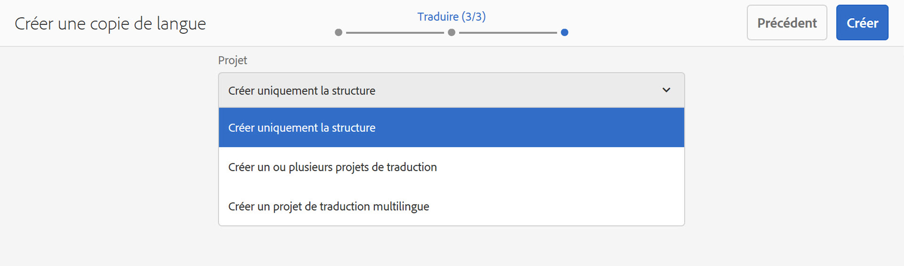

# Assistant Copie de la langue{#language-copy-wizard}

L’assistant Copie de la langue est une expérience guidée pour créer et gérer la structure du contenu multilingue. Il est désormais beaucoup plus simple et plus rapide de créer une copie de langue.

>[!NOTE]
>
>L’utilisateur doit être membre d’un groupe d’administrateurs de projet pour créer la copie de langue d’un site.

Pour accéder à cet assistant :

1. Dans Sites, sélectionnez une page et appuyez/cliquez sur Créer.

   

1. Sélectionnez Copie de la langue pour ouvrir l’assistant.

   

1. L’étape **Sélectionner la source** de l’assistant vous permet d’ajouter/supprimer des pages. Vous avez également la possibilité d’inclure ou d’exclure les sous-pages.

   

1. Le bouton **Suivant** vous amène à l&#39;étape **Configurer** de l&#39;Assistant. Ici, vous pouvez ajouter/supprimer des langues et sélectionner une méthode de traduction.

   

   >[!NOTE]
   >
   >Par défaut, il n’y a qu’un seul paramètre de traduction. Pour pouvoir sélectionner d’autres paramètres, vous devez d’abord configurer les configurations cloud. Voir [Configuration de la structure d’intégration de traduction](/help/sites-administering/tc-tic.md).

1. Le bouton **Suivant** vous amène à l&#39;étape **Traduire** de l&#39;Assistant. Vous pouvez ici choisir entre créer uniquement la structure, créer un nouveau projet de traduction ou ajouter à un projet de traduction existant.

   >[!NOTE]
   >
   >Si vous avez sélectionné plusieurs langues à l’étape précédente, plusieurs projets de traduction seront créés.

   

1. Le bouton **Créer** ferme l’assistant.

   

