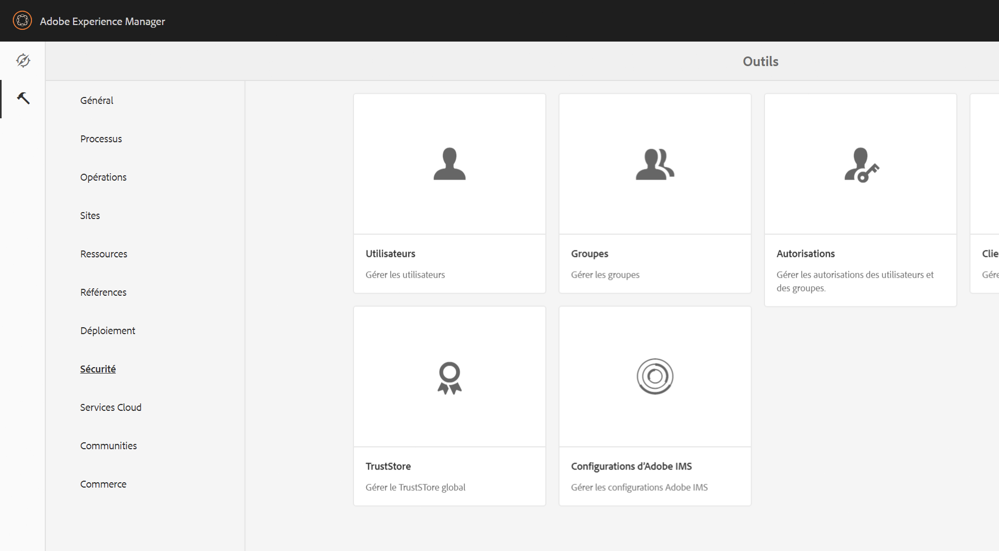

# Affichage principal de la gestion des autorisations{#principal-view-for-permissions-management}

## Présentation {#overview}

AEM 6.5 introduit la gestion des autorisations pour les utilisateurs et pour les groupes. La fonctionnalité principale reste la même que celle de l’interface utilisateur classique, mais celle-ci est plus efficace et conviviale.

## Utilisation {#how-to-use}

### Accès à l’interface utilisateur {#accessing-the-ui}

La nouvelle gestion des autorisations basée sur l’interface utilisateur est accessible via la carte Autorisations sous Sécurité , comme illustré ci-dessous :

Le nouvel affichage facilite la consultation de l’ensemble des privilèges et restrictions pour un principal donné pour tous les chemins d’accès pour lesquels les autorisations ont été accordées explicitement. Cela supprime la nécessité d’accéder à

CRXDE pour gérer les privilèges et les restrictions avancés. L’affichage a été fusionné. La vue est définie par défaut sur Groupe &quot;tout le monde&quot;.

Il existe un filtre qui permet à l’utilisateur de sélectionner le type d’entités à examiner. **Utilisateurs**, **Groupes** ou **Tous** et rechercher n’importe quelle entité&#x200B;**.**

### Affichage des autorisations pour un entité de sécurité {#viewing-permissions-for-a-principal}

Le cadre de gauche permet aux utilisateurs de faire défiler l’écran vers le bas pour trouver l’entité principale ou rechercher un Groupe ou un Utilisateur en fonction du filtre sélectionné, comme illustré ci-dessous :

Cliquez sur le nom pour afficher les autorisations attribuées sur la droite. Le volet Autorisations affiche la liste des entrées de contrôle d’accès sur des chemins spécifiques, ainsi que les restrictions configurées.

### Ajout d’une nouvelle entrée de contrôle d’accès pour une entité de sécurité {#adding-new-access-control-entry-for-a-principal}

De nouvelles autorisations peuvent être ajoutées en ajoutant une nouvelle entrée de contrôle d’accès en cliquant sur le bouton Ajouter ACE .

La fenêtre ci-dessous apparaît alors. L’étape suivante consiste à choisir le chemin d’accès pour lequel l’autorisation doit être configurée.

Sur cet exemple, nous sélectionnons un chemin pour lequel configurer une autorisation pour les **dam-users** :

Une fois le chemin sélectionné, le workflow revient sur l’écran depuis lequel un ou plusieurs privilèges peuvent être sélectionnés parmi les espaces de noms disponibles (comme `jcr`, `rep` ou `crx`), comme indiqué ci-dessous.

Vous pouvez ajouter des privilèges en effectuant une recherche à partir du champ de texte, puis en effectuant une sélection dans la liste.

>[!NOTE]
>
>Pour obtenir la liste complète des privilèges et descriptions, reportez-vous à la section [cette page](/help/sites-administering/user-group-ac-admin.md#access-right-management).

 

Une fois la liste des privilèges sélectionnée, l’utilisateur peut choisir le Type d’autorisation : Refuser ou autoriser, comme illustré ci-dessous.

 

### Utilisation des restrictions {#using-restrictions}

Outre la liste des privilèges et le type d’autorisation sur un chemin donné, cet écran permet également d’ajouter des restrictions pour un contrôle d’accès affiné, comme illustré ci-dessous :

>[!NOTE]
>
>Pour plus d’informations sur la signification de chaque restriction, consultez la [Documentation Jackrabbit Oak](https://jackrabbit.apache.org/oak/docs/security/authorization/restriction.html).

Vous pouvez ajouter des restrictions comme illustré ci-dessous en choisissant le type de restriction, en entrant la valeur et en appuyant sur la variable **+** icône .

 

La nouvelle entrée de contrôle d’accès est reflétée dans la liste de contrôle d’accès, comme illustré ci-dessous. Notez que `jcr:write` est une autorisation agrégée qui inclut `jcr:removeNode`, qui a été ajouté précédemment, mais qui n’apparaît pas ci-dessous, car il se trouve sous `jcr:write`.

### Modification des ACE {#editing-aces}

Les entrées de contrôle d’accès peuvent être modifiées en sélectionnant une entité et en choisissant l’entrée de contrôle d’accès que vous souhaitez modifier.

Par exemple, ici, nous pouvons modifier l’entrée ci-dessous pour **dam-users** en cliquant sur l’icône en forme de crayon à droite :

Les entrées de contrôle d’accès configurées présélectionnées apparaissent sur l’écran de modification. Il est possible de les supprimer en cliquant sur la croix située en regard de celles-ci ou d’ajouter de nouvelles autorisations pour le chemin donné, comme illustré ci-dessous.

Ici, nous ajoutons l’autorisation `addChildNodes` pour les **dam-users** sur le chemin donné.

Les modifications peuvent être enregistrées en cliquant sur le bouton **Enregistrer** en haut à droite, et les modifications seront répercutées dans les nouvelles autorisations pour **dam-users** comme illustré ci-dessous :

### Suppression des ACE {#deleting-aces}

Vous pouvez supprimer des entrées de contrôle d’accès pour supprimer l’ensemble des autorisations accordées à un principal sur un chemin spécifique. L’icône X en regard de ACE peut être utilisée pour la supprimer, comme illustré ci-dessous :

 

### Combinaisons de privilèges de l’interface utilisateur classique {#classic-ui-privilege-combinations}

Notez que la nouvelle interface utilisateur des autorisations utilise explicitement l’ensemble de base de privilèges au lieu de combinaisons prédéfinies qui ne reflétaient pas vraiment les privilèges sous-jacents exacts qui ont été accordés.

Ceci entraînait une certaine confusion quant à la configuration exacte. Le tableau suivant répertorie le mappage entre les combinaisons de privilèges de l’interface utilisateur classique et les privilèges réels qui les constituent :

<table>
 <tbody>
  <tr>
   <th>Combinaisons de privilèges de l’interface utilisateur classique</th>
   <th>Privilège de l’interface utilisateur Autorisations</th>
  </tr>
  <tr>
   <td>Lecture</td>
   <td><code>jcr:read</code></td>
  </tr>
  <tr>
   <td>Modification</td>
   <td>
<code>jcr:modifyProperties</code>
 
<code>jcr:lockManagement</code>
 
<code>jcr:versionManagement</code>
 </td>
  </tr>
  <tr>
   <td>Créer</td>
   <td>
<code>jcr:addChildNodes</code>
 
<code>jcr:nodeTypeManagement</code>
 </td>
  </tr>
  <tr>
   <td>Supprimer</td>
   <td>
<code>jcr:removeNode</code>
 
<code>jcr:removeChildNodes</code>
 </td>
  </tr>
  <tr>
   <td>Lecture de l’ACL</td>
   <td><code>jcr:readAccessControl</code></td>
  </tr>
  <tr>
   <td>Modification de l’ACL</td>
   <td><code>jcr:modifyAccessControl</code></td>
  </tr>
  <tr>
   <td>Réplication</td>
   <td><code>crx:replicate</code></td>
  </tr>
 </tbody>
</table>
