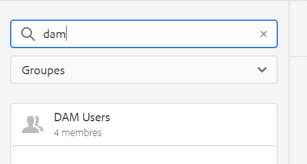

# Affichage principal de la gestion des autorisations{#principal-view-for-permissions-management}

## Présentation {#overview}

AEM 6.5 introduit la gestion des autorisations pour les utilisateurs et pour les groupes. La fonctionnalité principale reste la même que celle de l’interface utilisateur classique, mais celle-ci est plus efficace et conviviale.

## Utilisation {#how-to-use}

### Accès à l’interface utilisateur {#accessing-the-ui}

La nouvelle gestion des autorisations basée sur l’interface utilisateur est accessible via la carte Autorisations sous Sécurité, comme illustré ci-dessous :

Le nouvel affichage facilite la consultation de l’ensemble des privilèges et restrictions pour un principal donné pour tous les chemins d’accès pour lesquels les autorisations ont été accordées explicitement. Il n’est désormais plus nécessaire d’accéder à

CRXDE pour gérer les privilèges et les restrictions avancés. L’affichage a été fusionné. L’affichage par défaut est le groupe « Tout le monde ».

Il existe un filtre permettant à l’utilisateur de sélectionner le type de principaux au sein desquels chercher : **Utilisateurs** ou **Groupes**, ou **Tous** pour faire une recherche parmi l’ensemble des principaux **.**

### Affichage des autorisations pour un principal {#viewing-permissions-for-a-principal}

Le cadre de gauche permet aux utilisateurs de faire défiler la page vers le bas pour rechercher un principal, un groupe ou un utilisateur selon le filtre sélectionné, comme illustré ci-dessous :

Cliquez sur le nom pour afficher les autorisations attribuées sur la droite. Le volet Autorisations affiche la liste des entrées de contrôle d’accès sur des chemins d’accès spécifiques, ainsi que les restrictions configurées.

### Ajout d’une nouvelle entrée de contrôle d’accès pour un principal  {#adding-new-access-control-entry-for-a-principal}

Vous pouvez créer des autorisations supplémentaires en ajoutant un nouvel accès contrôlant l’entrée, en cliquant sur le bouton Ajouter une nouvelle entrée de contrôle d’accès.

La fenêtre ci-dessous apparaît alors. L’étape suivante consiste à choisir le chemin d’accès pour lequel l’autorisation doit être configurée.

Sur cet exemple, nous sélectionnons un chemin pour lequel configurer une autorisation pour les **utilisateurs DAM** :

Une fois le chemin sélectionné, le flux de travail revient à cet écran, où l&#39;utilisateur peut sélectionner un ou plusieurs des privilèges des espaces de nommage disponibles (par exemple `jcr`, `rep` ou `crx`), comme illustré ci-dessous.

Vous pouvez ajouter des privilèges en les recherchant à l’aide du champ de texte, puis en les sélectionnant dans la liste.

>[!NOTE]
>
>Pour obtenir la liste complète des privilèges et descriptions, consultez [cette page](/help/sites-administering/user-group-ac-admin.md#access-right-management).

 

Une fois la liste des privilèges constituée, l’utilisateur peut choisir le type d’autorisation : Refuser ou Autoriser, comme illustré ci-dessous.

 

### Utilisation des restrictions  {#using-restrictions}

Outre la liste des privilèges et le type d’autorisation pour un chemin d’accès donné, cet écran permet également d’ajouter des restrictions pour un contrôle d’accès plus précis, comme illustré ci-dessous :

>[!NOTE]
>
>Pour plus d’informations sur les différents types de restriction, consultez [cette page](/help/sites-administering/user-group-ac-admin.md#restrictions).

Vous pouvez ajouter des restrictions en sélectionnant le type de restriction, en entrant la valeur et en appuyant sur l’icône **+**, comme on peut voir ci-dessous.  

La nouvelle entrée de contrôle d’accès est reflétée dans la liste de contrôle d’accès, comme illustré ci-dessous. Notez que `jcr:write` est un privilège d&#39;agrégat qui inclut `jcr:removeNode` qui a été ajouté ci-dessus, mais qui n&#39;est pas affiché ci-dessous comme son nom couvert sous `jcr:write`.

### Modification des entrées de contrôle d’accès {#editing-aces}

Pour modifier les entrées de contrôle d’accès, sélectionnez un principal et l’entrée de contrôle d’accès à modifier.

Par exemple, ici, nous pouvons modifier l’entrée ci-dessous pour les **utilisateurs DAM** en cliquant sur l’icône en forme de crayon sur la droite :

Les entrées de contrôle d’accès configurées présélectionnées apparaissent sur l’écran de modification. Il est possible de les supprimer en cliquant sur la croix située en regard de celles-ci ou d’ajouter de nouvelles autorisations pour le chemin donné, comme illustré ci-dessous.

Ici, nous ajoutons l’autorisation `addChildNodes` pour les **utilisateurs DAM** sur le chemin donné.

Les modifications peuvent être enregistrées en cliquant sur le bouton **Enregistrer** en haut à droite, et les modifications seront répercutées dans les nouvelles autorisations pour **dam-users **comme illustré ci-dessous :

### Suppression des entrées de contrôle d’accès {#deleting-aces}

Vous pouvez supprimer des entrées de contrôle d’accès pour supprimer l’ensemble des autorisations accordées à un principal sur un chemin spécifique. Vous pouvez utiliser l’icône X en regard de l’entrée de contrôle d’accès pour la supprimer, comme illustré ci-dessous :

 

### Combinaisons d’autorisations de l’interface utilisateur classique  {#classic-ui-privilege-combinations}

Notez que la nouvelle interface utilisateur d’autorisations utilise explicitement l’ensemble d’autorisations de base plutôt que des combinaisons prédéfinies qui ne reflètent pas réellement les autorisations sous-jacentes qui ont été accordées.

Ceci entraînait une certaine confusion quant à la configuration exacte. Le tableau suivant répertorie le mappage entre les combinaisons d’autorisations de l’interface utilisateur classique et les autorisations réelles qui les composent :

<table>
 <tbody>
  <tr>
   <th>Combinaisons d’autorisations de l’interface utilisateur classique</th>
   <th>Privilèges accordés par l’interface utilisateur d’autorisations</th>
  </tr>
  <tr>
   <td>Lire</td>
   <td><code>jcr:read</code></td>
  </tr>
  <tr>
   <td>Modifier</td>
   <td>
<code>jcr:modifyProperties</code>
 
<code>jcr:lockManagement</code>
 
<code>jcr:versionManagement</code>
 </td>
  </tr>
  <tr>
   <td>Créer</td>
   <td>
<code>jcr:addChildNodes</code>
 
<code>jcr:nodeTypeManagement</code>
 </td>
  </tr>
  <tr>
   <td>Supprimer</td>
   <td>
<code>jcr:removeNode</code>
 
<code>jcr:removeChildNodes</code>
 </td>
  </tr>
  <tr>
   <td>Lire l’ACL</td>
   <td><code>jcr:readAccessControl</code></td>
  </tr>
  <tr>
   <td>Modifier l’ACL</td>
   <td><code>jcr:modifyAccessControl</code></td>
  </tr>
  <tr>
   <td>Répliquer</td>
   <td><code>crx:replicate</code></td>
  </tr>
 </tbody>
</table>

