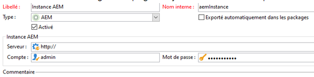

# Résolution des incidents liés à votre intégration Adobe Campaign{#troubleshooting-your-adobe-campaign-integration}

>[!NOTE]
>
>Cette page s’applique à Campaign Classic.

Les conseils de dépannage suivants permettent de résoudre les problèmes les plus courants que vous pouvez rencontrer lorsque vous intégrez AEM avec Adobe Campaign :

## Conseils pratiques de dépannage {#general-troubleshooting-tips}

Pour les deux intégrations, vous pouvez vérifier si les appels HTTP sont envoyés (AEM > Adobe Campaign, Adobe Campaign > AEM) :

* Lorsque les intégrations échouent, assurez-vous que ces appels arrivent sur l’autre extrémité (pour éviter les problèmes de pare-feu/SSL).
* En ce qui concerne la fonctionnalité AEM, vous constaterez que les appels JSON sont demandés à partir de l’interface de création d’AEM ; ils ne devraient pas engendrer d’erreur HTTP 500. Si vous voyez des erreurs HTTP 500, vérifiez le fichier `error.log` pour plus d’informations à leur sujet.
* L’augmentation du niveau de débogage pour les classes Campaign dans AEM aide également à résoudre des problèmes.

## Si la connexion échoue {#if-the-connection-fails}

Check that you have configured the **aemserver** operator in Adobe Campaign.

## Si les images n’apparaissent pas dans la console Adobe Campaign.{#if-images-do-not-appear-in-the-adobe-campaign-console}

Vérifiez la source HTML et confirmez que vous pouvez ouvrir l’URL à partir de l’ordinateur client. Si l’URL contient localhost:4503, modifiez la configuration de Day CQ Link Externalizer sur votre instance d’auteur afin qu’elle pointe vers une instance de publication accessible à partir de la console Adobe Campaign.

See [Configuring the Externalizer.](/help/sites-administering/campaignstandard.md#configuring-the-externalizer)

## Si vous ne parvenez pas à vous connecter à Adobe Campaign à partir d’AEM.{#if-you-cannot-connect-from-aem-to-adobe-campaign}

Recherchez le message d’erreur suivant dans Adobe Campaign :

`No datasource defined in the instance 'default'.`

`Make sure the DNS alias used to access the server is correct (for example, avoid hard-coded IP addresses). (iRc=16384)`

To fix this issue, change the following in **$CAMPAIGN_HOME/conf/config-&lt;instance-name>.xml**:

`<dataStore hosts="*" lang="en_GB">`

## Si aucune donnée ne s’affiche dans la boîte de dialogue Adobe Campaign.{#if-no-data-displays-in-the-adobe-campaign-dialog}

Dans Adobe Campaign, assurez-vous qu’il n’y a aucune barre oblique (/) après le numéro de port.



## Si vous recevez un avertissement concernant votre paramètre setlocale.{#if-you-get-a-warning-about-your-setlocale}

If you are starting the Apache HTTPD service and see the error `"Warning: setlocale: LC_CTYPE cannot change locale"` make sure that you have your **en_CA.ISO-8859-15 locale** installed on your system.

Vous pouvez vérifier s’ils sont installés à l’aide de `local -a`. S’ils ne le sont pas, vous pouvez corriger le script **/usr/local/neolane/nl6/env.sh** en remplaçant les paramètres régionaux par des paramètres régionaux effectivement installés.

## Si vous obtenez une erreur lors de la compilation du script get_nms_amcGetSeedMetaData_jssp. {#if-you-get-an-error-while-compiling-script-get-nms-amcgetseedmetadata-jssp}

Si vous voyez le message d’erreur suivant dans le fichier journal AEM :

`com.day.cq.mcm.campaign.impl.CampaignConnectorImpl Internal Adobe Campaign error: response body is Error while compiling script 'get_nms_amcGetSeedMetaData_jssp' line 45: String.prototype.toJSON called on incompatible XML.`

Utilisez la solution de contournement suivante :

1. Ouvrez le fichier **$CAMPAIGN_HOME/datakit/nms/fra/js/amcIntegration.js**.
1. Modifier la ligne 467 de la méthode &quot;amcGetSeedMetaData&quot;
1. Change `label : [inclView.@label](mailto:inclView.@label)` to `label : String([inclView.@label](mailto:inclView.@label))`

1. Enregistrer.
1. Redémarrez le serveur.

## Si Adobe Campaign affiche une erreur lorsque vous cliquez sur le bouton Synchroniser. {#if-adobe-campaign-displays-an-error-when-clicking-the-synchronize-button}

If when clicking the **Synchronize** button in Adobe Campaign Classic, you see the following error:

`Error while executing the method ‘aemListContent' of service [nms:delivery](https://nmsdelivery/)`

Pour résoudre ce problème, assurez-vous que l’URL de connexion à AEM configurée dans les comptes externes est accessible à partir de l’ordinateur.

Le changement de **localhost** par une adresse IP a résolu ce problème.

## Si vous obtenez l’erreur « Impossible d’analyser XTK Date+Time &#39;non défini&#39; ». {#if-you-get-a-cannot-parse-xtk-date-time-undefined-error}

Après avoir cliqué sur Synchroniser, vous obtenez une erreur indiquant qu’un script a été exécuté sur les pages : Impossible d’analyser XTK Date+Time &#39;non défini&#39; : ce n’est pas une valeur XTK valide.

Cela se produit en présence d’informations obsolètes relatives à Adobe Campaign sur l’instance AEM. Vous pouvez résoudre ce problème en supprimant toutes les configurations d’intégration d’Adobe Campaign sur AEM et en les reconstruisant. Créez ensuite un modèle.

## Si une connexion à SSL affiche une erreur lors de la configuration du service cloud. {#if-a-connection-to-ssl-displays-an-error-when-setting-up-the-cloud-service}

Dans le fichier error.log d’AEM, si vous voyez ce qui suit :

```xml
javax.net.ssl.SSLProtocolException: handshake alert:  unrecognized_name
at sun.security.ssl.ClientHandshaker.handshakeAlert(Unknown Source)
at sun.security.ssl.SSLSocketImpl.recvAlert(Unknown Source)
at sun.security.ssl.SSLSocketImpl.readRecord(Unknown Source)
at sun.security.ssl.SSLSocketImpl.performInitialHandshake(Unknown Source)
at sun.security.ssl.SSLSocketImpl.writeRecord(Unknown Source)
at sun.security.ssl.AppOutputStream.write(Unknown Source)
```

Veuillez créer un ticket auprès de l’équipe d’assistance d’Adobe Campaign.

## Si vous voyez des liens HTTP au lieu des liens HTTPS attendus dans la boîte de dialogue de synchronisation. {#if-you-see-http-instead-of-an-expected-https-links-in-the-synchronization-dialog}

Avec la configuration suivante :

* Adobe Campaign hébergé utilisant le protocole HTTPS pour communiquer avec l’instance de création d’AEM.
* SSL se terminant sur un proxy inverse
* Instance de création d’AEM On-Premise

Lorsque vous essayez de synchroniser le contenu dans la livraison Adobe Campaign, AEM renvoie une liste de newsletters. Toutefois, les URL vers les newsletters figurant dans la liste sont des adresses HTTP. Si vous sélectionnez l’un des éléments dans la liste, une erreur se produit.

Pour résoudre ce problème :

* Le répartiteur ou proxy inverse doit être configuré pour transmettre le protocole d’origine comme en-tête.
* The *Apache Felix Http Service SSL Filter* in the OSGi configuration ([https://&lt;host>:&lt;port>/system/console/configMgr](http://localhost:4502/system/console/configMgr)) needs to be configured to the respective header settings. See [https://felix.apache.org/documentation/subprojects/apache-felix-http-service.html#using-the-ssl-filter](https://felix.apache.org/documentation/subprojects/apache-felix-http-service.html#using-the-ssl-filter)

## Si le modèle personnalisé que vous avez créé ne peut pas être sélectionné dans les propriétés de la page.{#if-the-custom-template-i-created-cannot-be-selected-in-page-properties}

When creating a mail template for Adobe Campaign, you must include the property **acMapping** with the value **mapRecipient** in the **jcr:content** node of the template, or you will not be able to select the Adobe Campaign template in **Page Properties** of AEM (field is disabled).

## Si vous obtenez l’erreur « com.day.cq.mcm.campaign.servlets.util.ParameterMapper » dans les journaux.{#if-you-get-the-error-com-day-cq-mcm-campaign-servlets-util-parametermapper-in-your-logs}

Lors de l’utilisation de votre modèle personnalisé, vous obtenez l’erreur &quot;com.day.cq.mcm.campaign.servlets.util.ParameterMapper&quot; dans vos journaux. Dans ce cas, veillez à installer le Feature Pack 6576 à partir de [Package Share](/help/sites-administering/package-manager.md#package-share). Il s’agit d’un problème en raison duquel si la propriété acMapping est définie sur une valeur autre que destinataire.firstName, une valeur vide est créée du côté Gestionnaire de Adobe Campaign.
