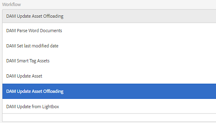

# Déchargeur de workflow de ressources{#assets-workflow-offloader}

Le déchargeur de workflow de ressources permet à plusieurs instances Adobe Experience Manager (AEM) Assets de réduire la charge de traitement sur l’instance principale. La charge de traitement est répartie entre l’instance principale et les différentes instances de déchargement (auxiliaires) que vous y ajoutez. La répartition de la charge de traitement des ressources augmente l’efficacité et la vitesse de traitement des ressources par AEM Assets. De plus, elle contribue à allouer des ressources dédiées pour traiter des ressources d’un type MIME particulier. Par exemple, vous pouvez réserver un nœud spécifique de votre topologie au traitement des ressources InDesign.

## Configuration de la topologie du déchargeur {#configure-offloader-topology}

Utilisez Configuration Manager pour ajouter l’URL de l’instance de filet de conduite et les noms d’hôte des instances de déchargement pour les demandes de connexion sur l’instance de filet de conduite.

1. Tap/click the AEM logo, and choose **Tools** > **Operations** > **Web Console** to open Configuration Manager.
1. From the Web Console, select **Sling** >  **Topology Management**.

   

1. In the Topology Management page, tap/click the **Configure Discovery.Oak Service** link.

   

1. In the Discovery Service Configuration page, specify the connector URL for the leader instance in the **Topology Connector URLs** field.

   

1. In the **Topology Connector Whitelist** field, specify IP address or host names of offloader instances that are allowed to connect with the leader instance. Appuyez/cliquez sur **Enregistrer**.

   

1. Pour afficher les instances de déchargement connectées à l’instance principale, sélectionnez **Tools** > **Deployment** > **Topology** et appuyez/cliquez sur la vue Cluster.

## Désactivation du déchargement {#disable-offloading}

1. Tap/click the AEM logo, and choose **Tools** > **Deployment** > **Offloading**. The **Offloading Browser** page displays topics and the server instances that can consume the topics.

   

1. Disable the *com/adobe/granite/workflow/offloading* topic on the leader instances with which users interact to upload or change AEM assets.

   

## Configuration des lanceurs de workflow sur l’instance principale {#configure-workflow-launchers-on-the-leader-instance}

Configure workflow launchers to use the [!UICONTROL DAM Update Asset Offloading] workflow on the leader instance instead of the **Dam Update Asset** workflow.

1. Tap/click the AEM logo, and choose, **Tools** > **Workflow** > **Launchers** to open the **Workflow Launchers** console.

   

1. Locate the two Launcher configurations with event type **Node Created** and **Node Modified** respectively, which run the **DAM Update Asset** workflow.
1. For each configuration, select the checkbox before it and tap/click the **View Properties** icon from the toolbar to display the **Launcher Properties** dialog.

   

1. From the **Workflow** list, choose [!UICONTROL DAM Update Asset Offloading] and tap/click **Save**.

   

1. Tap/click the AEM logo, and choose, **Tools** > **Workflow** > **Models** to open the **Workflow Models** page.
1. Select the [!UICONTROL DAM Update Asset Offloading] workflow, and tap/click **Edit** from the toolbar to display its details.

   

1. Display the context menu for the **DAM Workflow Offloading** step, and choose **Edit**. Vérifiez la saisie dans le champ **Rubrique de tâche** de l’onglet **Arguments génériques** de la boîte de dialogue de configuration.

   

## Désactivation des lanceurs de workflow sur les instances de déchargement {#disable-the-workflow-launchers-on-the-offloader-instances}

Disable the workflow launchers that run the **DAM Update Asset** workflow on the leader instance.

1. Tap/click the AEM logo, and choose, **Tools** > **Workflow** > **Launchers** to open the **Workflow Launchers** console.

   

1. Locate the two Launcher configurations with event type **Node Created** and **Node Modified** respectively, which run the **DAM Update Asset** workflow.
1. For each configuration, select the checkbox before it and tap/click the **View Properties** icon from the toolbar to display the **Launcher Properties** dialog.

   

1. In the **Activate** section, drag the slider to disable the workflow launcher and tap/click **Save** to disable it.

   

1. Téléchargez tout fichier de type image dans l’instance de filet de conduite. Vérifiez les miniatures générées et reportées pour le fichier par l’instance déchargée.

