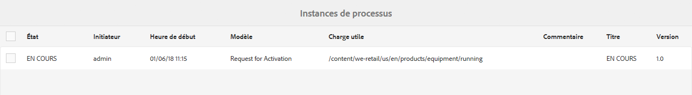
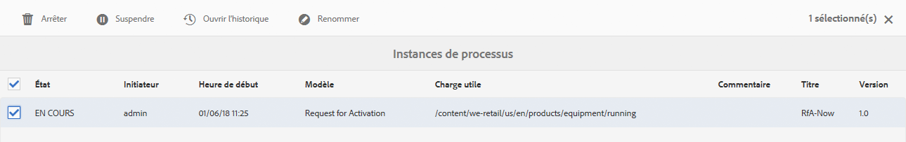
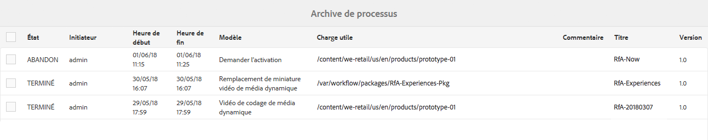
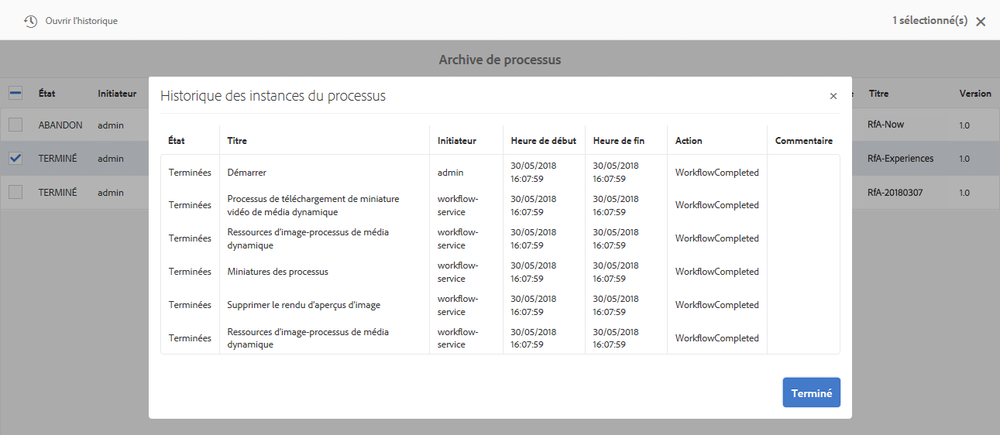
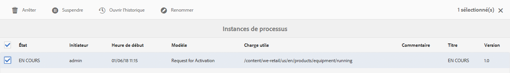
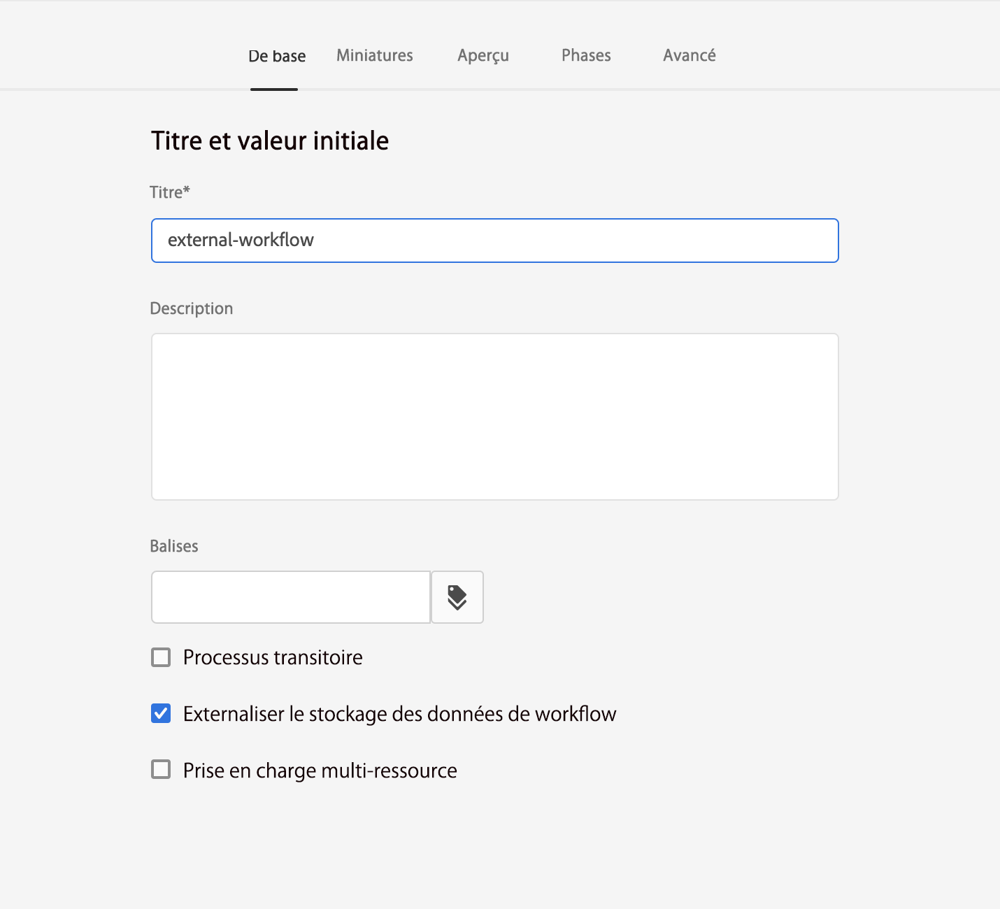

# Administration d’instances de workflow{#administering-workflow-instances}

La console de workflows fournit plusieurs outils permettant d’administrer les instances de workflow pour vérifier qu’elles s’exécutent comme prévu.

>[!NOTE]
>
>La [console JMX](/help/sites-administering/jmx-console.md#workflow-maintenance) permet d’effectuer d’autres opérations de maintenance des workflows.

Différentes consoles sont à votre disposition pour administrer les workflows. Utilisez la [navigation globale](/help/sites-authoring/basic-handling.md#global-navigation) pour ouvrir le panneau **Outils**, puis sélectionnez **Workflows** :

* **Modèles** : gérez les définitions des workflows.
* **Instances** : affichez et gérez l’exécution des instances de workflow.
* **Lanceurs** : gérez le lancement des workflows.
* **Archive** : affichez l’historique des workflows correctement terminés.
* **Échecs** : affichez l’historique des workflows terminés avec des erreurs.
* **Attribution automatique** : configurez l’attribution automatique des workflows aux modèles

## Suivi du statut des instances de workflow {#monitoring-the-status-of-workflow-instances}

1. Avec la navigation, sélectionnez **Outil**, puis **Workflows**.
1. Sélectionner **Instances** vous pouvez ainsi afficher la liste des instances de workflow en cours.

   

<!--
## Search Workflow Instances {#search-workflow-instances}

1. Using Navigation select **Tools**, then **Workflow**.
1. Select **Instances** to display the list of workflow instances currently in progress. On the top rail, in the left corner, select **Filters**. Alternatively, you can use the keystrokes alt+1. The following dialog is displayed:

   

1. In the Filter dialog, select the workflow search criteria. You can search based on these inputs:

   * Payload path: Select a specific path
   * Workflow model: Select a workflow model
   * Assignee: Select a workflow Assignee
   * Type: Task, Workflow item, or Workflow Failure
   * Task Status: Active, Complete, or Terminated
   * Where I Am: Owner AND Assignee, Owner only, Assignee only
   * Start Date: Start date before or after a specified date
   * End Date: End date before or after a specified date
   * Due Date: Due date before or after a specified date
   * Updated Date: Updated date before or after a specified date
-->

## Suspension, reprise ou arrêt d’une instance de workflows {#suspending-resuming-and-terminating-a-workflow-instance}

1. Avec la navigation, sélectionnez **Outil**, puis **Workflows**.
1. Sélectionner **Instances** vous pouvez ainsi afficher la liste des instances de workflow en cours.

   

1. Sélectionnez un élément spécifique, puis utilisez **Arrêter**, **Suspendre** ou **Reprendre**, selon le cas. Une confirmation et/ou d’autres détails sont requis :

   

## Affichage des workflows archivés {#viewing-archived-workflows}

1. Avec la navigation, sélectionnez **Outil**, puis **Workflows**.
1. Sélectionner **Archiver** vous pouvez ainsi afficher la liste des instances de workflow qui se sont terminées avec succès.

   

   >[!NOTE]
   >
   >L’état d’abandon est considéré comme une interruption réussie, car il se produit suite à une action de l’utilisateur ou de l’utilisatrice, comme par exemple :
   >
   >* L’utilisation de la fonction **Terminer**.
   >* lorsqu’une page soumise à un workflow est (forcée) supprimée, le workflow est arrêté.

1. Sélectionnez un élément spécifique, puis **Ouvrir l’historique** pour afficher plus de détails :

   

## Correction des échecs d’instance de workflows {#fixing-workflow-instance-failures}

Lorsqu’un workflow échoue, AEM fournit la variable **Échecs** pour vous permettre d’enquêter et de prendre les mesures appropriées une fois la cause d’origine traitée :

* **Détails de l’échec**
Ouvre une fenêtre pour afficher le **Message d’échec**, **Étape**, et **Pile des échecs**.

* **Ouvrir l’historique**
Affiche des détails sur l’historique des workflows.

* **Étape de reprise** - Exécute à nouveau l’instance du composant Étape de script. Utilisez la commande Relancer l’étape après avoir corrigé la cause de l’erreur initiale. Par exemple, relancez l’étape après avoir corrigé un bogue dans le script que l’étape de processus exécute.
* **Arrêter** - Arrêtez le workflow si l’erreur a provoqué une situation irréconciliable pour le workflow. Par exemple, le workflow peut se baser sur des conditions environnementales comme des informations figurant dans le référentiel qui ne sont plus valides pour l’instance de workflow.
* **Arrêter et réessayer** - Similaire à **Arrêter** mais qu’une nouvelle instance de workflow est lancée à l’aide de la charge utile, du titre et de la description d’origine.

Pour examiner les échecs, puis reprendre ou arrêter le workflow par la suite, utilisez les étapes suivantes :

1. Avec la navigation, sélectionnez **Outil**, puis **Workflows**.
1. Sélectionner **Échecs** vous pouvez ainsi afficher la liste des instances de workflow qui ne se sont pas terminées avec succès.
1. Sélectionnez un élément spécifique, puis l’action appropriée :

   

## Purge régulière des instances de workflow {#regular-purging-of-workflow-instances}

Réduire le nombre d’instances de workflow améliore les performances du moteur de workflows. Vous pouvez donc purger régulièrement les instances de workflow terminées ou en cours d’exécution du référentiel.

Configurez la **configuration de la purge du workflow Adobe Granite** pour purger les instances de workflows en fonction de leur âge et de leur statut. Vous pouvez également purger les instances de workflow de tous les modèles ou d’un modèle spécifique.

Vous pouvez également créer plusieurs configurations du service pour purger les instances de workflow qui répondent à différents critères. Par exemple, créez une configuration qui purge les instances d’un modèle de workflow spécifique lorsqu’elles s’exécutent pendant plus longtemps que prévu. Créez une autre configuration qui purge tous les workflows terminés après un certain nombre de jours afin de minimiser la taille du référentiel.

Pour configurer le service, vous pouvez utiliser la [console Web](/help/sites-deploying/configuring-osgi.md#osgi-configuration-with-the-web-console) ou [ajouter une configuration OSGi au référentiel](/help/sites-deploying/configuring-osgi.md#osgi-configuration-in-the-repository). Le tableau suivant décrit les propriétés dont vous avez besoin pour l’une ou l’autre de ces méthodes.

>[!NOTE]
>
>Pour ajouter la configuration au référentiel, le PID de service est :
>
>`com.adobe.granite.workflow.purge.Scheduler`
>
>Le service étant un service d’usine, le nom du nœud `sling:OsgiConfig` nécessite un suffixe d’identifiant, tel que :
>
>`com.adobe.granite.workflow.purge.Scheduler-myidentifier`

<table>
 <tbody>
  <tr>
   <th>Nom de propriété (console web)</th>
   <th>Nom de propriété OSGi</th>
   <th>Description</th>
  </tr>
  <tr>
   <td>Nom de la tâche</td>
   <td>scheduledpurge.name</td>
   <td>Nom explicite de la purge planifiée.</td>
  </tr>
  <tr>
   <td>Statut du workflow</td>
   <td>scheduledpurge.workflowStatus</td>
   <td><p>Statut des instances de workflow à purger. Les valeurs suivantes sont valides :</p>
    <ul>
     <li>TERMINÉ : les instances de workflow terminées sont purgées.</li>
     <li>EN COURS : les instances de workflow en cours d’exécution sont purgées.</li>
    </ul> </td>
  </tr>
  <tr>
   <td>Modèles à purger</td>
   <td>scheduledpurge.modelIds</td>
   <td><p>ID des modèles de workflows à purger. L’ID correspond au chemin d’accès au nœud de modèle, par exemple : <br />/var/workflow/models/dam/update_asset<br />. </p> <p>Pour spécifier plusieurs modèles, cliquez sur le bouton + dans la console web. </p> <p>Ne spécifiez aucune valeur pour purger les instances de tous les modèles de workflow.</p> </td>
  </tr>
  <tr>
   <td>Âge du workflow</td>
   <td>scheduledpurge.daysell</td>
   <td>L’âge des instances de workflow à purger en jours.</td>
  </tr>
 </tbody>
</table>

## Définition de la taille maximale de la boîte de réception {#setting-the-maximum-size-of-the-inbox}

Vous pouvez définir la taille maximale de la boîte de réception en configurant le **service de workflow Adobe Granite** à l’aide de la [console web](/help/sites-deploying/configuring-osgi.md#osgi-configuration-with-the-web-console) ou [ajouter une configuration OSGi au référentiel](/help/sites-deploying/configuring-osgi.md#osgi-configuration-in-the-repository). Le tableau suivant décrit la propriété que vous configurez pour l’une ou l’autre de ces méthodes.

>[!NOTE]
>
>Pour ajouter la configuration au référentiel, le PID de service est :
>
>`com.adobe.granite.workflow.core.WorkflowSessionFactory`.

| Nom de propriété (console web) | Nom de propriété OSGi |
|---|---|
| Taille de requête de boîte de réception maximale | granite.workflow.inboxQuerySize |

## Utilisation de variables Workflow pour les banques de données détenues par le client {#using-workflow-variables-customer-datastore}

Les données traitées par les workflows sont stockées dans l’enregistrement fourni par Adobe (JCR). Par nature, ces données peuvent être sensibles. Vous pouvez enregistrer toutes les métadonnées/données définies par l’utilisateur dans votre propre stockage géré au lieu d’Adobe le stockage fourni. Ces sections décrivent comment configurer ces variables pour un enregistrement externe.

### Définition du modèle pour utiliser l’enregistrement externe des métadonnées {#set-model-for-external-storage}

Au niveau du modèle de workflow, un indicateur est fourni pour indiquer que le modèle (et ses instances d’exécution) dispose d’un enregistrement externe des métadonnées. Les variables de workflow ne sont pas conservées dans JCR pour les instances de workflow des modèles marqués pour le stockage externe.

La propriété *userMetadataPersistenceEnabled* est stocké dans la variable *noeud jcr:content* du modèle de workflow. Cet indicateur est conservé dans les métadonnées de workflow en tant que *cq:userMetaDataCustomPersistenceEnabled*.

L’illustration ci-dessous montre comment définir l’indicateur dans un workflow.



### API pour les métadonnées dans un enregistrement externe {#apis-for-metadata-external-storage}

Pour stocker les variables en externe, implémentez les API exposées par le workflow.

UserMetaDataPersistenceContext

Les exemples suivants vous montrent comment utiliser l’API.

```
@ProviderType
public interface UserMetaDataPersistenceContext {
 
    /**
     * Gets the workflow for persistence
     * @return workflow
     */
    Workflow getWorkflow();
 
    /**
     * Gets the workflow id for persistence
     * @return workflowId
     */
    String getWorkflowId();
 
    /**
     * Gets the user metadata persistence id
     * @return userDataId
     */
    String getUserDataId();
}
```

UserMetaDataPersistenceProvider

```
/**
 * This provider can be implemented to store the user defined workflow-data metadata in a custom storage location
 */
@ConsumerType
public interface UserMetaDataPersistenceProvider {
 
   /**
    * Retrieves the metadata using a unique identifier
    * @param userMetaDataPersistenceContext
    * @param metaDataMap of user defined workflow data metaData
    * @throws WorkflowException
    */
   void get(UserMetaDataPersistenceContext userMetaDataPersistenceContext, MetaDataMap metaDataMap) throws WorkflowException;
 
   /**
    * Stores the given metadata to the custom storage location
    * @param userMetaDataPersistenceContext
    * @param metaDataMap metadata map
    * @return the unique identifier that can be used to retrieve metadata. If null is returned, then workflowId is used.
    * @throws WorkflowException
    */
   String put(UserMetaDataPersistenceContext userMetaDataPersistenceContext, MetaDataMap metaDataMap) throws WorkflowException;
} 
```
