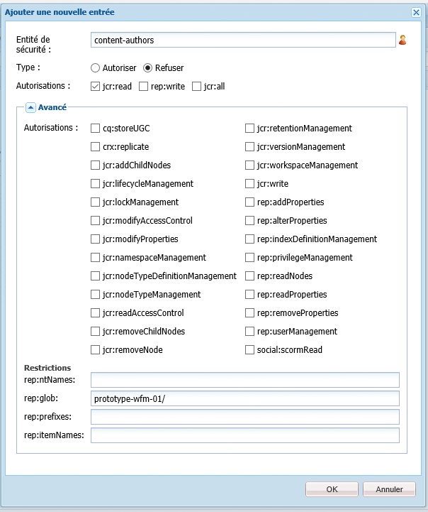
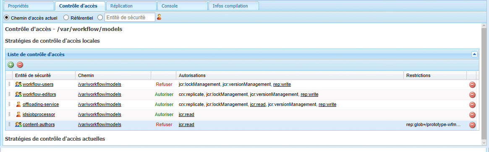
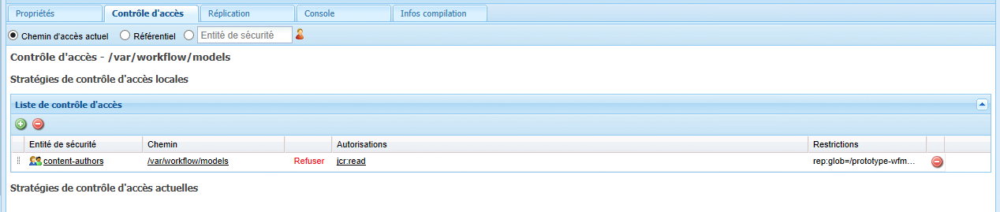

# Gestion de l’accès aux workflows{#managing-access-to-workflows}

Configurez les listes de contrôle d’accès en fonction des comptes utilisateur pour permettre (ou non) de lancer des workflows et d’y participer.

## Autorisations utilisateur exigées pour les workflows {#required-user-permissions-for-workflows}

Il est possible d’agir sur les workflows dans les cas suivants :

* vous travaillez avec le compte `admin`
* le compte a été affecté au groupe par défaut `workflow-users` :

   * Ce groupe contient toutes les autorisations nécessaires pour que les utilisateurs agissent sur les workflows.
   * Lorsque le compte appartient à ce groupe, il n’a accès qu’aux workflows dont il est à l’origine.

* le compte a été affecté au groupe par défaut `workflow-administrators` :

   * Ce groupe contient toutes les autorisations nécessaires pour que vos utilisateurs privilégiés surveillent et gèrent les workflows.
   * Lorsque le compte appartient à ce groupe, il a accès à tous les workflows.

>[!NOTE]
>
>Il s’agit des conditions requises minimales. Pour effectuer des actions spécifiques, votre compte doit également correspondre au participant affecté ou à un membre du groupe affecté pour prendre des mesures spécifiques.

## Configuration de l’accès aux workflows {#configuring-access-to-workflows}

Les modèles de workflows héritent d’une liste de contrôle d’accès par défaut pour contrôler les interactions possibles des utilisateurs avec les workflows. Pour personnaliser l’accès utilisateur d’un workflow, modifiez la liste de contrôle d’accès dans le référentiel du dossier contenant le nœud de modèles de workflows :

* [Appliquez une liste de contrôle d’accès pour le modèle spécifique de workflow sous /var/workflow/models.](/help/sites-administering/workflows-managing.md#apply-an-acl-for-the-specific-workflow-model-to-var-workflow-models)
* [Créez un sous-dossier dans /var/workflow/models et appliquez-y la liste de contrôle d’accès.](/help/sites-administering/workflows-managing.md#create-a-subfolder-in-var-workflow-models-and-apply-the-acl-to-that)

>[!NOTE]
>
>Pour plus d’informations sur l’utilisation de CRXDE Lite pour configurer des listes de contrôle d’accès, voir [Gestion des droits d’accès](/help/sites-administering/user-group-ac-admin.md#access-right-management).

### Appliquez une liste de contrôle d’accès pour le modèle spécifique de workflow sous /var/workflow/models.  {#apply-an-acl-for-the-specific-workflow-model-to-var-workflow-models}

Si le modèle de flux de travail est stocké dans `/var/workflow/models`, vous pouvez affecter une liste de contrôle d&#39;accès spécifique, pertinente uniquement pour ce flux de travail, au dossier :

1. Ouvrez CRXDE Lite dans votre navigateur web (par exemple, [http://localhost:4502/crx/de](http://localhost:4502/crx/de)).
1. Dans l’arborescence des nœuds, sélectionnez le nœud correspondant au dossier des modèles de workflow :

   `/var/workflow/models`

1. Cliquez sur l’onglet **Contrôle d’accès**.
1. Dans le tableau **Stratégies de contrôle d’accès locales** (**Liste de contrôle d’accès**), cliquez sur l’icône « + » pour **ajouter une entrée**.
1. Dans la boîte de dialogue **Ajouter une nouvelle entrée**, ajoutez une nouvelle entrée de contrôle d’accès avec les propriétés suivantes :

   * **Principal** :  `content-authors`
   * **Type** : `Deny`
   * **Privilèges** :  `jcr:read`
   * **Rep:glob** : référence au workflow spécifique

   

   Le tableau **Liste de contrôle d’accès** comprend maintenant la restriction pour `content-authors` dans le modèle de workflow `prototype-wfm-01`.

   

1. Cliquez sur **Enregistrer tout**.

   Le workflow `prototype-wfm-01` n’est plus disponible pour les membres du groupe `content-authors`.

### Créez un sous-dossier dans /var/workflow/models et appliquez-y la liste de contrôle d’accès.{#create-a-subfolder-in-var-workflow-models-and-apply-the-acl-to-that}

Votre [équipe de développement peut créer des workflow dans un sous-dossier](/help/sites-developing/workflows-models.md#creating-a-new-workflow) de

`/var/workflow/models`

Comparable aux workflows DAM stockés sous

`/var/workflow/models/dam/`

Vous pouvez alors ajouter une liste de contrôle d’accès dans le dossier proprement dit.

1. Ouvrez CRXDE Lite dans votre navigateur web (par exemple, [http://localhost:4502/crx/de](http://localhost:4502/crx/de)).
1. Dans l’arborescence de nœuds, sélectionnez le nœud correspondant au dossier individuel dans le dossier Modèles de workflows. Par exemple :

   `/var/workflow/models/prototypes`

1. Cliquez sur l’onglet **Contrôle d’accès**.
1. Dans le tableau **Stratégie de contrôle d’accès applicable**, cliquez sur l’icône « + » pour **ajouter** une entrée.
1. Dans le tableau **Stratégies de contrôle d’accès locales** (**Liste de contrôle d’accès**), cliquez sur l’icône + pour **ajouter une entrée**.
1. Dans la boîte de dialogue **Ajouter une nouvelle entrée**, ajoutez une nouvelle entrée de contrôle d’accès avec les propriétés suivantes :

   * **Principal** :  `content-authors`
   * **Type** : `Deny`
   * **Privilèges** :  `jcr:read`

   >[!NOTE]
   >
   >Comme lors de l’[application d’une liste de contrôle d’accès pour le modèle de workflow spécifique à /var/workflow/models](/help/sites-administering/workflows-managing.md#apply-an-acl-for-the-specific-workflow-model-to-var-workflow-models), vous pouvez inclure une propriété rep:glob pour limiter l’accès à un workflow spécifique.

   

   Le tableau **Liste de contrôle d’accès** comprend maintenant la restriction pour `content-authors` dans le dossier `prototypes`.

   

1. Cliquez sur **Enregistrer tout**.

   Les modèles du dossier `prototypes` ne sont plus disponibles pour les membres du groupe `content-authors`.

