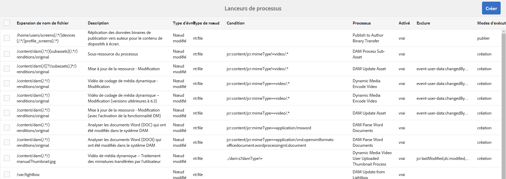
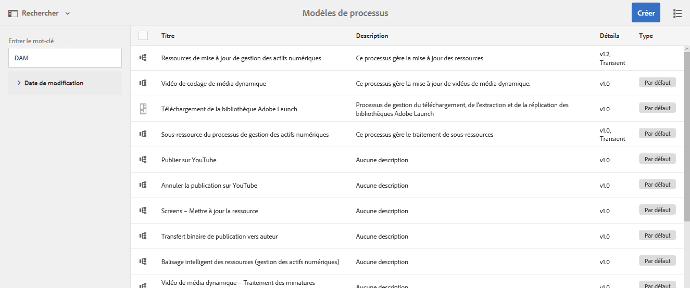
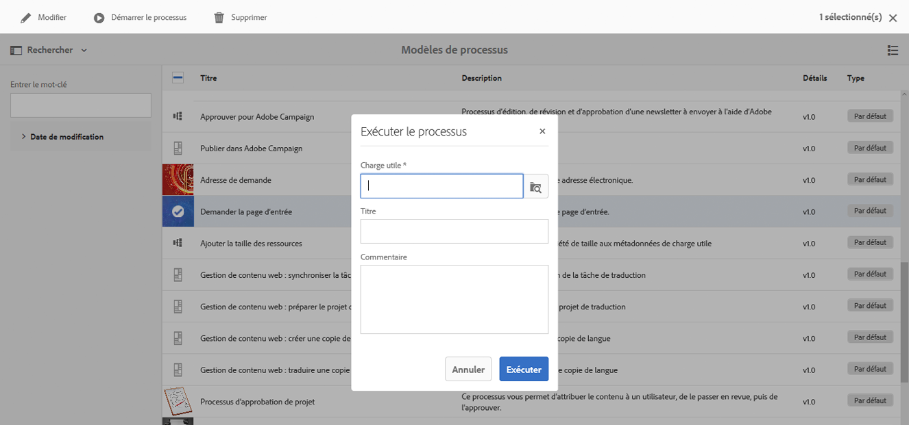
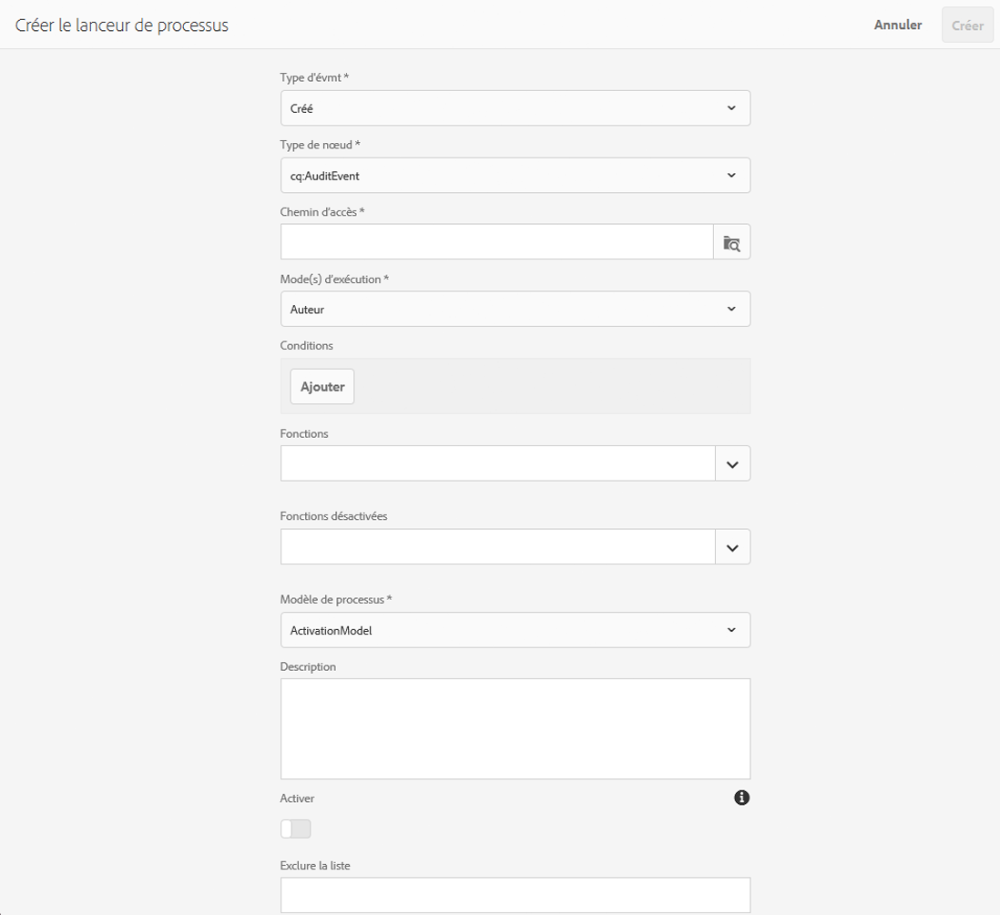

# Démarrage d’un workflow{#starting-workflows}

Lors de l’administration des workflows, vous pouvez les démarrer selon différentes méthodes :

* Manuellement :

   * À partir d’un [modèle de workflow](#workflow-models)
   * À l’aide d’un module de workflow pour le [le traitement par lots](#workflow-packages-for-batch-processing)

* Automatiquement :

   * En réponse à des modifications de nœud, [à l’aide d’un lanceur](#workflows-launchers)

>[!NOTE]
>
>D’autres méthodes sont également disponibles pour les créateurs. Pour plus d’informations, voir :
>
>* [Application de workflows aux pages ](/help/sites-authoring/workflows-applying.md)
>* [Application de workflows à des ressources de gestion des ressources numériques](/help/assets/assets-workflow.md)
>* [AEM Forms](https://helpx.adobe.com/aem-forms/6-2/aem-workflows-submit-process-form.html)
>* [Projets de traduction](/help/sites-administering/tc-manage.md)

>

## Modèles de workflow {#workflow-models}

Vous pouvez démarrer un workflow [reposant sur l’un des modèles](/help/sites-administering/workflows.md#workflow-models-and-instances) répertoriés dans la console Modèles de workflows. La charge utile constitue les seules informations obligatoires, même s’il est possible d’ajouter également un titre et/ou un commentaire.

## Lanceurs de workflows {#workflows-launchers}

Le lanceur de workflows surveille les modifications du référentiel de contenu pour lancer des workflows en fonction du type d’emplacement et de ressource du nœud modifié.

Using the **Launcher** you can:

* afficher les workflows déjà lancés pour des nœuds spécifiques ;
* sélectionner un workflow à lancer lorsqu’un certain nœud/type de nœud a été créé/modifié/supprimé ;
* supprimer des relations workflow -nœud existantes.

Vous pouvez créer un lanceur sur n’importe quel nœud. Cependant, les modifications apportées à certains nœuds ne lancent pas de workflows. Les modifications apportées à des nœuds sous les chemins d’accès ci-dessous n’entraînent pas le lancement des workflows :

* `/var/workflow/instances`
* Any workflow-inbox node located anywhere in the `/home/users` branch
* `/tmp`
* `/var/audit`
* `/var/classes`
* `/var/eventing`
* `/var/linkchecker`
* `/var/mobile`
* `/var/statistics`

   * Exception: Changes to nodes below `/var/statistics/tracking` *do* cause workflows to launch.

Différentes définitions sont incluses avec l’installation standard. Elles sont utilisées pour les tâches de gestion des actifs numériques et de collaboration sociale :

## Modules de workflow pour le traitement par lots {#workflow-packages-for-batch-processing}

Les modules de workflow sont des modules qui peuvent être transmis à un workflow sous forme de charge utile pour traitement, ce qui permet de traiter plusieurs ressources.

Un module de workflow :

* contient des liens vers un ensemble de ressources (comme des pages ou des ressources) ;
* contient des informations sur les modules, comme la date de création, l’utilisateur qui a créé le module et une brève description ;
* est défini à l’aide d’un modèle de page spécialisé. Ce type de page permet à l’utilisateur de spécifier les ressources dans le module ;
* peut être utilisé plusieurs fois ;
* peut être modifié par l’utilisateur (ajout ou suppression de ressources) alors que l’instance de workflow est en cours d’exécution.

## Démarrage d’un workflow à partir de la console Modèles {#starting-a-workflow-from-the-models-console}

1. Navigate to the **Models** console using **Tools**, **Workflow**, then **Models**.
1. Sélectionnez le workflow (selon la vue de la console). Vous pouvez également utiliser la fonction Rechercher (dans la partie supérieure gauche), si nécessaire :

   

   >[!NOTE]
   >
   >The **[Transient](/help/sites-developing/workflows.md#transient-workflows)** indicator shows workflows for which the workflow history will not be persisted.

1. Select **Start Workflow** from the toolbar.
1. La boîte de dialogue Exécuter le workflow s’ouvre, d’où vous pouvez spécifier les éléments suivants :

   * **Charge utile**

      Il peut s’agir d’une page, d’un noeud, d’une ressource, d’un package, entre autres ressources.

   * **Titre**

      Titre facultatif permettant d’identifier cette instance.

   * **Commentaire**

      Un commentaire facultatif pour aider à indiquer les détails de cette instance.
   

## Création d’une configuration de lanceur {#creating-a-launcher-configuration}

1. Navigate to the **Workflow Launchers** console using **Tools**, **Workflow**, then **Launchers**.
1. Select **Create**, then **Add Launcher** to open the dialog:

   

   * **Type d&#39;évmt**

      Type d&#39;événement qui lancera le processus :

      * Créé
      * Modifié
      * Supprimé
   * **Notetype**

      Type de noeud auquel le lanceur de processus s’applique.

   * **Chemin**

      Chemin d’accès auquel le lanceur de processus s’applique.

   * **Mode(s) d’exécution**

      Type de serveur auquel s&#39;applique le lanceur de processus. Sélectionnez **Auteur**, **Publication** ou **Créer et publier**.

   * **Conditions**

      Liste de conditions pour les valeurs de noeud qui, lorsqu’elles sont évaluées, déterminent si le processus est lancé. Par exemple, la condition suivante entraîne le lancement du processus lorsque le noeud porte un nom de propriété avec la valeur Utilisateur :

      name==User

   * **Fonctionnalités**

      Liste de fonctionnalités à activer. Sélectionnez les fonctions nécessaires à l’aide du sélecteur de liste déroulante.

   * **Fonctions désactivées**

   Liste de fonctionnalités à désactiver. Sélectionnez les fonctions nécessaires à l’aide du sélecteur de liste déroulante.

   * **Modèle de processus**

      Flux de travaux à lancer lorsque le Type d&#39;événement se produit sur le Nodetype et/ou le Chemin sous la condition définie.

   * **Description**

      Votre propre texte pour décrire et identifier la configuration du lanceur.

   * **Activer**

      Contrôle si le lanceur de processus est activé :

      * Sélectionnez **Activer** pour lancer des workflows lorsque des propriétés de configuration sont remplies.
      * Sélectionnez **Désactiver** lorsque le workflow ne doit pas être exécuté (pas même lorsque les propriétés de configuration sont satisfaites).
   * **Exclure la liste**

      Ceci spécifie les événements JCR à exclure (c’est-à-dire ignorer) lors de la détermination du déclenchement d’un processus.

      Cette propriété de lancement est une liste d&#39;éléments séparés par des virgules : &quot;

      * `property-name` ignore les événements `jcr` déclenchés avec le nom de propriété spécifié. ``
      * `event-user-data:<*someValue*>` ignore tout événement qui contient le `*<someValue*`> `user-data` défini via l’ [ API `ObservationManager`](https://docs.adobe.com/content/docs/en/spec/jsr170/javadocs/jcr-2.0/javax/jcr/observation/ObservationManager.html#setUserData(java.lang.String).

      Par exemple :

      `jcr:lastModified,dc:modified,dc:format,jcr:lastModifiedBy,imageMap,event-user-data:changedByWorkflowProcess`

      Cette fonction peut être utilisée pour ignorer les modifications déclenchées par un autre processus de workflow en ajoutant l’élément d’exclusion :

      `event-user-data:changedByWorkflowProcess`

1. Select **Create**, to create the launcher and return to the console.

   Une fois que l’événement approprié se produit, le lanceur est déclenché et le workflow est démarré.

## Gestion d’une configuration de lanceur {#managing-a-launcher-configuration}

After you have created your launcher configuration you can use the same console to select the instance, then **View Properties** (and edit them) or **Delete**.
