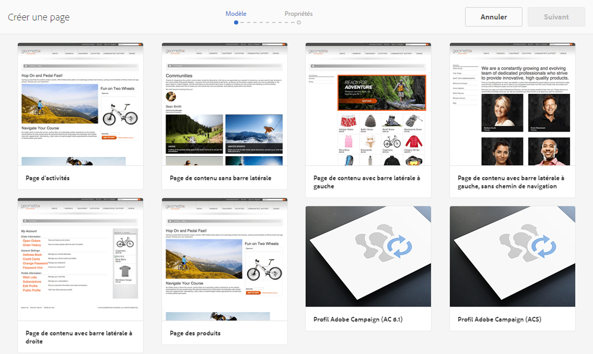
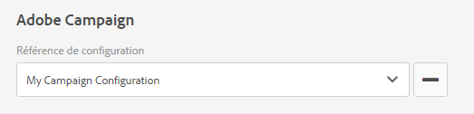
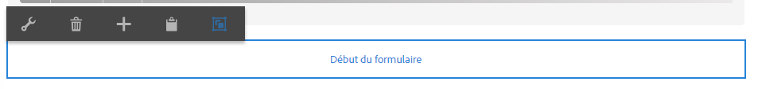
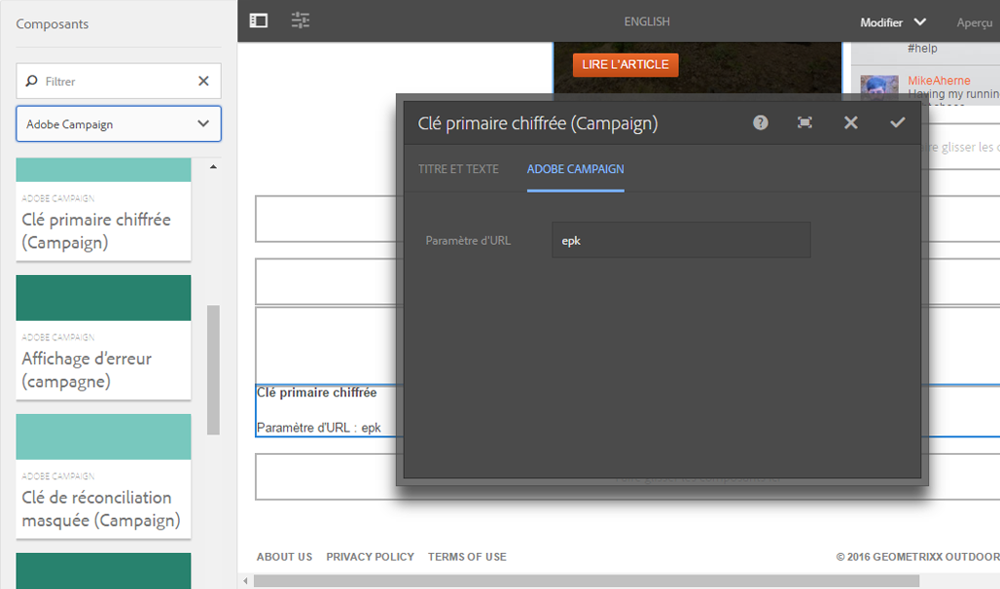
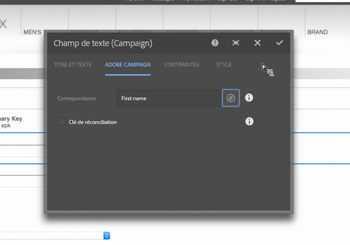

# Création de formulaires Adobe Campaign dans AEM {#creating-adobe-campaign-forms-in-aem}

AEM vous permet de créer et d’utiliser des formulaires qui interagissent avec Adobe Campaign sur votre site web. Vous pouvez insérer des champs spécifiques dans vos formulaires et les mapper à la base de données Adobe Campaign.

Vous pouvez également gérer les nouveaux abonnements des contacts, les désabonnements et les données de profil utilisateur, tout en intégrant leurs données dans votre base de données Adobe Campaign.

Pour utiliser des formulaires Adobe Campaign dans AEM, suivez les étapes décrites dans ce document :

1. Rendre un modèle disponible.
1. Créer un formulaire.
1. Modifier le contenu du formulaire.

Trois types de formulaires, spécifiques à Adobe Campaign, sont disponibles par défaut :

* Enregistrement d’un profil
* Abonnement à un service
* Désabonnement d’un service

Ces formulaires définissent un paramètre d’URL qui accepte la clé primaire chiffrée d’un profil Adobe Campaign. Selon ce paramètre d’URL, le formulaire met à jour les données du profil Adobe Campaign associé.

Même si vous créez ces formulaires individuellement, dans un cas d’utilisation standard, vous générez un lien personnalisé sur une page de formulaire à l’intérieur du contenu de la newsletter, afin que les destinataires puissent ouvrir le lien et modifier les données de leur profil (qu’il s’agisse pour eux de se désabonner, de s’abonner ou de mettre à jour leur profil).

Le formulaire est mis à jour automatiquement en fonction de l’utilisateur. Voir [Modification du contenu d’un formulaire](#editing-form-content) pour plus d’informations.

## Rendre un modèle disponible {#making-a-template-available}

Avant de pouvoir créer des formulaires spécifiques à Adobe Campaign, vous devez rendre les différents modèles disponibles dans votre application AEM.

Pour ce faire, consultez la [documentation sur les modèles](/help/sites-developing/templates.md#template-availability).

## Création d’un formulaire {#creating-a-form}

Tout d’abord, vérifiez la connexion entre les instances de création et de publication et assurez-vous qu’Adobe Campaign est en cours d’exécution. Voir [Intégration à Adobe Campaign Standard](/help/sites-administering/campaignstandard.md) ou [Intégration à Adobe Campaign Classic](/help/sites-administering/campaignonpremise.md).

>[!NOTE]
>
>Vérifiez que la propriété **acMapping** sur le nœud **jcr:content** de la page est définie sur **mapRecipient** ou **profile**, lorsque vous utilisez Adobe Campaign Classic ou Adobe Campaign Standard, respectivement.

1. Dans AEM, dans Sites, naviguez jusqu’à l’emplacement où vous souhaitez créer une page.
1. Créez une page et sélectionnez **Profil Adobe Campaign Classic** ou **Profil Adobe Campaign Standard**, puis cliquez sur **Suivant**.

   

   >[!NOTE]
   >
   >Si le modèle souhaité n’est pas disponible, voir [Disponibilité des modèles](/help/sites-developing/templates.md#template-availability).

1. Dans le champ **Nom**, ajoutez le nom de la page. Il doit s’agir d’un nom JCR valide.
1. Saisissez un titre dans le champ **Titre**, puis cliquez sur **Créer**.
1. Ouvrez la page, puis choisissez **Ouvrir les propriétés**, ajoutez ensuite la configuration Adobe Campaign aux services cloud et cliquez sur la coche pour enregistrer vos modifications.

   

1. Sur la page, dans le composant **Début du formulaire**, choisissez le type du formulaire en question : **S’abonner, Se désabonner** ou **Enregistrer le profil**. Vous pouvez uniquement disposer d’un type par formulaire. Vous pouvez désormais [modifier le contenu du formulaire](#editing-form-content).

## Modification du contenu d’un formulaire {#editing-form-content}

Les formulaires dédiés à Adobe Campaign présentent des composants spécifiques. Ces composants disposent d’une option pour vous permettre de lier chaque champ du formulaire à un champ dans la base de données Adobe Campaign.

>[!NOTE]
>
>Si le modèle souhaité n’est pas disponible, voir [Mise à disposition d’un modèle](/help/sites-authoring/adobe-campaign.md).

Cette section présente uniquement les liens spécifiques à Adobe Campaign. Pour plus d’informations sur une présentation plus générale de l’utilisation des formulaires dans Adobe Experience Manager, voir [Composants du mode éditeur](/help/sites-authoring/default-components-foundation.md).

1. Sélectionnez **Ouvrir les propriétés**, ajoutez la configuration Adobe Campaign aux services cloud et cliquez sur la coche pour enregistrer vos modifications.

   

1. Sur la page, dans le composant **Début de formulaire**, cliquez sur l’icône Configuration.

   

1. Cliquez sur l&#39;onglet **Advanced** et sélectionnez le type de formulaire - **S&#39;abonner,** ou **Enregistrer le Profil** et cliquez sur **OK.** Vous pouvez uniquement disposer d’un type par formulaire.

   * **Adobe Campaign : enregistrer le profil** : vous permet de créer ou de mettre à jour un destinataire dans Adobe Campaign (valeur par défaut).
   * **Adobe Campaign : s’abonner aux services** : vous permet de gérer les abonnements d’un destinataire dans Adobe Campaign.
   * **Adobe Campaign : se désabonner des services** : vous permet d’annuler les abonnements d’un destinataire dans Adobe Campaign.

1. Vous devez disposer d’un composant **Clé primaire chiffrée** sur chaque formulaire. Ce composant définit le paramètre d’URL utilisé pour accepter la clé primaire chiffrée d’un profil Adobe Campaign. Dans Composants, sélectionnez Adobe Campaign afin que seuls ces composants soient visibles.
1. Faites glisser le composant **Clé de Principal chiffrée** sur le formulaire (n’importe où) et cliquez ou appuyez sur l’icône **Configuration**. Dans l’onglet **Adobe Campaign**, spécifiez un nom pour le paramètre d’URL. Cliquez ou appuyez sur la coche pour enregistrer vos modifications.

   Les liens générés vers ce formulaire doivent utiliser ce paramètre d’URL et lui affecter la clé primaire chiffrée d’un profil Adobe Campaign. La clé primaire chiffrée doit présenter un format URL correct.

   

1. Ajoutez au formulaire autant de composants que vous le souhaitez, tels qu’un champ de texte, un champ de date, un champ de case à cocher, un champ d’option, etc. Voir [Composants de formulaire Adobe Campaign](/help/sites-authoring/adobe-campaign-components.md) pour plus d’informations sur chaque composant.
1. Cliquez sur l’icône Configuration pour afficher le composant. Par exemple, dans le composant **Champ de texte (Campaign)**, modifiez le titre et le texte.

   Cliquez sur **Adobe Campaign** pour mapper le champ de formulaire à une variable de métadonnées Adobe Campaign. Lors de l’envoi du formulaire, le champ mappé est mis à jour dans Adobe Campaign. Seuls les champs contenant des types correspondants sont disponibles dans le sélecteur de variables (par exemple, des variables de chaîne pour les champs de texte).

   

   >[!NOTE]
   >
   >Vous pouvez ajouter ou supprimer des champs affichés dans le tableau du destinataire en suivant les instructions ci-dessous : [https://blogs.adobe.com/experiencedelivers/experience-management/aem-campaign-integration/](https://blogs.adobe.com/experiencedelivers/experience-management/aem-campaign-integration/)

1. Cliquez sur **Publier la page**. La page est activée sur votre site. Vous pouvez l’afficher en accédant à votre instance de publication AEM. Vous pouvez aussi [tester un formulaire](#testing-a-form).

   >[!CAUTION]
   >
   >Vous devez accorder les autorisations de lecture à l’utilisateur anonyme sur le service cloud pour utiliser des formulaires sur l’instance de publication. Tenez toutefois compte des potentiels problèmes de sécurité liés au fait d’accorder les autorisations de lecture à un utilisateur anonyme et assurez-vous d’atténuer les risques associés, par exemple, en configurant le dispatcher.

## Test d’un formulaire {#testing-a-form}

Une fois que vous avez créé un formulaire et modifié son contenu, il est conseillé de tester manuellement que le formulaire fonctionne comme prévu.

>[!NOTE]
>
>Vous devez disposer d’un composant **Clé de Principal chiffrée** sur chaque formulaire. Dans Composants, sélectionnez Adobe Campaign afin que seuls ces composants soient visibles.
>
>Même si dans cette procédure vous saisissez le numéro d’EPK manuellement, dans la pratique, les utilisateurs recevront un lien vers cette page (pour se désabonner, s’abonner ou mettre à jour leur profil) dans une newsletter. En fonction de l’utilisateur, l’EPK est mis à jour automatiquement.
>
>Pour créer ce lien, vous utilisez la variable **Identifiant de ressource principale**(Adobe Campaign Standard) ou **Identificateur chiffré** (Adobe Campaign Classic) (par exemple, dans un composant **Texte et personnalisation (Campaign)**), qui pointe vers le livre de Adobe Campaign.

Pour ce faire, vous devez obtenir manuellement l’EPK d’un profil Adobe Campaign et ensuite l’ajouter à l’URL :

1. Pour obtenir la clé primaire chiffrée (EPK) d’un profil Adobe Campaign :

   * Dans Adobe Campaign Standard - Accédez à **Profils et Audiences** > **Profils**, qui liste les profils existants. Assurez-vous que le tableau affiche le champ **Identifiant de ressource principale** dans une colonne (Vous pouvez le configurer en cliquant/appuyant sur **Configurer la liste**). Copiez l’identifiant de ressource principale du profil souhaité.
   * Dans Adobe Campaign Classic, accédez à **Profils et Cibles** > **Destinataires**, qui liste les profils existants. Assurez-vous que le tableau affiche le champ **Identificateur chiffré** dans une colonne (Vous pouvez le configurer en cliquant avec le bouton droit sur une entrée et en sélectionnant **Configurer la liste...**). Copiez l’identifiant chiffré du profil souhaité.

1. Dans AEM, ouvrez la page de formulaire sur l’instance de publication et ajoutez l’EPK de l’étape 1 en tant que paramètre d’URL : utilisez le même nom que celui que vous avez précédemment défini dans le composant EPK lors de la création du formulaire (par exemple : `?epk=...`)
1. Le formulaire peut maintenant être utilisé pour modifier les données et les abonnements associés au profil Adobe Campaign lié. Après avoir modifié certains champs et envoyé le formulaire, vous pouvez vérifier dans Adobe Campaign que les données ont été mises à jour.

Les données de la base de données Adobe Campaign sont mises à jour une fois qu’un formulaire est validé.
