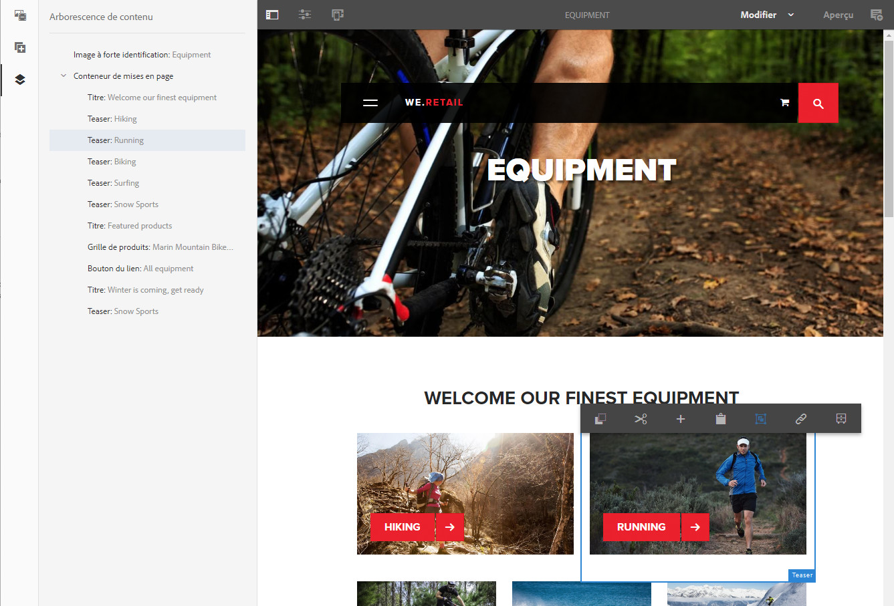

# Création – Environnement et outils{#authoring-the-environment-and-tools}

L’environnement de création d’AEM comprend divers mécanismes permettant d’organiser et de modifier votre contenu. Les outils fournis sont accessibles dans plusieurs consoles et éditeurs de page.

## Gestion de votre site {#managing-your-site}

Le **Sites** La console vous permet de parcourir et de gérer votre site web à l’aide de la barre d’en-tête, de la barre d’outils, des icônes d’action (applicables à la ressource sélectionnée), des chemins de navigation et, lorsqu’ils sont sélectionnés, des rails secondaires (par exemple, la chronologie et les références).

Par exemple, le mode Colonnes :

## Modification du contenu de la page {#editing-page-content}

Vous pouvez modifier une page à l’aide de l’éditeur de page. Par exemple :

`https://localhost:4502/editor.html/content/we-retail/us/en/equipment.html`

>[!NOTE]
>
>La première fois que vous ouvrez une page en vue de la modifier, une série de diapositives vous offre une présentation des fonctionnalités.
>
>Vous pouvez ignorer cette présentation ou la revoir à tout moment en la sélectionnant dans le menu **Informations sur la page**.

## Accès à l’Aide   {#accessing-help}

Lorsque vous modifiez une page, l’**Aide** est accessible depuis :

* la valeur [**Informations sur la page**](/help/sites-authoring/editing-page-properties.md#page-properties) sélecteur ; les diapositives d’introduction s’affichent alors (comme la première fois que vous accédez à l’éditeur).
* la valeur [configuration](/help/sites-authoring/editing-content.md#edit-configure-copy-cut-delete-paste) pour des composants spécifiques (à l’aide de l’icône ? dans la barre d’outils de la boîte de dialogue); l’aide contextuelle s’affiche.

D’autres [ressources d’aide sont accessibles depuis les consoles](/help/sites-authoring/basic-handling.md#accessing-help).

## Explorateur de composants {#components-browser}

L’explorateur de composants présente tous les composants que vous pouvez utiliser sur la page active. Vous pouvez les faire glisser à l’emplacement approprié, puis les modifier pour ajouter votre contenu.

L’explorateur de composants est un onglet du panneau latéral (de même que l’[explorateur de ressources](/help/sites-authoring/author-environment-tools.md#assets-browser) et l’[arborescence de contenu](/help/sites-authoring/author-environment-tools.md#content-tree)). Pour ouvrir (ou fermer) le panneau latéral, utilisez l’icône en haut à gauche de la barre d’outils :

Lorsque vous ouvrez le panneau latéral, il s’ouvre en glissant depuis le côté gauche (sélectionnez l’option **Composants** si nécessaire). Une fois ouvert, vous pouvez parcourir tous les composants disponibles pour votre page.

L’aspect et la gestion de l’explorateur dépendent du type d’appareil utilisé :

>[!NOTE]
>
>Un appareil mobile est détecté lorsque la largeur est inférieure à 1 024 px. Cela peut également être le cas pour une petite fenêtre de bureau.

* **Appareils mobiles (p. ex. iPad)**

  L’explorateur de composants couvre entièrement la page en cours de modification.

  Pour ajouter un composant à votre page, maintenez appuyé le composant requis et déplacez-le vers la droite (l’explorateur de composants se ferme pour afficher à nouveau la page) où vous pouvez positionner le composant.

  

* **Poste de travail**

  L’explorateur de composants s’ouvre sur le côté gauche de la fenêtre.

  Pour ajouter un composant à votre page, cliquez sur le composant requis et faites-le glisser vers l’emplacement requis.

  

  Les composants sont représentés par

   * Nom du composant
   * Groupe de composants (en gris)
   * Icône ou abréviation

      * Les icônes des composants standard sont monochromes.
      * Les abréviations sont toujours les deux premiers caractères du nom du composant.

  Dans la barre d’outils supérieure de l’explorateur de **composants**, vous pouvez effectuer les opérations suivantes :

   * Filtrer les composants par nom
   * Restreindre l’affichage à un groupe spécifique à l’aide de la liste déroulante

  Pour obtenir une description plus détaillée du composant, vous pouvez cliquer ou appuyer sur l’icône d’informations en regard du composant dans le navigateur **Composants** (le cas échéant). Par exemple, pour le **conteneur de mise en page** :

  

  Pour plus d’informations sur les composants disponibles, voir [Console Composants](/help/sites-authoring/default-components-console.md).

## Explorateur de ressources {#assets-browser}

L’explorateur de ressources présente toutes les [ressources](/help/assets/home.md) que vous pouvez utiliser directement sur la page active.

L’explorateur de ressources est un onglet du panneau latéral (de même que l’[explorateur de composants](/help/sites-authoring/author-environment-tools.md#components-browser) et l’[arborescence de contenu](/help/sites-authoring/author-environment-tools.md#content-tree)). Pour ouvrir ou fermer le panneau latéral, utilisez l’icône en haut à gauche de la barre d’outils :

Lorsque vous ouvrez le panneau latéral, il s’ouvre en glissant depuis le côté gauche. Sélectionnez l’onglet **Ressources** si nécessaire.

Lorsque l’explorateur de ressources est ouvert, vous pouvez parcourir toutes les ressources disponibles pour votre page. Le défilement infini permet de développer la liste si nécessaire.

Pour ajouter une ressource à votre page, sélectionnez-la et faites-la glisser jusqu’à l’emplacement souhaité. Il peut s’agir des éléments suivants :

* Un composant existant du type approprié.

   * Par exemple, vous pouvez faire glisser une ressource de type image sur un composant Image ;

* d’un [espace réservé](/help/sites-authoring/editing-content.md#component-placeholder) dans le système de paragraphes où créer un composant du type approprié.

   * Par exemple, vous pouvez faire glisser une ressource de type image sur le système de paragraphes afin de créer un composant Image.

>[!NOTE]
>
>Vous pouvez agir ainsi pour des ressources et des types de composants spécifiques. Voir [Insertion d’un composant à l’aide de l’explorateur de ressources](/help/sites-authoring/editing-content.md#inserting-a-component-using-the-assets-browser) pour en savoir plus.

Dans la barre d’outils supérieure de l’explorateur de ressources, vous pouvez filtrer les ressources en procédant comme suit :

* Nom
* Chemin
* type de ressource (images, manuscrits, documents, vidéos, pages, paragraphes ou produits) ;
* caractéristiques de ressources, telles que l’orientation (Portrait, Paysage, Carré) et le style (Couleur, Monochrome, Niveaux de gris).

   * Disponible uniquement pour certains types de ressources

L’aspect et la gestion de l’explorateur dépendent du type d’appareil utilisé :

>[!NOTE]
>
>Un appareil mobile est détecté si la largeur est inférieure à 1 024 px. C’est également le cas pour les petites fenêtres sur les ordinateurs de bureau.

* **Appareil mobile tel qu’iPad**

  L’explorateur de ressources couvre entièrement la page en cours de modification.

  Pour ajouter une ressource à votre page, maintenez appuyé la ressource requise, puis déplacez-la vers la droite : l’explorateur de ressources se ferme pour afficher à nouveau la page, où vous pouvez ajouter la ressource au composant requis.

  

* **Poste de travail**

  L’explorateur de ressources s’ouvre sur le côté gauche de la fenêtre.

  Pour ajouter une ressource à votre page, cliquez sur la ressource requise et faites-la glisser vers le composant ou l’emplacement requis.

  

Si vous devez modifier rapidement une ressource, vous pouvez lancer [l’éditeur de ressources](/help/assets/manage-assets.md) directement depuis l’explorateur de ressources en cliquant sur l’icône Modifier affichée en regard du nom de la ressource.

## Arborescence de contenu {#content-tree}

Le **Arborescence de contenu** donne un aperçu de tous les composants de la page dans une hiérarchie afin que vous puissiez voir en un coup d’oeil comment la page est composée.

L’arborescence de contenu est un onglet du panneau latéral (ainsi que l’explorateur de composants et de ressources). Pour ouvrir (ou fermer) le panneau latéral, utilisez l’icône en haut à gauche de la barre d’outils :

Lorsque vous ouvrez le panneau latéral, il s’ouvre en glissant depuis le côté gauche. Sélectionnez l’onglet **Arborescence de contenu** si nécessaire. Une fois ouvert, vous pouvez voir une représentation en arborescence de votre page ou modèle, de sorte qu’il soit plus facile de comprendre comment son contenu est structuré de manière hiérarchique. En outre, sur une page complexe, il est plus facile de passer d’un composant à l’autre de la page.

Étant donné qu’une page est souvent composée de nombreux composants du même type, l’arborescence des composants affiche un texte descriptif (en gris) après le nom du type de composant (en noir). Le texte descriptif provient des propriétés courantes du composant, telles que le titre ou le texte.

Les types de composants sont affichés dans la langue de l’utilisateur, tandis que le texte descriptif du composant dépend de la langue de la page.

Cliquez sur le chevron en regard d’un composant pour réduire ou développer ce niveau.

>[!NOTE]
>
>L’arborescence de contenu n’est pas disponible si vous modifiez une page sur un appareil mobile (si la largeur de l’explorateur est inférieure à 1 024 px).

Cliquez sur le composant pour le mettre en surbrillance dans l’éditeur de page. Les actions disponibles dépendent du statut de la page :

* Par exemple, une page de base :

  `https://localhost:4502/editor.html/content/we-retail/language-masters/en/equipment.html`

  

  Si le composant sur lequel vous cliquez est éditable, une icône de clé à molette s’affiche à droite du nom. Cliquez sur cette icône pour lancer directement la boîte de dialogue de modification du composant.

  

* Ou une page qui fait partie d’un [livecopy](/help/sites-administering/msm.md), où les composants sont hérités d’une autre page ; par exemple :

  `https://localhost:4502/editor.html/content/we-retail/us/en/equipment.html`

  

## Fragments – Explorateur de contenu associé {#fragments-associated-content-browser}

Si votre page contient des fragments de contenu, vous aurez dans ce cas également accès à l’[explorateur de contenu associé](/help/sites-authoring/content-fragments.md#using-associated-content).

## Références {#references}

**Références** affiche les connexions à la page sélectionnée :

* Plans directeurs
* Lancements
* Live Copies
* Copies de langue
* Liens entrants
* Utilisation du composant de référence : contenu emprunté et prêté
* Références aux pages de produit (depuis la console Commerce – Produits)

Ouvrez la console appropriée, puis accédez à la ressource requise et ouvrez **Références** à l’aide de :

[Sélectionnez la ressource qui vous intéresse](/help/sites-authoring/basic-handling.md#viewing-and-selecting-resources) pour afficher la liste des types de références correspondant à cette ressource :

Sélectionnez le type de référence approprié pour en savoir plus. Dans certains cas, d’autres actions sont disponibles lorsque vous sélectionnez une référence particulière, notamment :

* **Liens entrants**, fournit la liste de pages qui font référence à cette page, ainsi qu’un lien direct vers l’option **Modifier** pour l’une de ces deux pages lorsque vous sélectionnez un lien spécifique.

* Les instances du contenu emprunté et prêté à l’aide du composant **Référence** vous permettent de naviguer jusqu’à la page de référence.

* [Références aux pages de produit](/help/commerce/cif-classic/administering/generic.md#showing-product-references) (depuis la console Commerce – Produits)
* [Lancements](/help/sites-authoring/launches.md) donne accès aux lancements associés.
* [Live Copies](/help/sites-administering/msm.md) affiche les chemins d’accès à toutes les Live Copies basées sur la ressource sélectionnée.
* Le [plan directeur](/help/sites-administering/msm-best-practices.md) fournit des détails et la possibilité de diverses actions.
* [Copies de langue](/help/sites-administering/tc-manage.md#creating-translation-projects-using-the-references-panel), fournit des détails et diverses actions

Par exemple, vous pouvez corriger une référence rompue dans un composant Référence :

## Événements – Chronologie {#events-timeline}

Pour accéder aux ressources appropriées (par ex. des pages de la console **Sites** ou des ressources de la console **Ressources**), utilisez la [chronologie afin d’afficher l’activité récente d’un élément sélectionné](/help/sites-authoring/basic-handling.md#timeline).

Ouvrez la console appropriée, puis accédez à la ressource requise et ouvrez la **Chronologie** à l’aide de :

[Sélectionnez la ressource requise](/help/sites-authoring/basic-handling.md#viewing-and-selecting-resources), puis **Afficher tout** ou **Activités** afin de répertorier les activités récentes pour les ressources sélectionnées :

## Informations sur la page {#page-information}

Le bouton Informations sur la page (icône d’égaliseur) ouvre un menu qui fournit également des détails sur la dernière modification et la dernière publication. Selon les caractéristiques de la page, de son site et de votre instance, d’autres options peuvent être disponibles :

* [Ouvrir les propriétés](/help/sites-authoring/editing-page-properties.md)
* [Déployer la page](/help/sites-administering/msm.md#msm-from-the-ui)
* [Démarrer le processus](/help/sites-authoring/workflows-applying.md#starting-a-workflow-from-the-page-editor)
* [Verrouillage de la page](/help/sites-authoring/editing-content.md#locking-a-page)
* [Publier la page](/help/sites-authoring/publishing-pages.md#main-pars-title-10)
* [Dépublication de la page](/help/sites-authoring/publishing-pages.md#main-pars-title-5)
* [Modifier le modèle](/help/sites-authoring/templates.md) ; si la page est basée sur un [modèle modifiable](/help/sites-authoring/templates.md#editable-and-static-templates).

* [Afficher comme publié(e)](/help/sites-authoring/editing-content.md#view-as-published)
* Afficher dans Admin ; ouvre la page dans le [console Sites](/help/sites-authoring/basic-handling.md#viewing-and-selecting-resources)
* [Aide](/help/sites-authoring/basic-handling.md#accessing-help)

Par exemple, le cas échéant, **Informations sur la page** propose également les options suivantes :

* [Convertir le lancement](/help/sites-authoring/launches-promoting.md) si la page est un lancement.
* [Ouvrez dans l’IU classique](/help/sites-authoring/select-ui.md#switching-to-classic-ui-when-editing-a-page) si cette option a été [activée par un administrateur](/help/sites-administering/enable-classic-ui-editor.md).

Le menu **Informations sur la page** peut en outre donner accès à des analyses et recommandations, le cas échéant.

## Modes de page {#page-modes}

Plusieurs modes sont possibles lors de la modification d’une page, ce qui permet d’effectuer différentes actions :

* [Modifier](/help/sites-authoring/editing-content.md) : mode à utiliser lors de la modification du contenu de la page.
* [Disposition](/help/sites-authoring/responsive-layout.md) : permet de créer et de modifier une disposition réactive en fonction du type d’appareil utilisé (si la page est basée sur un conteneur de mises en page).

* [Génération de modèles automatique](/help/sites-authoring/scaffolding.md) : permet de créer un jeu volumineux de pages partageant la même structure, mais avec un contenu différent.
* [Développeur](/help/sites-developing/developer-mode.md) : permet d’accomplir diverses opérations (certains droits sont requis), notamment la vérification des détails techniques d’une page et de ses composants.

* [Conception](/help/sites-authoring/default-components-designmode.md) - vous permet d’activer/désactiver les composants à utiliser sur une page et de configurer la conception du composant (si la page est basée sur une [modèle statique](/help/sites-authoring/templates.md#editable-and-static-templates)).

* [Ciblage](/help/sites-authoring/content-targeting-touch.md) - accroître la pertinence du contenu grâce au ciblage et à la mesure sur tous les canaux.
* [Activity Map](/help/sites-authoring/page-analytics-using.md#analyticsvisiblefromthepageeditor) : affiche les données d’analyse de la page.

* [Timewarp](/help/sites-authoring/working-with-page-versions.md#timewarp) : permet d’afficher le statut d’une page à un moment donné.
* [Statut de la Live Copy](/help/sites-authoring/editing-content.md#live-copy-status) : donne un aperçu rapide du statut de la Live Copy et des composants qui sont ou non hérités.
* [Aperçu](/help/sites-authoring/editing-content.md#previewing-pages) : permet d’afficher la page comme elle sera présentée dans l’environnement de publication ou de naviguer au moyen des liens figurant dans le contenu.

* [Annoter](/help/sites-authoring/annotations.md) : permet d’ajouter ou d’afficher des annotations sur la page.

Vous pouvez accéder à ces modes en cliquant sur les icônes dans le coin supérieur droit ; l’icône active se changera alors pour refléter le mode sélectionné :

>[!NOTE]
>
>* Selon les caractéristiques de la page, certains modes peuvent ne pas être disponibles.
>* L’accès à certains modes nécessite les autorisations/privilèges appropriés.
>* Le mode Développeur n’est pas disponible sur les appareils mobiles en raison de restrictions d’espace.
>* Utilisez le [raccourci clavier](/help/sites-authoring/page-authoring-keyboard-shortcuts.md) (`Ctrl-Shift-M`) pour permuter entre l’**Aperçu** et le mode actuellement sélectionné (par ex. **Modifier**, **Disposition**, etc.).
>

## Sélection du chemin d’accès {#path-selection}

Lors de la création, il est souvent nécessaire de sélectionner une autre ressource, par exemple lors de la définition d&#39;un lien vers une autre page ou ressource ou de la sélection d&#39;une image. Pour sélectionner facilement un chemin, [Champs de chemin](/help/sites-authoring/author-environment-tools.md#path-fields) la saisie automatique de l’offre et la variable [explorateur de chemins d’accès](/help/sites-authoring/author-environment-tools.md#path-browser) permet une sélection plus robuste.

### Champs de chemin d’accès {#path-fields}

L’exemple utilisé ici pour illustrer est le composant d’image. Pour plus d’informations sur l’utilisation et la modification des composants, voir [Composants pour la création de pages](/help/sites-authoring/default-components.md).

Les champs de chemin d’accès disposent désormais d’une fonctionnalité de saisie automatique et d’anticipation pour faciliter la localisation d’une ressource.

Si vous cliquez sur le bouton **Ouvrir la boîte de dialogue de sélection** dans le champ de chemin d’accès, la boîte de dialogue [Explorateur de chemins d’accès](/help/sites-authoring/author-environment-tools.md#path-browser) s’ouvre pour vous permettre d’accéder à des options de sélection plus détaillées.

Vous pouvez également effectuer une saisie dans le champ de chemin d’accès. AEM vous proposera alors les chemins d’accès correspondants au fil de la saisie.

### Explorateur de chemins d’accès {#path-browser}

L’explorateur de chemins d’accès est organisé de la même façon que le [mode Colonnes](/help/sites-authoring/basic-handling.md#column-view) de la console Sites afin de permettre une sélection plus détaillée des ressources.

* Lorsqu’une ressource est sélectionnée, le bouton **Sélectionner** situé en haut à droite de la boîte de dialogue devient actif. Cliquez ou appuyez pour confirmer la sélection. **Annuler** pour abandonner.
* Si le contexte permet la sélection de plusieurs ressources, la sélection d’une ressource active également le bouton **Sélectionner**, mais ajoute également le nombre de ressources sélectionnées en haut à droite de la fenêtre. Cliquez sur le **X** en regard du nombre pour tout désélectionner.
* Lorsque vous parcourez l’arborescence, votre emplacement est reflété dans le chemin de navigation de la boîte de dialogue. Ces chemins de navigation peuvent également être utilisés pour passer rapidement dans la hiérarchie des ressources.
* Vous pouvez à tout moment utiliser le champ de recherche en haut de la boîte de dialogue. Cliquez sur le **X** dans le champ de recherche pour effacer la recherche.
* Pour affiner votre recherche, vous pouvez afficher les options de filtre et filtrer vos résultats en fonction du chemin d’accès.

  

## Raccourcis clavier {#keyboard-shortcuts}

Divers [raccourcis clavier](/help/sites-authoring/page-authoring-keyboard-shortcuts.md) sont disponibles.
