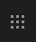

# Manipulation de base{#basic-handling}

>[!NOTE]
>
>* Cette page est conçue pour donner un aperçu des opérations de gestion de base lors de l’utilisation de l’environnement de création Adobe Experience Manager (AEM). Il utilise la console **Sites** comme base.
>
>* Certaines fonctionnalités ne sont pas disponibles dans toutes les consoles et d’autres peuvent être disponibles dans certaines consoles uniquement. Vous trouverez des informations spécifiques et plus détaillées sur les consoles individuelles et leurs fonctionnalités associées sur d’autres pages.
>* Des raccourcis clavier sont disponibles dans toute AEM. En particulier lorsque [utilisation des consoles](/help/sites-authoring/keyboard-shortcuts.md) et [modification de pages](/help/sites-authoring/page-authoring-keyboard-shortcuts.md).
>

## Prise en main {#getting-started}

### Interface utilisateur pour écrans tactiles {#a-touch-enabled-ui}

L’interface utilisateur d’AEM est désormais adaptée aux écrans tactiles. Une interface tactile vous permet d’interagir avec le logiciel par des gestes tels que la sélection, le toucher et le glissement. L’expérience est totalement différente des actions de l’interface de bureau classique, où le clic, le double-clic, le bouton droit et le pointage avec la souris avaient pignon sur rue.

Étant donné que l’interface utilisateur de AEM est tactile, vous pouvez utiliser les gestes tactiles sur vos appareils tactiles (par exemple, téléphone mobile ou tablette) et les actions de la souris sur un poste de travail classique.

### Premiers pas {#first-steps}

Une fois connecté, vous accédez au [panneau de navigation](#navigation-panel). Sélectionnez l’une des options pour ouvrir la console correspondante.

>[!NOTE]
>
>La console **Sites** est utilisée dans ce document pour garantir une bonne compréhension de l’utilisation de base d’AEM.
>
>Pour commencer, cliquez sur **Sites**.

### Navigation dans le produit {#product-navigation}

Lorsqu’une personne utilisatrice accède à une console pour la première fois, un tutoriel sur la navigation dans le produit en question s’affiche. Cliquez pour obtenir une bonne vue d’ensemble de la gestion de base des AEM.

Cliquez sur **Suivant** pour accéder à la page suivante de la présentation. Cliquez sur **Fermer** ou cliquez en dehors de la boîte de dialogue d’aperçu pour la fermer.

La vue d’ensemble redémarre la prochaine fois que vous accédez à la console, sauf si vous affichez toutes les diapositives ou cochez l’option . **Ne plus afficher**.

## Navigation globale {#global-navigation}

Pour passer d’une console à une autre, utilisez le panneau de navigation globale. Cela se déclenche sous la forme d’une liste déroulante plein écran lorsque vous cliquez sur le lien Adobe Experience Manager dans le coin supérieur gauche de l’écran.

Vous pouvez fermer le panneau de navigation globale en cliquant ou en appuyant sur **Fermer** pour revenir à votre position précédente.

>[!NOTE]
>
>Lorsque vous vous connectez pour la première fois, le **Navigation** panel

La navigation globale se compose de deux panneaux, représentés par des icônes dans la marge gauche de l’écran :

* **[Navigation](/help/sites-authoring/basic-handling.md#navigation-panel)** : représenté par une boussole 
* **[Outils](/help/sites-authoring/basic-handling.md#tools-panel)** : représenté par un marteau

Consultez les options disponibles dans ces panneaux ci-dessous.

### Panneau de navigation {#navigation-panel}

Le panneau Navigation permet d’accéder aux consoles AEM :

Le titre de l’onglet du navigateur est mis à jour pour refléter votre emplacement lorsque vous naviguez dans les consoles et le contenu.

Les consoles suivantes sont disponibles à partir du panneau de navigation :

<table>
 <tbody>
  <tr>
   <td><strong>Console</strong></td>
   <td><strong>Objectif</strong></td>
  </tr>
  <tr>
   <td>Ressources  </td>
   <td>Ces consoles permettent d’importer et de <a href="/help/assets/home.md">gérer des ressources numériques</a>, telles que des images, des vidéos, des documents et des fichiers audio. Utilisez ces ressources dans n’importe quel site web exécuté sur la même instance d’AEM. </td>
  </tr>
  <tr>
   <td>Communities</td>
   <td>Cette console vous permet de créer et de gérer des <a href="/help/communities/sites-console.md">sites de la communauté</a>, à des fins d’<a href="/help/communities/overview.md#engagement-community">engagement</a> et d’<a href="/help/communities/overview.md#enablement-community">activation</a>.</td>
  </tr>
  <tr>
   <td>Commerce</td>
   <td>Vous pouvez ainsi gérer des produits, des catalogues de produits et des commandes liés à vos <a href="/help/commerce/cif-classic/administering/ecommerce.md">Commerce</a> sites.</td>
  </tr>
  <tr>
   <td>Fragments d’expérience</td>
   <td>Un <a href="/help/sites-authoring/experience-fragments.md">Fragment d’expérience</a> est une expérience autonome qui peut être réutilisée sur plusieurs canaux et qui comporte des variantes, ce qui vous évite de devoir copier et coller à plusieurs reprises des expériences ou des parties d’expériences.</td>
  </tr>
  <tr>
   <td>Forms</td>
   <td>Cette console vous permet de créer, de gérer et de traiter vos <a href="/help/forms/home.md">formulaires et documents</a>.</td>
  </tr>
  <tr>
   <td>Personnalisation</td>
   <td>Cette console propose un <a href="/help/sites-authoring/personalization.md">framework d’outils de création de contenu ciblé et de présentation d’expériences personnalisées</a>.</td>
  </tr>
  <tr>
   <td>Projets</td>
   <td>La <a href="/help/sites-authoring/touch-ui-managing-projects.md">console Projets vous donne un accès direct à vos projets</a>. Les projets sont des tableaux de bord virtuels. Ils peuvent être utilisés pour créer une équipe, puis donner à cette équipe un accès aux ressources, aux workflows et aux tâches, ce qui permet aux personnes de travailler sur un objectif commun.   </td>
  </tr>
  <tr>
   <td>Screens</td>
   <td><a href="https://experienceleague.adobe.com/docs/experience-manager-screens/user-guide/authoring/setting-up-projects/creating-a-screens-project.html?lang=fr">Screens</a> vous permet de gérer tous vos écrans, quelle que soit leur taille et leur emplacement.</td>
  </tr>
  <tr>
   <td>Sites</td>
   <td>Les consoles Sites vous permettent de <a href="/help/sites-authoring/page-authoring.md">créer, afficher et gérer des sites web ;</a> s’exécutant sur votre instance AEM. Grâce à ces consoles, vous pouvez créer, modifier, copier, déplacer et supprimer des pages de sites web, démarrer des workflows et publier des pages.  </td>
  </tr>
 </tbody>
</table>

### Panneau Outils {#tools-panel}

Dans le panneau Outils, chaque option du panneau latéral contient un éventail de sous-menus. La variable [Consoles Outils](/help/sites-administering/tools-consoles.md) Cette section vous donne accès à plusieurs outils et consoles spécialisés pour la gestion des sites web, des ressources numériques et d’autres aspects du référentiel de contenu.

## En-tête {#the-header}

L’en-tête est toujours présent en haut de l’écran. Bien que la plupart des options de l’en-tête restent les mêmes, quel que soit l’endroit où vous vous trouvez dans le système, certaines dépendent du contexte.

* [Navigation globale](#navigatingconsolesandtools)

  Sélectionnez la variable **Adobe Experience Manager** où vous pouvez naviguer entre les consoles.

  

* [Recherche](/help/sites-authoring/search.md)

  

  Vous pouvez également utiliser la [touche de raccourci](/help/sites-authoring/keyboard-shortcuts.md) `/` (barre oblique) pour appeler la recherche à partir de n’importe quelle console.

* [Solutions](https://business.adobe.com/)

  

* [Aide](#accessinghelptouchoptimizedui)

  

* [Notifications](/help/sites-authoring/inbox.md)

  

  Cette icône contient un badge indiquant le nombre de notifications incomplètes actuellement attribuées.

  >[!NOTE]
  >
  >Prêt à l’emploi, AEM est préchargé avec des tâches administratives affectées au groupe d’administrateurs et administratrices. Voir [Votre boîte de réception – Tâches administratives prêtes à l’emploi](/help/sites-authoring/inbox.md#out-of-the-box-administrative-tasks) pour plus d’informations.

* [Propriétés de l’utilisateur](/help/sites-authoring/user-properties.md)

  

* [Sélecteur de rail](/help/sites-authoring/basic-handling.md#rail-selector)

  

  Les options présentées dépendent de la console active. Par exemple, dans la console **Sites**, vous ne pouvez sélectionner que le contenu (valeur par défaut), la chronologie, les références ou le panneau latéral de filtrage.

  

* Chemins de navigation

  

  S’affiche au milieu du rail et affiche toujours la description de l’élément sélectionné, les chemins de navigation vous permettent de naviguer dans une console spécifique. Dans la console Sites, vous pouvez parcourir les différents niveaux de votre site Web.

  Cliquez sur le texte du chemin de navigation pour ouvrir une liste déroulante répertoriant les niveaux de la hiérarchie de l’élément sélectionné. Pour accéder à cet emplacement, cliquez sur une entrée.

  

* Sélection de la période d’Analytics

  

  Cet élément est disponible dans la vue Liste uniquement. Pour plus d’informations, voir [mode liste](#list-view).

* Bouton **Créer**

  

  Une fois que vous cliquez dessus, les options affichées sont adaptées à la console ou au contexte.

* [Vues](/help/sites-authoring/basic-handling.md#viewingandselectingyourresourcescardlistcolumn)

  L’icône Vues se trouve à l’extrémité droite de la barre d’outils AEM. Comme elle indique également la vue actuelle, elle change. Par exemple, la vue par défaut, **Mode Colonnes** affiche :

  

  Vous pouvez basculer entre le mode Colonne, Carte et Liste. Le mode Liste affiche les paramètres d’affichage.

  

* Navigation au clavier

  Vous pouvez naviguer sur un site web en utilisant exclusivement le clavier. Ce processus s’appuie sur la fonctionnalité de la touche **TAB** (or **OPT+TAB**) pour vous déplacer entre les éléments de la page pouvant recevoir le *focus*.

  Dans le **Sites** , l’option ajoutée à la console  **Passer au contenu principal**. Cette option apparaît lorsque vous *tabulez* d’une option d’en-tête à une autre. Elle permet d’accélérer la navigation en ignorant les éléments standard de la barre d’outils (produit) et en accédant directement au contenu principal.

  

## Accès à l’Aide    {#accessing-help}

Plusieurs ressources d’aide sont disponibles :

* **Barre d’outils de la console**

  Selon votre emplacement, la variable **Aide** ouvre les ressources appropriées :

  

* **Navigation**

  La première fois que vous naviguez sur le système, [une série de diapositives présente AEM navigation](/help/sites-authoring/basic-handling.md#product-navigation).

* **Éditeur de page**

  La première fois que vous modifiez une page, une série de diapositives présente l’éditeur de page.

  

  Parcourez cet aperçu comme vous le feriez avec l’[aperçu de navigation du produit](/help/sites-authoring/basic-handling.md#product-navigation) la première fois que vous accédez à une console.

  Dans la **Informations sur la page** , vous pouvez sélectionner [**Aide**](/help/sites-authoring/author-environment-tools.md#accessing-help) pour le réafficher à tout moment.

* **Console Outils**

  Dans la **Outils** , vous pouvez également accéder à la console externe **Ressources**:

   * **Documentation**
Affichez la documentation de Web Experience Management.

   * **Ressources pour les développeurs**
Ressources et téléchargements pour les développeurs.

  >[!NOTE]
  >
  >Vous pouvez accéder à un aperçu des raccourcis clavier disponibles à tout moment à l’aide de la touche `?` (point d’interrogation) lorsque vous vous trouvez dans une console.
  >
  >Pour une présentation de tous les raccourcis clavier, voir :
  >
  >* [Raccourcis clavier lors de la modification de pages](/help/sites-authoring/page-authoring-keyboard-shortcuts.md)
  >* [Raccourcis clavier pour les consoles](/help/sites-authoring/keyboard-shortcuts.md)

## Barre d’outils Actions {#actions-toolbar}

Lorsque vous sélectionnez une ressource (une page ou un actif, par exemple), diverses actions sont indiquées par des icônes, avec un texte explicatif dans la barre d’outils. Ces actions dépendent de différents éléments :

* La console active
* Le contexte actuel
* Si vous êtes dans [mode de sélection](#navigatingandselectionmode) ou non

Les actions disponibles dans la barre d’outils changent pour refléter les actions que vous pouvez effectuer sur les éléments spécifiques sélectionnés.

La manière dont vous [sélectionnez une ressource](/help/sites-authoring/basic-handling.md#viewing-and-selecting-resources) dépend du mode.

En raison des restrictions d’espace dans certaines fenêtres, la barre d’outils peut rapidement dépasser l’espace disponible. Dans ce cas, d’autres options s’affichent. Cliquez ou appuyez sur les points de suspension (les trois points ou **..**) ouvre un sélecteur de liste déroulante contenant toutes les actions restantes. Par exemple, après avoir sélectionné une page dans la console **Sites** :

>[!NOTE]
>
>Les icônes individuelles disponibles sont documentées par rapport à la console, à la fonction ou au scénario approprié.

## Actions rapides {#quick-actions}

Dans [Mode Carte](#cardviewquickactions), certaines actions sont disponibles sous forme d’icônes d’action rapide et dans la barre d’outils. Les icônes d’action rapide sont disponibles pour un seul élément à la fois, ce qui évite d’avoir à effectuer une présélection.

Les actions rapides sont visibles lorsque vous placez le pointeur de la souris sur une carte de ressource (ordinateur de bureau). Les actions rapides disponibles dépendent de la console et du contexte. Voici, par exemple, les actions rapides d’une page dans la console **Sites** :

## Affichage et sélection de ressources {#viewing-and-selecting-resources}

L’affichage, la navigation et la sélection sont identiques sur le plan conceptuel dans tous les modes, mais leur manipulation comporte de légères variations en fonction du mode utilisé.

Vous pouvez afficher, parcourir et sélectionner (pour effectuer d’autres opérations) vos ressources dans n’importe quel mode disponible. Chaque mode peut être sélectionné par le biais d’une icône située en haut à droite :

* [Mode Colonnes](#column-view)
* [Mode Carte](#card-view)

* [Vue Liste](#list-view)

>[!NOTE]
>
>Par défaut, AEM Assets n’affiche pas les rendus originaux des ressources dans l’interface utilisateur sous forme de miniatures, quel que soit le mode. Si vous êtes administrateur ou administratrice, vous pouvez utiliser des superpositions pour configurer AEM Assets afin d’afficher les rendus originaux sous forme de miniatures.

### Sélection de ressources {#selecting-resources}

La sélection d’une ressource spécifique dépend d’une combinaison de la vue et de l’appareil :

<table>
 <tbody>
  <tr>
   <td> </td>
   <td>Sélectionner</td>
   <td>Désélectionner</td>
  </tr>
  <tr>
   <td>Mode Colonnes  </td>
   <td>
    <ul>
     <li>Ordinateur de bureau :  cliquez sur la vignette</li>
     <li>Appareils mobiles :  Sélectionner la miniature</li>
    </ul> </td>
   <td>
    <ul>
     <li>Ordinateur de bureau :  cliquez sur la vignette</li>
     <li>Appareils mobiles :  Sélectionner la miniature</li>
    </ul> </td>
  </tr>
  <tr>
   <td>Mode Carte  </td>
   <td>
    <ul>
     <li>Ordinateur de bureau :  pointez, puis utilisez l’action rapide</li>
     <li>Appareils mobiles :  Sélection et maintien de la carte</li>
    </ul> </td>
   <td>
    <ul>
     <li>Ordinateur de bureau :  cliquez sur la carte</li>
     <li>Appareils mobiles :  Sélectionner la carte</li>
    </ul> </td>
  </tr>
  <tr>
   <td>Vue Liste</td>
   <td>
    <ul>
     <li>Ordinateur de bureau :  cliquez sur la vignette</li>
     <li>Appareils mobiles :  Sélectionner la miniature</li>
    </ul> </td>
   <td>
    <ul>
     <li>Ordinateur de bureau :  cliquez sur la vignette</li>
     <li>Appareils mobiles :  Sélectionner la miniature</li>
    </ul> </td>
  </tr>
 </tbody>
</table>

#### Tout sélectionner {#select-all}

Vous pouvez sélectionner tous les éléments d’un mode en cliquant sur le bouton **Tout sélectionner** dans le coin supérieur droit de la console.

* Dans **Mode Carte**, toutes les cartes sont sélectionnées.
* Dans **Mode Liste**, tous les éléments de la liste sont sélectionnés.
* Dans **Mode Colonnes**, tous les éléments de la colonne la plus à gauche sont sélectionnés.

#### Tout désélectionner {#deselecting-all}

Dans tous les cas, lorsque vous sélectionnez des éléments, leur nombre est affiché dans le coin supérieur droit de la barre d’outils.

Vous pouvez désélectionner tous les éléments et quitter le mode de sélection en :

* cliquez ou appuyez sur **X** à côté du nombre,

* ou utilisez la touche **Échap**.

Quel que soit le mode, vous pouvez désélectionner tous les éléments en appuyant sur la touche Échap du clavier (si vous utilisez un ordinateur de bureau).

#### Exemple de sélection {#selecting-example}

1. Par exemple, dans la vue Carte :

   

1. Lorsque vous avez sélectionné une ressource, l’en-tête supérieur est couvert par la variable [barre d’outils actions](#actionstoolbar) qui donne accès aux actions actuellement applicables à la ressource sélectionnée.

   Pour quitter le mode de sélection, sélectionnez l’option **X** en haut à droite, ou utilisez **escape**.

### Mode Colonnes {#column-view}

Le mode Colonnes permet de naviguer visuellement dans une arborescence de contenu à travers une série de colonnes en cascade. Cette vue vous permet de visualiser et de parcourir l’arborescence de votre site web.

La sélection d’une ressource dans la colonne la plus à gauche affiche les ressources enfants dans une colonne située à droite. La sélection d’une ressource dans la colonne de droite affiche les ressources enfants dans une autre colonne à droite, etc.

* Vous pouvez naviguer de haut en bas dans l’arborescence en appuyant ou en cliquant sur le nom de la ressource ou sur le chevron situé à droite du nom de la ressource.

   * Le nom de la ressource et le chevron sont mis en surbrillance lorsque vous appuyez ou cliquez dessus.

     

   * Les enfants de la ressource sur laquelle vous avez cliqué/appuyé s’affichent dans la colonne située à droite de celle-ci.
   * Si vous cliquez sur un nom de ressource qui n’a pas d’enfant, ses détails s’affichent dans la colonne finale.

* Appuyez ou cliquez sur la miniature pour sélectionner la ressource.

   * Lorsqu’elle est sélectionnée, une coche s’affiche sur la miniature et le nom de la ressource est également mis en surbrillance.
   * Les détails de la ressource sélectionnée sont affichés dans la dernière colonne.
   * La barre d’outils d’action devient disponible.

     

  Lorsqu’une page est sélectionnée en mode Colonne, la page sélectionnée s’affiche dans la dernière colonne avec les détails suivants :

   * Titre de la page
   * Nom de la page (partie de l’URL de la page)
   * Modèle sur lequel est basée la page
   * Détails des modifications
   * Langue de la page
   * Détails de la publication

### Mode Carte {#card-view}

* Le mode Carte affiche des cartes d’informations pour chaque élément au niveau actuel. Elles fournissent des informations telles que :

   * Représentation visuelle du contenu de la page.
   * Le titre de la page ;
   * Des dates importantes (telles que la date de la dernière modification ou publication) ;
   * La page est verrouillée, masquée ou fait partie d’une Live Copy.
   * Le cas échéant, le moment auquel vous devez effectuer une action dans le cadre d’un workflow.

      * Les marques qui indiquent les actions requises peuvent être liées aux entrées de votre [boîte de réception](/help/sites-authoring/inbox.md).

* Les [actions rapides](#quick-actions) sont également disponibles dans ce mode, comme la sélection et les actions courantes, telles que la modification.

  

* Vous pouvez parcourir l’arborescence vers le bas en appuyant/cliquant sur des cartes (en veillant à éviter les actions rapides), ou vers le haut en utilisant le [chemin de navigation dans l’en-tête](/help/sites-authoring/basic-handling.md#the-header).

### Vue Liste {#list-view}

* La vue Liste répertorie les informations pour chaque ressource au niveau actuel.
* Vous pouvez parcourir l’arborescence vers le bas en appuyant/cliquant sur le nom de la ressource et en effectuant une sauvegarde à l’aide de la fonction [chemins de navigation dans l’en-tête](/help/sites-authoring/basic-handling.md#the-header).

* Pour sélectionner facilement tous les éléments de la liste, utilisez la case à cocher située dans le coin supérieur gauche de la liste.

  

   * Cette case apparaît cochée lorsque tous les éléments de la liste sont sélectionnés.

      * Pour tout désélectionner, cochez la case .

   * Lorsque seuls certains éléments sont sélectionnés, le signe moins apparaît.

      * Pour tout sélectionner, cochez la case .
      * Pour tout désélectionner, cochez à nouveau la case.

* Sélectionnez les colonnes à afficher à l’aide du **Paramètres d’affichage** située sous le bouton Vues. Vous pouvez afficher les colonnes suivantes :

   * **Nom** : nom de la page, qui peut s’avérer utile dans un environnement de création multilingue, car il fait partie de l’URL de la page et ne change pas, quelle que soit la langue
   * **Modifié** : date de la dernière modification et dernière modification par l’utilisateur ou l’utilisatrice
   * **Publié** : statut de la publication.
   * **Modèle** : modèle sur lequel la page est basée.
   * **Workflow** : workflow actuellement appliqué à la page. Plus d’informations sont disponibles lorsque vous placez le pointeur de la souris ou ouvrez la chronologie.

   * **Analyse de la page**
   * **Visiteurs ou visiteuses uniques**
   * **Temps passé sur la page**

  

  Par défaut, la colonne **Nom** est affichée ; ce nom fait partie de l’URL de la page. Il arrive que l’auteur doive accéder à des pages dans une langue différente. L’affichage du nom de la page (qui reste généralement inchangé) peut s’avérer utile si l’auteur ne connaît pas la langue de la page.

* Modifiez l’ordre des éléments à l’aide de la barre verticale en pointillés tout à droite de chaque élément de la liste.

  >[!NOTE]
  >
  >La modification de l’ordre fonctionne uniquement dans un dossier ordonné dont la valeur `jcr:primaryType` est `sling:OrderedFolder`.

  

  Cliquez sur la barre de sélection verticale et faites glisser l’élément vers un nouvel emplacement dans la liste.

  

* Vous pouvez afficher les données Analytics en affichant les colonnes appropriées à l’aide de la variable **Paramètres d’affichage** de la boîte de dialogue

  Vous pouvez filtrer les données d’analyse pour les 30, 90 ou 365 derniers jours à l’aide des options de filtrage situées à droite de l’en-tête.

  

## Sélecteur de rail {#rail-selector}

Le **sélecteur de rail** est disponible dans le coin supérieur gauche de la fenêtre et affiche des options en fonction des consoles actives.

Par exemple, dans la console Sites, vous pouvez sélectionner le contenu uniquement (valeur par défaut), l’arborescence de contenu, la chronologie, les références ou le panneau latéral de filtrage.

Si Contenu uniquement est sélectionné, alors seule l’icône de rail s’affiche. Si n’importe quelle autre option est sélectionnée, le nom des options apparaît en regard de l’icône de rail.

>[!NOTE]
>
>Des [raccourcis clavier](/help/sites-authoring/keyboard-shortcuts.md) sont disponibles pour basculer rapidement entre les options d’affichage du rail.

### Arborescence de contenu {#content-tree}

L’arborescence de contenu peut être utilisée pour parcourir rapidement la hiérarchie du site dans le panneau latéral et afficher de nombreuses informations sur les pages du dossier actif.

À l’aide du panneau latéral de l’arborescence de contenu avec une vue de liste ou Carte, les utilisateurs peuvent facilement voir la structure hiérarchique du projet. Ils peuvent facilement parcourir la structure de contenu à l’aide du panneau latéral de l’arborescence de contenu et afficher des informations détaillées sur la page en mode Liste.

>[!NOTE]
>
>Après avoir sélectionné une entrée dans la hiérarchie, vous pouvez naviguer rapidement dans la hiérarchie à l’aide des touches directionnelles.
>
>Reportez-vous à la section [raccourcis clavier](/help/sites-authoring/keyboard-shortcuts.md) pour plus d’informations.

### Chronologie {#timeline}

La chronologie peut être utilisée pour afficher et/ou lancer des événements qui se sont produits sur la ressource sélectionnée. Pour ouvrir la colonne Chronologie, utilisez le sélecteur de rail :

La colonne Chronologie permet d’effectuer les opérations suivantes :

* [Afficher divers événements liés à un élément sélectionné.](#timelineviewevents)

   * Les types d’événements peuvent être sélectionnés dans la liste déroulante :

      * [Commentaires](#timelineaddingandviewingcomments)
      * Annotations
      * Activités
      * [Lancements](/help/sites-authoring/launches.md)
      * [Versions](/help/sites-authoring/working-with-page-versions.md)
      * [Workflows](/help/sites-authoring/workflows-applying.md)

         * à l’exception de [workflows transitoires](/help/sites-developing/workflows.md#transient-workflows) car aucune information d’historique n’est enregistrée pour celles-ci

      * et Afficher tout

* [Ajouter/afficher des commentaires sur l’élément sélectionné. ](#timelineaddingandviewingcomments) La zone **Commentaire** s’affiche dans la partie inférieure de la liste des événements. Saisissez un commentaire suivi de Retour pour enregistrer le commentaire. Vous pouvez l’afficher en sélectionnant **Commentaires** ou **Tout afficher**.

* Certaines consoles disposent de fonctionnalités supplémentaires. Par exemple, dans la console Sites , vous pouvez effectuer les opérations suivantes :

   * [Enregistrer une version](/help/sites-authoring/working-with-page-versions.md#creatinganewversiontouchoptimizedui).
   * [Démarrer un workflow](/help/sites-authoring/workflows-applying.md#startingaworkflowfromtherail).

Ces options sont accessibles par le biais du chevron en regard du **Commentaire** champ .

### Références {#references}

**Références** afficher toutes les connexions à la ressource sélectionnée ; Par exemple, dans la console **Sites**, les [références](/help/sites-authoring/author-environment-tools.md#showingpagereferences) des pages affichent :

* [Lancements](/help/sites-authoring/launches.md#launches-in-references-sites-console)
* [Live Copies](/help/sites-administering/msm-livecopy-overview.md#openingthelivecopyoverviewfromreferences)
* [Copies de langue](/help/sites-administering/tc-prep.md#seeing-the-status-of-language-roots)
* Références du contenu :

   * liens d’autres pages vers la page sélectionnée
   * contenu emprunté à la page sélectionnée par le composant Référence, prêté ou les deux à cette page

### Filtrer {#filter}

Cela ouvre un panneau similaire à [search](/help/sites-authoring/search.md), avec les filtres d’emplacement appropriés définis, ce qui vous permet de filtrer davantage le contenu que vous souhaitez afficher.

