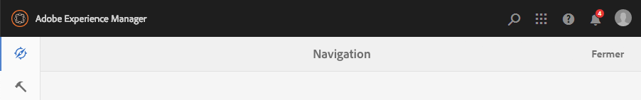
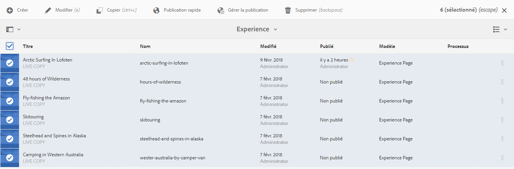

# Manipulation de base{#basic-handling}

>[!NOTE]
>
>* Cette page donne un aperçu des opérations de gestion de base dans l’environnement de création d’AEM. Il utilise la console **Sites** comme base.
   >
   >
* Certaines fonctionnalités ne sont pas disponibles dans toutes les consoles et des fonctionnalités supplémentaires peuvent être disponibles dans certaines consoles. Vous trouverez des informations spécifiques plus détaillées sur les consoles individuelles et leurs fonctions sur d’autres pages.
>* Des raccourcis clavier sont disponibles dans toute l’application AEM, notamment lors de l’[utilisation des consoles](/help/sites-authoring/keyboard-shortcuts.md) et de la [modification de pages](/help/sites-authoring/page-authoring-keyboard-shortcuts.md).

>

## Prise en main {#getting-started}

### Interface utilisateur pour écrans tactiles {#a-touch-enabled-ui}

L’interface utilisateur d’AEM est adaptée aux écrans tactiles. Les interfaces de ce type permettent d’interagir de manière tactile avec le logiciel en appuyant sur l’écran, en maintenant la pression du doigt ou en le faisant glisser. Avec une interface de bureau traditionnelle, en revanche, les différentes opérations (clic, double-clic, clic droit, survol, etc.) s’effectuent à l’aide de la souris.

Étant donné que l’interface utilisateur de AEM est tactile, vous pouvez utiliser les gestes tactiles sur vos appareils tactiles (par exemple, téléphone mobile ou tablette) et les actions de la souris sur un poste de travail classique.

### Premiers pas {#first-steps}

Une fois connecté, vous accédez au [panneau de navigation](#navigation-panel). Sélectionnez l’une des options pour ouvrir la console appropriée.

>[!NOTE]
>
>La console **Sites** est utilisée dans ce document pour garantir une bonne compréhension de l’utilisation de base d’AEM.
>
>Cliquez ou appuyez sur **Sites** pour commencer.

### Navigation dans le produit {#product-navigation}

La première fois que vous accédez à une console, un didacticiel de navigation du produit démarre. Prenez quelques instants pour cliquer ou appuyer sur divers éléments afin de vous familiariser avec le fonctionnement de base d’AEM.

Cliquez ou appuyez sur **Suivant** pour accéder à la page suivante de la présentation. Cliquez ou appuyez sur **Fermer** ou à l’extérieur de la boîte de dialogue de présentation pour la fermer.

Si vous ne désactivez pas l’option **Ne plus afficher ce message**, la présentation redémarrera la prochaine fois que vous accéderez à la console.

## Navigation globale {#global-navigation}

Pour passer d’une console à une autre, utilisez le panneau de navigation globale. Il s’active sous la forme d’une liste déroulante au format plein écran lorsque vous cliquez ou appuyez sur le lien Adobe Experience Manager situé dans le coin supérieur gauche de l’écran.

Vous pouvez fermer le panneau de navigation globale en cliquant ou en appuyant sur **Fermer** pour revenir à votre position précédente.

>[!NOTE]
>
>La première fois que vous vous connectez, vous accédez au panneau **Navigation**.

La navigation globale se compose de deux panneaux, représentés par des icônes dans la marge gauche de l’écran :

* **[Navigation](/help/sites-authoring/basic-handling.md#navigation-panel)** : représenté par une boussole
* **[Outils](/help/sites-authoring/basic-handling.md#tools-panel)** : représenté par un marteau

Les options disponibles dans ces panneaux sont décrites ci-dessous.

### Panneau de navigation  {#navigation-panel}

Le panneau de navigation donne accès aux AEM consoles :

Le titre de l’onglet du navigateur est mis à jour pour refléter votre emplacement lorsque vous naviguez dans les consoles et le contenu.

Les consoles suivantes sont disponibles à partir du panneau de navigation :

<table>
 <tbody>
  <tr>
   <td><strong>Console</strong></td>
   <td><strong>Objectif</strong></td>
  </tr>
  <tr>
   <td>Ressources  </td>
   <td>Ces consoles permettent d’importer et de <a href="/help/assets/home.md">gérer des ressources numériques</a> telles que des images, des vidéos, des documents et des fichiers audio. Utilisez ces ressources dans n’importe quel site web exécuté sur la même instance d’AEM. </td>
  </tr>
  <tr>
   <td>Communities</td>
   <td>Cette console permet de créer et de gérer des <a href="/help/communities/sites-console.md">sites de communauté</a> pour l’<a href="/help/communities/overview.md#engagement-community">engagement</a> et l’<a href="/help/communities/overview.md#enablement-community">activation</a>.</td>
  </tr>
  <tr>
   <td>Commerce</td>
   <td>Vous permet de gérer les produits, les catalogues de produits et les commandes liés à vos sites de <a href="/help/commerce/cif-classic/administering/ecommerce.md">commerce</a>.</td>
  </tr>
  <tr>
   <td>Fragments d’expérience</td>
   <td>Un <a href="/help/sites-authoring/experience-fragments.md">fragment d’expérience</a> est une expérience autonome qui peut être réutilisée sur l’ensemble des canaux et présentant des variations, vous évitant ainsi de devoir copier et coller à plusieurs reprises des expériences ou des parties d’expériences.</td>
  </tr>
  <tr>
   <td>Formulaires</td>
   <td>Cette console permet de créer, de gérer et de traiter vos <a href="/help/forms/home.md">formulaires et documents</a>.</td>
  </tr>
  <tr>
   <td>Personnalisation</td>
   <td>Cette console propose un <a href="/help/sites-authoring/personalization.md">ensemble d’outils de création de contenu ciblé et de présentation d’expériences personnalisées</a>.</td>
  </tr>
  <tr>
   <td>Projets</td>
   <td>La <a href="/help/sites-authoring/touch-ui-managing-projects.md">console Projets permet d’accéder directement aux projets</a>, qui sont des tableaux de bord virtuels. Utilisez-les pour composer une équipe, puis pour donner à cette équipe un accès aux ressources, aux workflows et aux tâches, afin que tous les membres de l’équipe puissent travailler sur un objectif commun.   </td>
  </tr>
  <tr>
   <td>Screens</td>
   <td>La console <a href="https://docs.adobe.com/content/help/fr-FR/experience-manager-screens/user-guide/authoring/setting-up-projects/creating-a-screens-project.html">Screens</a> permet de gérer tous les écrans proposés aux clients, quel que soit leur taille ou leur emplacement.</td>
  </tr>
  <tr>
   <td>Sites</td>
   <td>Les consoles Sites permettent de <a href="/help/sites-authoring/page-authoring.md">créer, d’afficher et de gérer des sites web</a> exécutés sur votre instance AEM. Grâce à ces consoles, vous pouvez créer, modifier, copier, déplacer et supprimer des pages de site web, démarrer des workflows et publier des pages.  </td>
  </tr>
 </tbody>
</table>

### Panneau Outils {#tools-panel}

Chaque option du panneau latéral Outils comporte une plage de sous-menus. Les [consoles Outils](/help/sites-administering/tools-consoles.md) permettent d’accéder à différents outils et à différentes consoles spécialisés, qui vous permettent d’administrer des sites web, des ressources numériques et d’autres aspects de votre référentiel de contenu.

## En-tête {#the-header}

L’en-tête est toujours affiché en haut de l’écran. La plupart des options de l’en-tête restent les mêmes où que vous soyez dans le système. Cependant, certaines d’entre elles dépendent du contexte.

* [Navigation globale](#navigatingconsolesandtools)

   Sélectionnez le lien **Adobe Experience Manager** pour naviguer entre les consoles.

   

* [Rechercher](/help/sites-authoring/search.md)

   

   Vous pouvez également utiliser la [touche de raccourci](/help/sites-authoring/keyboard-shortcuts.md) `/` (barre oblique) pour appeler la recherche à partir de n’importe quelle console.

* [Solutions](https://www.adobe.com/fr/experience-cloud.html)

   

* [Aide](#accessinghelptouchoptimizedui)

   

* [Notifications](/help/sites-authoring/inbox.md)

   

   Cette icône contiendra un badge indiquant le nombre de notifications incomplètes actuellement attribuées.

   >[!NOTE]
   >
   >AEM est fourni avec des tâches administratives prêtes à l’emploi attribuées au groupe d’utilisateurs administrateurs. Voir [Votre boîte de réception – tâches administratives prêtes à l’emploi](/help/sites-authoring/inbox.md#out-of-the-box-administrative-tasks) pour plus d’informations.

* [Propriétés de l’utilisateur](/help/sites-authoring/user-properties.md)

   

* [Sélecteur de rail](/help/sites-authoring/basic-handling.md#rail-selector)

   

   Les options présentées dépendent de la console active. Par exemple, dans la console **Sites**, vous ne pouvez sélectionner que le contenu (valeur par défaut), la frise chronologique, les références ou le panneau latéral de filtrage.

   

* Chemin de navigation

   

   Le chemin de navigation est situé au milieu du rail. Il affiche toujours la description de l’élément sélectionné et vous permet de naviguer au sein d’une console spécifique. Dans la console Sites, vous pouvez parcourir les différents niveaux de votre site web.

   Il vous suffit de cliquer sur le texte du chemin de navigation pour afficher une liste déroulante répertoriant les niveaux hiérarchiques de l’élément actuellement sélectionné. Cliquez sur une entrée pour accéder à cet emplacement.

   

* Sélection de la période d’Analytics

   

   Cet élément est disponible en mode Liste uniquement. Voir [liste vue](#list-view) pour plus d&#39;informations.

* Bouton **Créer**

   

   Une fois que vous cliquez dessus, les options affichées sont adaptées à la console ou au contexte.

* [Vues](/help/sites-authoring/basic-handling.md#viewingandselectingyourresourcescardlistcolumn)

   L’icône Vues se trouve à l’extrémité droite de la barre d’outils AEM. Comme elle indique également la vue actuelle, elle change. Par exemple, la vue par défaut, **Mode Colonnes** affiche :

   

   Vous pouvez basculer entre le mode d’affichage Colonne, Carte et Liste. Dans le mode d&#39;affichage Liste, les paramètres de vue sont également affichés.

   

* Navigation au clavier

   Vous pouvez naviguer sur un site web en utilisant exclusivement le clavier. Cela utilise la fonctionnalité de navigateur standard de la clé **TAB** (ou **OPT+TAB**) pour vous déplacer entre les éléments de la page qui sont *activables*.

   Dans la console **Sites**, vous pouvez ajouter l’option **Passer au contenu principal**. Cela devient visible lorsque vous *tab* utilisez les options d&#39;en-tête et accélère votre navigation en vous permettant d&#39;ignorer les éléments standard de la barre d&#39;outils (produit) et de vous diriger directement vers le contenu principal.

   

## Accès à l’aide {#accessing-help}

Plusieurs ressources d’aide sont disponibles :

* **Barre d’outils de la console**

   Selon l’endroit où vous vous trouvez, l’icône **Aide** ouvre les ressources appropriées :

   

* **Navigation**

   La première fois que vous naviguez dans le système, [une série de diapositives présente la navigation au sein d’AEM](/help/sites-authoring/basic-handling.md#product-navigation).

* **Éditeur de page**

   Lorsque vous modifiez une page pour la première fois, une série de diapositives présente l’Éditeur de page.

   

   Parcourez cet aperçu comme vous le feriez avec l’[aperçu de navigation du produit](/help/sites-authoring/basic-handling.md#product-navigation) la première fois que vous accédez à une console.

   Dans le menu [**Informations sur la page**, sélectionnez l’option **Aide**](/help/sites-authoring/author-environment-tools.md#accessing-help) pour afficher de nouveau cette présentation à tout moment.

* **Console Outils**

   Dans la console **Outils**, vous pouvez également accéder aux **ressources** externes :

   * **Documentation**
Affichez la documentation de web Experience Management.

   * **Ressources pour les développeurs**
Ressources et téléchargements pour les développeurs.
   >[!NOTE]
   >
   >Vous pouvez accéder à un aperçu des raccourcis clavier disponibles à tout moment à l’aide de la touche `?` (point d’interrogation) lorsque vous vous trouvez dans une console.
   >
   >Pour une présentation de tous les raccourcis clavier, reportez-vous à la documentation suivante :
   >
   >    * [Raccourcis clavier lors de la modification de pages](/help/sites-authoring/page-authoring-keyboard-shortcuts.md)
   >    * [Raccourcis clavier pour les consoles](/help/sites-authoring/keyboard-shortcuts.md)

## Barre d’outils d’actions {#actions-toolbar}

Lorsque vous sélectionnez une ressource (une page ou une ressource, par exemple), diverses actions sont indiquées par des icônes, avec un texte explicatif dans la barre d’outils. Ces actions dépendent de différents éléments :

* La console active.
* Le contexte actuel.
* Si vous êtes en [mode de sélection](#navigatingandselectionmode).

L’action disponible dans la barre d’outils change pour tenir compte des actions que vous pouvez effectuer sur les éléments sélectionnés.

La manière dont vous [sélectionnez une ressource](/help/sites-authoring/basic-handling.md#viewing-and-selecting-resources) dépend du mode.

En raison des restrictions d’espace dans certaines fenêtres, la barre d’outils peut rapidement dépasser l’espace disponible. Lorsque cela se produit, d’autres options s’affichent. En cliquant ou en appuyant sur les points de suspension (**…**), vous ouvrez un menu déroulant contenant toutes les actions restantes. Par exemple, après avoir sélectionné une page dans la console **Sites** :

>[!NOTE]
>
>Les icônes individuelles disponibles sont documentées par rapport à la console, à la fonction ou au scénario approprié.

## Actions rapides  {#quick-actions}

Dans le [mode Carte](#cardviewquickactions), certaines actions, en plus d’être disponibles dans la barre d’outils, le sont également sous la forme d’icônes d’actions rapides. Les icônes d’actions rapides sont disponibles pour un seul élément à la fois et évitent d’avoir à présélectionner l’action.

Les actions rapides s’affichent lorsque vous pointez (ordinateur de bureau) sur une carte de ressources. Les actions rapides disponibles dépendent de la console et du contexte. Voici, par exemple, les actions rapides relatives à une page de la console **Sites** :

## Affichage et sélection de ressources {#viewing-and-selecting-resources}

L’affichage, la navigation et la sélection sont identiques sur le plan conceptuel dans tous les modes, mais leur manipulation comporte de légères variations en fonction du mode utilisé.

Vous pouvez afficher, parcourir et sélectionner (pour effectuer d’autres opérations) vos ressources dans n’importe quel mode disponible. Chaque mode peut être sélectionné par le biais d’une icône située en haut à droite :

* [Mode Colonnes](#column-view)
* [Mode Carte](#card-view)

* [Mode Liste](#list-view)

>[!NOTE]
>
>Par défaut, AEM Assets n’affiche pas les rendus d’origine des ressources dans l’interface utilisateur sous la forme de miniatures, et ce, quel que soit le mode. Si vous êtes administrateur, vous pouvez utiliser des incrustations pour configurer AEM Assets afin d’afficher les rendus d’origine sous la forme de miniatures.

### Sélection de ressources  {#selecting-resources}

La sélection d’une ressource en particulier dépend de la combinaison du mode et de l’appareil :

<table>
 <tbody>
  <tr>
   <td> </td>
   <td>Sélectionner</td>
   <td>Désélectionner</td>
  </tr>
  <tr>
   <td>Mode Colonnes  </td>
   <td>
    <ul>
     <li>Ordinateur de bureau :  cliquez sur la vignette</li>
     <li>Appareil mobile :  appuyez sur la vignette</li>
    </ul> </td>
   <td>
    <ul>
     <li>Ordinateur de bureau :  cliquez sur la vignette</li>
     <li>Appareil mobile :  appuyez sur la vignette</li>
    </ul> </td>
  </tr>
  <tr>
   <td>Mode Carte  </td>
   <td>
    <ul>
     <li>Bureau :  Pointez sur, puis utilisez la coche action rapide</li>
     <li>Appareil mobile :  maintenez la carte enfoncée</li>
    </ul> </td>
   <td>
    <ul>
     <li>Bureau :   Cliquez sur la carte</li>
     <li>Périphérique mobile :   Appuyez sur la carte</li>
    </ul> </td>
  </tr>
  <tr>
   <td>Mode Liste</td>
   <td>
    <ul>
     <li>Ordinateur de bureau :  cliquez sur la vignette</li>
     <li>Appareil mobile :  appuyez sur la vignette</li>
    </ul> </td>
   <td>
    <ul>
     <li>Ordinateur de bureau :  cliquez sur la vignette</li>
     <li>Appareil mobile :  appuyez sur la vignette</li>
    </ul> </td>
  </tr>
 </tbody>
</table>

#### Tout sélectionner {#select-all}

Vous pouvez sélectionner tous les éléments d’une vue en cliquant sur l’option **Sélectionner tout** dans l’angle supérieur droit de la console.

* En **mode Carte**, toutes les cartes sont sélectionnées.
* Dans le **mode d&#39;affichage Liste**, tous les éléments de la liste sont sélectionnés.
* En **mode Colonnes**, tous les éléments de la colonne la plus à gauche sont sélectionnés.

#### Tout désélectionner {#deselecting-all}

Dans tous les cas, lorsque vous sélectionnez des éléments, leur nombre est affiché dans le coin supérieur droit de la barre d’outils.

Vous pouvez annuler la sélection de tous les éléments et quitter le mode de sélection en procédant comme suit :

* cliquez ou appuyez sur **X** à côté du nombre,

* ou utilisez la touche **Échap**.

Quel que soit le mode, vous pouvez désélectionner tous les éléments en appuyant sur la touche Échap du clavier (si vous utilisez un ordinateur de bureau).

#### Exemple de sélection {#selecting-example}

1. Par exemple, en mode Carte :

   

1. Une fois que vous avez sélectionné une ressource, l’en-tête de premier niveau est couvert par la [barre d’outils Actions](#actionstoolbar), qui permet d’accéder aux actions actuellement applicables à la ressource sélectionnée.

   Pour quitter le mode de sélection, sélectionnez le signe **X** affiché en haut à droite de l’écran ou utilisez la touche **Échap**.

### Mode Colonnes {#column-view}

Le mode Colonnes permet de parcourir visuellement une arborescence de contenu au moyen d’une série de colonnes en cascade. Ce mode vous permet de visualiser et de parcourir l’arborescence de votre site web.

La sélection d’une ressource dans la colonne de gauche affiche les ressources enfants dans une colonne située à droite. La sélection d’une ressource dans la colonne de droite affiche les ressources enfants dans une autre colonne à droite, et ainsi de suite.

* Vous pouvez parcourir l’arborescence vers le haut et vers le bas en appuyant ou en cliquant sur le nom de la ressource ou sur le chevron à droite du nom.

   * Le nom de la ressource et le chevron sont mis en surbrillance lorsque vous cliquez ou appuyez dessus.

   

   * Les enfants de la ressource sélectionnée sont affichés dans la colonne située à droite de la ressource concernée.
   * Si vous appuyez ou cliquez sur le nom d’une ressource qui ne contient pas d’enfants, ses détails sont affichés dans la dernière colonne.

* Le fait d’appuyer ou de cliquer sur la miniature sélectionne la ressource.

   * Une fois la ressource sélectionnée, une coche s’affiche au-dessus de la miniature et le nom de la ressource est également mis en surbrillance.
   * Les détails de la ressource sélectionnée sont affichés dans la dernière colonne.
   * La barre d’outils Action est alors activée.

   

   Lorsqu’une page est sélectionnée en mode Colonne, elle est affichée dans la dernière colonne avec les informations suivantes :

   * Titre de la page
   * Nom de la page (composante de l’URL de la page)
   * Modèle sur lequel la page est basée
   * Modification des détails
   * Langue de la page
   * Détails de la publication

### Mode Carte {#card-view}

* Le mode Carte affiche les cartes d’informations de chaque élément au niveau actuel. Fournit des informations, comme :

   * une représentation visuelle du contenu de la page ;.
   * Le titre de la page.
   * Des dates importantes (telles que la date de la dernière modification ou publication).
   * Si la page est verrouillée, masquée ou fait partie d’une Live Copy.
   * Le cas échéant, le moment auquel vous devez effectuer une action dans le cadre d’un worfklow.

      * Les repères qui indiquent les actions requises peuvent être liés à des entrées de votre [boîte de réception](/help/sites-authoring/inbox.md).

* Les [actions rapides](#quick-actions) sont également disponibles dans ce mode pour la sélection et quelques actions courantes, telles que l’édition.

   

* Vous pouvez parcourir l’arborescence vers le bas en appuyant/cliquant sur des cartes (en veillant à éviter les actions rapides), ou vers le haut en utilisant le [chemin de navigation dans l’en-tête](/help/sites-authoring/basic-handling.md#the-header).

### Mode Liste {#list-view}

* Le mode Liste répertorie les informations pour chaque ressource au niveau actuel.
* Vous pouvez parcourir l’arborescence vers le bas en appuyant/cliquant sur le nom de la ressource, ou vers le haut en utilisant le [chemin de navigation dans l’en-tête](/help/sites-authoring/basic-handling.md#the-header).

* Pour sélectionner facilement tous les éléments de la liste, utilisez la case à cocher située dans le coin supérieur gauche de la liste.

   

   * Lorsque tous les éléments de la liste sont sélectionnés, cette case est cochée.

      * Cliquez ou appuyez sur la case à cocher pour désélectionner tous les éléments.
   * Lorsque seuls quelques éléments sont sélectionnés, le signe moins est affiché.

      * Cliquez ou appuyez sur la case à cocher pour sélectionner tous les éléments.
      * Cliquez ou appuyez à nouveau sur la case à cocher pour tout désélectionner.

* Sélectionnez les colonnes à afficher à l’aide de l’option **Afficher les paramètres** située sous le bouton Vues. Les colonnes suivantes peuvent être affichées :

   * **Nom** : nom de la page ; cela peut s’avérer utile dans un environnement de création multilingue, dans la mesure où il fait partie de l’URL de la page et où il ne change pas, quelle que soit la langue.
   * **Modifié** : date de la dernière modification et nom de l’utilisateur responsable de la modification.
   * **Publié** : état de la publication.
   * **Modèle** : modèle sur lequel la page est basée.
   * **Workflow** : workflow actuellement appliqué à la page. D’autres informations sont disponibles lorsque vous déplacez la souris ou lorsque vous ouvrez la chronologie.

   * **Analyse de la page**
   * **Visiteurs uniques**
   * **Temps passé sur la page**

   

   Par défaut, la colonne **Nom** est affichée ; ce nom fait partie de l’URL de la page. Dans certains cas, il se peut que l’auteur doive accéder à des pages rédigées dans une autre langue. Aussi, le fait de voir le nom de la page (qui reste généralement identique) peut s’avérer très utile si l’auteur ne connaît pas la langue de la page.

* Modifiez l’ordre des éléments à l’aide de la barre verticale en pointillés tout à droite de chaque élément de la liste.

   >[!NOTE]
   >
   >La modification de l’ordre fonctionne uniquement dans un dossier ordonné dont la valeur `jcr:primaryType` est `sling:OrderedFolder`.

   

   Cliquez ou appuyez sur la barre de sélection verticale, puis faites glisser l’élément vers un nouvel emplacement dans la liste.

   

* Vous pouvez consulter les données Analytics en affichant les colonnes appropriées à l’aide de la boîte de dialogue **Afficher les paramètres**.

   Vous pouvez filtrer les données d&#39;analyse pour les 30, 90 ou 365 derniers jours à l’aide des options de filtrage situées à droite de l’en-tête.

   

## Sélecteur de rail {#rail-selector}

Le **sélecteur de rail** est disponible dans le coin supérieur gauche de la fenêtre et affiche des options en fonction des consoles actives.

Par exemple, dans la console Sites, vous pouvez sélectionner le contenu uniquement (valeur par défaut), l’arborescence de contenu, la chronologie, les références ou le panneau latéral de filtrage.

Si Contenu uniquement est sélectionné, alors seule l’icône de rail s’affiche. Si n’importe quelle autre option est sélectionnée, le nom des options apparaît en regard de l’icône de rail.

>[!NOTE]
>
>Des [raccourcis clavier](/help/sites-authoring/keyboard-shortcuts.md) sont disponibles pour basculer rapidement entre les options d’affichage du rail.

### Arborescence de contenu {#content-tree}

L’arborescence de contenu peut être utilisée pour naviguer rapidement dans la hiérarchie du site au niveau du panneau latéral, ainsi que pour visualiser un grand nombre d’informations sur les pages du dossier en cours.

En utilisant le panneau latéral d’arborescence de contenu en même temps qu’un mode Liste ou Cartes, les utilisateurs peuvent facilement voir la structure hiérarchique du projet et naviguer aisément dans la structure de contenu à l’aide du panneau latéral d’arborescence de contenu, ainsi que visualiser des informations détaillées sur la page en mode Liste.

>[!NOTE]
>
>Une fois qu’une entrée est sélectionnée dans la vue hiérarchique, les touches fléchées peuvent être utilisées pour naviguer rapidement au sein de la hiérarchie.
>
>Voir les [raccourcis clavier](/help/sites-authoring/keyboard-shortcuts.md) pour plus d’informations.

### Chronologie {#timeline}

La frise chronologique peut être utilisée pour afficher et/ou lancer des événements qui se sont produits sur la ressource sélectionnée. Pour ouvrir la colonne Chronologie, utilisez le sélecteur de rail :

La colonne Chronologie permet d’effectuer les actions suivantes :

* [Afficher divers événements liés à un élément sélectionné.](#timelineviewevents)

   * Les types d’événements peuvent être sélectionnés dans la liste déroulante :

      * [Commentaires](#timelineaddingandviewingcomments)
      * Annotations
      * Activités  
      * [Lancements](/help/sites-authoring/launches.md)
      * [Versions](/help/sites-authoring/working-with-page-versions.md)
      * [Workflows](/help/sites-authoring/workflows-applying.md)

         * à l’exception des [workflows transitoires](/help/sites-developing/workflows.md#transient-workflows), car aucune information historique n’est enregistrée pour ceux-ci
      * et Afficher tout

* [Ajouter/afficher des commentaires sur l’élément sélectionné. ](#timelineaddingandviewingcomments) La zone **Commentaire** s’affiche dans la partie inférieure de la liste des événements. Saisissez un commentaire, puis appuyez sur Entrée pour l’enregistrer. Il s’affiche si vous sélectionnez l’option **Commentaires** ou **Tout afficher**.

* Certaines consoles possèdent des fonctionnalités supplémentaires. Par exemple, dans la console Sites, vous pouvez :

   * [enregistrer une version](/help/sites-authoring/working-with-page-versions.md#creatinganewversiontouchoptimizedui) ;.
   * [Démarrer un worfklow](/help/sites-authoring/workflows-applying.md#startingaworkflowfromtherail).

Ces fonctionnalités sont accessibles par le biais du chevron en regard du champ **Commentaires**.

### Références {#references}

Les **références** affichent toutes les connexions avec la ressource sélectionnée. Dans la console **Sites**, par exemple, les [références](/help/sites-authoring/author-environment-tools.md#showingpagereferences) des pages affichent les informations suivantes :

* [Lancements](/help/sites-authoring/launches.md#launches-in-references-sites-console)
* [Live copies](/help/sites-administering/msm-livecopy-overview.md#openingthelivecopyoverviewfromreferences)
* [Copies de langue](/help/sites-administering/tc-prep.md#seeing-the-status-of-language-roots)
* Références du contenu :

   * liens d’autres pages vers la page sélectionnée
   * contenu emprunté et/ou prêté à la page sélectionnée par le composant Référence

### Filtrer {#filter}

Cette action ouvre un panneau similaire à [Rechercher](/help/sites-authoring/search.md) avec les filtres d’emplacement correspondants déjà définis, ce qui permet de filtrer davantage le contenu que vous souhaitez afficher.

