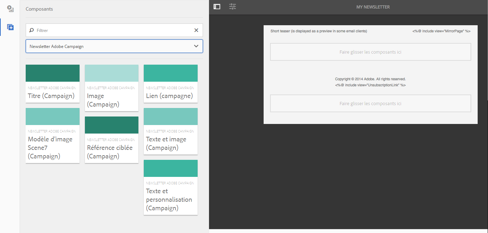

# Utilisation d’Adobe Campaign Classic et d’Adobe Campaign Standard{#working-with-adobe-campaign-classic-and-adobe-campaign-standard}

Vous pouvez créer le contenu d’un courrier électronique dans AEM et le traiter dans les courriers électroniques Adobe Campaign. À cet effet, vous devez suivrez cette procédure :

1. Créez une newsletter dans AEM à partir d’un modèle spécifique à Adobe Campaign.
1. Sélectionnez [un service Adobe Campaign](#selecting-the-adobe-campaign-cloud-service-and-template) avant de modifier le contenu pour accéder à toutes les fonctionnalités.
1. Modifiez le contenu.
1. Validez le contenu.

Le contenu peut alors être synchronisé avec une diffusion dans Adobe Campaign. Ce document contient des instructions détaillées.

Reportez-vous à la section [Création de formulaires Adobe Campaign dans AEM](/help/sites-authoring/adobe-campaign-forms.md).

>[!NOTE]
>
>Avant de pouvoir utiliser cette fonctionnalité, vous devez configurer AEM de manière à l’intégrer à [Adobe Campaign](/help/sites-administering/campaignonpremise.md) ou à [Adobe Campaign Standard](/help/sites-administering/campaignstandard.md).

## Envoi du contenu d’un courrier électronique via Adobe Campaign {#sending-email-content-via-adobe-campaign}

Une fois que vous avez configuré AEM et Adobe Campaign, vous pouvez créer du contenu à diffuser par courrier électronique directement dans AEM, puis le traiter dans Adobe Campaign.

Lorsque vous créez du contenu Adobe Campaign dans AEM, vous devez créer un lien vers un service Adobe Campaign avant de modifier le contenu pour accéder à toutes les fonctionnalités.

Deux cas de figure peuvent se présenter :

* Le contenu peut être synchronisé avec une diffusion à partir d’Adobe Campaign. Cela vous permet d’utiliser du contenu AEM dans une diffusion.
* (Adobe Campaign Classic uniquement) Le contenu peut être envoyé directement vers Adobe Campaign, qui génère automatiquement une nouvelle diffusion par e-mail. Ce mode comporte des limitations.

Ce document contient des instructions détaillées.

### Création de contenu de courrier électronique {#creating-new-email-content}

>[!NOTE]
>
>When adding email templates, be sure to add them under **/content/campaigns** to make them available.

#### Création de contenu de courrier électronique {#creating-new-email-content-1}

1. In AEM select **Sites** then **Campaigns**, then browse to where your email campaigns are managed. In the following example, the path is **Sites** > **Campaigns** > **Geometrixx Outdoors** > **Email Campaigns**.

   >[!NOTE]
   >
   >[Les exemples de messages électroniques ne sont disponibles que dans Geometrixx](/help/sites-developing/we-retail.md). Téléchargez un exemple de contenu Geometrixx à partir de Package Share.

   

1. Sélectionnez **Créer**, puis **Créer une page**.
1. Sélectionnez l’un des modèles disponibles spécifiques à Adobe Campaign auxquels vous vous connectez, puis cliquez sur **Suivant**. Par défaut, trois modèles sont disponibles :

   * **Adobe Campaign Classic Email**: vous permet d’ajouter du contenu à un modèle prédéfini (deux colonnes) avant de l’envoyer à Adobe Campaign Classic pour diffusion.
   * **Courriel** Adobe Campaign Standard : vous permet d’ajouter du contenu à un modèle prédéfini (deux colonnes) avant de l’envoyer à Adobe Campaign Standard pour diffusion.

1. Fill in the **Title** and optionally the **Description** and click **Create**. Le titre est utilisé comme objet de la newsletter/du courrier électronique sauf si vous le remplacez lors de la modification du courrier électronique.

### Sélection du service de cloud et du modèle d’Adobe Campaign {#selecting-the-adobe-campaign-cloud-service-and-template}

Pour l’intégration à Adobe Campaign, vous devez ajouter un service de cloud Adobe Campaign dans la page. Cela vous permet d’accéder à la personnalisation et à d’autres informations Adobe Campaign.

De plus, vous pouvez également avoir à sélectionner le modèle Adobe Campaign et à modifier l’objet et ajouter du texte brut pour les utilisateurs qui ne lisent pas le courrier électronique au format HTML.

Vous pouvez sélectionner le service de cloud sur l’onglet **Sites** ou à partir du courrier électronique/de la newsletter après l’avoir créé.

La sélection du service de cloud sur l’onglet **Sites** est l’approche recommandée. La sélection du service de cloud à partir du courrier électronique/de la newsletter nécessite une solution de contournement.

À partir de la page **Sites** :

1. Dans AEM, sélectionnez la page Courrier électronique et cliquez sur **Afficher les propriétés**.

   

1. Select **Edit** and then the **Cloud services** tab and scroll down to the bottom and click the + sign to add a configuration and then select **Adobe Campaign**.

   

1. Sélectionnez la configuration qui correspond à votre instance Adobe Campaign dans la liste déroulante, puis confirmez en cliquant sur **Enregistrer**.
1. Vous pouvez vue le modèle que le courrier électronique lui a appliqué en cliquant sur l’onglet** Adobe Campaign**. Si vous souhaitez sélectionner un autre modèle, vous pouvez y accéder à partir du courrier électronique en cours de modification.

   If you would like to apply a specific email delivery template (from Adobe Campaign), other than the default mail template, in **Properties**, select the **Adobe Campaign** tab. Entrez le nom interne du modèle de diffusion par courrier électronique dans l’instance Adobe Campaign associée.

   Le modèle sélectionné détermine les champs de personnalisation disponibles dans Adobe Campaign.

   

En mode Création, à partir de la newsletter/du courrier électronique, vous ne pourrez peut-être pas sélectionner la configuration du service cloud d’Adobe Campaign dans **Propriétés de la page** en raison d’un problème de mise en page. Vous pouvez utiliser la solution de contournement décrite ci-dessous :

1. Dans AEM, sélectionnez la page Courrier électronique et cliquez sur **Modifier**. Cliquez sur **Ouvrir les propriétés**.

   

1. Select **Cloud services** and click **+** to add a configuration. Sélectionnez une des configurations affichées (peu importe laquelle). Cliquez ou appuyez sur le signe « **+** » pour ajouter une autre configuration, puis sélectionnez **Adobe Campaign**.

   >[!NOTE]
   >
   >Vous pouvez également sélectionner les services de cloud en sélectionnant **Afficher les propriétés** sous l’onglet **Sites**.

1. Sélectionnez la configuration qui correspond à votre instance Adobe Campaign dans la liste déroulante, supprimez la première configuration que vous avez créée et qui n’était pas pour Adobe Campaign, puis cliquez sur la coche.
1. Pour sélectionner les modèles et ajouter du texte brut, passez à l’étape 4 de la procédure précédente.

### Modification du contenu d’un courrier électronique {#editing-email-content}

Pour modifier le contenu d’un courrier électronique :

1. Ouvrez le courrier électronique. Par défaut, vous êtes en mode d’édition.

   

1. If you would like to change the subject of the email or add plain text for those users who will not view the email in HTML, select **Email** and add a subject and text. Cliquez sur l’icône de page pour générer automatiquement une version en texte brut à partir de la version HTML. Cliquez sur la coche lorsque vous avez terminé.

   Vous pouvez personnaliser la newsletter à l’aide des champs de personnalisation d’Adobe Campaign. Pour ajouter un champ de personnalisation, ouvrez le sélecteur de champ de personnalisation en cliquant sur le bouton permettant d’afficher le logo Adobe Campaign. Vous pouvez alors sélectionner l’un des champs disponibles pour cette newsletter.

   >[!NOTE]
   >
   >Si les champs de personnalisation dans les propriétés de l’éditeur sont grisés, vérifiez votre configuration.

   

1. Open the components panel on left side of screen and select **Adobe Campaign Newsletter** from the drop-down menu to find those components.

   

1. Faites glisser des composants directement dans la page et modifiez-les en conséquence. Par exemple, vous pouvez faire glisser un composant **Texte et personnalisation (Campaign)** et ajouter du texte personnalisé.

   

   See [Adobe Campaign Components](/help/sites-authoring/adobe-campaign-components.md) for a detailed description of each component.

   

### Insertion d’une personnalisation {#inserting-personalization}

Lorsque vous modifiez votre contenu, vous pouvez insérer les éléments suivants :

* Champs de contexte Adobe Campaign. Il s’agit de champs que vous pouvez insérer dans votre texte et qui s’adapteront en fonction des données du destinataire (par exemple, prénom, nom ou toute donnée de la dimension cible).
* Blocs de personnalisation Adobe Campaign. Il s’agit de blocs de contenu prédéfini qui ne sont pas liés aux données du destinataire, tels qu’un logo de marque ou un lien vers une page miroir.

Pour une description complète des composants Adobe Campaign, reportez-vous à la section [Composants Adobe Campaign](/help/sites-authoring/adobe-campaign-components.md).

>[!NOTE]
>
>* Seuls les champs de la dimension cible **Profils** d’Adobe Campaign sont pris en compte.
>* When viewing Properties from **Sites**, you do not have access to the Adobe Campaign context fields. Vous pouvez y accéder directement à partir du courrier électronique en cours de modification.

>

Pour insérer une personnalisation :

1. Insert a new **Newsletter** > **Text &amp; Personalization (Campaign)** component by dragging it onto the page.

   

1. Ouvrez le composant en cliquant sur l’icône Crayon. L’éditeur s’affiche.

   

   >[!NOTE]
   >
   >**Pour Adobe Campaign standard :**
   >
   >* Les champs de contexte disponibles correspondent à la dimension cible de **Profils** dans Adobe Campaign.
   >* See [Linking an AEM page to an Adobe Campaign email](#linking-an-aem-page-to-an-adobe-campaign-email-adobe-campaign-standard).

   >
   >**Pour Adobe Campaign Classic :**
   >
   >* Available context fields are dynamically recovered from the Adobe Campaign **nms:seedMember** schema. Les données d’extension cible sont extraites dynamiquement du worfklow qui contient la diffusion synchronisée avec le contenu. (See the [Synchronizing content created in AEM with a delivery from Adobe Campaign](#synchronizing-content-created-in-aem-with-a-delivery-from-adobe-campaign-classic) section).
      >
      >
   * To add or hide personalization elements, see [Managing personalization fields and blocks](/help/sites-administering/campaignonpremise.md#managing-personalization-fields-and-blocks).
   >* **Important** : Tous les champs du tableau source doivent également se trouver dans le tableau du destinataire (ou le tableau du contact correspondant).

1. Insérez du texte en le tapant. Insérez des champs de contexte ou de blocs de personnalisation en cliquant sur les composants Adobe Campaign et en les sélectionnant. Une fois que vous avez terminé, sélectionnez la coche.

   

   Après avoir inséré des champs de contexte ou des blocs de personnalisation, vous pouvez afficher un aperçu de votre newsletter et tester les champs. See [Previewing a Newsletter](#previewing-a-newsletter).

### Aperçu d’une newsletter {#previewing-a-newsletter}

Vous pouvez prévisualiser la newsletter telle qu’elle se présentera, ainsi que la personnalisation.

1. La newsletter étant affichée, cliquez sur **Aperçu** dans le coin supérieur droit d’AEM. AEM affiche la newsletter telle qu’elle se présente lorsque les utilisateurs la reçoivent.

   

   >[!NOTE]
   >
   >Si vous utilisez Adobe Campaign Standard et l’exemple de modèle, deux blocs de personnalisation affichant le contenu initial (**&quot;&lt;%@ include view=&quot;MirrorPage&quot; %>&quot;** et **&quot;&lt;%@ include view=&quot;UnsubscriptionLink&quot; %>&quot;**) généreront des erreurs lors de l’importation du contenu lors de la diffusion. Vous pouvez les ajuster en sélectionnant les blocs correspondants à l’aide du sélecteur de blocs de personnalisation.

1. Pour afficher un aperçu de la personnalisation, ouvrez ContextHub en cliquant/appuyant sur l’icône correspondante de la barre d’outils. Les balises de champs de personnalisation sont désormais remplacées par les données source du persona sélectionné. Découvrez comment les variables s’adaptent lors du changement de persona dans ContextHub.

   

1. Vous pouvez afficher les données source provenant d’Adobe Campaign associées au persona actuellement sélectionné. À cet effet, cliquez/appuyez sur le module Adobe Campaign dans la barre ContextHub. Une boîte de dialogue contenant toutes les données source du profil actuel s’affiche. Là encore, les données s’adaptent lors du changement pour un autre persona.

   

### Approbation du contenu dans AEM {#approving-content-in-aem}

Une fois le contenu terminé, vous pouvez commencer la procédure d’approbation. Go to the **Workflow** tab of the toolbox and select the **Approve for Adobe Campaign** workflow.

Ce worfklow prêt à l’emploi comporte deux étapes : révision, puis approbation ou révision puis rejet. Néanmoins, ce worfklow peut être étendu et adapté à une procédure plus complexe.

To approve content for Adobe Campaign, apply the workflow by selecting **Workflow** and selecting **Approve for Adobe Campaign** and click **Start Workflow**. Parcourez les étapes et approuvez le contenu. Vous pouvez également rejeter le contenu en sélectionnant **Rejeter** au lieu de **Approuver** dans la dernière étape du worfklow.

Une fois le contenu approuvé, il s’affiche comme approuvé dans Adobe Campaign. Le courrier électronique peut alors être envoyé.

Dans Adobe Campaign Standard :

Dans Adobe Campaign Classic :

>[!NOTE]
Le contenu non approuvé peut être synchronisé avec une diffusion dans Adobe Campaign, mais la diffusion ne peut pas être exécutée. Seul le contenu approuvé peut être envoyé via les diffusions Adobe Campaign.

## Liaison d’AEM à Adobe Campaign Standard et à Adobe Campaign Classic {#linking-aem-with-adobe-campaign-standard-and-adobe-campaign-classic}

La manière dont vous liez ou synchronisez AEM avec Adobe Campaign varie en fonction de la version que vous utilisez, Adobe Campaign Standard avec abonnement ou Adobe Campaign Classic On-Premise.

Pour obtenir des instructions en fonction de votre solution Adobe Campaign, reportez-vous aux sections suivantes :

* [Liaison d’une page AEM à un courrier électronique Adobe Campaign (Adobe Campaign Standard)](#linking-an-aem-page-to-an-adobe-campaign-email-adobe-campaign-standard)
* [Synchronisation du contenu créé dans AEM avec une diffusion d’Adobe Campaign Classic](#synchronizing-content-created-in-aem-with-a-delivery-from-adobe-campaign-classic)

### Liaison d’une page AEM à un courrier électronique Adobe Campaign (Adobe Campaign Standard) {#linking-an-aem-page-to-an-adobe-campaign-email-adobe-campaign-standard}

Adobe Campaign Standard permet d’extraire et de lier du contenu créé dans AEM avec :

* une adresse électronique
* un modèle de courrier électronique

Cela vous permet de diffuser le contenu. Grâce au code affiché sur la page, vous savez si une newsletter est liée à une diffusion unique.

>[!NOTE]
Si un bulletin d’information est lié à plusieurs diffusions, le nombre de diffusions liées (mais tous les ID ne sont pas affichés).

Pour lier une page créée dans AEM à un courrier électronique Adobe Campaign

1. Créez un courrier électronique en utilisant un modèle de courrier électronique spécifique à AEM. Refer to [Creating emails in Adobe Campaign Standard](https://helpx.adobe.com/fr/campaign/standard/channels/using/creating-an-email.html) for more information.

   

1. Ouvrez le bloc **Contenu** dans le tableau de bord de diffusion.

   

1. Select **Link with an Adobe Experience Manager content** in the toolbar to access the list of contents available in AEM.

   >[!NOTE]
   If the **Link with an Adobe Experience Manager** option does not appear in the action bar, check that the **Content editing mode** is correctly configured set to **Adobe Experience Manager** in the email properties.

   

1. Sélectionnez le contenu que vous souhaitez utiliser dans votre courrier électronique.

   Cette liste indique les éléments suivants :

   * Libellé du contenu dans AEM.
   * État d’approbation du contenu dans AEM. Si le contenu n’est pas approuvé, vous pouvez le synchroniser, mais il doit être approuvé avant d’envoyer la diffusion. Cependant, vous pouvez exécuter certaines opérations, comme l’envoi d’une épreuve ou le test d’aperçu.
   * Date de la dernière modification du contenu.
   * Tout contenu déjà associé à une diffusion.

   >[!NOTE]
   Par défaut, le contenu déjà synchronisé avec la diffusion est masqué. Cependant, vous pouvez l’afficher et l’utiliser. Par exemple, si vous souhaitez utiliser le contenu comme modèle pour plusieurs diffusions.

   Lorsque le courrier électronique est lié à du contenu d’AEM, le contenu ne peut pas être modifié dans Adobe Campaign.

1. Définissez les autres paramètres de votre courrier électronique dans le tableau de bord (public, calendrier d’exécution).
1. Exécutez la diffusion du courrier électronique. Lors de l’analyse de la diffusion, la version la plus récente du contenu AEM est extraite.

   >[!NOTE]
   Si le contenu est mis à jour dans AEM alors qu’il est lié à un courrier électronique, il est mis à jour automatiquement dans Adobe Campaign lors de l’analyse. La synchronisation peut également être exécutée manuellement à l’aide de **Actualiser le contenu à partir d’Adobe Experience Manager** dans la barre d’actions de contenu.
   Vous pouvez annuler la liaison entre un courrier électronique et du contenu AEM à l’aide de **Supprimer la liaison avec le contenu Adobe Experience Manager** dans la barre d’actions de contenu. Ce bouton n’est disponible que si du contenu est déjà lié à la diffusion. Pour lier un autre contenu à une diffusion, vous devez supprimer la liaison de contenu actuel avant de pouvoir établir une nouvelle liaison.
   Lorsque la liaison est supprimée, le contenu local est conservé et est modifiable dans Adobe Campaign. Si vous liez à nouveau le contenu après l’avoir modifié, toutes les modifications seront perdues.

### Synchronisation du contenu créé dans AEM avec une diffusion Adobe Campaign Classic {#synchronizing-content-created-in-aem-with-a-delivery-from-adobe-campaign-classic}

Adobe Campaign vous permet d’extraire et de synchroniser le contenu créé dans AEM avec :

* une diffusion de campagne
* une activité de diffusion dans un worfklow de campagne
* une diffusion récurrente
* une diffusion continue
* une diffusion du centre de messages
* un modèle de diffusion

Dans AEM, si une newsletter est associée à une diffusion unique, le code de diffusion s’affiche dans la page.

>[!NOTE]
Si le bulletin d’information est lié à plusieurs diffusions, le nombre de diffusions liées (mais pas tous les identifiants).

>[!NOTE]
L’étape du worfklow **Publication dans Adobe Campaign** est obsolète dans AEM 6.1. Cette étape faisait partie de l’intégration d’AEM 6.0 à Adobe Campaign et n’est plus nécessaire.

Pour synchroniser le contenu créé dans AEM avec une diffusion à partir d’Adobe Campaign :

1. Create a delivery or add a delivery activity to a campaign workflow by selecting the **Email delivery with AEM content (mailAEMContent)** delivery template.

   

1. Select **Synchronize** in the toolbar to access the list of contents available in AEM.

   >[!NOTE]
   If the **Synchronize** option does not appear in the delivery&#39;s toolbar, check that the **Content editing mode** field is correctly configured in **AEM** by selecting **Properties** > **Advanced**.

   

1. Sélectionnez le contenu à synchroniser avec la diffusion.

   Cette liste indique les éléments suivants :

   * Libellé du contenu dans AEM.
   * État d’approbation du contenu dans AEM. Si le contenu n’est pas approuvé, vous pouvez le synchroniser, mais il doit être approuvé avant d’envoyer la diffusion. Cependant, vous pouvez exécuter certaines opérations, comme l’envoi d’un fichier BAT ou un test d’aperçu.
   * Date de la dernière modification du contenu.
   * Tout contenu déjà associé à une diffusion.

   >[!NOTE]
   Par défaut, le contenu déjà synchronisé avec la diffusion est masqué. Cependant, vous pouvez l’afficher et l’utiliser. Par exemple, si vous souhaitez utiliser le contenu comme modèle pour plusieurs diffusions.

   

1. Définissez les autres paramètres de votre diffusion (cible, etc.).
1. Si nécessaire, commencez la procédure d’approbation de la diffusion dans Adobe Campaign. Outre les approbations configurées dans Adobe Campaign (budget, cible, etc.), le contenu doit être approuvé dans AEM. L’approbation du contenu dans Adobe Campaign n’est possible que si le contenu est déjà approuvé dans AEM.
1. Exécutez la diffusion. Lors de l’analyse de la diffusion, la version la plus récente du contenu AEM est extraite.

   >[!NOTE]
   * Une fois la diffusion et le contenu synchronisés, le contenu de la diffusion dans Adobe Campaign est en lecture seule. L’objet du courrier électronique et le contenu ne peuvent plus être modifiés.
   * Si le contenu est mis à jour dans AEM lorsqu’il est lié à une diffusion dans Adobe Campaign, il est mis à jour automatiquement dans la diffusion lors de l’analyse de la diffusion. The synchronization can also be executed manually using the **Refresh content now** button.
   * You can cancel synchronization between a delivery and AEM content using the **Desynchronize** button. Cette opération n’est disponible que si un contenu est déjà synchronisé avec la diffusion. Pour synchroniser un autre contenu avec une diffusion, vous devez annuler la synchronisation de contenu actuelle avant de pouvoir établir une nouvelle liaison.
   * Si le contenu local est désynchronisé, il est conservé et est modifiable dans Adobe Campaign. Si vous resynchronisez le contenu après l’avoir modifié, vous perdrez toutes les modifications.
   * Pour les diffusions récurrentes et continues, la synchronisation avec le contenu AEM est désactivée chaque fois que la diffusion est exécutée.

