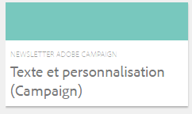

# Utilisation d’Adobe Campaign Classic et d’Adobe Campaign Standard{#working-with-adobe-campaign-classic-and-adobe-campaign-standard}

Vous pouvez créer le contenu d’un e-mail dans AEM et le traiter dans les e-mails Adobe Campaign. À cet effet, vous devez suivrez cette procédure :

1. Créez une newsletter dans AEM depuis un modèle spécifique à Adobe Campaign.
1. Sélectionnez [un service Adobe Campaign](#selecting-the-adobe-campaign-cloud-service-and-template) avant de modifier le contenu pour accéder à toutes les fonctionnalités.
1. Modifiez le contenu.
1. Validez le contenu.

Le contenu peut ensuite être synchronisé avec une diffusion dans Adobe Campaign. Ce document contient des instructions détaillées.

Voir aussi [Création de formulaires Adobe Campaign dans AEM](/help/sites-authoring/adobe-campaign-forms.md).

>[!NOTE]
>
>Avant de pouvoir utiliser cette fonctionnalité, vous devez configurer AEM pour l’intégration à [Adobe Campaign](/help/sites-administering/campaignonpremise.md) ou à [Adobe Campaign Standard](/help/sites-administering/campaignstandard.md).

## Envoi de contenu d’e-mail via Adobe Campaign {#sending-email-content-via-adobe-campaign}

Après avoir configuré AEM et Adobe Campaign, vous pouvez créer le contenu de la diffusion par e-mail directement dans AEM, puis le traiter dans Adobe Campaign.

Lorsque vous créez du contenu Adobe Campaign dans AEM, vous devez effectuer une liaison à un service Adobe Campaign avant de modifier le contenu pour accéder à toutes les fonctionnalités.

Deux cas sont possibles :

* Le contenu peut être synchronisé avec une diffusion depuis Adobe Campaign. Vous pouvez ainsi utiliser le contenu AEM dans une diffusion.
* (Adobe Campaign Classic uniquement) Le contenu peut être envoyé directement vers Adobe Campaign, qui génère automatiquement une nouvelle diffusion par e-mail. Ce mode présente des limites.

Ce document contient des instructions détaillées.

### Créer du contenu d’e-mail {#creating-new-email-content}

>[!NOTE]
>
>Lorsque vous ajoutez des modèles d’e-mail, veillez à les ajouter sous **/content/campaigns** pour qu’ils soient disponibles.

#### Création de contenu d’e-mail {#creating-new-email-content-1}

1. Dans AEM, sélectionnez **Sites**, puis **Campagnes** et cherchez l’emplacement où sont gérées vos campagnes par e-mail. Dans l’exemple ci-dessous, le chemin d’accès est **Sites** > **Campagnes** > **Geometrixx Outdoors** > **Campagnes par e-mail**.

   >[!NOTE]
   >
   >[Les exemples d’e-mails ne sont disponibles que dans Geometrixx](/help/sites-developing/we-retail.md). Téléchargez un exemple de contenu de Geometrixx à partir de Package Share.

   

1. Sélectionnez **Créer**, puis **Créer une page**.
1. Sélectionnez l’un des modèles disponibles auxquels connecter Adobe Campaign, puis cliquez sur **Suivant**. Trois modèles sont disponibles par défaut :

   * **E-maiL Adobe Campaign Classic** : permet d’ajouter du contenu à un modèle prédéfini (deux colonnes) avant de l’envoyer pour diffusion vers Adobe Campaign Classic.
   * **E-mail Adobe Campaign Standard** : permet d’ajouter du contenu à un modèle prédéfini (deux colonnes) avant de l’envoyer vers Adobe Campaign Standard pour diffusion.

1. Renseignez le champ **Titre** et éventuellement le champ **Description**, puis cliquez sur **Créer**. Le titre est utilisé comme objet de la newsletter ou de l’e-mail sauf si vous le remplacez lors de la modification de l’e-mail.

### Sélectionner le service cloud et le modèle Adobe Campaign {#selecting-the-adobe-campaign-cloud-service-and-template}

Pour une intégration à Adobe Campaign, vous devez ajouter un service cloud Adobe Campaign à la page. Cela vous permet d’accéder à la personnalisation et à d’autres informations Adobe Campaign.

En outre, vous devrez peut-être également sélectionner le modèle Adobe Campaign, modifier l’objet et ajouter du contenu en texte brut pour les utilisateurs et utilisatrices qui ne verront pas l’e-mail en HTML.

Vous pouvez sélectionner le service cloud à partir de l’onglet **Sites** ou dans l’e-mail/la newsletter après sa création.

L’approche recommandée consiste à sélectionner le service cloud à partir de l’onglet **Sites**. La sélection du service cloud à partir de l’e-mail/la newsletter nécessite une solution de contournement.

Depuis la page **Sites** :

1. Dans AEM, sélectionnez la page d’e-mail et cliquez sur **Afficher les propriétés**.

   

1. Sélectionnez **Modifier**, puis l’onglet **Services cloud** et faites défiler l’écran vers le bas pour cliquer sur le signe « + » pour ajouter une configuration, puis sélectionnez **Adobe Campaign**.

   

1. Sélectionnez la configuration qui correspond à votre instance Adobe Campaign dans la liste déroulante, puis confirmez en cliquant sur **Enregistrer**.
1. Vous pouvez afficher le modèle appliqué au e-mail en cliquant sur l’onglet **Adobe Campaign**. Si vous souhaitez sélectionner un autre modèle, vous pouvez y accéder à partir de l’e-mail en cours de modification.

   Si vous souhaitez appliquer un modèle de diffusion par e-mail spécifique (à partir d’Adobe Campaign), autre que le modèle d’e-mail par défaut, dans **Propriétés**, sélectionnez l’onglet **Adobe Campaign**. Saisissez le nom interne du modèle de diffusion par e-mail dans l’instance Adobe Campaign associée.

   Le modèle sélectionné détermine les champs de personnalisation disponibles dans Adobe Campaign.

   

En mode Création, à partir de la newsletter ou de l’e-mail, vous ne pourrez peut-être pas sélectionner la configuration de service cloud d’Adobe Campaign dans les **Propriétés de la page** en raison d’un problème de mise en page. Vous pouvez utiliser la solution de contournement décrite ci-dessous :

1. Dans AEM, sélectionnez la page d’e-mail et cliquez sur **Modifier**. Cliquez sur **Ouvrir les propriétés**.

   

1. Sélectionnez **Services Cloud** et cliquez sur le signe « **+** » pour ajouter une configuration. Sélectionnez une des configurations affichées (peu importe laquelle). Cliquez sur le bouton **+** signer pour ajouter une autre configuration, puis sélectionner **Adobe Campaign**.

   >[!NOTE]
   >
   >Vous pouvez également sélectionner les services cloud en sélectionnant **Afficher les propriétés** sous l’onglet **Sites**.

1. Sélectionnez la configuration qui correspond à votre instance Adobe Campaign dans la liste déroulante, supprimez la première configuration que vous avez créée qui n’était pas destinée à Adobe Campaign, puis confirmez en cliquant sur la coche.
1. Pour sélectionner les modèles et ajouter du texte brut, reprenez à l’étape 4 de la procédure précédente.

### Modification du contenu de l’e-mail {#editing-email-content}

Pour modifier le contenu d’un email :

1. Ouvrez l’email. Vous accédez par défaut au mode d’édition.

   

1. Si vous souhaitez modifier l’objet de l’e-mail ou ajouter du texte brut pour les utilisateurs qui ne liront pas l’e-mail au format HTML, sélectionnez **E-mail** et ajoutez un objet et du texte. Cliquez sur l’icône de page pour générer automatiquement une version en texte brut à partir de la version HTML. Une fois que vous avez terminé, cliquez sur la coche.

   Vous pouvez personnaliser la newsletter à l’aide des champs de personnalisation d’Adobe Campaign. Pour ajouter un champ de personnalisation, ouvrez le sélecteur de champ de personnalisation en cliquant sur le bouton affichant le logo Adobe Campaign. Vous pouvez ensuite choisir parmi tous les champs disponibles pour cette newsletter.

   >[!NOTE]
   >
   >Si les champs de personnalisation des propriétés de l’éditeur sont grisés, réexaminez votre configuration.

   

1. Ouvrez le panneau Composants dans la partie gauche de l’écran et sélectionnez **Newsletter Adobe Campaign** dans le menu déroulant pour chercher ces composants.

   

1. Faites glisser des composants directement dans la page et modifiez-les en conséquence. Par exemple, vous pouvez faire glisser un composant **Texte et personnalisation (Campaign)** et ajouter du texte personnalisé.

   

   Pour obtenir une description détaillée de chacun des composants, reportez-vous à la section [Composants Adobe Campaign](/help/sites-authoring/adobe-campaign-components.md).

   

### Insertion d’une personnalisation {#inserting-personalization}

Lorsque vous éditez votre contenu, vous pouvez insérer :

* Des champs de contexte Adobe Campaign. Il s&#39;agit de champs que vous pouvez insérer dans votre texte qui s&#39;adaptent aux données du destinataire (prénom, nom ou toute donnée de la dimension cible, par exemple).
* Des blocs de personnalisation Adobe Campaign. Il s’agit de blocs de contenu prédéfinis qui ne sont pas liés aux données du destinataire, comme le logo d’une marque ou un lien vers une page miroir.

Consultez [Composants d’Adobe Campaign](/help/sites-authoring/adobe-campaign-components.md) pour une description complète des composants de Campaign.

>[!NOTE]
>
>* Seuls les champs de la dimension de ciblage **Profils** d’Adobe Campaign sont pris en compte.
>* Lorsque vous affichez des propriétés à partir de l’onglet **Sites**, vous n’avez pas accès aux champs de contexte Adobe Campaign. Vous pouvez y accéder directement à partir de l’e-mail en cours de modification.

Pour insérer une personnalisation :

1. Insérez un nouveau composant **Newsletter** > **Texte et personnalisation (Campaign)** en le faisant glisser vers la page.

   

1. Ouvrez le composant en cliquant sur l’icône représentant un crayon. L’éditeur statique s’ouvre.

   

   >[!NOTE]
   >
   >**Pour Adobe Campaign Standard :**
   >
   >* Les champs de contexte disponibles correspondent à la dimension de ciblage **Profils** d’Adobe Campaign.
   >* Reportez-vous à la section [Liaison d’une page AEM à un e-mail Adobe Campaign](#linking-an-aem-page-to-an-adobe-campaign-email-adobe-campaign-standard).
   >
   >**Pour Adobe Campaign Classic :**
   >
   >* Les champs de contexte disponibles sont extraits dynamiquement à partir du schéma Adobe Campaign **nms:seedMember**. Les données d’extension cible sont extraites dynamiquement du workflow qui contient la diffusion synchronisée avec le contenu. (Reportez-vous à la section [Synchronisation du contenu créé dans AEM avec une diffusion Adobe Campaign](#synchronizing-content-created-in-aem-with-a-delivery-from-adobe-campaign-classic).)
   >
   >* Pour ajouter ou masquer des éléments de personnalisation, reportez-vous à la section [Gestion des champs et des blocs de personnalisation](/help/sites-administering/campaignonpremise.md#managing-personalization-fields-and-blocks).
   >* **Important** : tous les champs de la table de contrôle doivent également se trouver dans la table des destinataires (ou la table des contacts correspondante).

1. Saisissez le texte à insérer. Insérez des champs de contexte ou des blocs de personnalisation en cliquant sur les composants Adobe Campaign et en les sélectionnant. Lorsque vous avez terminé, cochez la case.

   

   Après avoir inséré des champs de contexte ou des blocs de personnalisation, vous pouvez afficher un aperçu de votre newsletter et tester les champs. Reportez-vous à la section [Aperçu d’une newsletter](#previewing-a-newsletter).

### Prévisualisation d’une newsletter {#previewing-a-newsletter}

Vous pouvez prévisualiser l’aspect de la newsletter et prévisualiser la personnalisation.

1. La newsletter étant affichée, cliquez sur **Aperçu** dans le coin supérieur droit d’AEM. AEM affiche la newsletter telle qu’elle se présente lorsque les utilisateurs la reçoivent.

   

   >[!NOTE]
   >
   >Si vous utilisez Adobe Campaign Standard et l’exemple de modèle, deux blocs de personnalisation affichent le contenu initial : **&lt;%@ include view=&quot;MirrorPage&quot; %>** et **&lt;%@ include view=&quot;UnsubscriptionLink&quot; %>**, qui renvoient des erreurs lors de l’import du contenu lors de la diffusion. Vous pouvez les ajuster en sélectionnant les blocs correspondants à l’aide du sélecteur de blocs de personnalisation.

1. Pour prévisualiser la personnalisation, ouvrez ContextHub en cliquant/appuyant sur l’icône correspondante dans la barre d’outils. Les balises de champ de personnalisation sont désormais remplacées par les données sources de la personne sélectionnée. Découvrez comment les variables s’adaptent lors du changement de persona dans ContextHub.

   

1. Vous pouvez afficher les données sources provenant d’Adobe Campaign associées au personna actuellement sélectionné. Pour ce faire, cliquez sur le module Adobe Campaign dans la barre ContextHub. Une boîte de dialogue s’ouvre alors, affichant toutes les données sources du profil actuel. Là encore, les données s’adaptent lors du changement pour un autre persona.

   

### Approbation du contenu dans AEM {#approving-content-in-aem}

Une fois le contenu terminé, vous pouvez lancer le processus d’approbation. Accédez à l’onglet **Workflow** de la palette et sélectionnez le workflow **Approuver pour Adobe Campaign**.

Ce workflow prêt à l’emploi comporte deux étapes : révision, puis approbation ou révision puis rejet. Néanmoins, ce workflow peut être étendu et adapté à une procédure plus complexe.

Pour approuver le contenu pour Adobe Campaign, appliquez le workflow en sélectionnant **Workflow** et **Approuver pour Adobe Campaign**. Cliquez ensuite sur **Démarrer le workflow**. Parcourez les étapes et approuvez le contenu. Vous pouvez également rejeter le contenu en sélectionnant **Rejeter** au lieu d’**Approuver** dans la dernière étape du workflow.

Une fois le contenu approuvé, il apparaît comme approuvé dans Adobe Campaign. L’e-mail peut alors être envoyé.

Dans Adobe Campaign Standard :

Dans Adobe Campaign Classic :

>[!NOTE]
>
Le contenu non approuvé peut être synchronisé avec une diffusion dans Adobe Campaign, mais la diffusion ne peut pas être exécutée. Seul le contenu approuvé peut être envoyé via les diffusions Campaign.

## Liaison d’AEM avec Adobe Campaign Standard et Adobe Campaign Classic {#linking-aem-with-adobe-campaign-standard-and-adobe-campaign-classic}

La manière dont vous liez ou synchronisez AEM avec Adobe Campaign dépend de si vous utilisez Adobe Campaign Standard par abonnement ou Adobe Campaign Classic sur site.

Pour obtenir des instructions en fonction de votre solution Adobe Campaign, reportez-vous aux sections suivantes :

* [Liaison d’une page AEM à un e-mail Adobe Campaign (Adobe Campaign Standard)](#linking-an-aem-page-to-an-adobe-campaign-email-adobe-campaign-standard)
* [Synchronisation du contenu créé dans AEM avec une diffusion à partir d’Adobe Campaign Classic](#synchronizing-content-created-in-aem-with-a-delivery-from-adobe-campaign-classic)

### Liaison d’une page AEM à un e-mail Adobe Campaign (Adobe Campaign Standard) {#linking-an-aem-page-to-an-adobe-campaign-email-adobe-campaign-standard}

Adobe Campaign Standard permet de récupérer et de lier le contenu créé dans AEM avec :

* Un e-mail.
* Un modèle d’e-mail.

Cela vous permet de diffuser le contenu. Vous déterminez si une newsletter est liée à une seule diffusion par le code qui s’affiche sur la page.

>[!NOTE]
>
Si une newsletter est liée à plusieurs diffusions, le nombre de diffusions liées s’affiche.

Pour lier une page créée dans AEM à un e-mail Adobe Campaign, suivez les étapes suivantes :

1. Créez un email basé sur un modèle d&#39;email spécifique à une AEM. Pour plus d’informations, reportez-vous à la section [Création d’e-mails dans Adobe Campaign Standard](https://helpx.adobe.com/fr/campaign/standard/channels/using/creating-an-email.html).

   

1. Ouvrez le bloc **Contenu** dans le tableau de bord de diffusion.

   

1. Pour accéder à la liste de contenu disponible dans AEM, sélectionnez **Lier avec un contenu Adobe Experience Manager** dans la barre d’outils.

   >[!NOTE]
   >
   Si l’option **Lier avec un contenu Adobe Experience Manager** ne s’affiche pas dans la barre d’actions, vérifiez que le **mode de modification du contenu** est configuré correctement sur **Adobe Experience Manager** dans les propriétés d’e-mail.

   

1. Sélectionnez le contenu que vous souhaitez utiliser dans votre e-mail.

   Cette liste indique :

   * Le libellé du contenu dans AEM.
   * État d’approbation du contenu dans AEM. Si le contenu n’est pas approuvé, vous pouvez le synchroniser, mais il devra être approuvé avant l’envoi de la diffusion. Cependant, vous pouvez exécuter certaines opérations, comme l’envoi d’un BAT ou le test d’aperçu.
   * La date de la dernière modification du contenu.
   * Tout contenu déjà lié à une diffusion.

   >[!NOTE]
   >
   Par défaut, le contenu déjà synchronisé avec une diffusion est masqué. Vous pouvez toutefois l’afficher et l’utiliser. Par exemple, si vous souhaitez utiliser le contenu comme modèle pour plusieurs diffusions.

   Lorsque l’e-mail est lié à du contenu AEM, le contenu ne peut pas être modifié dans Adobe Campaign.

1. Spécifiez les autres paramètres de votre e-mail depuis son tableau de bord (audiences, planning d&#39;exécution).
1. Exécutez la diffusion par e-mail. Lors de l’analyse de la diffusion, la version la plus récente du contenu AEM est récupérée.

   >[!NOTE]
   >
   Si le contenu est mis à jour dans AEM lorsqu’il est lié à un e-mail, il est automatiquement mis à jour dans Adobe Campaign lors de l’analyse. La synchronisation peut également être exécutée manuellement en utilisant l’option **Actualiser le contenu Adobe Experience Manager** dans la barre d’actions de contenu.
   >
   Vous pouvez annuler le lien entre un e-mail et le contenu AEM à l’aide de l’option **Supprimer le lien avec le contenu Adobe Experience Manager** de la barre d’actions de contenu. Ce bouton n’est disponible que si un contenu est déjà lié à la diffusion. Pour lier un autre contenu à une diffusion, vous devez supprimer le lien du contenu actuel avant de pouvoir établir un nouveau lien.
   >
   Lorsque le lien est supprimé, le contenu local est conservé et devient modifiable dans Adobe Campaign. Si vous liez de nouveau le contenu après l’avoir modifié, toutes les modifications seront perdues.

### Synchronisation du contenu créé dans AEM avec une diffusion à partir d’Adobe Campaign Classic {#synchronizing-content-created-in-aem-with-a-delivery-from-adobe-campaign-classic}

Adobe Campaign permet de récupérer et de synchroniser le contenu créé dans AEM avec :

* Une diffusion de campagne
* une activité de diffusion dans un workflow de campagne
* Une diffusion récurrente
* Une diffusion continue
* Une diffusion Message Center
* Un modèle de diffusion

Dans AEM, si une newsletter est liée à une seule diffusion, le code de diffusion s&#39;affiche sur la page.

>[!NOTE]
>
Si la newsletter est liée à différentes diffusions, le nombre de diffusions liées (mais pas chaque ID) s’affiche.
>
[!NOTE]
>
L’étape du workflow **Publication dans Adobe Campaign** est obsolète dans AEM 6.1. Cette étape faisait partie de l’intégration d’AEM 6.0 à Adobe Campaign et n’est plus nécessaire.

Pour synchroniser du contenu créé dans AEM avec une diffusion à partir d’Adobe Campaign :

1. Créez une diffusion ou ajoutez une activité de diffusion à un workflow de campagne en sélectionnant le modèle de diffusion **Diffusion par e-mail avec du contenu AEM (mailAEMContent)**.

   

1. Pour accéder à la liste des contenus disponibles dans AEM, sélectionnez **Synchroniser** dans la barre d’outils.

   >[!NOTE]
   >
   Si l’option **Synchroniser** ne s’affiche pas dans la barre d’outils de diffusion, vérifiez que le champ **Mode de modification du contenu** est configuré correctement dans **AEM** en sélectionnant **Propriétés** > **Avancé**.

   

1. Sélectionnez le contenu que vous souhaitez synchroniser avec votre diffusion.

   Cette liste indique :

   * Le libellé du contenu dans AEM.
   * État d’approbation du contenu dans AEM. Si le contenu n’est pas approuvé, vous pouvez le synchroniser, mais il devra être approuvé avant l’envoi de la diffusion. Cependant, vous pouvez exécuter certaines opérations, telles que l’envoi d’un BAT ou le test d’aperçu.
   * Date de la dernière modification du contenu.
   * Tout contenu déjà lié à une diffusion.

   >[!NOTE]
   >
   Par défaut, le contenu déjà synchronisé avec une diffusion est masqué. Vous pouvez toutefois l’afficher et l’utiliser. Par exemple, si vous souhaitez utiliser le contenu comme modèle pour plusieurs diffusions.

   

1. Spécifiez les autres paramètres de votre diffusion (cible, etc.)
1. Au besoin, lancez le processus d’approbation de la diffusion dans Adobe Campaign. La validation du contenu dans AEM est nécessaire en plus des validations configurées dans Adobe Campaign (budget, cible, etc.). L’approbation du contenu dans Adobe Campaign n’est possible que si le contenu a déjà été approuvé dans AEM.
1. Exécutez la diffusion. Lors de l’analyse de la diffusion, la version la plus récente du contenu AEM est récupérée.

   >[!NOTE]
   >
   * Une fois la diffusion et le contenu synchronisés, le contenu de la diffusion dans Adobe Campaign passe en lecture seule. L&#39;objet de l&#39;email et son contenu ne peuvent plus être modifiés.
   * Si le contenu est mis à jour dans AEM alors qu’il est lié à une diffusion dans Adobe Campaign, il est automatiquement mis à jour dans la diffusion lors de l’analyse de la diffusion. La synchronisation peut également être exécutée manuellement à l’aide du bouton **Actualiser le contenu maintenant**.
   * Vous pouvez annuler la synchronisation entre une diffusion et le contenu d’AEM à l’aide du bouton **Désynchroniser**. Cette option n’est disponible que si un contenu est déjà synchronisé avec la diffusion. Pour synchroniser un contenu différent avec une diffusion, vous devez annuler la synchronisation de contenu actuelle avant de pouvoir établir un nouveau lien.
   * Si le contenu local est désynchronisé, il est conservé et peut être modifié dans Adobe Campaign. Si vous resynchronisez le contenu après l’avoir modifié, vous perdrez toutes vos modifications.
   * Pour les diffusions récurrentes et continues, la synchronisation avec le contenu AEM est arrêtée à chaque exécution de la diffusion.
