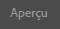

# Aperçu des pages à l’aide des données ContextHub {#previewing-pages-using-contexthub-data}

La barre d’outils [ContextHub](/help/sites-developing/contexthub.md) affiche les données ContextHub et vous permet de modifier les données de la boutique. Elle est utile pour prévisualiser le contenu déterminé par des données dans une boutique ContextHub.

La barre d’outils consiste en une série de modes d’IU qui contiennent un ou plusieurs modules d’IU.

* Les modes d’IU sont les icônes qui s’affichent dans la partie gauche de la barre d’outils. Lorsque vous cliquez ou appuyez sur une icône, la barre d’outils affiche les modules d’IU qu’elle contient.
* Les modules d’IU affichent les données d’une ou plusieurs boutiques ContextHub. Certains modules d’IU vous permettent également de manipuler les données de boutique.

ContextHub installe plusieurs modes d’IU et modules d’IU. Votre administrateur a peut-être [configuré ContextHub](/help/sites-developing/ch-configuring.md) pour en afficher d’autres.

## Affichage de la barre d’outils ContextHub {#revealing-the-contexthub-toolbar}

La barre d’outils ContextHub est disponible en mode Aperçu. La barre d’outils est disponible uniquement sur les instances d’auteur et uniquement si l’administrateur l’a activée.

1. Avec votre page ouverte pour édition, cliquez ou appuyez sur Aperçu sur la barre d’outils.

   

1. Pour afficher la barre d’outils, appuyez ou cliquez sur l’icône ContextHub.

   

## Fonctionnalités du module d’IU {#ui-module-features}

Chaque module d’IU fournit un ensemble de fonctionnalités différent, mais les types de fonctionnalités suivants sont communs. Les modules d’IU étant redimensionnables, votre développeur peut mettre en œuvre d’autres fonctionnalités selon les besoins.

### Contenu de la barre d’outils {#toolbar-content}

Les modules d’IU peuvent afficher des données d’une ou de plusieurs boutiques ContextHub sur la barre d’outils. Les modules d’IU utilisent une icône et un titre pour s’identifier.

### Contenu contextuel {#popup-content}

Certains modules d’IU affichent une fenêtre contextuelle lorsque l’utilisateur clique ou appuie dessus. En règle générale, cette fenêtre contextuelle contient des informations supplémentaires complétant les informations affichées sur la barre d’outils.

### Formulaires contextuels {#popup-forms}

La fenêtre contextuelle d’un module peut contenir des éléments de formulaire qui vous permettent de changer les données contenues dans la boutique ContextHub. Si le contenu de la page est déterminé par les données de la boutique, vous pouvez utiliser le formulaire et observer les modifications apportées au contenu de la page.

### Mode Plein écran  {#fullscreen-mode}

Les fenêtres contextuelles peuvent inclure une icône sur laquelle vous cliquez ou appuyez afin que le contenu de la fenêtre contextuelle englobe l’intégralité de la fenêtre du navigateur.

