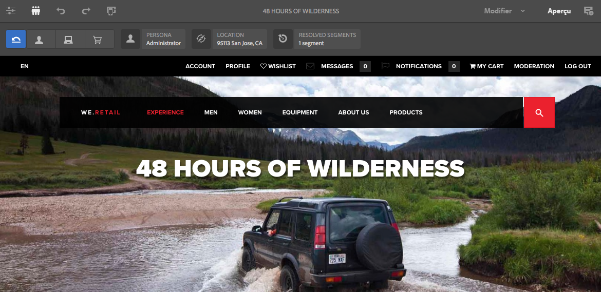

# Aperçu des pages à l’aide des données ContextHub{#previewing-pages-using-contexthub-data}

La barre d’outils [ContextHub](/help/sites-developing/contexthub.md) affiche les données ContextHub et vous permet de modifier les données de la boutique. La barre d’outils ContextHub est utile pour prévisualiser le contenu déterminé par les données d’un magasin ContextHub.

La barre d’outils se compose d’une série de modes d’UI qui contiennent un ou plusieurs modules d’UI.

* Les modes d’UI sont des icônes qui s’affichent sur le côté gauche de la barre d’outils. Lorsque vous cliquez sur une icône, la barre d’outils affiche les modules d’IU qu’elle contient.
* Les modules d’UI affichent les données d’un ou de plusieurs magasins ContextHub. Certains modules d’UI permettent également de manipuler les données du magasin.

ContextHub installe plusieurs modes d’IU et modules d’IU. Votre administrateur ou administratrice a peut-être [configuré ContextHub](/help/sites-developing/ch-configuring.md) pour en afficher d’autres.

## Affichage de la barre d’outils ContextHub {#revealing-the-contexthub-toolbar}

La barre d’outils ContextHub est disponible en mode Aperçu. La barre d’outils est disponible uniquement sur les instances d’auteur et uniquement si l’administrateur l’a activée.

1. Avec votre page ouverte pour édition, cliquez sur Aperçu dans la barre d’outils.

   

1. Pour afficher la barre d’outils, cliquez sur l’icône ContextHub.

   

## Fonctionnalités du module d’IU {#ui-module-features}

Chaque module d’UI fournit un ensemble de fonctionnalités différent, mais les types de fonctionnalités suivants sont communs. Comme les modules d’UI peuvent être étendus, votre développeur ou développeuse peut mettre en œuvre d’autres fonctionnalités selon les besoins.

### Contenu de la barre d’outils {#toolbar-content}

Les modules d’IU peuvent afficher des données d’une ou de plusieurs boutiques ContextHub sur la barre d’outils. Les modules d’IU utilisent une icône et un titre pour s’identifier.

### Contenu de la fenêtre contextuelle {#popup-content}

Certains modules d’UI affichent une fenêtre contextuelle lorsque l’utilisateur ou utilisatrice clique ou appuie dessus. En règle générale, cette fenêtre contextuelle contient des informations supplémentaires complétant les informations affichées sur la barre d’outils.

### Formulaires dans une fenêtre contextuelle {#popup-forms}

La fenêtre contextuelle d’un module peut inclure des éléments de formulaire qui vous permettent de modifier les données dans le magasin ContextHub. Si le contenu de la page est déterminé par les données du magasin, vous pouvez utiliser le formulaire et observer les modifications apportées au contenu de la page.

### Mode Plein écran {#fullscreen-mode}

Les fenêtres contextuelles peuvent inclure une icône sur laquelle vous cliquez afin que le contenu de la fenêtre contextuelle remplisse l’intégralité de la fenêtre du navigateur.

