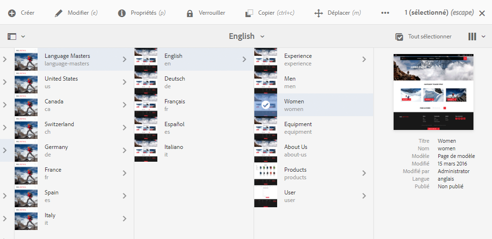
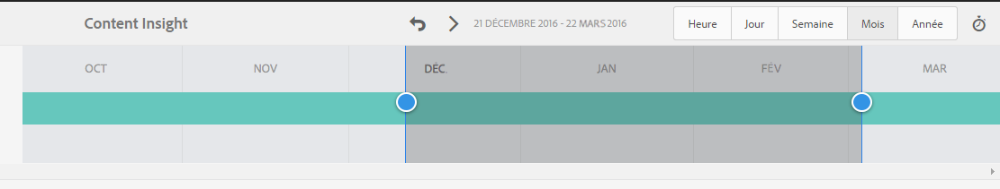
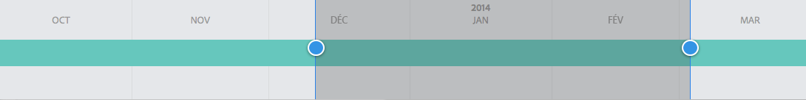

# Analyser les performances de page{#analyzing-page-performance}

Ouvrez la page [Content Insight](/help/sites-authoring/content-insights.md) pour analyser les performances de la page que vous créez. Configurez la période de création de rapports pour cibler votre analyse.

## Ouvrir Analytics et recommendations concernant une page {#opening-analytics-and-recommendations-for-a-page}

Procédez comme suit pour afficher Analytics et recommendations concernant une page :

1. Accédez à la page que vous souhaitez analyser.
1. Dans la barre d’outils, cliquez ou appuyez sur **Analyses et recommandations**.

   >[!NOTE]
   >
   >Les analyses et recommandations pour une page s’affichent uniquement si vous avez configuré l’[intégration d’AEM avec Adobe Analytics](/help/sites-administering/adobeanalytics-connect.md).

   

### Modifier la période de création de rapports {#changing-the-reporting-period}

Modifiez les aspects suivants liés au temps des rapports d’analyse :

* Période pendant laquelle générer les rapports.
* Granularité des données.

Les outils permettant de modifier les aspects temporels des rapports s’affichent en haut de la page Content Insight. 

#### Modifier la période de création de rapports {#changing-the-reporting-period-1}

Modifiez la période de création de rapports de la page Content Insight afin de concentrer votre analyse de l’activité de la page sur une période spécifique. Lorsque vous modifiez la période de création de rapports, les rapports sont automatiquement actualisés. La zone ombrée du délai représente la période de création de rapports. Les dates sur le délai augmentent de gauche à droite.

Pour modifier la période de création de rapports d’une page Content Insight :

1. Si le délai n’apparaît pas en haut de la page, cliquez ou appuyez sur l’icône Activer/désactiver le délai.

   

1. Pour modifier la date de début de la période de création de rapports, faites glisser le cercle qui s’affiche sur le côté gauche de la zone ombrée jusqu’à la date de début souhaitée.

   Si vous ne pouvez pas voir le côté gauche de la zone ombrée, utilisez la barre de défilement pour l’afficher.

1. Pour modifier la date de fin de la période de création de rapports, faites glisser le cercle qui s’affiche sur le côté droit de la zone ombrée jusqu’à la date de fin souhaitée.

#### Modifier la granularité de la période de création de rapports {#changing-the-granularity-of-the-reporting-period}

Modifiez la durée de chaque point de données dans un rapport. Par exemple, lorsque la granularité Semaine est sélectionnée, chaque point de données du rapport Vues représente le nombre de vues pour une semaine.

La granularité affecte les rapports qui tracent les données par rapport au temps, tels que les rapports Vues et Moyenne des minutes d’engagement sur la page. La granularité affecte également l’échelle du délai.

1. Si le contrôle de granularité n’apparaît pas, cliquez ou appuyez sur l’icône Activer/désactiver la granularité.

   

1. Cliquez ou appuyez sur la granularité souhaitée. Une fois sélectionné, le rapport est automatiquement mis à jour pour refléter la granularité.

### Attribuer des tâches pour les Recommandations d’optimisation du moteur de recherche {#assigning-tasks-for-seo-recommendations}

Utilisez le rapport Recommandations d’optimisation du moteur de recherche pour créer des tâches visant à améliorer la visibilité des pages. Pour chaque recommandation du rapport qui ne comporte pas de coche, vous pouvez créer une tâche que vous attribuez à un utilisateur ou à une utilisatrice pour effectuer le travail requis.

Le statut de la recommandation d’optimisation pour les moteurs de recherche indique quand la tâche est créée mais pas encore terminée.

Une fois créée, la tâche apparaît dans la liste Tâches de l’utilisateur. Pour plus d’informations sur les tâches, consultez [Utilisation de tâches](/help/sites-authoring/task-content.md).

Utilisez la procédure suivante pour créer une tâche pour une recommandation d’optimisation du moteur de recherche.

1. Cliquez ou appuyez sur l’icône d’informations de la recommandation d’optimisation du moteur de recherche.

   

1. Cliquez sur l’icône en forme de triangle encerclé qui s’affiche en regard de l’icône d’informations.

   

1. Renseignez les champs de formulaire qui s’affichent, puis appuyez sur Créer :

   * Projet : sélectionnez le projet dans lequel créer la tâche.
   * Nom : nom qui identifie la tâche. Le nom par défaut est le titre de la recommandation d’optimisation du moteur de recherche.
   * Attribuer à : sélectionnez la personne utilisatrice à laquelle la tâche doit être attribuée. Commencez à saisir le nom de l’utilisateur ou de l’utilisatrice pour filtrer la liste.
   * Description : description de l’activité requise pour terminer la tâche. La description par défaut correspond aux informations qui accompagnent la recommandation d’optimisation du moteur de recherche.
   * Priorité de la tâche : priorité de la tâche.
   * Date d’échéance : date à laquelle la tâche doit être terminée.

   **Remarque :** la tâche créée inclut également le chemin d’accès à la page à laquelle la recommandation d’optimisation pour les moteurs de recherche s’applique.

1. Cliquez ou appuyez sur Terminé pour fermer le message Tâche créée.
