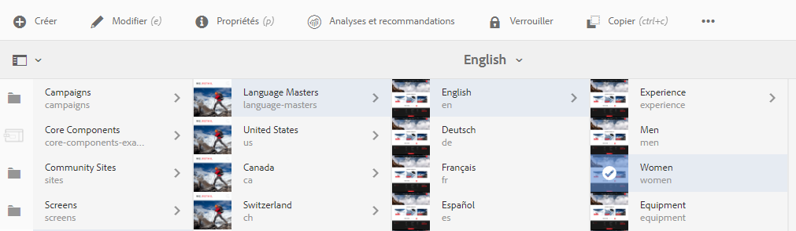
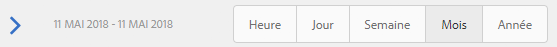

# Analyse des performances de page{#analyzing-page-performance}

Ouvrez la page [Content Insight](/help/sites-authoring/content-insights.md) pour analyser les performances de la page que vous créez. Configurez la période de création de rapports afin de cibler votre analyse.

## Ouverture de l’analyse et des recommandations relatives à une page {#opening-analytics-and-recommendations-for-a-page}

Utilisez la procédure suivante afin de voir les analyses et les recommandations pour une page :

1. Accédez à la page que vous voulez analyser.
1. Dans la barre d’outils, cliquez ou appuyez sur **Analyses et recommandations**.

   >[!NOTE]
   >
   >Les analyses et recommandations pour une page s’affichent uniquement si vous avez configuré l’[intégration d’AEM avec Adobe Analytics](/help/sites-administering/adobeanalytics-connect.md).

   

### Modification de la période de création de rapports {#changing-the-reporting-period}

Modifiez les aspects temporels suivants des rapports d’analyse :

* La période pour laquelle créer un rapport.
* La granularité des données.

Les outils permettant de modifier les aspects temporels des rapports s’affichent en haut de la page Content Insight. 

#### Modification de la période de création de rapports {#changing-the-reporting-period-1}

Modifiez la période de création de rapports de la page Content Insight pour cibler votre analyse de l’activité de page sur une période spécifique. Lorsque vous modifiez la période de création de rapports, les rapports sont automatiquement actualisés. La zone ombrée sur la période représente la période de création de rapports. Les dates de la période augmentent de gauche à droite.

Pour modifier la période de rapport d’une page Content Insight :

1. Si la période n’apparaît pas en haut de la page, cliquez ou appuyez sur l’icône Activer/désactiver la période.

   

1. Pour modifier la date de début de la période de création de rapports, faites glisser le cercle figurant sur le côté gauche de la zone ombrée vers la date de début désirée.

   Si vous ne voyez pas le côté gauche de la zone ombrée, utilisez la barre de défilement pour l’ajouter à la vue.

1. Pour modifier la date de fin de la période de création de rapports, faites glisser le cercle figurant sur le côté droit de la zone ombrée vers la date de fin désirée.

#### Modification de la granularité de la période de création de rapports {#changing-the-granularity-of-the-reporting-period}

Modifiez la durée couverte par chaque point de données dans un rapport. Par exemple, lorsque la granularité Semaine est sélectionnée, chaque point de données du rapport Vues représente le nombre de vues pour une semaine.

La granularité affecte les rapports qui tracent les données par rapport au temps (par exemple, les rapports Vues et Minutes moyennes d’interactions par page). La granularité a également une incidence sur l’échelle de la période.

1. Si le contrôle de granularité ne s’affiche pas, appuyez ou cliquez sur l’icône Activer/désactiver la granularité.

   

1. Cliquez ou appuyez sur la granularité de votre choix. Une fois sélectionné, le rapport est automatiquement mis à jour pour refléter la granularité.

### Affectation de tâches pour les recommandations d’optimisation pour les moteurs de recherche. {#assigning-tasks-for-seo-recommendations}

Utilisez le rapport Recommandations d’optimisation pour les moteurs de recherche afin de créer des tâches pour améliorer la visibilité des pages aux moteurs de recherche. Pour chaque recommandation du rapport ne comportant pas de coche, vous pouvez créer une tâche que vous affectez à un utilisateur qui effectuera le travail requis.

L’état de la recommandations d’optimisation pour les moteurs de recherche indique quand la tâche est créée mais pas encore terminée.

Une fois créée, la tâche apparaît dans la liste Tâches de l’utilisateur. Pour plus d’informations sur les tâches, voir [Utilisation de Tâches](/help/sites-authoring/task-content.md).

Utilisez la procédure suivante afin de créer une tâche pour une recommandation d’optimisation pour les moteurs de recherche.

1. Appuyez ou cliquez sur l’icône d’informations de la recommandation d’optimisation pour les moteurs de recherche.

   

1. Cliquez sur l’icône représentant un triangle dans un cercle située en regard de l’icône d’informations.

   

1. Renseignez les champs de formulaire qui s’affichent, puis appuyez sur Créer :

   * Projet : Sélectionnez le projet dans lequel vous souhaitez créer la tâche.
   * Nom : Le nom qui identifie la tâche. Le nom par défaut est le titre de la recommandation d’optimisation pour les moteurs de recherche.
   * Affecter à : Sélectionnez l’utilisateur auquel affecter la tâche. Commencez à taper le nom de l’utilisateur pour filtrer la liste.
   * Description : Une description de l’activité requise pour terminer la tâche. La description par défaut correspond aux informations accompagnant la recommandation d’optimisation pour les moteurs de recherche.
   * Priorité de la tâche : La priorité de la tâche.
   * Échéance : La date à laquelle la tâche doit être terminée.

   **Remarque :** La tâche créée inclut également le chemin d’accès à la page à laquelle la recommandation d’optimisation pour les moteurs de recherche s’applique.

1. Cliquez ou appuyez sur Terminé pour fermer le message Tâche créée.

