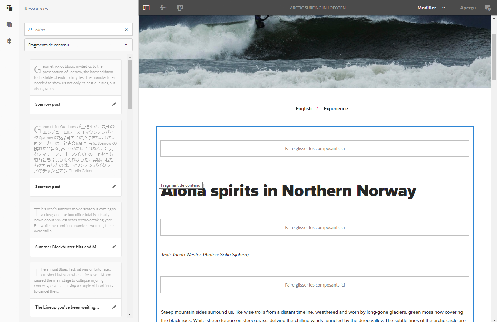
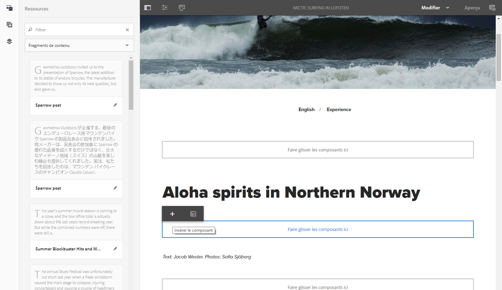
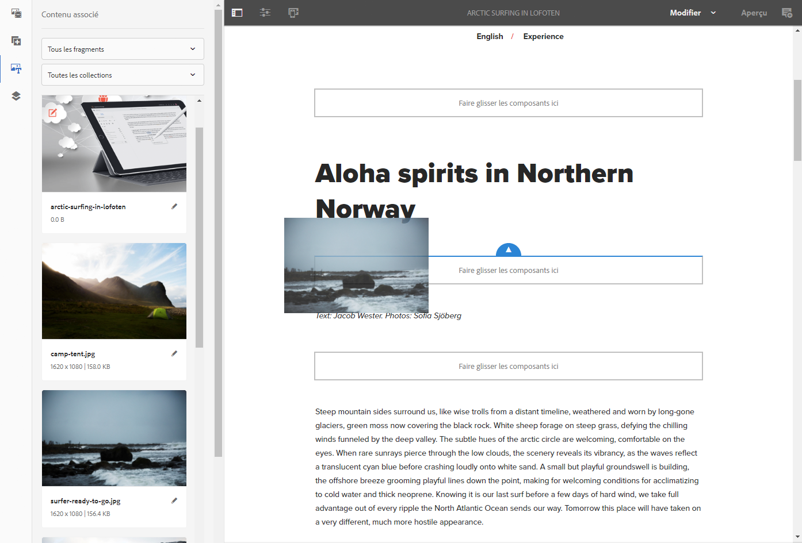

# Création de page à partir de fragments de contenu{#page-authoring-with-content-fragments}

Les fragments de contenu Adobe Experience Manager (AEM) sont [créés et gérés en tant que ressources indépendantes de la page](/help/assets/content-fragments/content-fragments.md).

Ils vous permettent de créer du contenu neutre pour les canaux, ainsi que des variantes (éventuellement spécifiques aux canaux). Vous pouvez ensuite utiliser ces fragments et leurs variantes lors de la création de vos pages de contenu.

En même temps que l’outil d’exportation JSON mis à jour, les fragments de contenu structuré peuvent également être utilisés pour diffuser du contenu AEM via Content Services à des canaux autres que des pages AEM.

>[!NOTE]
>
>Les **fragments de contenu** et les **[fragments d’expérience](/help/sites-authoring/experience-fragments.md)** représentent deux fonctions distinctes d’AEM :
>
>* **Fragments de contenu** sont du contenu éditorial, principalement du texte et des images associées. Il s’agit de contenu pur, sans conception ni mise en page.
>* Les **fragments d’expérience** désignent un contenu parfaitement mis en page : un fragment de page web.
>
>Les fragments d’expérience peuvent être composés de contenu sous la forme de fragments de contenu, mais pas l’inverse.

>[!CAUTION]
>
>Cette page doit être lue avec [Utilisation de fragments de contenu](/help/assets/content-fragments/content-fragments.md) (et pages connexes), car il présente la terminologie et les concepts de base, ainsi que la création et la gestion des fragments.

Les fragments de contenu permettent ce qui suit :

* **Stratégie de marketing et de campagne**

   * Examen du contenu par le biais de fragments de contenu gérés de manière centralisée.

* **Créateurs et créatrices professionnels**

   * Suivi des ressources de création via des collections associées à des fragments de contenu.

* **Rédacteurs et rédactrices**

   * Écriture dans l’éditeur de fragments de contenu d’AEM.
   * Possibilité de créer des variations de contenu.
   * Possibilité d’associer du contenu pertinent au fragment de contenu.
   * Possibilité d’utiliser le contrôle de version/workflow.
   * Possibilité de partager un fragment de contenu.
   * Possibilité de gérer les traductions de manière centralisée.

* **Producteurs et responsable parcours**

   * Sélection à partir de fragments et de variations prédéfinis avec la création dans AEM.
   * Possibilité de compter sur la mise à jour en continu des fragments et du contenu associé à mesure que les rédacteurs et les rédactrices, et les créateurs et créatrices, effectuent leurs mises à jour dans des ressources et des fragments gérés de manière centralisée.
   * Possibilité de compter sur un contenu multimédia associé traité pour être pertinent.
   * Possibilité de créer des variations de contenu ad hoc à la volée tout en s’assurant que celles-ci restent gérées de manière centralisée dans le fragment.

## Ajout d’un fragment de contenu à une page {#adding-a-content-fragment-to-your-page}

1. Ouvrez la page à modifier.

1. Ajoutez le composant **Fragment de contenu** à partir du navigateur **Composants** ou **Insérer un nouveau composant**.

1. Vous pouvez effectuer l’une des actions suivantes :

   * Ouvrir l’explorateur de **ressources** et filtrer sur **Fragments de contenu** (la valeur par défaut est Images). Faire ensuite glisser le fragment requis sur l’instance du composant.

   * Sélectionner le composant de fragment de contenu, puis **Configurer** dans la barre d’outils. Dans la boîte de dialogue, vous pouvez ouvrir la boîte de dialogue de sélection pour rechercher et sélectionner les **Fragment de contenu**.

   >[!NOTE]
   >
   >L’autre méthode consiste à faire glisser un fragment de contenu directement sur la page. Cela crée automatiquement le composant associé (fragment de contenu).

1. Au départ, le contenu de la **Principal** Elément et **Principal** (variation) s’affiche. Vous pouvez [sélectionner d’autres éléments et/ou variantes](#selecting-the-element-or-variation) en fonction de vos besoins.

   

   >[!NOTE]
   >
   >Pour plus d’informations sur les autres fonctionnalités de modification, voir :
   >
   >
   >
   >    * [Mise en page réactive](/help/sites-authoring/responsive-layout.md)
   >    * [Modification du contenu de la page](/help/sites-authoring/editing-content.md)
   >
   >

### Sélection de l’élément ou de la variation {#selecting-the-element-or-variation}

Ouvrez le fichier **Configuration** pour configurer le fragment à utiliser sur la page active. La boîte de dialogue peut dépendre du composant utilisé.

Dans la boîte de dialogue de configuration appropriée, vous pouvez sélectionner les paramètres disponibles, notamment :

* **Fragment de contenu**

  Indiquez le fragment à utiliser.

* **Mode d’affichage** :

   * **Un seul élément texte**

   * **Plusieurs éléments**

* **Élément**

   * Par défaut **Principal** est toujours disponible.
   * Une sélection est disponible si le fragment a été créé avec un modèle approprié.

  >[!NOTE]
  >
  >Les éléments disponibles dépendent du modèle utilisé.

* **Variation**

   * Par défaut **Principal** est toujours disponible.
   * Une sélection est disponible si des variations ont été créées pour le fragment.

* **Paragraphes**: spécifiez la plage de paragraphes à inclure :

   * **Tous**
   * **Plage** : par exemple, `1`, `3-5`, `9-*`

      * **Gérer les en-têtes comme leurs propres paragraphes**

* **Gérer les en-têtes comme leurs propres paragraphes**

### Connexion rapide à l’éditeur de fragment {#quick-connection-to-fragment-editor}

Vous pouvez ouvrir la source du fragment à modifier (la ressource) à l’aide de l’icône **Modifier** située dans la barre d’outils du composant. Cela vous permet de : [modifier et gérer le fragment de contenu ;](/help/assets/content-fragments/content-fragments.md).

>[!CAUTION]
>
>Comme toujours, la modification de la source du fragment peut avoir un impact sur toutes les pages qui référencent ce fragment de contenu.

### Ajout de contenu intermédiaire {#adding-in-between-content}

Lorsqu’un fragment de contenu spécifique est ajouté à la page, il y a un espace réservé **Faire glisser des composants ici** entre chaque paragraphe de HTML (et en haut/en bas) du fragment.

Vous pouvez ainsi ajouter du contenu supplémentaire. [intermédiaire (c’est-à-dire, contenu intermédiaire)](/help/assets/content-fragments/content-fragments.md#in-between-content-when-page-authoring-with-content-fragments) le contenu du fragment (à l’un des points disponibles), sans avoir à modifier le fragment racine.

Pour le contenu intermédiaire, vous pouvez :

* Ajouter des composants à partir de l’[explorateur de composants](/help/sites-authoring/author-environment-tools.md#components-browser).
* Ajouter des ressources à partir de l’[explorateur de ressources](/help/sites-authoring/author-environment-tools.md#assets-browser).
* Utiliser du [contenu associé](#using-associated-content) comme source de contenu intermédiaire.

>[!CAUTION]
>
>Le contenu intermédiaire est du contenu de page. Il n’est pas stocké dans le fragment de contenu.

>[!NOTE]
>
>Vous pouvez également [insérer des ressources visuelles (images) dans le fragment](/help/assets/content-fragments/content-fragments-variations.md#inserting-assets-into-your-fragment).
>
>Les ressources visuelles insérées sont liées au paragraphe précédent dans le fragment. Cela signifie que vous ne pouvez pas placer le contenu intermédiaire entre une ressource visuelle et le paragraphe précédent.

>[!CAUTION]
>
>Une fois que vous avez ajouté du contenu intermédiaire à un fragment de contenu sur votre page, la modification de la structure du fragment de contenu sous-jacent (c’est-à-dire dans l’éditeur de fragment de contenu) peut entraîner des résultats erronés/inattendus.
>
>Dans ce cas, le contenu intermédiaire est conservé tel quel :
>
>* Les composants intermédiaires ont une position absolue dans la séquence de composants dans le flux du fragment. Cette position ne change pas, même lorsque le contenu des paragraphes du fragment change.
>
>  Cela peut donner l’impression que le positionnement relatif a changé, dans la mesure où les paragraphes intermédiaires n’ont aucune relation contextuelle avec les paragraphes (de fragment) près desquels ils sont placés.
>* À moins que ces deux structures de paragraphes ne soient en conflit ; dans ce cas, le contenu intermédiaire n’est pas affiché (bien qu’il soit toujours présent en interne).
>

### Utilisation de contenu associé {#using-associated-content}

Si vous avez [contenu associé](/help/assets/content-fragments/content-fragments-assoc-content.md) avec la propriété [fragment de contenu](/help/assets/content-fragments/content-fragments.md), ces ressources sont disponibles à partir du panneau latéral (après avoir placé votre fragment sur la page de contenu). Le contenu associé est en fait une source spéciale de contenu pour le [contenu intermédiaire](#adding-in-between-content).

>[!NOTE]
>
>Vous pouvez ajouter des [ressources visuelles (des images, par exemple)](/help/assets/content-fragments/content-fragments.md#fragments-with-visual-assets) au fragment et/ou à la page de plusieurs manières différentes.

>[!NOTE]
>
>Si une page contient plusieurs fragments de contenu, la variable **Contenu associé** affiche les ressources appropriées à tous les fragments.

Une fois que vous avez ajouté un fragment avec du contenu associé à votre page, un nouvel onglet (**Contenu associé**) s’ouvre dans le panneau latéral.

À partir de là, vous pouvez faire glisser les ressources vers l’emplacement requis (vers un composant existant ou vers l’emplacement requis où le composant approprié est créé) :

### Ressources insérées dans le fragment {#assets-inserted-into-the-fragment}

Si des ressources (des images, par exemple) ont été insérées dans le fragment proprement dit, les options permettant de les modifier dans l’éditeur de page sont limitées. <!-- Removed link as it was a 404 on helpx -->

Dans le cas d’une image, par exemple, vous pouvez effectuer les opérations suivantes :

* Recadrer, faire pivoter ou retourner l’image.
* Ajouter un titre ou un texte secondaire.
* Spécifier une taille.
* Vous pouvez également configurer la mise en page.

D’autres modifications telles que le déplacement, la copie et la suppression, doivent être effectuées dans l’éditeur de fragments.

### Publication {#publishing}

Les fragments doivent être publiés afin de pouvoir être utilisés sur vos pages web publiées :

* Un fragment peut être publié une fois [qu’il a été créé dans la console Ressources](/help/assets/content-fragments/content-fragments.md#publishingandreferencingafragment).
* Si *fragment non publié* est utilisé sur une page en cours de publication, le fragment peut également être publié maintenant.
