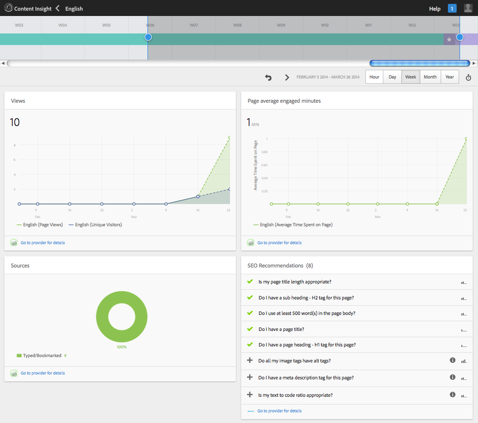
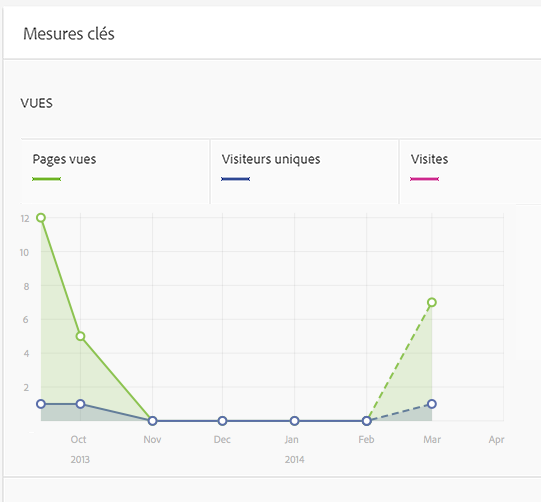
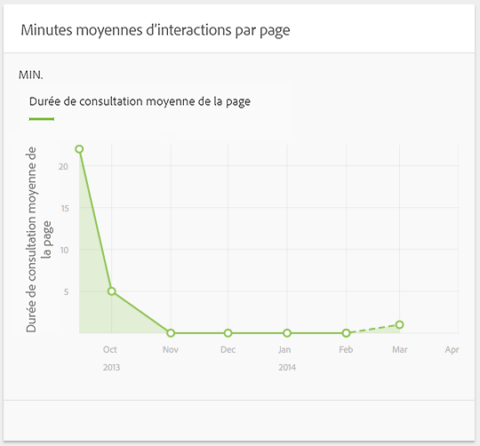
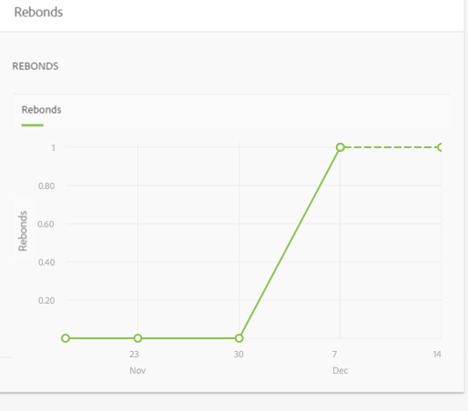

# Content Insight {#content-insight}

Content Insight fournit des informations sur les performances des pages à l’aide de l’analyse web et des recommandations d’optimisation pour les moteurs de recherche. Utilisez Content Insight pour prendre des décisions sur la manière de modifier les pages ou pour savoir comment les modifications précédentes ont changé les performances. Pour chaque page que vous créez, vous pouvez ouvrir Content Insight afin d’analyser la page.

La disposition de la page Content Insight s’adapte à la dimension et à l’orientation de l’écran du périphérique que vous utilisez.

## Données du rapport 

La page Content Insight comprend des rapports qui utilisent les données d’Adobe SiteCatalyst, Adobe Target, Adobe Social et BrightEdge :

* SiteCatalyst : Les rapports pour les mesures suivantes sont disponibles :

   * Pages vues
   * Durée de consultation moyenne de la page
   * Sources

* Target : Rapports sur l’activité de campagne pour laquelle votre page comprend des offres.
* BrightEdge : Signale les fonctions de page qui améliorent la visibilité de la page aux moteurs de recherche et recommande les fonctions à mettre en œuvre.

Reportez-vous à [Ouverture de l’analyse et des recommandations concernant une page](/help/sites-authoring/ci-analyze.md#opening-analytics-and-recommendations-for-a-page).

## Période de création de rapports 

Les rapports affichent les données relatives à une période que vous contrôlez. Lorsque vous définissez la période de création de rapports, les rapports sont automatiquement actualisés en fonction des données de cette période. Des repères visuels indiquent à quel moment les versions de la page ont été modifiées, afin de vous permettre de comparer les performances de chaque version.

Vous pouvez également spécifier la granularité des données signalées. Par exemple, vous pouvez afficher les données quotidiennes, hebdomadaires, mensuelles ou annuelles.

Voir [Modification de la période de création de rapports](/help/sites-authoring/ci-analyze.md#changing-the-reporting-period).

>[!NOTE]
>
>Les rapports Content Insights nécessitent que votre administrateur ait intégré AEM à SiteCatalyst, Target et BrightEdge. See [Integrating with SightCatalyst](/help/sites-administering/adobeanalytics.md), [Integrating with Adobe Target](/help/sites-administering/target.md), and [Integrating with BrightEdge](/help/sites-administering/brightedge.md).

## Rapport Vues {#the-views-report}

Le rapport Vues inclut les fonctions suivantes permettant d’évaluer le trafic de page :

* Le nombre total de vues pour une page au cours de la période de création de rapports.
* Un graphique du nombre de vues au cours de la période de création de rapports :

   * Nombre total de vues.
   * Visiteurs uniques.

## Rapport Minutes moyennes d’interactions par page {#the-page-average-engaged-report}

Le rapport Minutes moyennes d’interactions par page inclut les fonctions suivantes permettant d’évaluer l’efficacité des pages :

* La durée moyenne pendant laquelle la page reste ouverte pendant la période de création de rapport entière.
* Un graphique de la durée moyenne d’une page vue sur la période de création de rapports.

## Rapport Sources {#the-sources-report}

Le rapport Sources indique comment les utilisateurs ont accédé à la page (par exemple, à partir des résultats d’un moteur de recherche ou via l’URL connue).

## Rapport Rebonds {#the-bounces-report}

Le rapport Rebonds inclut un graphique indiquant le nombre de rebonds qui se sont produits pour une page au cours de la période de création de rapports sélectionnée.

## Rapport d’activité de campagne {#the-campaign-activity-report}

Pour chaque campagne pour laquelle la page est active, un rapport nommé Activité de *Nom de campagne* apparaît. Le rapport affiche les impressions et les conversions de page pour chaque segment pour lequel une offre est fournie.

## Rapport Recommandations d’optimisation pour les moteurs de recherche {#the-seo-recommendations-report}

Le rapport Recommandations d’optimisation pour les moteurs de recherche contient les résultats de l’analyse de BrightEdge pour la page. Ce rapport constitue une liste de contrôle des fonctionnalités de page qui indique quelles fonctionnalités la page inclut et n’inclut pas pour optimiser la repérabilité avec les moteurs de recherche.

Le rapport vous permet de créer des tâches de sorte que des améliorations soient effectuées pour améliorer la repérabilité de page. Les recommandations indiquent que des tâches ont été créées pour mettre en œuvre la recommandation. Reportez-vous à [Affectation de tâches pour les recommandations d’optimisation pour les moteurs de recherche](/help/sites-authoring/ci-analyze.md#assigning-tasks-for-seo-recommendations).

