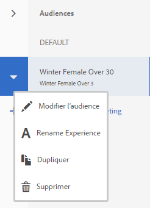
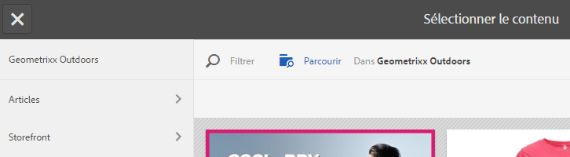

# Création de contenu ciblé en mode Ciblage{#authoring-targeted-content-using-targeting-mode}

Créez du contenu ciblé à l’aide du mode Ciblage d’AEM. Le mode Ciblage et le composant cible fournissent des outils pour créer du contenu pour les expériences :

* Identifiez facilement le contenu ciblé qui se trouve sur la page. Une ligne pointillée forme une bordure tout autour du contenu ciblé.
* Sélectionnez une marque et une activité pour afficher les expériences.
* Ajoutez des expériences à une activité ou supprimez des expériences.
* Effectuez des tests AB et convertissez les gagnants (Adobe Target uniquement).
* Ajoutez des offres à une expérience en en créant ou en utilisant des offres à partir d’une bibliothèque.
* Configurez les objectifs et surveillez les performances.
* Simulez l’expérience client.
* Pour plus de personnalisation, configurez le composant cible.

Vous pouvez utiliser AEM ou Adobe Target comme moteur de ciblage (vous devez disposer d’un compte Adobe Target valide pour utiliser Adobe Target). Si vous utilisez Adobe Target, vous devez d’abord configurer l’intégration. Reportez-vous à [Instructions pour l’intégration à Adobe Target](/help/sites-administering/target.md).

Les activités et les expériences qui s’affichent en mode Ciblage se répercutent dans la [console Activités](/help/sites-authoring/activitylib.md) :

* Les modifications que vous apportez aux activités et aux expériences à l’aide du mode de ciblage sont répercutées dans la console Activités.
* Les modifications effectuées dans la console Activités sont répercutées en mode Ciblage.

>[!NOTE]
>
>Lorsque vous créez une campagne dans Adobe Target, elle affecte la propriété `thirdPartyId` à chaque campagne. Lorsque vous supprimez la campagne dans Adobe Target, la propriété thirdPartyId n’est pas supprimée. Vous ne pouvez pas réutiliser la propriété `thirdPartyId` pour des campagnes de différents types (AB, XT) et elle ne peut pas être supprimée manuellement. Pour éviter ce problème, attribuez un nom unique à chaque campagne ; les noms de campagne ne peuvent pas être réutilisés dans différents types de campagne.
>
>Si vous utilisez le même nom dans le même type de campagne, vous remplacez la campagne existante.
>
>Lors de la synchronisation, si le message d’erreur « Échec de la demande. `thirdPartyId` existe déjà. » s’affiche, modifiez le nom de la campagne et resynchronisez-la.

>[!NOTE]
>
>Lors du ciblage, la combinaison de la marque et de l’activité est conservée au niveau de l’utilisateur, et non au niveau du canal.

## Passage en mode Ciblage {#switching-to-targeting-mode}

Passez en mode Cible pour accéder aux outils de création de contenu ciblé.

Pour passer en mode Ciblage :

1. Ouvrez la page pour laquelle vous souhaitez créer du contenu ciblé.
1. Dans la barre d’outils supérieure de la page, cliquez sur le menu déroulant Mode pour afficher les types de mode disponibles.

   

1. Cliquez sur **Ciblage**. Les options de ciblage s’affichent dans la partie supérieure de la page.

   

## Ajout d’une activité à l’aide du mode Ciblage {#adding-an-activity-using-targeting-mode}

Utilisez le mode Ciblage pour ajouter une activité à une marque. Lorsque vous ajoutez une activité, elle contient l’expérience par défaut. Une fois l’activité ajoutée, vous lancez le processus de ciblage de contenu correspondant à cette dernière.

Vous pouvez également créer et gérer des activités Adobe Target à partir d’AEM avec la possibilité de sélectionner le moteur de ciblage (AEM ou Adobe Target) et le type d’activité (ciblage d’expérience ou test AB).

En outre, vous pouvez gérer les objectifs et les mesures pour toutes les activités Adobe Target et vos audiences Adobe Target. La création de rapports d’activité d’Adobe Target, y compris la conversion des gagnants pour les tests AB, est également incluse.

Lorsque vous ajoutez une activité, elle apparaît également dans la [console Activités](/help/sites-authoring/activitylib.md).

Pour ajouter une activité :

1. Utilisez le menu déroulant **Marque** pour sélectionner la marque pour laquelle vous souhaitez créer l’activité.

   >[!NOTE]
   >
   >Adobe vous recommande de [créer des marques dans la console activités](/help/sites-authoring/activitylib.md#creating-a-brand-using-the-activities-console).
   >
   >
   >Si vous créez une marque en utilisant un autre procédé, assurez-vous que le nœud `/campaigns/<brand>/master` existe pour éviter qu’une erreur ne se produise lorsque vous tenterez de créer une activité.

1. Cliquez sur + en regard de l’option **Activité** menu déroulant.
1. Saisissez un nom pour l’activité.

   >[!NOTE]
   >
   >Lorsque vous créez une activité et qu’une configuration cloud Adobe Target est associée à la page ou à l’un de ses parents, AEM considère automatiquement Adobe Target comme le moteur.

1. Dans le menu déroulant du moteur **Ciblage**, sélectionnez votre moteur de ciblage.

   * Si vous sélectionnez **ContextHub AEM**, les champs restants sont grisés et ne sont pas disponibles. Cliquez sur **Créer**.

   * Si vous sélectionnez **Adobe Target**, vous pouvez choisir une configuration (par défaut, il s’agit de celle définie lorsque vous aviez [configuré le compte](/help/sites-administering/opt-in.md)) ainsi qu’un type d’activité.

   * Si vous utilisez l’intégration AEM/Adobe Campaign et que vous envoyez du contenu ciblé (newsletters), sélectionnez **Adobe Campaign**. Pour plus d’informations, consultez [Intégration avec Adobe Campaign](/help/sites-administering/campaign.md).

1. Dans le menu Activité , sélectionnez **Ciblage d’expérience** ou **Test AB**.

   * Ciblage d’expérience : gérez les activités Adobe Target à partir d’AEM.
   * Test A/B : créez/gérez les activités de test A/B dans Adobe Target à partir d’AEM.

## Procédure de ciblage : création, ciblage et objectifs et paramètres {#the-targeting-process-create-target-and-goals-settings}

Le mode Ciblage permet de configurer plusieurs aspects d’une activité. Procédez en suivant le processus en trois étapes suivant pour créer du contenu ciblé pour une activité de marque :

1. [Créer](#create-authoring-the-experiences) : ajoutez ou supprimez des expériences et ajoutez des offres pour chaque expérience.
1. [Cible](#diagramtargetconfiguringtheaudiences) : spécifiez l’audience ciblée par chaque expérience. Vous pouvez cibler une audience spécifique et, si vous utilisez des tests AB, déterminer quel pourcentage de trafic va vers quelle expérience.
1. [Objectifs et paramètres](#settingsgoalssettingsconfiguringtheactivityandsettinggoals) : planifiez l’activité et définissez la priorité. Vous pouvez également définir des objectifs de mesures de succès.

Procédez comme suit pour lancer le processus de ciblage du contenu pour une activité.

>[!NOTE]
>
>Pour utiliser la procédure de ciblage, vous devez être membre du groupe d’utilisateurs créateurs d’activités ciblées.

Pour ajouter une activité :

1. Dans le menu déroulant **Marque**, sélectionnez la marque contenant l’activité sur laquelle vous travaillez.
1. Dans le menu déroulant **Activité**, sélectionnez l’activité pour laquelle vous créez du contenu ciblé.
1. Pour afficher les contrôles qui vous guident tout au long du processus de ciblage, cliquez sur **Commencer le ciblage**.

   

   >[!NOTE]
   >
   >Pour modifier l’activité que vous utilisez, cliquez sur **Précédent**.

## Créer : création d’expériences {#create-authoring-the-experiences}

L’étape Créer du ciblage du contenu implique la création d’expériences. Au cours de cette étape, vous pouvez créer ou supprimer les expériences de l’activité et ajouter des offres à chaque expérience.

### Affichage des offres d’expérience en mode Ciblage {#seeing-experience-offers-in-targeting-mode}

Après avoir [lancé le processus de ciblage](/help/sites-authoring/content-targeting-touch.md#the-targeting-process-create-target-and-goals-settings), sélectionnez une expérience pour afficher les offres fournies pour cette expérience. Lorsque vous sélectionnez une expérience, les composants ciblés sur la page changent pour afficher l’offre pour cette expérience.

>[!CAUTION]
>
>Soyez prudent lorsque vous désactivez le ciblage d’un composant déjà ciblé dans l’instance d’auteur. L’activité correspondante est automatiquement supprimée de l’instance de publication.

>[!NOTE]
>
>Une offre est le contenu d’un composant ciblé.

Les expériences s’affichent dans le volet Audiences. Dans l’exemple ci-dessous, les expériences sont **Par défaut**, **Femme**, **Femme âgée de plus de 30 ans** et **Femme âgée de moins de 30 ans**. Cet exemple affiche l’offre Par défaut d’un composant **Image** ciblé.

Lorsqu’une autre expérience est sélectionnée, le composant Image affiche l’offre concernant cette expérience.

Lorsqu’une expérience est sélectionnée et que le composant ciblé n’inclut pas d’offre pour cette expérience, le composant affiche l’option **Ajouter une offre** superposée à l’offre par défaut semi-transparente. Lorsqu’aucune offre n’a été créée pour une expérience, l’offre **Par défaut** s’affiche pour le segment mappé à l’expérience.

L’expérience par défaut s’affiche également si les propriétés du visiteur ne correspondent à aucun segment mappé sur les expériences. Voir [Ajout d’expériences à l’aide du mode Ciblage](#adding-and-removing-experiences-using-targeting-mode).

### Offres personnalisées et offres de bibliothèque {#custom-offers-and-library-offers}

Les offres qui sont [créées sur la page](/help/sites-authoring/content-targeting-touch.md#adding-a-custom-offer) et qui sont utilisées pour une seule expérience sont appelées offres personnalisées. L’image suivante est superposée sur le contenu d’une offre personnalisée :

Les offres [ajoutées à partir d’une bibliothèque d’offres](/help/sites-authoring/content-targeting-touch.md#adding-an-offer-from-an-offer-library) sont superposées sur l’image suivante :

Vous pouvez enregistrer des offres personnalisées dans une bibliothèque d’offres si vous décidez de les réutiliser. Vous pouvez également convertir une offre de bibliothèque en offre personnalisée si vous souhaitez modifier le contenu d’une expérience. Après modification, vous pouvez à nouveau enregistrer l’offre dans la bibliothèque.

### Ajout et suppression d’expériences à l’aide du mode Ciblage {#adding-and-removing-experiences-using-targeting-mode}

À l’aide de l’étape Créer du [processus de ciblage](/help/sites-authoring/content-targeting-touch.md#the-targeting-process-create-target-and-goals-settings), vous pouvez ajouter et supprimer des expériences. En outre, vous pouvez dupliquer une expérience et aussi la renommer.

#### Ajout d’expériences à l’aide du mode Ciblage {#adding-experiences-using-targeting-mode}

Pour ajouter une expérience :

1. Pour ajouter une expérience, cliquez sur **+** **Ajout du ciblage d’expérience** qui apparaît sous les expériences existantes dans la variable **Audiences** volet.
1. Sélectionnez une audience. Par défaut, ce nom correspond au nom de l’expérience. Si vous le souhaitez, vous pouvez saisir un autre nom. Cliquez sur **OK**.

#### Suppression d’expériences à l’aide du mode Ciblage {#removing-experiences-using-targeting-mode}

Pour supprimer une expérience :

1. Cliquez sur la flèche en regard du nom de l’expérience.

   

1. Cliquez sur **Supprimer**.

#### Attribution d’un nouveau nom à des expériences à l’aide du mode Ciblage {#renaming-experiences-using-targeting-mode}

Pour renommer des expériences à l’aide du mode Ciblage :

1. Cliquez sur la flèche en regard du nom de l’expérience.
1. Cliquez sur **Renommer l’expérience** et entrez le nouveau nom.
1. Cliquez ailleurs dans l’écran pour enregistrer les modifications.

#### Modification des audiences à l’aide du mode Ciblage {#editing-audiences-using-targeting-mode}

Pour modifier les audiences à l’aide du mode Ciblage :

1. Cliquez sur la flèche en regard du nom de l’expérience.
1. Cliquez sur **Modifier l’audience** et sélectionnez une nouvelle audience.
1. Cliquez sur **OK**.

#### Duplication d’expériences à l’aide du mode Ciblage {#duplicating-experiences-using-targeting-mode}

Pour copier des expériences à l’aide du mode Ciblage :

1. Cliquez sur la flèche en regard du nom de l’expérience.
1. Cliquez sur **Dupliquer** et sélectionnez l’audience.
1. Renommez l’expérience, si vous le souhaitez, puis cliquez sur **OK**.

### Création d’offres à l’aide du mode Ciblage {#creating-offers-using-targeting-mode}

Ciblez un composant pour créer des offres pour les expériences. Les composants ciblés fournissent le contenu utilisé comme offres pour les expériences.

* [Ciblez un composant existant](/help/sites-authoring/content-targeting-touch.md#creating-a-default-offer-by-targeting-an-existing-component). Le contenu devient l’offre de l’expérience par défaut.
* [Ajoutez un composant cible](/help/sites-authoring/content-targeting-touch.md#creating-an-offer-by-adding-a-target-component), puis ajoutez du contenu au composant.

Une fois qu’un composant est ciblé, vous pouvez ajouter des offres pour chaque expérience :

* [Ajoutez des offres personnalisées](/help/sites-authoring/content-targeting-touch.md#adding-a-custom-offer).
* [Ajoutez des offres à partir d’une bibliothèque](/help/sites-authoring/content-targeting-touch.md#adding-an-offer-from-an-offer-library).

Les outils suivants sont disponibles pour utiliser des offres :

* [Ajout d’une offre personnalisée à une bibliothèque d’offres](/help/sites-authoring/content-targeting-touch.md#adding-a-custom-offer-to-a-library).
* [Conversion d’une offre de bibliothèque en offre personnalisée](/help/sites-authoring/content-targeting-touch.md#converting-a-library-offer-to-a-custom-library).
* [Ouvrez une offre de bibliothèque et modifiez son contenu](/help/sites-authoring/content-targeting-touch.md#editing-a-library-offer).

#### Création d’une offre par défaut à l’aide d’un composant Ciblage existant {#creating-a-default-offer-by-targeting-an-existing-component}

Ciblez un composant sur la page pour l’utiliser comme offre pour l’expérience par défaut de l’activité. Lorsque vous ciblez un composant, il est enveloppé dans un composant cible et son contenu devient l’offre de l’expérience par défaut.

Lorsque vous ciblez un composant, seul ce composant peut être utilisé dans l’offre. Vous ne pouvez pas supprimer le composant de l’offre ni ajouter d’autres composants à celle-ci.

Effectuez la procédure suivante après [avoir lancé le processus de ciblage](/help/sites-authoring/content-targeting-touch.md#the-targeting-process-create-target-and-goals-settings).

1. Cliquez sur le composant à cibler. La barre d’outils du composant s’affiche, comme dans l’exemple suivant.

   

1. Cliquez sur l’icône Cible .

   

   Le contenu du composant est l’offre de l’expérience par défaut. Lorsqu’un composant est ciblé, son nœud par défaut est répliqué pour chaque expérience. Cela est nécessaire afin de modifier le nœud de contenu adéquat lors d’une création spécifique à une expérience. Pour ces expériences autres que l’expérience par défaut, [ajoutez une offre personnalisée](/help/sites-authoring/content-targeting-touch.md#adding-a-custom-offer) ou [une offre de bibliothèque](/help/sites-authoring/content-targeting-touch.md#adding-an-offer-from-an-offer-library).

#### Création d’une offre en ajoutant un composant cible {#creating-an-offer-by-adding-a-target-component}

Ajoutez un composant cible afin de créer l’offre pour l’expérience par défaut. Le composant cible est un conteneur pour d’autres composants, et les composants insérés dans ce conteneur sont ciblés. Lorsque vous utilisez le composant cible, vous pouvez ajouter plusieurs composants pour créer une offre. De plus, vous pouvez utiliser différents composants dans chaque expérience pour créer des offres différentes.

Pour plus d’informations sur la personnalisation de ce composant, voir [Configuration des options de composant cible](/help/sites-authoring/content-targeting-touch.md#configuring-target-component-options).

>[!NOTE]
>
>Les offres que vous créez à l’aide de la [console Offres](/help/sites-authoring/offerlib.md) peuvent également contenir plusieurs composants. Ces offres appartiennent à une bibliothèque d’offres et peuvent être utilisées pour plusieurs expériences.

Comme le composant cible est un conteneur, il apparaît comme une zone de dépôt pour d’autres composants.

En mode Cible, le composant cible possède une bordure bleue, et le message de cible de dépôt indique la nature ciblée.

En mode d’édition, le composant cible comporte une icône Cible.

Lorsque vous faites glisser des composants dans le composant cible, ils deviennent des composants ciblés.

Lorsque vous ajoutez un composant au composant cible, il fournit du contenu pour une expérience spécifique. Pour spécifier l’expérience, sélectionnez-la avant d’ajouter les composants.

Vous pouvez ajouter un composant cible à la page en mode édition ou en mode Ciblage. Vous pouvez ajouter des composants au composant cible uniquement en mode Ciblage. Le composant cible appartient au groupe de composants de personnalisation.

Si vous modifiez le contenu ciblé, vous devez cliquer sur **Commencer le ciblage** avant que vous ne puissiez le faire.

1. Faites glisser le composant cible vers la page où vous voulez faire apparaître l’offre.
1. Par défaut, aucun identifiant d’emplacement n’est défini. Cliquez sur la roulette de configuration pour définir l’emplacement.

   >[!NOTE]
   >
   >S’il est défini par l’administrateur, vous pouvez avoir besoin de définir explicitement l’emplacement.
   >
   >
   >Les administrateurs peuvent déterminer si la définition de cette configuration est requise à l’adresse **https://&lt;host>:&lt;port>/system/console/configMgr/com.day.cq.personalization.impl.servlets.TargetingConfigurationServlet**
   >
   >
   Pour obliger les utilisateurs à saisir un emplacement, cochez la case **Forcer à indiquer l’emplacement**.

1. Sélectionnez l’expérience pour laquelle vous souhaitez créer l’offre.
1. Créez l’offre :

   * Pour l’expérience par défaut, faites glisser les composants vers la zone ciblée et modifiez les propriétés du composant comme vous le faites habituellement pour créer le contenu de l’offre.
   * Pour les expériences autres que l’expérience par défaut, [ajoutez une offre personnalisée](#adding-a-custom-offer) ou [ajoutez une offre de bibliothèque](/help/sites-authoring/content-targeting-touch.md#adding-an-offer-from-an-offer-library).

#### Ajout d’une offre personnalisée {#adding-a-custom-offer}

Créez une offre en créant le contenu d’un composant ciblé en mode Ciblage. Lorsque vous créez une offre personnalisée, elle est utilisée comme offre pour une expérience unique.

Si vous décidez que l’offre peut être utilisée pour d’autres expériences, vous pouvez créer une offre personnalisée et l’[ajouter à la bibliothèque](/help/sites-authoring/content-targeting-touch.md#adding-a-custom-offer-to-a-library). Pour plus d’informations sur l’utilisation de la console Offres pour créer une offre réutilisable, reportez-vous à la section [Ajout d’une offre à une bibliothèque d’offres](/help/sites-authoring/offerlib.md#add-an-offer-to-an-offer-library).

1. Sélectionnez l’expérience à laquelle vous ajoutez l’offre.
1. Pour afficher le menu du composant, cliquez sur le composant ciblé auquel vous ajoutez l’offre.

   

1. Cliquez sur l’icône + .

   Le contenu de l’offre par défaut est utilisé comme offre pour l’expérience actuelle.

1. Cliquez sur l&#39;offre pour afficher le menu de l&#39;offre, puis cliquez sur l&#39;icône d&#39;édition.

   

1. Modifiez le contenu du composant.

#### Ajout d’une offre à partir d’une bibliothèque d’offres {#adding-an-offer-from-an-offer-library}

Ajoutez une offre de la [bibliothèque d’offres](/help/sites-authoring/offerlib.md) à une expérience. Vous pouvez ajouter une offre de la bibliothèque de la marque que vous ciblez actuellement.

Vous ne pouvez pas ajouter d’offres de bibliothèque à l’expérience par défaut.

1. Sélectionnez l’expérience à laquelle vous ajoutez l’offre.
1. Pour afficher le menu du composant, cliquez sur le composant ciblé auquel vous ajoutez l’offre.

   

1. Cliquez sur l’icône de dossier.

   

1. Sélectionnez l’offre dans la bibliothèque, puis cliquez sur l’icône en forme de coche.

   

   Le sélecteur d’offres vous permet de rechercher ou de filtrer des offres. Lors de la navigation ou du filtrage, vous pouvez également trier les offres et modifier leur mode d’affichage. Le nombre dans le coin supérieur droit indique le nombre d’offres disponibles dans la bibliothèque actuelle.

   * Cliquez sur **Parcourir** pour accéder à un autre dossier. Le volet de navigation s’affiche. Cliquez sur la flèche pour accéder aux dossiers. Cliquez sur **Parcourir** pour fermer le volet de navigation.

   

   * Cliquez sur **Filtrer** pour filtrer les offres par rapport aux mots-clés ou aux balises. Vous saisissez des mots-clés et sélectionnez des balises dans le menu déroulant. Cliquez sur **Filtrer** pour fermer le volet de filtrage.

   

   * Modifiez la façon dont vous triez les offres en cliquant ou en appuyant sur la flèche en regard de **Du plus récent au plus ancien**. Les offres peuvent être triées de la plus récente à la plus ancienne et inversement.

   

   Cliquez sur l’icône en regard de **Afficher sous** pour afficher les offres sous forme de mosaïques ou de liste.

   

#### Ajout d’une offre personnalisée à une bibliothèque {#adding-a-custom-offer-to-a-library}

Ajoutez une offre personnalisée à la [bibliothèque d’offres](/help/sites-authoring/offerlib.md) lorsque vous souhaitez la réutiliser comme offre pour plusieurs expériences. Vous pouvez ajouter des offres à la bibliothèque de la marque actuelle que vous ciblez.

Pour plus d’informations sur l’utilisation de la console Offres pour créer une offre réutilisable, reportez-vous à la section [Ajout d’une offre à une bibliothèque d’offres](/help/sites-authoring/offerlib.md#add-an-offer-to-an-offer-library).

1. Sélectionnez l’expérience pour afficher l’offre personnalisée.
1. Cliquez sur l’offre personnalisée pour afficher le menu de l’offre, puis cliquez sur le bouton **Enregistrer l’offre dans la bibliothèque des offres** Icône

   

1. Saisissez le nom de l’offre, sélectionnez la bibliothèque à laquelle vous ajoutez l’offre, puis cliquez sur l’icône en forme de coche.

#### Conversion d’une offre de bibliothèque en bibliothèque personnalisée {#converting-a-library-offer-to-a-custom-library}

Convertissez une offre de bibliothèque en offre personnalisée pour modifier l’offre en fonction de l’expérience actuelle et sans modifier l’offre dans d’autres expériences.

1. Sélectionnez l’expérience pour afficher l’offre de bibliothèque.
1. Cliquez sur l’offre de la bibliothèque pour afficher le menu d’offres, puis cliquez sur l’icône Convertir en offre intégrée .

   

#### Modification d’une offre de bibliothèque {#editing-a-library-offer}

Ouvrez une offre de bibliothèque à partir d’une expérience en mode Ciblé pour modifier l’offre. Les modifications que vous apportez apparaissent dans toutes les expériences qui utilisent l’offre.

1. Sélectionnez l’expérience pour afficher l’offre de bibliothèque.
1. Convertissez l’offre de bibliothèque en offre locale/personnalisée. Reportez-vous à la section [Conversion d’une offre de bibliothèque en bibliothèque personnalisée](#converting-a-library-offer-to-a-custom-library).
1. Modifiez le contenu de l’offre.

1. Réenregistrez-la dans la bibliothèque. Reportez-vous à la section [Ajout d’une offre personnalisée à une bibliothèque](#adding-a-custom-offer-to-a-library).

## Cible : configuration des audiences {#target-configuring-the-audiences}

L’étape Cibler du [processus de ciblage](/help/sites-authoring/content-targeting-touch.md#the-targeting-process-create-target-and-goals-settings) implique le mappage des audiences avec les expériences que vous avez utilisées à l’étape Créer. La page Cible affiche les audiences que chaque expérience cible. Vous pouvez spécifier ou modifier l’audience de chaque expérience. Si vous utilisez Adobe Target, vous pouvez également créer des tests A/B qui vous permettent de cibler un pourcentage du trafic pour une audience sur une expérience particulière.

### Si vous utilisez le ciblage d’AEM ou d’Adobe Target (ciblage d’expériences)… {#if-you-are-using-aem-targeting-or-adobe-target-experience-targeting}

Les audiences s’affichent dans la partie gauche du diagramme de mappage, tandis que les expériences s’affichent dans la partie droite.

Définissez une audience à l’aide d’un segment. La configuration du cloud de la page détermine les segments qui vous sont disponibles. Lorsque la page n’est pas associée à une configuration cloud Adobe Target, les segments AEM sont disponibles pour définir des audiences. Lorsque la page est associée à une configuration cloud Adobe Target, vous utilisez des segments Target.

Pour plus d’informations sur les moteurs de ciblage, consultez [Moteur de ciblage](/help/sites-authoring/personalization.md#targeting-engine).

N’utilisez pas plus d’une expérience pour une audience. Un symbole d’avertissement s’affiche en regard d’une expérience lorsqu’elle est mappée à une audience mappée à une autre expérience.

### Association d’expériences à des audiences (AEM ou Adobe Target) {#associating-experiences-with-audiences-aem-or-adobe-target}

Procédez comme suit pour associer une expérience à une audience lors de l’utilisation du ciblage AEM (ou du ciblage d’expérience Adobe Target) :

1. Cliquez sur la flèche de liste déroulante située en regard de la zone d’audience associée à l’expérience.
1. (Facultatif) Cliquez sur **Modifier** puis saisissez un mot-clé pour rechercher le segment souhaité.
1. Dans la liste des audiences, sélectionnez l’audience et cliquez sur **OK**.

### Si vous utilisez des tests A/B (Adobe Target)…  {#if-you-are-using-a-b-testing-adobe-target}

Si vous avez une activité de test A/B, les audiences se trouvent à votre gauche, le pourcentage de vue de chaque expérience au milieu et les expériences à droite.

Vous pouvez modifier les pourcentages, à condition que leur somme reste égale à 100 %. Une audience peut être utilisée par plusieurs expériences dans les tests A/B.

### Association d’audiences et de pourcentages de trafic avec un test A/B {#associating-audiences-and-traffic-percentages-with-a-b-testing}

1. Cliquez sur la liste déroulante en regard de l’audience mappée à l’expérience.
1. (Facultatif) Cliquez sur **Modifier**, puis saisissez un mot-clé pour chercher le segment souhaité.
1. Cliquez sur **OK.**
1. Saisissez des pourcentages pour configurer le mode de routage du trafic d’audience vers chaque expérience. Le nombre total doit être égal à 100.
1. (Facultatif) Modifiez le nom de l’expérience en cliquant sur le menu déroulant en regard de son nom.

## Objectifs et paramètres : configuration de l’activité et définition des objectifs {#goals-settings-configuring-the-activity-and-setting-goals}

L’étape Objectifs et paramètres de la [procédure de ciblage](/help/sites-authoring/content-targeting-touch.md#the-targeting-process-create-target-and-goals-settings) implique de configurer le comportement de l’activité de marque. Indiquez le moment où l’activité commence et se termine, ainsi que sa priorité. En outre, vous effectuez également le suivi des objectifs. Plus précisément, vous pouvez décider de ce que vous souhaitez mesurer avec vos activités.

Les mesures d’objectif ne sont disponibles que si vous utilisez Adobe Target pour votre moteur de ciblage. Définissez au moins une mesure d’objectif. Si Adobe Analytics est configuré et que vous disposez d’une configuration cloud Analytics A4T, vous pouvez choisir la source de création de rapports Adobe Target ou Adobe Analytics.

Les mesures d’objectif ne sont réalisées que pour la campagne publiée.

Si vous utilisez AEM comme moteur de ciblage :

Si vous utilisez Adobe Target comme moteur de ciblage :

Si vous utilisez Adobe Target comme moteur de ciblage et que A4T Analytics est configuré pour le compte, un menu déroulant supplémentaire, **Source de création de rapports**, s’affiche :

Les mesures de succès ci-dessous sont disponibles (pour la publication uniquement) :

<table>
 <tbody>
  <tr>
   <td><strong>Conversion</strong></td>
   <td>
Pourcentage de visiteurs ayant cliqué sur n’importe quelle partie de l’expérience testée. Une conversion peut être comptabilisée une fois par visiteur ou visiteuse ou chaque fois qu’un visiteur ou une visiteuse effectue une conversion. La mesure de conversion est définie sur l’une des valeurs suivantes :

    <ul>
     <li><strong>A affiché une page</strong> : vous pouvez définir la page que l’audience a consultée en sélectionnant l’option <strong>L’URL est</strong>, puis en indiquant la ou les URL, ou en sélectionnant <strong>L’URL contient</strong> et en ajoutant un chemin d’accès ou un mot-clé.</li>
     <li><strong>A affiché une mbox</strong> : vous pouvez définir la mbox que l’audience a consultée en saisissant le nom de la mbox. Vous pouvez saisir plusieurs mbox en cliquant sur <strong>Ajouter une mbox</strong>.</li>
    </ul> </td>
  </tr>
  <tr>
   <td><strong>Recettes</strong></td>
   <td>
Recettes générées par la visite. Vous pouvez choisir parmi les mesures de recettes répertoriées :

    <ul>
     <li>Recettes par visiteur (RPV)</li>
     <li>Valeur de commande moyenne (AOV)</li>
     <li>Total ventes </li>
     <li>Commandes</li>
    </ul> 
Pour ces options, le fait qu’une mbox ait été consultée indique que l’objectif a été atteint. Vous pouvez définir la ou les mbox.
 </td>
  </tr>
  <tr>
   <td><strong>Engagement</strong></td>
   <td>
Vous pouvez mesurer trois types d’engagement :

    <ul>
     <li>Pages vues</li>
     <li>Score personnalisé</li>
     <li>Temps passé sur le site</li>
    </ul> </td>
  </tr>
 </tbody>
</table>

De plus, il existe des paramètres avancés qui permettent de déterminer comment compter les mesures de succès. Les options incluent le comptage de la mesure par impression ou une fois par visiteur ou visiteuse et le choix de conserver l’utilisateur ou l’utilisatrice dans l’activité ou de le ou la supprimer.

Utilisez les options avancées pour déterminer ce qui se passe **après** qu’un utilisateur a rencontré la mesure de l’objectif. Le tableau suivant présente les options disponibles.

<table>
 <tbody>
  <tr>
   <td><strong>Une fois qu’un utilisateur a rencontré cette mesure de l’objectif...</strong></td>
   <td><strong>Vous sélectionnez l’événement suivant…</strong></td>
  </tr>
  <tr>
   <td><strong>Incrémenter le décompte et laisser l’utilisateur dans l’activité</strong></td>
   <td>Indiquez comment le nombre est incrémenté :
    <ul>
     <li>Une fois par participant</li>
     <li>À chaque impression, à l’exclusion des actualisations de page</li>
     <li>À chaque impression</li>
    </ul> </td>
  </tr>
  <tr>
   <td><strong>Incrémenter le décompte, libérer l’utilisateur et autoriser la rentrée</strong></td>
   <td>Sélectionnez l’expérience que voit le visiteur s’il entre à nouveau dans l’activité :
    <ul>
     <li>Même expérience</li>
     <li>Expérience aléatoire</li>
     <li>Expérience non vue</li>
    </ul> </td>
  </tr>
  <tr>
   <td><strong>Incrémenter le décompte, libérer l’utilisateur et bloquer la rentrée</strong></td>
   <td>Déterminez ce que l’utilisateur voit au lieu du contenu de l’activité :
    <ul>
     <li>Même expérience, sans suivi</li>
     <li>Contenu par défaut ou autre contenu d’activité</li>
    </ul> </td>
  </tr>
 </tbody>
</table>

Pour plus d’informations sur les mesures de succès, voir [Documentation d’Adobe Target](https://experienceleague.adobe.com/docs/target/using/activities/success-metrics/success-metrics.html?lang=fr).

### Paramètres de configuration (ciblage d’AEM) {#configuring-settings-aem-targeting}

Pour configurer les paramètres en cas d’utilisation du ciblage AEM :

1. Pour spécifier le moment où l’activité commence, utilisez le menu déroulant **Démarrer** pour sélectionner l’une des valeurs suivantes :

   * **Lorsqu’elle est activée** :l’activité commence lorsque la page qui contient le contenu ciblé est activée.
   * **Date et heure spécifiées :** heure spécifique. Lorsque vous sélectionnez cette option, cliquez sur l’icône du calendrier, sélectionnez une date et indiquez l’heure de début de l’activité.

1. Pour spécifier le moment où l’activité se termine, utilisez le menu déroulant **Fin** pour sélectionner l’une des valeurs suivantes :

   * **Lorsqu’elle est désactivée** : l’activité se termine lorsque la page qui contient le contenu ciblé est désactivée.
   * **Date et heure spécifiées :** heure spécifique. Lorsque vous sélectionnez cette option, cliquez sur l’icône du calendrier, sélectionnez une date et indiquez l’heure de fin de l’activité.

1. Pour spécifier une priorité pour l’activité, utilisez le curseur pour sélectionner l’une des options suivantes : **Faible**, **Normale** ou **Élevée**.

### Configuration des objectifs et des paramètres (Adobe Target) {#configuring-goals-settings-adobe-target}

Pour configurer des objectifs et des paramètres en cas d’utilisation d’Adobe Target :

1. Pour spécifier le moment où l’activité commence, utilisez le menu déroulant **Démarrer** pour sélectionner l’une des valeurs suivantes :

   * **Lorsqu’elle est activée** :l’activité commence lorsque la page qui contient le contenu ciblé est activée.
   * **Date et heure spécifiées :** heure spécifique. Lorsque vous sélectionnez cette option, cliquez sur l’icône du calendrier, sélectionnez une date et indiquez l’heure de début de l’activité.

1. Pour spécifier le moment où l’activité se termine, utilisez le menu déroulant **Fin** pour sélectionner l’une des valeurs suivantes :

   * **Lorsqu’elle est désactivée** : l’activité se termine lorsque la page qui contient le contenu ciblé est désactivée.
   * **Date et heure spécifiées :** heure spécifique. Lorsque vous sélectionnez cette option, cliquez sur l’icône du calendrier, sélectionnez une date et indiquez l’heure de fin de l’activité.

1. Pour spécifier une priorité pour l’activité, utilisez le curseur pour sélectionner l’une des options suivantes : **Faible**, **Normale** ou **Élevée**.
1. Si vous avez configuré Adobe Analytics avec votre compte Adobe Target, le menu déroulant de la **source de création de rapports** s’affiche. Sélectionnez **Adobe Target** ou **Adobe Analytics** en tant que source.

   Si vous avez sélectionné **Adobe Analytics**, sélectionnez la société et une suite de rapports. Si vous sélectionnez **Adobe Target**, aucune action n’est requise.

   

1. Dans la zone **Mesure d’objectif**, sous **Mon objectif principal**, sélectionnez la mesure de succès dont vous souhaitez effectuer le suivi (Conversion, Chiffre d’affaires, Engagement) et saisissez la manière dont cette mesure est évaluée (ou l’action entreprise par l’audience pour indiquer qu’un objectif a été atteint). Consultez la définition des mesures d’objectif dans le tableau précédent et la [documentation d’Adobe Target](https://experienceleague.adobe.com/docs/target/using/activities/success-metrics/success-metrics.html?lang=fr) sur les mesures de succès.

   Vous pouvez renommer l’objectif en cliquant sur le bouton de sélection dans le coin supérieur droit et en sélectionnant **Renommer**.

   Si vous devez supprimer tous les champs, cliquez sur le bouton de sélection dans le coin supérieur droit et sélectionnez **Effacer tous les champs**.

   Toutes les mesures comportent également des paramètres avancés que vous pouvez définir. Sélectionnez **Paramètres avancés** pour y accéder. Reportez-vous à la définition de la comptabilisation des mesures de succès dans le tableau précédent et à la [Documentation d’Adobe Target](https://experienceleague.adobe.com/docs/target/using/activities/success-metrics/success-metrics.html?lang=fr).

   >[!NOTE]
   >
   Un objectif au moins doit être défini.

   

   >[!NOTE]
   >
   S’il manque des informations dans votre mesure, une ligne rouge entoure la mesure.

1. Cliquez sur **Ajouter une nouvelle mesure** pour configurer d’autres mesures de succès.

   

   >[!NOTE]
   >
   Vous pouvez supprimer d’autres objectifs en cliquant ou en appuyant sur les points de suspension ou sur **Supprimer**. AEM nécessite qu’au moins un objectif soit défini.

1. Si vous souhaitez mieux contrôler le mode de comptabilisation des mesures de succès, cliquez sur **Paramètres avancés** pour y accéder.
1. Cliquez sur **Enregistrer**.

Après la configuration, vous pouvez [afficher les performances de vos activités](/help/sites-authoring/activitylib.md#viewing-performance-and-converting-winning-experiences-a-b-test) qui utilisent Adobe Target (ciblage d’expérience ou de test A/B). En outre, avec le ciblage des tests A/B, vous pouvez [convertir les gagnants](/help/sites-authoring/activitylib.md#viewing-performance-and-converting-winning-experiences-a-b-test).

## Simuler une expérience {#simulating-an-experience}

Simulez l’expérience d’un visiteur ou d’une visiteuse afin de vérifier que le contenu de la page s’affiche comme prévu en fonction de la conception du contenu ciblé. Lors de la simulation, chargez différents profils utilisateur et affichez le contenu ciblé pour cet utilisateur ou cette utilisatrice.

Les critères suivants déterminent le contenu qui s’affiche lors de la simulation de l’expérience d’un visiteur ou d’une visiteuse :

* Les données du magasin de sessions de l’utilisateur ou de l’utilisatrice (via ContextHub).
* Les [activités activées](/help/sites-authoring/activitylib.md).
* Les [règles qui définissent les segments](/help/sites-administering/campaign-segmentation.md).
* Le contenu des expériences dans les composants Target.
* La [configuration du moteur de ciblage](/help/sites-authoring/activitylib.md).

Si du contenu inattendu s’affiche sur la page lors du chargement d’un profil, vérifiez la configuration de chaque élément de cette liste.

>[!NOTE]
>
Si vous utilisez des tests AB, les expériences de simulation sont affichées en fonction du pourcentage de trafic. Cela est contrôlé par Adobe Target, ce qui peut entraîner des résultats inattendus pour les auteurs et autrices. (L’activité _author est synchronisée avec des paramètres spécifiques qui permettent une réévaluation lors de la simulation.) Les auteurs et autrices peuvent avoir besoin d’actualiser pour afficher les autres expériences en fonction de leurs paramètres de trafic.

Pour simuler l’expérience du visiteur ou de la visiteuse, utilisez les outils suivants :

* Activité de simulation en mode Ciblage : la page affiche les offres destinées à la personne utilisatrice actuellement sélectionnée dans ContextHub. Vous pouvez modifier les offres qui ciblent la personne utilisatrice.
* Mode Aperçu : utilisez ContextHub pour sélectionner les utilisateurs et utilisatrices et les emplacements qui répondent aux critères des segments sur lesquels vos expériences sont basées. Lorsque vos sélections ContextHub changent, le contenu ciblé change en conséquence.

1. Pour passer en mode Aperçu, cliquez sur la barre d’outils **Aperçu**.
1. Dans la barre d’outils, cliquez sur l’icône ContextHub.

   

1. Utilisez ContextHub pour modifier les propriétés du contexte. Par exemple, cliquez sur la propriété Persona pour sélectionner un autre utilisateur.

   

   La page se modifie pour afficher le contenu ciblé pour le contexte actuel.

1. Pour modifier les offres affichées, passez en mode Ciblage . Pour l’activité de simulation sélectionnée, modifiez les offres pour le contexte que vous avez configuré en mode Aperçu.

## Configuration des options du composant cible {#configuring-target-component-options}

Vous pouvez personnaliser le composant cible en accédant aux options du composant de l’une des deux façons suivantes :

1. Après avoir ciblé le composant, dans le composant cible, cliquez sur le composant, puis sur l’icône de paramètres (engrenage).

   

   AEM affiche la fenêtre Options du composant cible.

   

1. Pour accéder à ces paramètres en mode Plein écran, dans la fenêtre Options du composant cible , cliquez sur l’icône Plein écran.

   

   AEM affiche la fenêtre Options du composant cible en plein écran.

   

1. Configurez les paramètres du composant cible, comme indiqué dans les tableaux suivants.

<table>
 <tbody>
  <tr>
   <td><strong>Option</strong></td>
   <td><strong>Description</strong></td>
  </tr>
  <tr>
   <td><strong>Emplacement</strong></td>
   <td>
L’emplacement est une chaîne qui attribue un nom à l’emplacement du contenu ciblé et connecte les offres aux lieux (ou aux emplacements ou composants) dans la page où ces offres doivent être positionnées.
 
Ce champ est une valeur générique.
 
Si vous placez une offre dans un composant, elle mémorise l’identifiant de l’emplacement. Lorsque la page est exécutée, le moteur évalue les segments de l’utilisateur ou de l’utilisatrice et, en fonction de cela, résout les expériences des campagnes actives qui doivent être affichées. Ensuite, il vérifie les identifiants d’emplacement sur la page et tente de faire correspondre les offres avec ceux-ci.
 </td>
  </tr>
  <tr>
   <td><strong>Moteur</strong></td>
   <td>Choisissez entre <strong>Règles côté client (sans suivi), Adobe Target, ContextHub </strong>et<strong> Adobe Campaign </strong>en fonction du moteur que vous souhaitez utiliser.</td>
  </tr>
 </tbody>
</table>

Si vous sélectionnez Adobe Target comme moteur :

<table>
 <tbody>
  <tr>
   <td><strong>Option</strong></td>
   <td><strong>Description</strong></td>
  </tr>
  <tr>
   <td><strong>Ciblage précis</strong></td>
   <td>
L’activation d’un ciblage précis indique au composant d’attendre que les données ClientContext ou ContextHub soient disponibles avant d’envoyer la demande à Adobe Target. Cela peut augmenter le temps de chargement. Pour la création, le ciblage précis est toujours activé.
 
Si vous cochez la case <strong>Ciblage précis</strong>, la mbox commence par effectuer une opération <code>mboxDefine</code>, puis une opération <code>mboxUpdate</code> dans une demande Ajax une fois que les données sont disponibles.
 
Si vous ne cochez pas la case <strong>Ciblage précis</strong>, la mbox effectue une opération <code>mboxCreate</code> entraînant immédiatement une demande synchrone (dans ce cas, les données de contexte ne sont pas toutes encore disponibles).
 
<strong>Remarque :</strong> l’activation ou la désactivation du ciblage précis sur un composant spécifique n’a pas incidence sur les paramètres que vous avez définis au niveau global. Vous pouvez toujours remplacer les paramètres globaux en sélectionnant Ciblage précis dans le composant.
 </td>
  </tr>
  <tr>
   <td><strong>Inclure les segments résolus</strong></td>
   <td>
Si vous cochez cette case, tous les segments résolus dans l’appel de mbox et les paramètres configurés dans la page et dans le framework sont inclus.
 
Cela ne fonctionne que dans les situations où vous utilisez une API XML, pour synchronisez les segments AEM. Si des segments dans AEM ne sont pas gérés par Adobe Target (comme les segments de script), cette option vous permet de résoudre le segment dans AEM et d’envoyer à Adobe Target des informations indiquant que le segment est actif.
 </td>
  </tr>
  <tr>
   <td><strong>Paramètres contextuels hérités</strong></td>
   <td>Répertorie les paramètres de contexte hérités de l’infrastructure Adobe Target, le cas échéant, associés à la page sélectionnée.</td>
  </tr>
  <tr>
   <td><strong>Paramètres de contexte</strong></td>
   <td>Cliquez sur <strong>Ajouter un champ</strong> pour configurer des paramètres contextuels supplémentaires (comme ceux disponibles dans l’infrastructure Target). Les paramètres de contexte ajoutés au composant ne concernent <i>que</i> ce composant et non un autre composant, comme ce serait le cas si vous ajoutiez des paramètres de contexte directement dans le framework.</td>
  </tr>
  <tr>
   <td><strong>Paramètres statiques</strong></td>
   <td>Cliquez sur <strong>Ajouter un champ</strong> pour configurer des paramètres statiques supplémentaires (comme ceux disponibles dans l’infrastructure Target). Les paramètres statiques ajoutés au composant concernent <i>uniquement</i> ce composant et non un autre composant, comme ce serait le cas si vous ajoutiez des paramètres statiques directement à le framework. Les paramètres statiques ne proviennent pas du contexte (contexte client du contenu du hub).</td>
  </tr>
 </tbody>
</table>

>[!NOTE]
>
Lorsque vous sélectionnez un composant et le rendez ciblable, AEM remplace également le composant et injecte un composant Adobe Target. (Le composant Adobe Target est non seulement utilisé lorsque vous l’ajoutez manuellement à la page, mais également lorsque vous ciblez un composant existant.)

Si vous sélectionnez ClientContext (côté client) comme moteur :

<table>
 <tbody>
  <tr>
   <td><strong>Option</strong></td>
   <td><strong>Description</strong></td>
  </tr>
  <tr>
   <td><strong>Options côté client – Stratégie</strong></td>
   <td>
Sélectionnez l’une des options suivantes :

    <ul>
     <li><strong>Première</strong> : expérience la plus haute dans la liste, telle qu’elle a été classée dans la campagne.</li>
     <li><strong>Aléatoire</strong> : n’importe quelle expérience est utilisée.</li>
     <li><strong>Score Clickstream</strong> : les résultats des balises et des balises associées suivis dans le contexte du client sont utilisés. Les taux de fréquence d’accès aux balises définis sur la page de teaser sont comparés.</li>
    </ul> </td>
  </tr>
 </tbody>
</table>

Vous sélectionnez **Adobe Campaign** comme moteur si vous intégrez AEM à Adobe Campaign. Pour plus d’informations, consultez [Intégration d’AEM à Adobe Campaign](/help/sites-administering/campaign.md).

Sélectionnez **ContextHub** comme moteur si vous utilisez le ciblage ContextHub. Voir [Configuration de ContextHub.](/help/sites-developing/ch-configuring.md)
