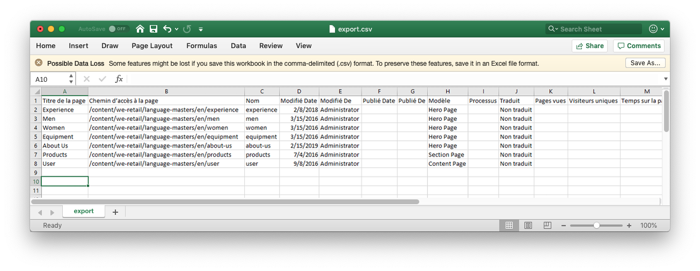
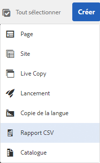
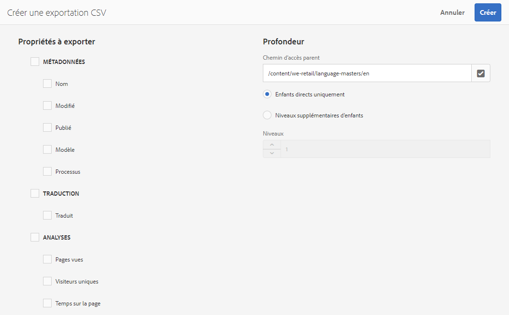

# Exporter au format CSV  {#export-to-csv}

L’option **Créer une exportation CSV** vous permet d’exporter les informations relatives à vos pages vers un fichier CSV situé sur votre système local.

* Le fichier téléchargé est nommé `export.csv`.
* Le contenu dépend des propriétés que vous sélectionnez.
* Vous pouvez définir le chemin, ainsi que la profondeur de l’exportation.

>[!NOTE]
>
>La fonction de téléchargement et la destination par défaut du navigateur sont utilisées.

L’assistant **Créer une exportation CSV** vous permet de sélectionner les éléments suivants :

* Propriétés à exporter
   * Métadonnées  
      * Nom
      * Modifié
      * Publié
      * Template (Modèle)
      * Workflow
   * Traduction
      * Traduit
   * Analyse
      * Pages vues
      * Visiteurs uniques
      * Temps sur la page
* Profondeur
   * Chemin d’accès parent
   * Enfants directs uniquement
   * Niveaux supplémentaires d’enfants
   * Niveaux

Vous pouvez ouvrir le fichier `export.csv` obtenu dans Excel (ou toute autre application compatible).

The create **CSV Report** option is available when browsing the **Sites** console (in List view): it is an option of the **Create** drop down menu:

Pour créer une exportation CSV :

1. Ouvrez la console **Sites**, puis, le cas échéant, accédez à l’emplacement requis.
1. Dans la barre d’outils, sélectionnez **Créer** puis **Rapport CSV** pour ouvrir l’assistant :

   

1. Sélectionnez les propriétés requises à exporter.
1. Sélectionnez **Créer**.
