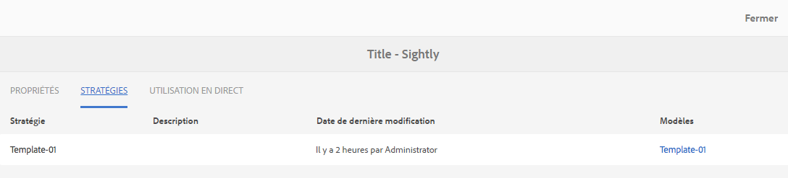

# Console des composants{#components-console}

La console des composants vous permet de parcourir tous les composants définis pour votre instance et d’afficher les informations clés pour chacun d’eux.

Vous pouvez y accéder depuis **Outils >** **Général** > **Composants**. Dans la console, les vues Carte et Liste sont disponibles. Comme il n’existe pas de structure d’arborescence pour les composants, le mode Colonnes n’est pas disponible.

>[!NOTE]
>
>La console des composants affiche tous les composants du système. L’[Explorateur de composants](/help/sites-authoring/author-environment-tools.md#components-browser) affiche les composants qui sont disponibles pour les auteurs et masque tous les groupes de composants qui commencent par un point (`.`).

## Rechercher {#searching}

Avec l’icône **Contenu uniquement** (en haut à gauche), vous pouvez ouvrir le panneau de **recherche** pour rechercher et/ou filtrer les composants :

### Détails des composants {#component-details}

Pour afficher des détails sur un composant spécifique, cliquez sur la ressource requise. Trois onglets sont proposés :

* **Propriétés**

  

  L’onglet Propriétés vous permet d’effectuer les opérations suivantes :

   * Afficher les propriétés générales du composant.
   * Observez comment l’[icône ou l’abréviation a été définie](/help/sites-developing/components-basics.md#component-icon-in-touch-ui) pour le composant.

      * Cliquez sur la source de l’icône pour accéder à ce composant.

   * Affichez le **type de ressource** et le **super type de ressource** (si défini) pour le composant.

      * Cliquez sur le super type de ressource pour accéder à ce composant.

  >[!NOTE]
  >
  >Étant donné que les `/apps` ne sont pas modifiables à l’exécution, la console Composants est en lecture seule.

* **Politiques**

  

* **Utilisation en direct**

  

  >[!CAUTION]
  >
  >En raison de la nature des informations collectées pour cette vue, la collecte/l’affichage de ces informations peut nécessiter un certain temps.

* **Documentation**

  Si le développeur ou la développeuse a fourni la [documentation du composant](/help/sites-developing/developing-components.md#documenting-your-component), elle apparaîtra dans l’onglet **Documentation**. Si aucune documentation n’est disponible, l’onglet **Documentation** n’est pas affiché.

  
