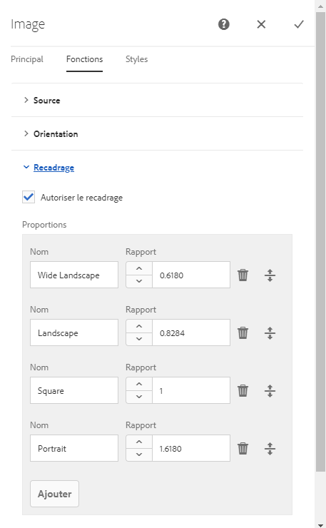

# Configuration de composants en mode de conception{#configuring-components-in-design-mode}

Lors de l’installation standard d’une instance AEM, plusieurs composants sont immédiatement disponibles dans l’explorateur de composants.

In addition to these, various other components are also available. You can use Design mode to [enable/disable such components](#enable-disable-components). When enabled and located on your page you can then use Design mode to [configure aspects of the component design](#configuring-the-design-of-a-component) by editing the attribute parameters.

>[!NOTE]
>
>Il convient de faire attention lors de la modification de ces composants. Les paramètres de conception font souvent partie intégrante du site web. Ils ne doivent donc être modifiés que par une personne disposant des privilèges et de l’expérience appropriés, généralement un administrateur ou un développeur. Pour plus d’informations, voir [Développement de composants](/help/sites-developing/components.md).

>[!NOTE]
>
>Le mode de conception est uniquement disponible pour les modèles statiques. Les modèles créés avec des modèles modifiables doivent être modifiés à l’aide de l’[éditeur de modèles](/help/sites-authoring/templates.md).

>[!NOTE]
>
>Le mode de conception est uniquement disponible pour les configurations de conception stockées en tant que contenu sous ( `/etc`).
>
>Starting in AEM 6.4, it is recommended to store designs as configuration data under `/apps` to support continuous deployment scenarios. Designs stored under `/apps` are not editable at runtime and the Design mode will not be available to non-admin users for such templates.

Pour ce faire, vous devrez ajouter ou supprimer les composants autorisés dans le système de paragraphes de la page. Le système de paragraphes (`parsys`) est un composant composite qui contient tous les autres composants de paragraphes. Il permet aux auteurs d’ajouter des composants de différents types à une page, car il contient tous les autres composants de paragraphes. Chaque type de paragraphe est représenté en tant que composant.

Par exemple, le contenu d’une page des produits peut contenir un système de paragraphes avec les éléments suivants :

* Une image du produit (sous la forme d’une image ou d’un paragraphe « textimage »)
* La description du produit (sous la forme d’un paragraphe de texte)
* Un tableau de données techniques (sous la forme d’un paragraphe de tableau)
* Un formulaire à remplir par les utilisateurs (sous la forme d’un paragraphe de début de formulaire, d’élément de formulaire et de fin de formulaire)

>[!NOTE]
>
>Reportez-vous aux sections [Développement de composants](/help/sites-developing/components.md) et [Consignes d’utilisation des modèles et des composants](/help/sites-developing/dev-guidelines-bestpractices.md#guidelines-for-using-templates-and-components) pour en savoir plus sur `parsys`.

>[!CAUTION]
>
>La modification de la conception en mode Création, telle que décrite dans cet article, est la méthode recommandée pour définir des conceptions de modèles statiques.
>
>La modification de conceptions dans CRX DE, par exemple, n’est pas recommandée et l’application de ces conceptions risque de provoquer un comportement imprévu. Pour plus d’informations, consultez le document [Modèles de page - Statiques](/help/sites-developing/page-templates-static.md#how-template-designs-are-applied), à l’attention du développeur.

## Activation/désactivation des composants {#enable-disable-components}

Pour activer ou désactiver un composant :

1. Sélectionnez le mode **Conception**.

   

1. Appuyez ou cliquez sur un composant. Lorsqu’il est sélectionné, le composant présente une bordure bleue.

   

1. Click or tap the **Parent** icon.

   

   Cela a pour effet de sélectionner le système de paragraphes contenant le composant actif.

1. L’icône **Configurer** du système de paragraphes s’affiche dans la barre d’outils du parent. 

   

   Sélectionnez cette icône pour afficher la boîte de dialogue.

1. Utilisez la boîte de dialogue pour définir les composants disponibles dans l’explorateur de composants lors de la modification de la page en cours.

   

   La boîte de dialogue comporte deux onglets :

   * Composants autorisés
   * Paramètres

   **Composants autorisés**

   On the **Allowed Components** tab, you define which components are available for the parsys.

   * Les composants sont regroupés en groupes de composants, qui peuvent être développés et réduits.
   * Un groupe entier peut être sélectionné en cochant le nom du groupe, et tous peuvent être désélectionnés en décochant la case.
   * Le signe moins indique qu’au moins un élément du groupe est sélectionné, mais pas tous.
   * Un champ de recherche est disponible pour filtrer un composant en fonction de son nom.
   * Les chiffres à droite du nom du groupe de composants représentent le nombre total de composants sélectionnés dans ce groupe, quel que soit le filtre.

   La configuration s’effectue par composant de page. Si des pages enfants utilisent le même modèle et/ou composant de page (généralement aligné), la même configuration est appliquée au système de paragraphes correspondant.

   >[!NOTE]
   >
   >Les composants de formulaire adaptatif sont conçus pour fonctionner à l’intérieur du conteneur de formulaires adaptatifs afin de tirer parti de l’écosystème de formulaires. Ils doivent donc uniquement être utilisés dans l’éditeur de formulaires adaptatifs et ne fonctionneront pas dans l’éditeur de pages de sites.

   **Paramètres**

   L’onglet **Paramètres** vous permet de définir des options supplémentaires, par exemple dessiner une ancre pour chaque composant, et de définir la marge intérieure des cellules de chaque conteneur.

1. Sélectionnez **Terminé** pour enregistrer la configuration.

## Configuration de la conception d’un composant {#configuring-the-design-of-a-component}

1. Sélectionnez le mode **Conception**.

   

1. Appuyez ou cliquez sur un composant avec une bordure bleue. Dans cet exemple, un composant d’image à forte identification est sélectionné.

   

1. Utilisez l’icône **Configurer** pour ouvrir la boîte de dialogue.

   

   Dans la boîte de dialogue de conception, vous pouvez configurer le composant en fonction des paramètres de conception disponibles.

   

   La boîte de dialogue comporte trois onglets :

   * Principal
   * Fonctionnalités
   * Styles

   **Propriétés**

   L’onglet **Propriétés** vous permet de configurer les paramètres de conception importants du composant. Par exemple, pour un composant Image, vous pouvez définir la taille maximale et minimale de l’image autorisée.

   **Fonctionnalités**

   L’onglet **Fonctions** vous permet d’activer ou de désactiver des fonctions supplémentaires pour le composant. Par exemple, pour un composant Image, vous pouvez définir l’orientation de l’image, les options de recadrage disponibles, et si une image peut être téléchargée.

   **Styles**

   Dans l’onglet **Styles**, vous pouvez définir les styles et les classes CSS à utiliser avec le composant.

   

   Utilisez le bouton **Ajouter** pour ajouter des entrées supplémentaires à la liste de dialogue à entrées multiples.

   

   Utilisez l&#39;icône ** Supprimer **pour supprimer une entrée d&#39;une liste de dialogue à entrées multiples.

   

   Utilisez l’icône **Déplacer** pour réorganiser l’ordre des entrées dans une liste de dialogue à entrées multiples.

   

1. Appuyez ou cliquez sur l’icône **Terminé** pour enregistrer et fermer la boîte de dialogue.

