# Composants de base {#foundation-components}

>[!CAUTION]
>
>La plupart des composants de base sont désormais obsolètes avec AEM 6.5. Pour plus d&#39;informations, consultez les [notes de mise à jour](/help/release-notes/deprecated-removed-features.md).
>
>Adobe recommande l’utilisation des ](https://docs.adobe.com/content/help/fr-FR/experience-manager-core-components/using/introduction.html)composants principaux[ plus modernes et extensibles dans les projets AEM. Ils font partie de l&#39;exemple de contenu [We.Retail](/help/sites-developing/we-retail.md) et peuvent également être [installés séparément et utilisés pour le développement](https://docs.adobe.com/content/help/fr-FR/experience-manager-core-components/using/get-started/using.html) par votre administrateur.
>
>Vous pouvez utiliser [AEM Moderniser la suite d&#39;outils](https://opensource.adobe.com/aem-modernize-tools/) pour refaçonner votre site basé sur les composants de base afin d&#39;utiliser les composants de base.

Les composants de base ont été conçus pour être utilisés lors de la création de contenu d’une page web standard. Ils forment un sous-ensemble des composants disponibles « prêts à l’emploi » pour une installation AEM standard.

Certains sont immédiatement disponibles par le biais du navigateur de composants, d&#39;autres sont également disponibles en utilisant [mode de conception](/help/sites-authoring/default-components-designmode.md) (si la page est basée sur un modèle statique) ou en modifiant [le modèle](/help/sites-authoring/templates.md) (si la page est basée sur un modèle modifiable).

L’utilisation de composants de base est prise en charge, mais elle est pratiquement obsolète et désormais remplacée par des composants principaux offrant davantage d’évolutivité et de flexibilité.

>[!NOTE]
>
>Cette section ne traite que des composants disponibles « prêts à l’emploi » dans une installation AEM standard.
>
>En fonction de votre instance, vous disposez peut-être de composants personnalisés développés explicitement pour vos besoins. Ces composants peuvent même avoir le même nom que certains composants traités ici.

Les composants sont disponibles dans l’onglet **Composants** du panneau latéral de l’éditeur de page lors de la [modification d’une page](/help/sites-authoring/editing-content.md).

Vous pouvez sélectionner un composant et le faire glisser jusqu’à l’emplacement de votre choix sur la page. Vous pouvez ensuite le modifier à l’aide des options suivantes :

* [Configurer les propriétés](/help/sites-authoring/editing-page-properties.md)
* [Modifier le contenu](/help/sites-authoring/editing-content.md)

* [Modifier le contenu - Mode plein écran](/help/sites-authoring/editing-content.md#edit-content-full-screen-mode)

Les composants sont regroupés dans diverses catégories appelées groupes de composants, notamment :

* [Général](#general) : comprend des composants de base, y compris du texte, des images, des tableaux et des graphiques.
* [Colonnes](#columns) : comprend les composants nécessaires à la mise en page du contenu.
* [Formulaire](#formgroup) : comprend tous les composants nécessaires pour créer un formulaire.

## Général {#general}

Les composants de type Général sont des composants de base qui servent à créer du contenu.

### Élément de compte {#account-item}

>[!CAUTION]
>
>Ce composant de base est obsolète. Adobe recommande plutôt l’utilisation des composants principaux[.](https://docs.adobe.com/content/help/en/experience-manager-core-components/using/introduction.html)

Vous pouvez définir un lien avec un titre et une description.


### Image adaptative {#adaptive-image}

>[!CAUTION]
>
>Ce composant de base est obsolète. Adobe recommande plutôt l’utilisation du [composant principal Image](https://docs.adobe.com/content/help/fr-FR/experience-manager-core-components/using/components/image.html).

Le composant d’image adaptative génère des images dimensionnées en fonction de la fenêtre dans laquelle s’ouvre la page web. Pour utiliser le composant, vous devez fournir une image issue du système de fichiers ou du gestionnaire des actifs numériques. Si la page web s’ouvre, le navigateur web télécharge une copie de l’image qui a été redimensionnée, afin qu’elle s’adapte à la fenêtre active.

Les caractéristiques suivantes permettent de déterminer la taille de la fenêtre :

* Écran du périphérique : les appareils mobiles affichent généralement les pages web sur la totalité de l’écran.
* Taille de la fenêtre du navigateur web : les utilisateurs d’ordinateurs de bureau et portables peuvent redimensionner les fenêtres du navigateur web.

Par exemple, le composant génère une petite image lorsque la page web s’ouvre sur un téléphone mobile et une image de taille moyenne sur une tablette. Sur un ordinateur portable, le composant génère une grande image lorsque la page s’ouvre dans un navigateur plein écran. Si la taille du navigateur est réduite, le composant s’adapte en générant une image plus petite avant d’actualiser la vue.

#### Formats d’image pris en charge {#supported-image-formats}

Utilisez les fichiers image avec les extensions suivantes dans le composant d’image adaptative :

* .jpg
* .jpeg
* .png
* .gif **

>[!CAUTION]
>
>Les fichiers GIF animés ne sont pas pris en charge dans AEM pour les rendus adaptatifs.

#### Tailles et qualité d’images {#images-sizes-and-quality}

Le tableau suivant répertorie la largeur de l’image générée en fonction de la largeur de la fenêtre d’affichage. La hauteur de l’image générée est calculée pour préserver le rapport L/H et éviter l’apparition de bandes blanches sur les bords de l’image. Il se peut aussi que l’image soit recadrée.

Si l’image est au format JPEG, sa qualité peut aussi dépendre de la taille de la fenêtre d’affichage, comme suit :

* Faible (0,42)
* Moyenne (0,82)
* Elevée (1)

| **Plage de largeurs de la fenêtre d’affichage (pixels)** | **Largeur de l’image (pixels)** | **Qualité JPEG** | **Type de périphérique ciblé** |
|---|---|---|---|
| largeur &lt;= 319 | 320 | faible |  |
| largeur = 320 | 320 | moyenne | Téléphone portable (portrait) |
| 320 &lt; largeur &lt; 481 | 480 | moyenne | Téléphone portable (paysage) |
| 480 &lt; largeur &lt; 769 | 476 | élevée | Tablette (portrait) |
| 768 &lt; largeur &lt; 1 025 | 620 | élevée | Tablette (paysage) |
| largeur &lt;= 1025 | pleine taille (taille d’origine) | élevée | Bureau |

#### Propriétés {#properties}

La boîte de dialogue permet de modifier les propriétés pour votre instance du composant Image adaptative. Parmi ces propriétés, nombreuses sont celles qui sont communes au composant d’image sur lequel il est basé. Les propriétés sont disponibles dans deux onglets :

* **Image**

   * **Image**
Faites glisser une image à partir de l’outil de recherche de contenu ou cliquez pour ouvrir une fenêtre de recherche dans laquelle vous pouvez charger une image. Ensuite, vous pouvez la recadrer, la faire pivoter ou la supprimer. Pour effectuer un zoom avant ou arrière sur l’image, utilisez le curseur situé sous l’image (au-dessus des boutons OK et Annuler).

   * **Recadrer**
Recadrez une image en faisant glisser ses bords.

   * **Rotation**
Cliquez plusieurs fois sur Rotation pour faire pivoter l’image dans la position souhaitée.

   * **Effacer**
Permet de supprimer l’image actuelle.

* **Avancé**

   * **Titre**
Le composant Image adaptative n’utilise pas cette propriété.

   * **Texte de remplacement**
Texte secondaire à utiliser pour l’image.

   * **Lier à**
Le composant Image adaptative n’utilise pas cette propriété.

   * **Description**
Le composant Image adaptative n’utilise pas cette propriété.

#### Extension du composant d’image adaptative {#extending-the-adaptive-image-component}

Pour obtenir des informations sur la personnalisation du composant Image adaptive, reportez-vous à la section [Présentation du composant Image adaptive](/help/sites-developing/responsive.md#using-adaptive-images).

### Carrousel {#carousel}

>[!CAUTION]
>
>Ce composant de base est obsolète. Adobe recommande plutôt l’utilisation du [composant principal Carrousel](https://docs.adobe.com/content/help/fr-FR/experience-manager-core-components/using/components/carousel.html).

Le composant Carrousel permet d’afficher les images associées à des pages individuelles :

* une à la fois ;
* pour une courte période ;
* dans l’ordre que vous spécifiez ;
* avec un délai que vous spécifiez.

Des contrôles « cliquables » permettent également à l’utilisateur de parcourir les pages affichées en temps réel, à la demande. Cliquer sur l’image de page actuellement visible vous permet d’accéder à cette page. C’est-à-dire que le carrousel agit comme une commande de navigation.

#### Propriétés {#properties-1}

Ces propriétés sont disponibles dans deux onglets :

* **Carrousel**
Vous spécifiez ici la manière dont le carrousel fonctionne :

   * Vitesse de lecture
Le temps en millisecondes avant l’affichage de la diapositive suivante.
   * Temps de transition
Le temps en millisecondes de transition entre deux diapositives.
   * Type des commandes
Diverses options sont disponibles dans un menu déroulant ; par exemple, les boutons Précédent/Suivant ou les commutateurs haut-droit.

* **Liste**

   Vous indiquez ici comment les pages sont incluses dans votre carrousel :

   * **Construire la liste avec**
Il existe plusieurs manières de construire une liste de pages : Pages enfants, Liste fixe, Recherche ou Recherche avancée (toutes décrites ci-dessous).
Quelle que soit la méthode employée, chacune des pages que vous ajoutez à la liste doit déjà comporter une image qui lui est associée, car c’est cette image qui s’affiche dans le carrousel. Si une page donnée ne comporte pas d’image sous ses propriétés de page, vous devez associer une image à la page avant de commencer, sinon le carrousel affiche une page vide (ou presque vide). Voir [Modification des propriétés de page](/help/sites-authoring/editing-page-properties.md).
Selon l’élément que vous choisissez, un nouveau panneau s’affiche :

      * **Options des pages enfants**

         * **Page parente**
Spécifiez un chemin d’accès manuellement ou à l’aide du sélecteur. Laissez vide pour utiliser la page actuelle comme page parente.
      * **Options de la liste fixe**

         * ****
PagesSélectionnez une liste de pages. Utiliser 
`+` pour ajouter d’autres entrées et les boutons Haut/Bas pour modifier l’ordre.
      * **Options de recherche**

         * **Démarrer dans** Spécifiez un chemin de départ manuellement ou à l’aide du sélecteur.

         * **Requête de recherche** Entrez une requête de recherche en texte brut.
      * **Options de la recherche avancée**

         * **Notation des prédicats de Query Builder** Entrez une requête de recherche à l’aide de la notation des prédicats de Query Builder. Par exemple, entrez « fulltext=Marketing » pour afficher dans le carrousel toutes les pages comportant le terme « Marketing » dans leur contenu.
Voir [API QueryBuilder](/help/sites-developing/querybuilder-api.md) pour consulter une discussion complète sur les expressions de requête et d’autres exemples.
   * **Ordre**
par sélection 
`jcr:title`,  `jcr:created`,  `cq:lastModified` ou  `cq:template` à partir du menu déroulant.

   * **Limite**
Nombre maximal d’éléments que vous souhaitez utiliser dans le carrousel (facultatif).


>[!NOTE]
>
>Vous pouvez créer un composant de carrousel personnalisé pour Adobe Experience Manager, qui affiche les ressources numériques situées dans le gestionnaire des actifs numériques AEM. Pour plus d’informations, voir [Création de composants de carrousel personnalisés pour Adobe Experience Manager](https://helpx.adobe.com/experience-manager/using/custom-carousel-components.html).

### Graphique  {#chart}

>[!CAUTION]
>
>Ce composant de base est obsolète. Adobe recommande plutôt l’utilisation des composants principaux[.](https://docs.adobe.com/content/help/en/experience-manager-core-components/using/introduction.html)

Le composant Graphique permet d’ajouter un histogramme ou un graphique en courbes ou circulaire. AEM crée un graphique à partir des données que vous fournissez en les tapant directement dans l’onglet Données ou en les copiant-collant dans une feuille de calcul.

* **Données**

   * **Données de graphique**
Ajoutez vos données de graphique au format CSV ; une virgule (« , ») est utilisée comme séparateur de valeurs.

* **Avancé**

   * **Type de graphique**
Effectuez un choix parmi les types suivants : Histogramme, Graphique en courbes et Graphique circulaire.

   * **Texte de remplacement**
Texte de remplacement qui s’affiche à la place du graphique.

   * **Largeur**
Largeur du graphique en pixels.

   * **Hauteur**
Hauteur du graphique en pixels.

L’exemple suivant illustre des données de graphique suivies de l’histogramme qui en résulte :

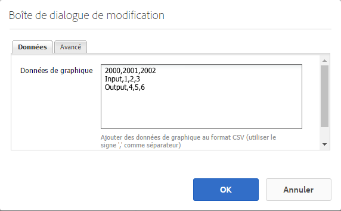 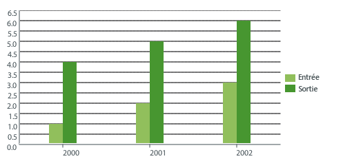

>[!NOTE]
>
>Vous pouvez créer un graphique de référence AEM personnalisé qui présente les données situées dans le référentiel JCR AEM. Pour plus d’informations, voir [Affichage de données Adobe Experience Manager sous forme de graphique](https://helpx.adobe.com/experience-manager/using/displaying-experience-manager-data-chart.html).

### Fragment de contenu {#content-fragment}

>[!CAUTION]
>
>Ce composant de base est obsolète. Adobe recommande plutôt l’utilisation du [composant principal Fragment de contenu](https://docs.adobe.com/content/help/fr-FR/experience-manager-core-components/using/components/content-fragment-component.html).

Des [fragments de contenu](/help/sites-authoring/content-fragments.md) sont créés et gérés sous forme de ressources indépendantes de la page. Vous pouvez ensuite utiliser ces fragments et leurs variantes lors de la création de vos pages de contenu.

### Importateur de conception {#design-importer}

>[!CAUTION]
>
>Ce composant de base est obsolète. Adobe recommande plutôt l’utilisation des composants principaux[.](https://docs.adobe.com/content/help/en/experience-manager-core-components/using/introduction.html)

Cette option permet de transférer un fichier compressé qui contient un bloc de conception.

### Télécharger {#download}

>[!CAUTION]
>
>Ce composant de base est obsolète. Adobe recommande plutôt l’utilisation des composants principaux[.](https://docs.adobe.com/content/help/en/experience-manager-core-components/using/introduction.html)

Le composant Télécharger crée un lien dans la page web sélectionnée pour télécharger un fichier spécifique. Faites glisser un élément à partir de l’Outil de recherche de contenu ou téléchargez un fichier.

* **Télécharger**

   * **Description**
Courte description affichée avec le lien de téléchargement.

   * **Fichier**
Fichier disponible pour être téléchargé sur la page web résultante. Faites glisser un élément à partir de l’Outil de recherche de contenu ou cliquez dans la zone pour charger le fichier à télécharger.

L&#39;exemple suivant montre le composant Télécharger dans Geometrixx :


### Externe {#external}

>[!CAUTION]
>
>Ce composant de base est obsolète. Adobe recommande plutôt l’utilisation des composants principaux[.](https://docs.adobe.com/content/help/en/experience-manager-core-components/using/introduction.html)

Le composant d’intégration d’application externe (**Externe**) permet d’incorporer des applications externes dans une page AEM en utilisant un iframe.

* **Externe**

   * **Cible**
applicationSpécifiez l&#39;URL de l&#39;application Web à intégrer ; par exemple :

      ```
      https://en.wikipedia.org/wiki/Main_Page
      ```

   * **Transmettre les paramètres**
Cochez les cases correspondant aux paramètres à transmettre à l’application, lorsque cela s’avère nécessaire.

   * **Largeur et Hauteur
**Définir la taille de l’iframe

L’application externe est intégrée au système de paragraphes de la page AEM, par exemple, lorsque vous utilisez une application cible de `https://en.wikipedia.org/wiki/Main_Page` :


>[!NOTE]
>
>Selon le cas, d’autres options sont disponibles pour l’intégration d’applications externes, par exemple : l’[Intégration de portlets](/help/sites-administering/aem-as-portal.md).

### Modèle     {#flash}

>[!CAUTION]
>
>Ce composant de base est obsolète. Adobe recommande plutôt l’utilisation des composants principaux[.](https://docs.adobe.com/content/help/en/experience-manager-core-components/using/introduction.html)

>[!CAUTION]
>
>Ce composant ne devrait plus fonctionner de manière prête sans une personnalisation étendue au niveau du projet.

Le composant Flash vous permet de charger une animation Flash. Faites glisser un élément Flash à partir de l’Outil de recherche de contenu ou utilisez la boîte de dialogue :

* **Modèle**

   * **Animation Flash**

      Fichier d’animation Flash. Faites glisser un élément à partir de l’Outil de recherche de contenu ou cliquez pour ouvrir une fenêtre de recherche.

   * **Taille**

      Dimensions en pixels de la zone d’affichage contenant l’animation.

* **Autre image**

   Autre image à afficher

* **Avancé**

   * **Menu contextuel**

      Indique si le menu contextuel doit être affiché ou masqué.

   * **Mode Fenêtre**

      Permet de spécifier comment la fenêtre doit apparaître (opaque, transparente ou comme une fenêtre distincte, par exemple).

   * **Couleur de fond**

      Couleur de fond sélectionnée à partir de la palette de couleurs fournie.

   * **Version minimale**

      Version minimale d’Adobe Flash Player requise pour exécuter l’animation. La valeur par défaut est de 9.0.0.

   * **Attributs**

      Permet de spécifier les autres attributs nécessaires.

### Image {#image}

>[!CAUTION]
>
>Ce composant de base est obsolète. Adobe recommande plutôt l’utilisation du [composant principal Image](https://docs.adobe.com/content/help/en/experience-manager-core-components/using/components/image.html).

Le composant Image affiche une image et le texte qui l’accompagne selon les paramètres définis.

Vous pouvez charger une image, puis la modifier et la manipuler (par exemple, la recadrer, la faire pivoter ou y ajouter un lien/titre/texte).

Vous pouvez faire glisser et déposer une image de l’[explorateur de ressources](/help/sites-authoring/author-environment-tools.md#assets-browser) directement sur le composant ou dans sa [boîte de dialogue de configuration](/help/sites-authoring/editing-content.md#component-edit-dialog). Vous pouvez également télécharger une image à partir de la boîte de dialogue de configuration ; cette boîte de dialogue contrôle également toutes les définitions et la manipulation de l’image :

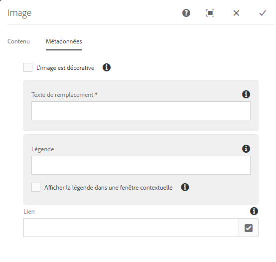

Une fois l’image chargée (et pas avant), utilisez la [modification statique](/help/sites-authoring/editing-content.md#edit-content) pour recadrer/faire pivoter l’image si nécessaire :


>[!NOTE]
>
>L’éditeur statique utilise la taille d’origine et les proportions de l’image lors de la modification. Vous pouvez également spécifier les propriétés de hauteur et de largeur. Les restrictions de taille et de format définies dans les propriétés sont appliquées lorsque vous enregistrez vos modifications.
>
>Selon votre instance, des restrictions minimales et maximales peuvent aussi être imposées par la [conception de la page](/help/sites-developing/designer.md). Ces restrictions sont développées lors de la mise en œuvre du projet.

Différentes autres options sont disponibles en mode Plein écran. Par exemple, Carte et Zoom :


>[!NOTE]
>
>Internet Explorer ne permet pas de surveiller la progression du téléchargement.
>
>Les utilisateurs d’Internet Explorer doivent charger l’image, cliquer sur **OK**, puis rouvrir l’image pour afficher le fichier téléchargé dans l’aperçu et être en mesure d’y apporter des modifications (un recadrage, par exemple).
>
>Voir la section [Plateformes certifiées](/help/release-notes/release-notes.md#certifiedplatforms) pour plus d’informations sur les fonctionnalités HTML5 utilisées par AEM.

Lorsqu’une image est chargée, vous pouvez configurer ce qui suit :

* **Map**

   Pour mapper une image, sélectionnez Zone cliquable. Vous pouvez spécifier comment créer la zone cliquable (rectangle, polygone, etc.) et où la zone doit pointer.

* **Recadrer**

   Sélectionnez Recadrer pour recadrer une image. Utilisez la souris pour effectuer le recadrage.

* **Rotation**

   Pour faire pivoter une image, sélectionnez Pivoter. Utilisez-le à plusieurs reprises jusqu’à ce que l’image soit pivotée comme vous le souhaitez.

* **Effacer**

   Permet de supprimer l’image actuelle.

* **Titre**

   Titre de l’image.

* **Texte de remplacement**

   Texte alternatif à utiliser lors de la création de contenu accessible.

* **Lier à**

   Créez un lien vers des ressources ou d’autres pages de votre site Web.

* **Description**

   Description de l’image.

* **Taille**

   Permet de définir la hauteur et la largeur de l’image.

>[!NOTE]
>
>Certaines options sont uniquement disponibles dans l’éditeur plein écran.

L’image finale (avec **Titre** et **Description**) peut s’afficher comme suit :


### Conteneur de mises en page {#layout-container}

Ce composant fournit un système de paragraphes/grille qui permet d’ajouter et de positionner des composants dans une [grille réactive](/help/sites-authoring/responsive-layout.md). Vous pouvez ainsi définir différentes mises en page de contenu selon la largeur des périphériques cibles (téléphones, tablettes et ordinateurs de bureau, notamment).

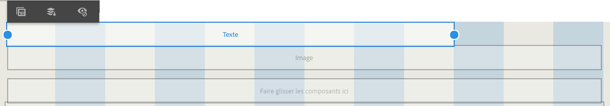

>[!NOTE]
>
>Ce composant a été mis en œuvre avec le [langage de modèle HTML (HTL)](https://docs.adobe.com/content/help/fr-FR/experience-manager-htl/using/overview.html).

### Liste {#list}

>[!CAUTION]
>
>Ce composant de base est obsolète. Adobe recommande plutôt l’utilisation du [composant principal Liste](https://docs.adobe.com/content/help/fr-FR/experience-manager-core-components/using/components/list.html).

Le composant Liste vous permet de configurer des critères de recherche pour afficher une liste :

* **Liste**

   * **Construire la liste avec**

      Vous indiquez ici où la liste doit récupérer son contenu. Il existe plusieurs méthodes :

   * Selon l’élément que vous choisissez, un nouveau panneau s’affiche :

      * **Options des pages enfants**

         * **Enfants de**  (page parente)

            Spécifiez un chemin d’accès manuellement ou à l’aide du sélecteur. Laissez vide pour utiliser la page active comme parent.
      * **Options de la liste fixe**

         * **Pages**

            Sélectionnez une liste de pages. Utilisez + pour ajouter d’autres entrées et les boutons Haut/Bas pour modifier l’ordre.
      * **Options de recherche**

         * Démarrer dans

            Entrez un chemin de départ, manuellement ou à l’aide du sélecteur.

         * Requête de recherche

            Vous pouvez saisir une requête de recherche de texte brut.
      * **Options de la recherche avancée**

         * **Notation des prédicats de Query Builder**

            Vous pouvez entrer une requête de recherche à l’aide de la notation de prédicat Querybuilder. Par exemple, vous pouvez entrer &quot;fulltext=Marketing&quot; pour que toutes les pages contenant &quot;Marketing&quot; s’affichent dans le carrousel.

            Voir [API QueryBuilder](/help/sites-developing/querybuilder-api.md) pour une analyse complète des expressions de requête et d’autres exemples.
      * **Balises**

         Permet de spécifier la **Page parente**, les **Tags / Mots-clés** et les critères de correspondance.
   * **Afficher comme**

      Permet de spécifier comment les éléments doivent être répertoriés (Liens, Teasers et Actualités).

   * **Classer par**

      Permet de spécifier si la liste doit être classée. Si c’est le cas, indique les critères à utiliser pour le tri. Vous pouvez entrer un critère ou en sélectionner un dans la liste déroulante fournie.

   * **Limite**

      Permet de spécifier le nombre maximal d’éléments à afficher dans la liste.

   * **Activer le flux**

      Indique si un flux RSS doit être activé pour la liste.

   * **Paginer après**

      Vous pouvez indiquer ici le nombre d’éléments de la liste à afficher simultanément. Une liste qui contient un nombre d’éléments supérieur à celui spécifié utilise la pagination pour s’afficher en plusieurs parties.


L’exemple suivant illustre un composant **Liste** affichant une liste de pages enfants. La conception est contrôlée par les définitions CSS personnalisées d’une conception de site.

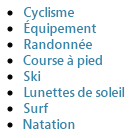

### Connexion {#login}

>[!CAUTION]
>
>Ce composant de base est obsolète. Adobe recommande plutôt l’utilisation des composants principaux[.](https://docs.adobe.com/content/help/en/experience-manager-core-components/using/introduction.html)

>[!CAUTION]
>
>Ce composant ne devrait plus fonctionner de manière prête sans une personnalisation étendue au niveau du projet.

Ces options fournissent les champs de nom d’utilisateur et de mot de passe.

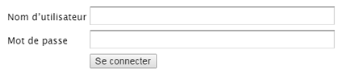

Vous pouvez configurer :

* Se connecter

   * Libellé de section

      Texte de l’entrée pour les champs de saisie.

   * Libellé du nom de l&#39;utilisateur

      Texte permettant d’étiqueter le champ du nom d’utilisateur.

   * Libellé du mot de passe

      Texte permettant d’étiqueter le champ du mot de passe.

   * Libellé du bouton Se connecter

      Texte du bouton de connexion.

   * Rediriger vers

      Vous pouvez spécifier la page de votre site Web qui doit être ouverte une fois que l’utilisateur s’est connecté.

* Déjà connecté

   * Libellé du bouton Continuer

      Texte indiquant que l’utilisateur est déjà connecté.

### État de la commande {#order-status}

>[!CAUTION]
>
>Ce composant ne devrait plus fonctionner de manière prête sans une personnalisation étendue au niveau du projet.

* **Titre**

   * **Titre**

      Indiquez le texte du titre à afficher.

   * **Lien**

      Spécifiez la page (le produit) pour laquelle le statut de la commande doit être affiché.

   * **Type / Taille**

      Effectuez une sélection dans la sélection fournie.


### Référence  {#reference}

>[!CAUTION]
>
>Ce composant de base est obsolète. Adobe recommande plutôt l’utilisation du [composant principal Fragment de contenu](https://docs.adobe.com/content/help/en/experience-manager-core-components/using/components/content-fragment-component.html).

Le composant **Référence** permet de référencer du texte à partir d’une autre page de votre site web AEM (dans l’instance actuelle). Le contenu du paragraphe référencé s’affiche alors comme s’il faisait partie de la page actuelle. Le contenu est mis à jour lorsque le paragraphe source est modifié (peut nécessiter une actualisation de la page).

* **Référence de paragraphe**

   * **Référence**

      Indiquez le chemin d’accès à la page et au paragraphe que vous souhaitez référencer (y compris le contenu).

Pour spécifier le chemin d’accès à un paragraphe, vous devez le suffixer (vers la page) avec :

`.../jcr:content/par/<paragraph-ID>`

Par exemple :

`/content/geometrixx-outdoors/en/equipment/biking/cajamara/jcr:content/par/similar-products`

Outre qu’il référence un paragraphe spécifique, le chemin peut également être modifié pour spécifier un système de paragraphes entier. Pour ce faire, vous pouvez suffixer le chemin avec :

`/jcr:content/par`

Par exemple :

`/content/geometrixx-outdoors/en/equipment/biking/cajamara/jcr:content/par`

Une fois configuré, le contenu s’affiche exactement comme sur la page source. Le fait qu’il s’agisse d’une référence n’apparaît que lorsque vous ouvrez le composant pour le modifier :

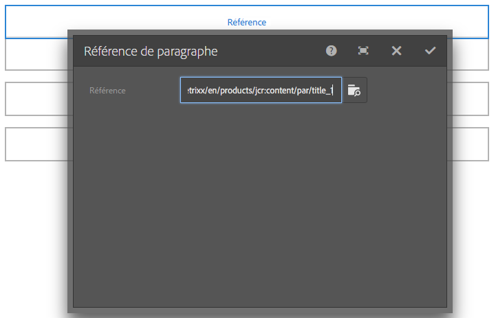

### Recherche {#searching}

>[!CAUTION]
>
>Ce composant de base est obsolète. Adobe recommande plutôt l’utilisation du [composant principal Recherche rapide](https://docs.adobe.com/content/help/fr/experience-manager-core-components/using/components/quick-search.html).

Le composant Rechercher offre des capacités de recherche à votre page.

Vous pouvez configurer :

* Rechercher

   * **Types de nœuds**

      Si la recherche doit être limitée à un type de noeud spécifique, faites-le ici ; par exemple, `cq:Page`.

   * **Chemin d’accès de la recherche**

      Indiquez la page racine de la branche que vous souhaitez rechercher.

   * **Texte du bouton de recherche**

      Nom affiché sur le bouton de recherche actuel.

   * **Texte des statistiques**

      Texte affiché au-dessus des résultats de la recherche.

   * **Texte Aucun résultat**

      Si la recherche ne renvoie aucun résultat, le texte entré ici est affiché.

   * **Vérifier l’orthographe du texte**

      Si une personne saisit un terme similaire, ce texte est affiché devant le terme.
Par exemple, si vous tapez geometrixx, le système affiche &quot;Voulez-vous dire ? geometrixx&quot;.

   * **Texte Pages similaires**

      Texte affiché à côté d’un résultat pour des pages similaires. Cliquez sur ce lien pour afficher les pages dont le contenu est similaire.

   * **Texte Recherches connexes**

      Texte affiché à côté des recherches de termes et sujets associés.

   * **Texte Tendances des recherches**

      Titre situé au-dessus des termes de recherche saisis par les utilisateurs.

   * **Libellé Pages de résultats**

      Texte qui apparaît en bas de cette liste avec des liens vers d’autres pages de résultats.

   * **Libellé Précédent**

      Nom qui apparaît sur le lien vers les pages de recherche précédentes.

   * **Libellé Suivant**

      Nom qui apparaît sur le lien vers les pages de recherche suivantes.

L’exemple ci-dessous montre le composant Recherche après une recherche du mot *geometrixx* dans le répertoire racine d’une installation standard. Il présente également la pagination des résultats :

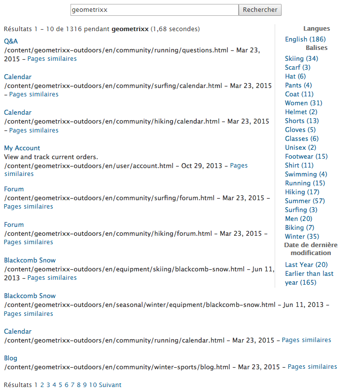

L&#39;exemple suivant montre un terme de recherche mal orthographié et non disponible :

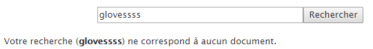

### Plan du site {#sitemap}

>[!CAUTION]
>
>Ce composant de base est obsolète. Adobe recommande plutôt de tirer parti des [composants de base de la navigation](https://docs.adobe.com/content/help/fr/experience-manager-core-components/using/components/navigation.html), [navigation linguistique](https://docs.adobe.com/content/help/fr/experience-manager-core-components/using/components/language-navigation.html) et [chemin de navigation](https://docs.adobe.com/content/help/fr/experience-manager-core-components/using/components/breadcrumb.html).

Liste automatique du plan du site qui (avec les paramètres par défaut) répertorie toutes les pages (sous forme de liens actifs) du site web actuel. Par exemple (extrait) :

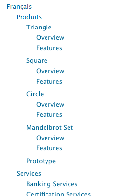

Si nécessaire, vous pouvez configurer l’option suivante :

* **Plan du site**

   * **Chemin racine**

      Chemin à partir duquel la liste doit commencer.

### Slideshow  {#slideshow}

>[!CAUTION]
>
>Ce composant de base est obsolète. Adobe recommande plutôt l’utilisation du [composant principal Carrousel](https://experienceleague.adobe.com/docs/experience-manager-core-components/using/components/carousel.html).

>[!CAUTION]
>
>Ce composant ne devrait plus fonctionner de manière prête sans une personnalisation étendue au niveau du projet.

Ce composant vous permet de charger une série d’images à afficher sous forme de diaporama dans la page. Vous pouvez ajouter ou supprimer des images et leur attribuer un titre. Sous l’onglet Avancé, vous pouvez également spécifier la taille de la zone d’affichage.

Vous pouvez configurer :

* **Diapositives**

   * **Nouvelle diapositive**

      Vous pouvez spécifier une sélection de diapositives à l’aide des boutons **Ajouter** (et **Supprimer**).

   * **Titre**

      Indiquez un titre si nécessaire. Il est superposé sur la diapositive appropriée.

* **Avancé**

   * **Taille**

      Spécifiez la largeur et la hauteur en pixels.

Le composant Diaporama affiche ensuite de façon répétée chaque image en séquence pendant une courte durée, avant de passer en fondu à la diapositive suivante :


### Tableau {#table}

>[!CAUTION]
>
>Ce composant de base est obsolète. Adobe recommande plutôt l’utilisation du [composant principal Texte](https://docs.adobe.com/content/help/fr-FR/experience-manager-core-components/using/components/text.html).

>[!NOTE]
>
>Le composant de base **Tableau** repose sur l’[éditeur de texte enrichi](/help/sites-authoring/rich-text-editor.md), tout comme le composant **[Texte](#text)**.

Le composant **Tableau** est préconfiguré pour vous permettre de construire, remplir et formater un tableau. Dans la boîte de dialogue, vous pouvez configurer le tableau et créer le contenu comme suit :

* de bout en bout ; ou
* en copiant-collant une feuille de calcul ou un tableau à partir d’un éditeur externe (Excel, OpenOffice, Bloc-notes, etc.).

Vous pouvez apporter des modifications standard au contenu à l’aide de l’Éditeur intégré :


En mode Plein écran, vous pouvez configurer la disposition du tableau :


La capture d’écran ci-après illustre l’utilisation du composant Tableau (la conception est déterminée par le CSS propre au site) :


### Nuage de tags {#tag-cloud}

Un nuage de tags (balises) présente une sélection graphique de balises appliquées au contenu dans votre site web :


Lorsque vous configurez le composant Nuage de tags, vous pouvez spécifier les options suivantes :

* **Balises à afficher**

   Emplacement à partir duquel les balises à afficher sont rassemblées. Sélectionnez une page, une page contenant tous les enfants ou toutes les balises.

* **Page**

   Sélectionnez la page à référencer.

* **Aucun lien sur les balises**

   Permet de spécifier si les balises affichées doivent se comporter comme des liens.

Pour plus d’informations sur l’application de balises, consultez la rubrique [Utilisation des balises](/help/sites-authoring/tags.md).

### Texte {#text}

>[!CAUTION]
>
>Ce composant de base est obsolète. Adobe recommande plutôt l’utilisation du [composant principal Texte](https://docs.adobe.com/content/help/en/experience-manager-core-components/using/components/text.html).

>[!NOTE]
>
>Le composant de base **Texte** repose sur l’[éditeur de texte enrichi](/help/sites-authoring/rich-text-editor.md), tout comme le composant de base **Tableau**.

Le composant Texte vous permet de saisir un bloc de texte à l’aide d’un éditeur WYSIWYG, avec une fonctionnalité fournie par l’[éditeur de texte enrichi](/help/sites-authoring/rich-text-editor.md). Une série d’icônes vous permettent de mettre le texte en forme (police, alignement, liens, listes et retrait).


Lorsque vous ouvrez la boîte de dialogue **Configurer**, vous pouvez également définir :

* **Espacement**
* **Style de texte**

Le texte mis en forme s’affiche alors sur la page ; la conception réelle dépend du CSS du site :


Pour plus d’informations sur le composant Texte et les fonctions de l’éditeur de texte enrichi, reportez-vous à la page [Éditeur de texte enrichi](/help/sites-authoring/rich-text-editor.md).

#### Édition statique {#inplace-editing}

Outre le mode d’édition de texte enrichi basé sur la boîte de dialogue, AEM propose un mode d’[édition statique](/help/sites-authoring/editing-content.md) qui permet l’édition directe du texte tel qu’il est affiché dans la mise en page.

### Texte et Image {#text-image}

>[!CAUTION]
>
>Ce composant de base est obsolète. Adobe recommande plutôt l’utilisation du composant principal [Image](https://docs.adobe.com/content/help/en/experience-manager-core-components/using/components/image.html) et [texte](https://docs.adobe.com/content/help/en/experience-manager-core-components/using/components/text.html).

Le composant Texte et image permet d’ajouter un bloc de texte et une image. Vous pouvez également ajouter et modifier du texte et des images séparément. Pour plus d’informations, reportez-vous aux composants [Texte](#text) et [Image](#image).

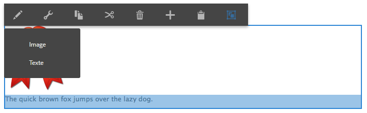

Vous pouvez configurer :

* **Styles**  de composant (**styles**)

   Vous pouvez ici aligner l’image à droite ou à gauche. Le paramètre par défaut est aligné à **Gauche**, avec l’image à gauche.

* **Propriétés**  de l’image (Propriétés **de l’image** avancée)

   Sous cet onglet, vous pouvez spécifier les paramètres suivants :

   * **Ressource image**

      Téléchargez l’image requise.

   * **Titre**

      Titre du bloc de texte. Il s’affiche lorsque l’utilisateur pointe dessus avec la souris.

   * **Texte de remplacement**

      Texte de remplacement à afficher lorsque l’image ne peut pas être affichée. Si vous laissez ce champ vide, le titre est utilisé.

   * **Lier à**

      Spécifiez un chemin de cible.

   * **Description**

      Description de l’image.

   * **Taille**

      Permet de définir la hauteur et la largeur de l’image.

L’exemple suivant illustre un composant Texte et image avec l’image alignée sur la gauche :


### Titre {#title}

>[!CAUTION]
>
>Ce composant de base est obsolète. Adobe recommande plutôt l’utilisation du composant principal [Titre](https://docs.adobe.com/content/help/en/experience-manager-core-components/using/components/list.html).

Le composant Titre permet d’afficher les éléments suivants :

* le nom de la page actuelle (lorsque le champ Titre est vide) ;
* le texte spécifié dans le champ Titre.

Vous pouvez configurer :

* **Titre**

   Si vous voulez utiliser un nom différent du titre de la page, saisissez-le ici.

* **Lien**

   URI si le titre doit se comporter comme un lien.

* **Type / Taille**

   Sélectionnez Petit ou Grand dans la liste déroulante. L’option Petit génère le titre en tant qu’image. L’option Grand génère le titre en tant que texte.

L’exemple suivant montre un composant **Titre** affiché (la conception est déterminée par le CSS propre au site) :


### Vidéo {#video}

>[!CAUTION]
>
>Ce composant de base est obsolète. Adobe recommande plutôt de tirer parti du [composant principal incorporé ](https://experienceleague.adobe.com/docs/experience-manager-core-components/using/components/embed.html).

>[!CAUTION]
>
>Ce composant ne devrait plus fonctionner de manière prête sans une personnalisation étendue au niveau du projet.

Le composant **Vidéo** permet de placer un élément vidéo prédéfini « prêt à l’emploi » sur une page.

Voir également [configurer vos profils vidéo](/help/sites-administering/config-video.md#configuringvideoprofiles) pour une utilisation des profils avec les éléments HTML5.

Une fois une instance du composant placée sur la page, vous pouvez configurer les options suivantes :

* Vidéo

   * **Contenu vidéo**

      Téléchargez ou déposez votre fichier vidéo.

   * **Taille**

      La taille native de la vidéo (largeur x hauteur en pixels) s’affiche dans les cases en regard de la Taille (voir ci-dessus). Saisissez ici manuellement la largeur et la hauteur pour remplacer les dimensions natives de la vidéo. Cliquez sur **OK** pour fermer la boîte de dialogue.

>[!NOTE]
>
>Les formats pris en charge sont les suivants :
>
>* `.mp4`
>* `Ogg`
>* `FLV` (vidéo Flash)


## Columns {#columns}

Les colonnes constituent un mécanisme pour contrôler la disposition du contenu dans AEM. Dans une installation standard, des composants sont fournis pour créer deux et/ou trois colonnes.

L’exemple suivant illustre l’utilisation du composant 2 colonnes. Vous pouvez utiliser des espaces réservés pour les nouveaux composants :

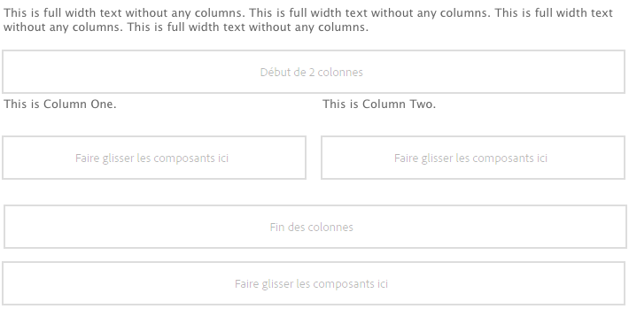

### 2 colonnes {#columns-1}

Composant Contrôle de colonne qui est égal par défaut à 2 colonnes.

### 3 colonnes  {#columns-2}

Composant Contrôle de colonne qui est égal par défaut à 3 colonnes.

### Contrôle de colonne {#column-control}

Le composant Contrôle de colonne permet aux utilisateurs de sélectionner la manière de diviser le contenu dans le panneau principal de la page web en plusieurs colonnes. Les utilisateurs peuvent sélectionner le nombre de colonnes requis (à partir d’une liste prédéfinie), puis créer, supprimer ou déplacer le contenu dans chacune des colonnes.

* **Contrôle de colonne**

   * **Disposition des colonnes**

      Sélectionnez le nombre de colonnes à afficher. Une fois créée, chaque colonne dispose de son propre lien permettant de faire glisser des composants ou des ressources lors de l’ajout de contenu.

## Formulaire {#form}

>[!CAUTION]
>
>Le composant de base est obsolète. Adobe recommande plutôt l’utilisation des composants principaux[.](https://docs.adobe.com/content/help/en/experience-manager-core-components/using/introduction.html)

Les composants Formulaire servent à créer des formulaires permettant aux visiteurs d’envoyer leur saisie. Les formulaires et leurs composants peuvent être utilisés pour recueillir diverses informations, dont les commentaires d’un utilisateur (un questionnaire de satisfaction client, par exemple) et des informations le concernant (un enregistrement d’utilisateur, par exemple).

>[!NOTE]
>
>Pour plus d’informations sur les formulaires AEM, reportez-vous à la section [Aide – AEM Forms](/help/forms/home.md).

Les formulaires sont constitués de plusieurs composants différents :

* **Formulaire**

   Le composant Formulaire définit le début et la fin d’un nouveau formulaire dans la page. D’autres composants peuvent être placés entre ces éléments comme des tableaux, des téléchargements, etc.

* **Champs et éléments de formulaire**

   Les champs et éléments de formulaire comprennent par exemple les zones de texte, les cases d’option, les images, etc. L’utilisateur exécute souvent une action dans un champ de formulaire (saisie de texte, par exemple). Pour plus d’informations, reportez-vous à chaque élément de formulaire.

* **Composants Profil**

   Les composants Profil sont associés aux profils des visiteurs utilisés pour la collaboration sociale et pour tout autre domaine où la personnalisation des visiteurs est requise.

Vous trouverez ci-dessous un exemple de formulaire constitué du composant **Formulaire** (début et fin) avec deux champs de **texte****de formulaire** pour la saisie et un champ de **texte** **général** pour le texte d’introduction, ainsi qu’un bouton **Envoyer**.

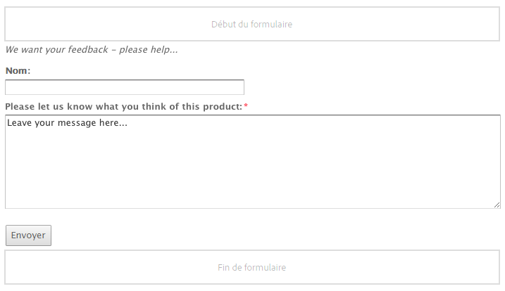

>[!NOTE]
>
>Vous trouverez des informations sur le développement et la personnalisation des formulaires à la [page de développement de formulaires](/help/sites-developing/developing-forms.md). Ces informations concernent l’ajout d’actions, de contraintes, le préchargement de champs et l’utilisation de scripts pour lancer un appel à l’action par un service, entre autres.

### Paramètres communs à (de nombreux) composants de formulaire {#settings-common-to-many-form-components}

Bien que chaque composant de formulaire ait une finalité différente, nombre d’entre eux comportent des options et des paramètres semblables.

Les onglets suivants sont disponibles dans la boîte de dialogue lors de la configuration d’un composant de formulaire :

* **Titre et texte**

   Cet onglet vous invite à renseigner des informations de base, telles que le titre du formulaire et tout texte d’accompagnement. Le cas échéant, il vous permet également de définir d’autres informations essentielles ; par exemple, s’il s’agit d’un champ à sélection multiple ou les différents éléments pouvant être sélectionnés.

* **Valeurs initiales**

   Cet onglet vous permet d’indiquer une valeur par défaut.

* **Contraintes**

   Cet onglet vous permet d’indiquer si un champ est obligatoire et les contraintes qui lui sont appliquées (doit être numérique, par exemple).

* **Style**

   Indique la taille et le style des champs.

>[!NOTE]
>
>Les champs affichés varient grandement en fonction du composant individuel.

Ces onglets vous fournissent les paramètres nécessaires ; ceux-ci peuvent dépendre du type de composant individuel, mais peuvent inclure :

* **Titre et texte**

   * **Nom de l’élément**

      Nom de l’élément de formulaire. Cela indique l’emplacement de stockage des données dans le référentiel.
Il s’agit d’un champ obligatoire qui ne doit contenir que les caractères suivants :

      * Caractères alphanumériques
      * `_ . / : -`
   * **Titre**

      Titre affiché avec le champ. Si rien n’est indiqué, le titre par défaut est affiché.

   * **Description**

      Ce champ vous permet de fournir des informations supplémentaires pour l’utilisateur, si cela s’avère nécessaire. Sur le formulaire, cela est indiqué sous le champ, dans une police plus petite que celle du titre.

   * **Afficher/masquer**

      Cette case à cocher détermine les conditions de visibilité du champ.


* **Valeurs initiales**

   * **Valeur par défaut**

      Il s’agit de la valeur affichée dans le champ à l’ouverture du formulaire ; c’est-à-dire, avant que l’utilisateur n’ait saisi la moindre donnée.

* **Contraintes**

   * **Requis**

      Il dépend du type de composant de formulaire, mais fournit une ou plusieurs zones de clic pour indiquer que ce champ, ou certaines parties de ce champ, est/sont requis.

   * **Message obligatoire**

      Un message pour informer les utilisateurs que ce champ est requis ; un champ obligatoire sera également marqué avec un astérisque.

   * **Contrainte**

      Les contraintes disponibles pour la sélection dépendent du type de composant de formulaire.

   * **Message de contrainte**

      Message informant les utilisateurs de ce qui est requis.

* **Style**

   * **Taille**

      Dans les lignes et les colonnes.

   * **Largeur**

      En pixels.

   * **CSS.**

### Formulaire (composant)  {#form-component}

>[!CAUTION]
>
>Ce composant de base est obsolète. Adobe recommande plutôt l’utilisation du [composant principal Conteneur de formulaires](https://docs.adobe.com/content/help/fr/experience-manager-core-components/using/components/forms/form-container.html).

Le composant Formulaire définit le début et la fin d’un formulaire à l’aide des éléments **Début du formulaire** et **Fin de formulaire**. Ces deux paragraphes sont toujours utilisés conjointement pour s’assurer que le formulaire est correctement défini.

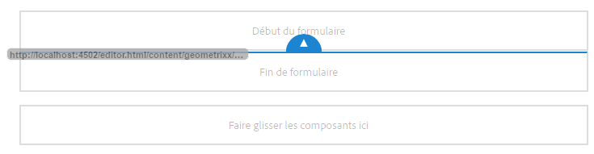

Entre le début et la fin d’un formulaire, vous pouvez ajouter des composants qui définissent les champs de saisie réels à l’intention des utilisateurs.

>[!NOTE]
>
>Le composant de formulaire des composants de base ne prend en charge que l’utilisation d’autres composants de base Formulaire (bouton, texte, masqué, etc.). L’utilisation des composants de formulaire des [composants principaux](https://docs.adobe.com/content/help/en/experience-manager-core-components/using/introduction.html) dans un formulaire de composant de base (et vice versa) n’est pas prise en charge.

#### Début du formulaire {#start-of-form}

Ce composant est nécessaire pour définir le début d’un nouveau formulaire sur la page. Vous pouvez configurer :

* **Formulaire**

   * **Page de remerciement**

      Page à référencer pour remercier les visiteurs pour leur message. Si ce champ est vide, le formulaire s’affiche de nouveau après l’envoi.

   * **Démarrer le processus**

      Détermine quel processus est déclenché une fois le formulaire envoyé.

* **Avancé**

   * **Type d’action**

      Un formulaire requiert une action. L’action définit l’opération déclenchée avec les données soumises par l’utilisateur (semblable à action= en langage HTML). Certains ont besoin d&#39;une **configuration d&#39;action** correspondante.
Une sélection de types d’action est incluse dans une installation AEM standard :

      * **Demande de compte**
      * **Créer le contenu**
      * **Créer une piste**
      * **Créer un compte et le mettre à jour**
      * **Service de messagerie électronique : créer un abonné et l’ajouter à la liste**
      * **Service de messagerie électronique : envoyer un message de répondeur automatique**
      * **Service de messagerie électronique : désabonner l’utilisateur de la liste**
      * **Modifier la communauté**
      * **Modifier la (les) ressource(s)**
      * **Modifier la (les) ressource(s) contrôlée(s) du processus**
      * **Courrier**
      * **Détails de la commande passée**
      * **Mise à jour du profil**
      * **Réinitialiser le mot de passe**
      * **Définir le mot de passe**
      * **Stocker le contenu**

         Il s’agit du type d’action par défaut.

      * **Stocker le contenu avec les chargements**
      * **Envoyer la commande**
      * **Désabonner l’abonné**
      * **Mettre à jour la commande**
   * **L’identifiant de formulaires**

      L’identifiant du formulaire l’identifie de façon unique. Utilisez cet identifiant si plusieurs formulaires figurent sur une seule page ; assurez-vous qu’ils présentent des identifiants différents.

   * **Chemin de chargement**

      Chemin d’accès aux propriétés de noeud utilisé pour charger des valeurs prédéfinies dans les champs de formulaire.

      Il s’agit d’un champ facultatif qui permet de spécifier le chemin à un nœud dans le référentiel. Lorsque ce nœud comporte des propriétés qui correspondent aux noms des champs, les champs adéquats du formulaire sont préchargés avec la valeur de ces propriétés. S’il n’existe aucune correspondance, le champ contient la valeur par défaut.

      Le champ **Chemin de chargement** vous permet de précharger des valeurs dans les champs obligatoires du formulaire. Voir [Préchargement des valeurs de formulaire](/help/sites-developing/developing-forms.md#preloading-form-values).

   * **Validation du client**

      Indique si la validation du client est requise pour ce formulaire (la validation du serveur est *toujours* effectuée). Cela peut être obtenu conjointement avec le composant **Captcha de formulaires**.

   * **Type de ressource de validation**

      Définit le type de ressource de validation si vous souhaitez valider la totalité du formulaire (et non des champs séparés). Si vous validez le formulaire dans son intégralité, vous devez également inclure l’un des éléments suivants :

      * Un script pour la validation du client :

         `/apps/<*myApp*>/form/<*myValidation*>/formclientvalidation.jsp`

      * Un script pour la validation du côté serveur :

         `/apps/<*myApp*>/form/<*myValidation*>/formservervalidation.jsp`
   * **Configuration de l’action**

      Les options disponibles dans **Configuration de l&#39;action** dépendent du **Type d&#39;action** sélectionné :

      * **Demande de compte**

         * **Page Créer un compte**

            Page utilisée lors de la création d’un compte.
      * **Créer le contenu**

         * Content Path (Chemin d’accès au contenu)

            Chemin d’accès à tout type de contenu utilisé par le formulaire. Saisissez un chemin qui se termine par une barre oblique `/`. La barre oblique signifie que, pour chaque port de formulaire, un nouveau nœud est créé à l’emplacement indiqué, par exemple :

            `/forms/feedback/`

         * **Type**

            Sélectionnez le type requis.

         * **Formulaire**

            Spécifiez le formulaire.

         * **Rendu avec**

            Sélectionnez l’option requise dans la liste.

         * **Type de ressource**

            Si cette variable est définie, elle est ajoutée à chaque commentaire sous la forme `sling:resourceType`.

         * **Sélecteur d’affichage**
      * **Créer une piste**

         * **La piste sera ajoutée à cette liste**

            Spécifiez la liste de piste requise.
      * **Créer un compte et le mettre à jour**

         * **Groupe initial**

            Groupe auquel affecter un nouvel utilisateur.

         * **Accueil**

            Page à afficher après une connexion réussie.

         * **Chemin**

            Chemin d’accès (relatif) vers l’emplacement de création et de stockage du nouveau compte.

         * **Afficher des données...**

            Cliquez sur ce bouton pour accéder aux informations sur les résultats de formulaire dans l’éditeur en masse. A partir de là, vous pouvez exporter les informations dans un fichier `.tsv` (séparé par des tabulations) (à utiliser, par exemple, dans une feuille de calcul Excel).
      * **Courrier**

         * **Du**

            Saisissez l’adresse électronique à partir de laquelle le courrier électronique doit être envoyé.

         * **Envoyer à**

            Entrez les adresses du ou des destinataires du formulaire.

         * **CC**

            Entrez les adresses du ou des destinataires en copie (CC).

         * **CCI**

            Entrez les adresses du ou des destinataires en copie carbone invisible (CCI).

         * **Objet**

            Entrez l’objet du courriel.
      * **Réinitialiser le mot de passe**

         * **Page Changer le mot de passe**

            Page utilisée pour modifier le mot de passe.
      * **Stocker le contenu**

         * **Content Path** (Chemin d’accès au contenu)

            Chemin d’accès à tout type de contenu utilisé par le formulaire. Saisissez un chemin qui se termine par une barre oblique `/`. La barre oblique signifie que, pour chaque port de formulaire, un nouveau nœud est créé à l’emplacement indiqué, par exemple :
            `/forms/feedback/`

         * **Afficher des données...**

            Cliquez sur ce bouton pour accéder aux informations sur les résultats de formulaire dans l’éditeur en masse. Vous avez alors la possibilité d’exporter les informations vers un fichier .tsv (séparé par des tabulations) en vue de l’utiliser, par exemple, dans une feuille de calcul Excel).
      * **Stocker le contenu avec les chargements**

         Il existe les mêmes options que **Stocker le contenu**.

      * **Désabonner l’abonné**

         * **La piste sera supprimée de cette liste.**

            Spécifiez la liste de piste requise.


#### Fin de formulaire {#end-of-form}

Ceci marque la fin du formulaire. Vous pouvez configurer les options suivantes :

* **Fin de formulaire**

   * **Afficher le bouton Envoyer**

      Indique si le bouton Envoyer doit être affiché ou non.

   * **Envoyer le nom**

      Identifiant à spécifier si vous utilisez plusieurs boutons Envoyer dans un formulaire.

   * **Envoyer le titre**

      Nom qui apparaît sur le bouton (Envoyer, par exemple).

   * **Afficher le bouton Réinitialiser**

      Cochez la case pour que le bouton Réinitialiser soit visible.

   * **Réinitialiser le titre**

      Nom qui apparaît sur le bouton Réinitialiser.

   * **Description**

      Informations qui s’affichent sous le bouton.

### Nom de compte {#account-name}

>[!CAUTION]
>
>Ce composant de base est obsolète. Adobe recommande plutôt l’utilisation du [composant principal Texte de formulaire](https://docs.adobe.com/content/help/fr/experience-manager-core-components/using/components/forms/form-text.html).

Ce composant permet à l’utilisateur de saisir un nom de compte :


### Adresse {#address}

>[!CAUTION]
>
>Ce composant de base est obsolète. Adobe recommande plutôt l’utilisation du [composant principal Texte de formulaire](https://docs.adobe.com/content/help/en/experience-manager-core-components/using/components/forms/form-text.html).

Ce composant permet d’ajouter une adresse internationale au format suivant :

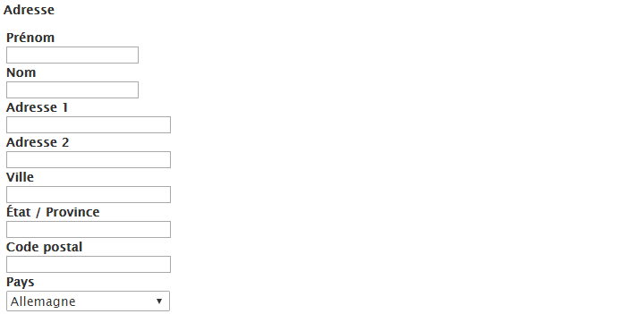

Le composant est configuré pour une utilisation immédiate, mais vous pouvez modifier la configuration le cas échéant, par exemple en ajoutant des contraintes aux éléments individuels de l’adresse. Lorsque les champs sont laissés vides, les valeurs par défaut sont utilisées.

### Captcha  {#captcha}

>[!CAUTION]
>
>Ce composant de base est obsolète. Adobe recommande plutôt l’utilisation des composants principaux[.](https://docs.adobe.com/content/help/en/experience-manager-core-components/using/introduction.html)

>[!CAUTION]
>
>Ce composant ne devrait plus fonctionner de manière prête sans une personnalisation étendue au niveau du projet.

Le composant Captcha requiert que l’utilisateur saisisse une chaîne alphanumérique comme affichée à l’écran. La chaîne est modifiée à chaque actualisation.

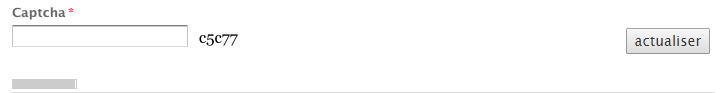

Vous pouvez configurer plusieurs paramètres différents pour ce composant, notamment un message à afficher lorsque la chaîne Captcha n’est pas valide.

### Groupe de cases à cocher  {#checkbox-group}

>[!CAUTION]
>
>Ce composant de base est obsolète. Adobe recommande plutôt l’utilisation du [composant principal Options de formulaire](https://docs.adobe.com/content/help/fr/experience-manager-core-components/using/components/forms/form-options.html).

Une case à cocher vous permet de créer une liste composée d&#39;une ou de plusieurs cases à cocher (plusieurs d&#39;entre elles peuvent être simultanément cochées).


Vous pouvez spécifier divers paramètres y compris un titre, une description et un nom d’élément. À l’aide des boutons + et -, vous pouvez ajouter ou supprimer des éléments, puis les positionner à l’aide des flèches pointant vers le haut ou vers le bas.

>[!NOTE]
>
>L’option **Chemin de chargement des éléments** permet de précharger des valeurs dans la liste de groupes de cases à cocher.
>
>Voir [Préchargement des champs de formulaire avec de multiples valeurs](/help/sites-developing/developing-forms.md#preloading-form-fields-with-multiple-values).

### Détails de la carte de crédit {#credit-card-details}

>[!CAUTION]
>
>Ce composant de base est obsolète. Adobe recommande plutôt l’utilisation des composants principaux[.](https://docs.adobe.com/content/help/en/experience-manager-core-components/using/introduction.html)

Ce composant vous permet de fournir les champs nécessaires pour saisir les informations de carte de crédit. Vous pouvez le configurer pour spécifier les types de cartes acceptés et les informations requises (par exemple, le code de sécurité).


### Liste déroulante {#dropdown-list}

>[!CAUTION]
>
>Ce composant de base est obsolète. Adobe recommande plutôt l’utilisation du [composant principal Options de formulaire](https://docs.adobe.com/content/help/en/experience-manager-core-components/using/components/forms/form-options.html).

Une liste déroulante peut être configurée pour fournir à votre utilisation une plage de valeurs à sélectionner :


Vous pouvez spécifier un titre et des éléments pour qu’ils apparaissent dans la liste. À l’aide des boutons + et -, vous pouvez ajouter ou supprimer des éléments de la liste, puis les positionner à l’aide des flèches pointant vers le haut ou vers le bas. Spécifiez si les utilisateurs sont autorisés à sélectionner plusieurs éléments de la liste, ainsi que tous les éléments qui doivent être automatiquement sélectionnés la première fois qu’ils ouvrent la liste (valeurs initiales).

>[!NOTE]
>
>L’option **Chemin de chargement des éléments** permet de précharger des valeurs dans la liste déroulante.
>
>Voir [Préchargement des champs de formulaire avec de multiples valeurs](/help/sites-developing/developing-forms.md#preloading-form-fields-with-multiple-values).

### Téléchargement du fichier {#file-upload}

>[!CAUTION]
>
>Ce composant de base est obsolète. Adobe recommande plutôt l’utilisation des composants principaux[.](https://docs.adobe.com/content/help/en/experience-manager-core-components/using/introduction.html)

Le composant Chargement du fichier fournit à l&#39;utilisateur un moyen pour sélectionner un fichier et le télécharger.


>[!NOTE]
>
>Vous pouvez créer un composant de chargement personnalisé pour charger les fichiers sur un Sling Servlet. Pour plus d’informations, voir [Transfert de fichiers dans Adobe Experience Manager](https://helpx.adobe.com/experience-manager/using/uploading-files-aem1.html).

### Champ masqué {#hidden-field}

>[!CAUTION]
>
>Ce composant de base est obsolète. Adobe recommande plutôt l’utilisation du [composant principal Masqué du formulaire](https://docs.adobe.com/content/help/fr/experience-manager-core-components/using/components/forms/form-hidden.html).

Ce composant permet de créer un champ masqué. Ceux-ci peuvent être utilisés à diverses fins, par exemple, lorsque vous devez exécuter une action après avoir soumis le formulaire ou lorsque des données masquées sont nécessaires au post-traitement.


>[!NOTE]
>
>Vous pouvez également personnaliser votre formulaire de manière à afficher ou masquer des composants de formulaire spécifiques en fonction de la valeur d’autres champs du formulaire. Changer la visibilité d’un champ de formulaire est utile lorsque le champ est requis uniquement dans certaines conditions.
>
>Voir [Affichage et masquage de composants de formulaire](/help/sites-developing/developing-forms.md#showing-and-hiding-form-components).

### Bouton Image  {#image-button}

>[!CAUTION]
>
>Ce composant de base est obsolète. Adobe recommande plutôt l’utilisation du [composant principal Bouton de formulaire](https://docs.adobe.com/content/help/fr/experience-manager-core-components/using/components/forms/form-button.html).

Un bouton d’image permet de créer un bouton comportant vos texte et image :

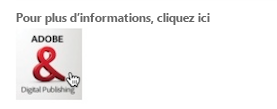

### Téléchargement de l’image {#image-upload}

>[!CAUTION]
>
>Ce composant de base est obsolète. Adobe recommande plutôt l’utilisation des composants principaux[.](https://docs.adobe.com/content/help/en/experience-manager-core-components/using/introduction.html)

Le composant Chargement de l&#39;image fournit à l&#39;utilisateur un moyen pour sélectionner un fichier image et le télécharger.


### Champ du lien {#link-field}

>[!CAUTION]
>
>Ce composant de base est obsolète. Adobe recommande plutôt l’utilisation des composants principaux[.](https://docs.adobe.com/content/help/en/experience-manager-core-components/using/introduction.html)

Le champ Lien permet à l&#39;utilisateur de spécifier une URL.

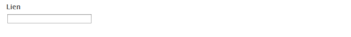

Ce composant est le plus couramment utilisé pour le formulaire d’événement de calendrier où il est employé pour le champ d’URL/de lien d’un événement.

### Champ Mot de passe {#password-field}

>[!CAUTION]
>
>Ce composant de base est obsolète. Adobe recommande plutôt l’utilisation des composants principaux[.](https://docs.adobe.com/content/help/en/experience-manager-core-components/using/introduction.html)

Ce composant permet à l’utilisateur de saisir son mot de passe :


### Réinitialisation du mot de passe {#password-reset}

>[!CAUTION]
>
>Ce composant de base est obsolète. Adobe recommande plutôt l’utilisation des composants principaux[.](https://docs.adobe.com/content/help/en/experience-manager-core-components/using/introduction.html)

Ce composant fournit à l’utilisateur deux champs pour :

* la saisie d’un mot de passe ;
* la nouvelle saisie du mot de passe pour vérifier que la saisie est correcte.

Avec les paramètres par défaut, le composant ressemble à celui-ci :


### Groupe de cases d’option {#radio-group}

>[!CAUTION]
>
>Ce composant de base est obsolète. Adobe recommande plutôt l’utilisation du [composant principal Options de formulaire](https://docs.adobe.com/content/help/en/experience-manager-core-components/using/components/forms/form-options.html).

Un groupe de cases d&#39;option fournit une liste composée d&#39;une ou de plusieurs cases d&#39;option (une seule case peut être sélectionnée à un moment donné).

Spécifiez le nom de l’élément avec un titre et une description. À l’aide des boutons + et -, ajoutez ou supprimez des éléments, placez-les à l’aide des touches Haut et Bas et spécifiez une valeur par défaut, le cas échéant :


>[!NOTE]
>
>L’option **Chemin de chargement des éléments** permet de précharger des valeurs dans les cases d’option.
>
>Voir [Préchargement des champs de formulaire avec de multiples valeurs](/help/sites-developing/developing-forms.md#preloading-form-fields-with-multiple-values).

### Bouton Envoyer {#submit-button}

>[!CAUTION]
>
>Ce composant de base est obsolète. Adobe recommande plutôt l’utilisation du [composant principal Bouton de formulaire](https://docs.adobe.com/content/help/en/experience-manager-core-components/using/components/forms/form-button.html).

Ce composant vous permet de créer un bouton Envoyer avec le texte par défaut :


Ou votre propre texte :


### Champ des balises {#tags-field}

>[!CAUTION]
>
>Ce composant de base est obsolète. Adobe recommande plutôt l’utilisation des composants principaux[.](https://docs.adobe.com/content/help/en/experience-manager-core-components/using/introduction.html)

Ce champ vous permet de sélectionner des balises :

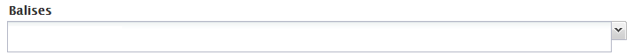

Vous pouvez spécifier plusieurs paramètres, y compris les espaces de noms qui peuvent être utilisés à l’aide d’un onglet spécialisé :

* **Champ de balise**

   * **Espaces de noms autorisés**

      * **Geometrixx Outdoors**
      * **Processus**
      * **Forum**
      * **Photothèque**
      * **Geometrixx Media**
      * **Balises standard**
      * **Marketing**
      * **Propriétés de l’élément**
      * **Largeur en pixels**
      * **Taille de la fenêtre contextuelle**

### Champ de texte {#text-field}

>[!CAUTION]
>
>Ce composant de base est obsolète. Adobe recommande plutôt l’utilisation du [composant principal Texte de formulaire](https://docs.adobe.com/content/help/en/experience-manager-core-components/using/components/forms/form-text.html).

Le champ de texte standard peut être configuré selon la taille et la largeur requises avec votre propre message :


### Bouton(s) d’envoi de flux de travail {#workflow-submit-button-s}

>[!CAUTION]
>
>Ce composant de base est obsolète. Adobe recommande plutôt l’utilisation du [composant principal Bouton de formulaire](https://docs.adobe.com/content/help/en/experience-manager-core-components/using/components/forms/form-button.html).

Permet de créer un bouton Envoyer à utiliser dans un workflow.


