# Modification du contenu de la page{#editing-page-content}

Une fois la page créée (une nouvelle page ou dans le cadre d’un lancement ou d’une Live Copy), vous pouvez modifier le contenu pour effectuer toute mise à jour dont vous avez besoin.

Le contenu est ajouté à l’aide de [composants](/help/sites-authoring/default-components-console.md) (appropriés au type de contenu) que vous pouvez déplacer sur la page. Ils peuvent ensuite être modifiés sur place, déplacés ou supprimés.

>[!NOTE]
>
>Vous devez disposer des [droits d’accès](/help/sites-administering/security.md) et des [autorisations](/help/sites-administering/security.md#permissions) appropriés sur votre compte pour modifier les pages.
>
>En cas de problème, contactez votre administrateur système.

>[!NOTE]
>
>Si votre page et/ou modèle ont été configurés correctement, vous pouvez utiliser la [mise en page réactive](/help/sites-authoring/responsive-layout.md) lors de la modification.

>[!NOTE]
>
>En mode **Édition**, les liens dans votre contenu sont visibles, mais ils ne sont **pas accessibles**. Utilisez le [mode Aperçu](#previewingpagestouchoptimizedui) pour naviguer en suivant les liens.

## Barre d’outils Page {#page-toolbar}

La barre d’outils Page permet d’accéder à la fonctionnalité appropriée, en fonction de la configuration de la page.

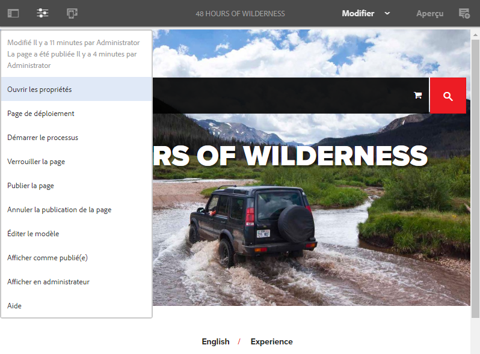

La barre d’outils vous donne accès à de nombreuses options. La disponibilité de certaines options dépend du contexte et de la configuration en cours.

* **Activer/désactiver le panneau latéral**

   Permet d’ouvrir/de fermer le panneau latéral, qui contient l’[explorateur de ressources](/help/sites-authoring/author-environment-tools.md#assets-browser), l’[explorateur de composants](/help/sites-authoring/author-environment-tools.md#components-browser) et l’[arborescence de contenu](/help/sites-authoring/author-environment-tools.md#content-tree).

   

* **Informations sur la page**

   Permet d’accéder au menu [Informations sur la page](/help/sites-authoring/author-environment-tools.md#page-information) qui présente des informations et les opérations qui peuvent être effectuées sur la page : affichage et modification des informations concernant la page, affichage des propriétés de la page, publication/annulation de la publication de la page, etc.

   

* **Émulateur**

   Active/désactive la [barre d’outils de l’émulateur](/help/sites-authoring/responsive-layout.md#selecting-a-device-to-emulate), utilisée pour simuler l’aspect de la page sur un autre périphérique. Cette option est automatiquement désactivée dans le mode Mise en page.

   

* **ContextHub**

   Permet d’ouvrir le [centre contextuel](/help/sites-authoring/ch-previewing.md). Uniquement disponible en mode Aperçu.

   

* **Titre de la page**

   À titre purement informatif.

   

* **Sélecteur de mode**

   Affiche le [mode](/help/sites-authoring/author-environment-tools.md#page-modes) en cours et vous permet d’en sélectionner un autre, tel que Édition, Mise en page, Timewarp ou Ciblage.

   

* **Aperçu**

   Permet d’activer le [mode Aperçu](/help/sites-authoring/editing-content.md#preview-mode). Celui-ci affiche la page telle qu’elle apparaît lorsqu’elle est publiée.

   

* **Annoter**

   Permet d’ajouter des [annotations](/help/sites-authoring/annotations.md) sur la page lorsque vous la révisez. Après la première annotation, l’icône prend la forme d’un nombre qui indique combien d’annotations figurent sur la page.

   

### Notification d’état {#status-notification}

Si la page fait partie d’un ou de plusieurs [workflows](/help/sites-authoring/workflows.md), ces informations s’affichent dans une barre de notification située en haut de l’écran lorsque vous la modifiez.

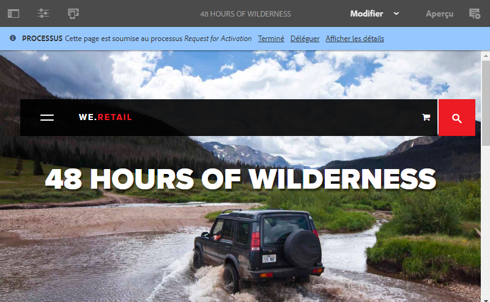

>[!NOTE]
>
>La barre d’état est visible uniquement par les comptes utilisateur disposant des privilèges appropriés.

La notification indique le workflow exécuté sur la page. Si l’utilisateur prend part à l’étape actuelle du workflow, des options [affectant l’état du workflow](/help/sites-authoring/workflows-participating.md) et permettant d’obtenir plus d’informations sur le workflow sont également disponibles, à savoir :

* **Terminé** - Ouvre la boîte de dialogue **Terminer la tâche** .

* **Délégué** : ouvre la boîte de dialogue **Terminer la tâche** .

* **Afficher les détails** : ouvre la fenêtre **Détails** du workflow

L’utilisation de la barre de notification pour terminer et déléguer des étapes de workflow fonctionne de la même manière que la [participation à des workflows](/help/sites-authoring/workflows-participating.md) depuis la boîte de réception de notifications.

Si la page est soumise à plusieurs workflows, leur nombre est indiqué à droite de la notification, avec des chevrons, pour vous permettre de les parcourir.

## Espace réservé du composant {#component-placeholder}

L’espace réservé du composant est un indicateur qui signale où sera positionné un composant lorsque vous le déplacez ; au-dessus du composant sur lequel vous placez le curseur.

* Lorsque vous ajoutez un nouveau composant à une page (par glissement depuis l’explorateur de composants) :

   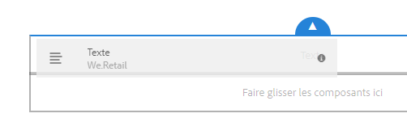

* Lors du déplacement d’un composant existant :

   

## Insertion d’un composant {#inserting-a-component}

### Insertion d’un composant depuis l’explorateur de composants {#inserting-a-component-from-the-components-browser}

Vous pouvez ajouter un nouveau composant à l’aide de l’[explorateur de composants](/help/sites-authoring/author-environment-tools.md#components-browser). L’[espace réservé du composant](#component-placeholder) indique où le composant va être positionné :

1. Assurez-vous que votre page est en mode [**Édition**](/help/sites-authoring/author-environment-tools.md#page-modes).
1. Ouvrez l’[explorateur de composants](/help/sites-authoring/author-environment-tools.md#components-browser).
1. Faites glisser le composant jusqu’à la [position requise](#component-placeholder).

1. [Modifiez](#editmovecopypastedelete) le composant.

>[!NOTE]
>
>Sur un appareil mobile, le navigateur de composants occupe tout l’écran. Dès que vous commencez à faire glisser un composant, le navigateur se ferme et la page est de nouveau affichée, de sorte que vous puissiez placer le composant.

### Insertion d’un composant à partir du système de paragraphes {#inserting-a-component-from-the-paragraph-system}

Vous pouvez ajouter un nouveau composant à l’aide de la case **Faire glisser les composants ici** du système de paragraphes :

1. Assurez-vous que votre page est en mode [**Édition**](/help/sites-authoring/author-environment-tools.md#page-modes).
1. Pour sélectionner et ajouter un nouveau composant à partir du système de paragraphes, deux méthodes peuvent être utilisées :

   * Sélectionnez l’option **Insérer le composant** (+) à partir de la barre d’outils d’un composant existant ou de la zone **Faire glisser les composants ici**.

   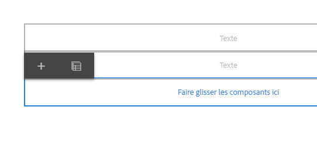

   * Si vous utilisez un ordinateur de bureau, vous pouvez double-cliquer sur la zone **Faire glisser les composants ici**.

   La boîte de dialogue **Insérer un nouveau composant** s’affiche pour vous permettre de sélectionner le composant nécessaire :

   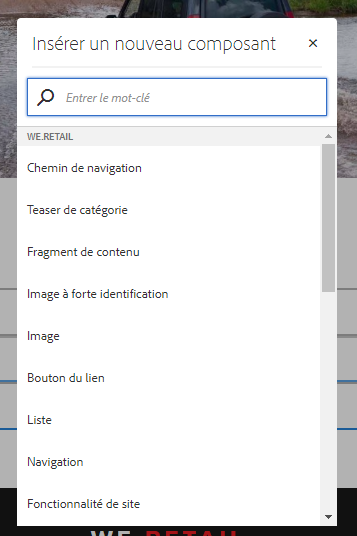

1. Le composant sélectionné est alors ajouté au bas de la page. [Modifiez](#editmovecopypastedelete) le composant selon les besoins.

### Insertion d’un composant à partir de l’Explorateur de ressources    {#inserting-a-component-using-the-assets-browser}

Vous pouvez également ajouter un nouveau composant à la page en faisant glisser un élément depuis l’[explorateur de ressources](/help/sites-authoring/author-environment-tools.md#assets-browser). Un nouveau composant du type approprié (et contenant l’élément) est ainsi créé automatiquement.

Ceci est valide pour les types de ressources suivants (certains dépendent du système de pages/paragraphes) :

<table>
 <tbody>
  <tr>
   <th><strong>Type de ressource</strong></th>
   <th><strong>Type de composant résultant</strong></th>
  </tr>
  <tr>
   <td>Image</td>
   <td>Image</td>
  </tr>
  <tr>
   <td>Document</td>
   <td>Téléchargement</td>
  </tr>
  <tr>
   <td>Produit</td>
   <td>Produit</td>
  </tr>
  <tr>
   <td>Vidéo</td>
   <td>Flash</td>
  </tr>
  <tr>
   <td>Fragment de contenu</td>
   <td>Fragment de contenu  </td>
  </tr>
 </tbody>
</table>

>[!NOTE]
>
>Ce comportement peut être configuré pour votre installation. Pour plus d’informations, voir [Configuration d’un système de paragraphes de manière à faire glisser une ressource pour créer une instance de composant](/help/sites-developing/developing-components.md#configuring-a-paragraph-system-so-that-dragging-an-asset-creates-a-component-instance).

Pour créer un composant en faisant glisser l’un des types de ressources ci-dessus, suivez ces étapes :

1. Assurez-vous que votre page est en mode [**Édition**](/help/sites-authoring/author-environment-tools.md#page-modes).
1. Ouvrez l’[explorateur de ressources](/help/sites-authoring/author-environment-tools.md#assets-browser).
1. Faites glisser la ressource jusqu’à la position requise. L’[espace réservé du composant](#component-placeholder) indique où le composant va être positionné.

   Un composant, du type de ressource approprié, est créé à l’emplacement requis. Il contient la ressource sélectionnée.

1. [Modifiez](#editmovecopypastedelete) le composant si nécessaire.

>[!NOTE]
>
>Sur un appareil mobile, l’explorateur de ressources occupe tout l’écran. Dès que vous commencez à faire glisser une ressource, le navigateur se ferme et la page est de nouveau affichée, de sorte que vous puissiez placer la ressource.

Si, lors de l’exploration des ressources, vous estimez qu’il est nécessaire d’apporter une modification rapide à l’une d’elles, vous pouvez lancer directement l’[éditeur de ressources](/help/assets/manage-assets.md) à partir du navigateur en cliquant sur l’icône d’édition située en regard de son nom.

## Modifier/Configurer/Copier/Couper/Supprimer/Coller {#edit-configure-copy-cut-delete-paste}

La sélection d’un composant ouvre la barre d’outils, qui permet d’accéder à diverses actions pouvant être réalisées sur le composant.

Les actions disponibles pour l’utilisateur sont affichées comme il convient ; ces actions ne peuvent pas toutes être décrites ici.

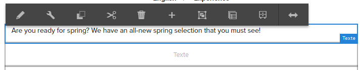

* **Modifier**

   [En fonction du type de composant](/help/sites-authoring/default-components.md), vous pouvez [en modifier le contenu](#edit-content). Une barre d’outils est souvent disponible.

   

* **Configurer**

   [En fonction du type de composant](/help/sites-authoring/default-components.md), vous pouvez modifier et configurer ses propriétés. En général, une boîte de dialogue s’ouvre.

   

* **Copier**

   Cette opération copie le composant dans le presse-papiers. Après l’opération de collage, le composant d’origine demeure.

   

* **Couper**

   Cette opération copie le composant dans le presse-papiers. Après l’opération de collage, le composant d’origine est supprimé.

   

* **Supprimer**

   Vous devez confirmer cette opération avant que le composant ne soit supprimé de la page.

   

* **Insérer le composant**

   Cette option ouvre la boîte de dialogue pour [ajouter un nouveau composant](/help/sites-authoring/editing-content.md#inserting-a-component-from-the-paragraph-system).

   

* **Coller**

   Colle le composant du Presse-papiers sur la page. Le maintien de l’original dépend de l’opération utilisée (Copier ou Couper).

   * Vous pouvez coller le composant sur la même page ou sur une autre.
   * L’élément est collé au-dessus de celui dans lequel vous sélectionnez l’opération de collage.
   * L’opération de collage ne s’affiche que s’il y a du contenu dans le presse-papiers.

   

   >[!NOTE]
   >
   >Si vous collez du contenu sur une autre page déjà ouverte avant l’opération Couper/Copier, il convient d’actualiser la page pour afficher le contenu collé.

* **Groupe**

   Permet de sélectionner plusieurs composants à la fois. Vous pouvez obtenir le même résultat sur un ordinateur de bureau en utilisant la combinaison **Ctrl+Clic** ou **Commande+Clic**.

   

* **Parent**

   Permet de sélectionner le composant parent du composant sélectionné.

   

* **Mise en page**

   Cette option vous permet de modifier la [mise en page](/help/sites-authoring/editing-content.md#edit-component-layout) du composant sélectionné. Cela s’applique uniquement au composant sélectionné et n’active pas le [mode Mise en page](/help/sites-authoring/author-environment-tools.md#page-modes) de la page entière.

   

* **Convertir en variation de fragment d’expérience**

   Permet de créer un [fragment d’expérience](/help/sites-authoring/experience-fragments.md) à partir du composant sélectionné ou de l’ajouter à un fragment d’expérience existant.

   

## Modifier (du contenu) {#edit-content}

Deux méthodes permettent d’ajouter et/ou de modifier le contenu dans les composants :

* Ouvrez la [boîte de dialogue de composant pour l’édition](#component-edit-dialog).
* [Faites glisser et déposez un élément](#draganddropintocomponent) depuis l’explorateur de ressources pour ajouter directement du contenu.

### Boîte de dialogue d’édition de composant    {#component-edit-dialog}

Vous pouvez ouvrir un composant pour modifier le contenu à l’aide de l’[icône Modifier (crayon) de la barre d’outils Composant](#edit-configure-copy-cut-delete-paste).

Les options de modification disponibles dépendent du composant. Pour certains composants[, toutes les actions sont uniquement disponibles en mode Plein écran](#edit-content-full-screen-mode). Par exemple :

* [Composant textuel](/help/sites-authoring/rich-text-editor.md#main-pars-title-24)

   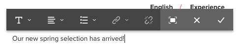

* Composant d’image

   

   >[!NOTE]
   >
   >L’édition ne fonctionne pas sur un composant d’image vide.
   >
   >
   >Vous devez [faire glisser ou télécharger une image (à l’aide de l’option Configurer)](/help/sites-authoring/default-components-foundation.md#image) avant de commencer à la modifier.

* Composant image – Plein écran

   [Le passage en mode plein écran](/help/sites-authoring/editing-content.md#edit-content-full-screen-mode) pour le composant d’image permet de libérer de l’espace pour modifier l’image et d’afficher des options de modification supplémentaires, telles que **Lancer une Map** et **Réinitialiser le zoom**. En outre, le mode plein écran permet de sélectionner les paramètres prédéfinis de recadrage.

   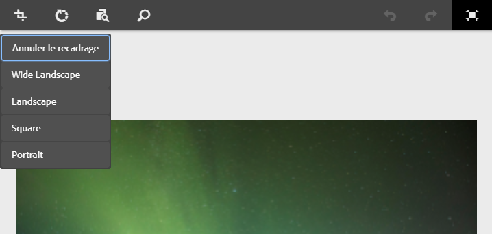

* Les composants construits à partir de plusieurs composants de base, tels que le [composant de base Texte et image](/help/sites-authoring/default-components-foundation.md#text-image), vous demandent tout d’abord de confirmer le jeu d’options de modification désiré :

   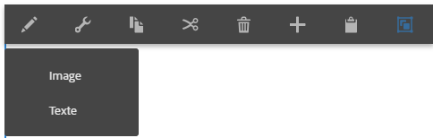

### Faire glisser et déposer des éléments dans des composants {#drag-and-drop-assets-into-component}

Pour certains types de composants, vous pouvez faire glisser et déposer des éléments depuis l’explorateur de ressources directement dans le composant pour mettre à jour le contenu :

| **Type de ressource** | **Type de composant** |
|---|---|
| Image | Image |
| Document | Téléchargement |
| Produit | Produit |
| Vidéo | Flash |
| Fragment de contenu | Fragment de contenu |

## Modifier (contenu) – Mode Plein écran {#edit-content-full-screen-mode}

Pour tous les composants, vous pouvez accéder au mode Plein écran (ou le quitter) avec :

Par exemple, le composant **textuel** :

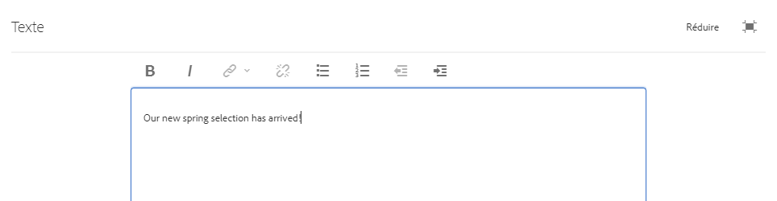

>[!NOTE]
>
>Pour certains composants, le mode plein écran dispose d’un plus grand nombre d’options disponibles que l’éditeur statique de base.

## Déplacement d’un composant {#moving-a-component}

Pour déplacer un composant de paragraphe :

1. Sélectionnez le paragraphe à déplacer en appuyant/cliquant dessus et en le maintenant enfoncé.
1. Faites glisser le paragraphe jusqu’à son nouvel emplacement. AEM indique l’endroit où le paragraphe peut être déposé. Déposez-le à l’emplacement de votre choix.

   

1. Votre paragraphe est déplacé.

>[!NOTE]
>
>Vous pouvez également utiliser la technique du [couper/coller](/help/sites-authoring/editing-content.md#edit-configure-copy-cut-delete-paste) pour déplacer un composant.

## Modification de la mise en page du composant {#edit-component-layout}

Au lieu de basculer à plusieurs reprises entre les modes d’édition et de [mise en page](/help/sites-authoring/responsive-layout.md) pour ajuster un composant, vous pouvez sélectionner l’action **Mise en page** pour un composant afin d’en modifier la mise en page. Cela vous évite de devoir quitter le mode d’édition, ce qui se traduit par un gain de temps.

1. Lorsque le mode **Édition** de la console Sites est actif, la sélection d’un composant déclenche l’affichage de sa barre d’outils.

   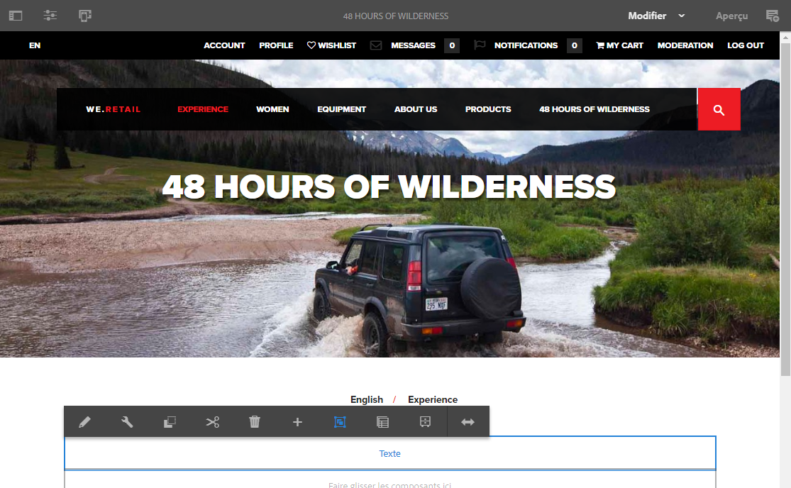

   Cliquez ou appuyez sur l’action **Mise en page** pour ajuster la mise en page du composant.

   

1. Une fois cette action sélectionnée :

   * Les poignées de redimensionnement du composant s’affichent.
   * La barre d’outils de l’émulateur est affichée en haut de l’écran.
   * Les actions de mise en page sont affichées dans la barre d’outils du composant, au lieu des actions d’édition standard.

   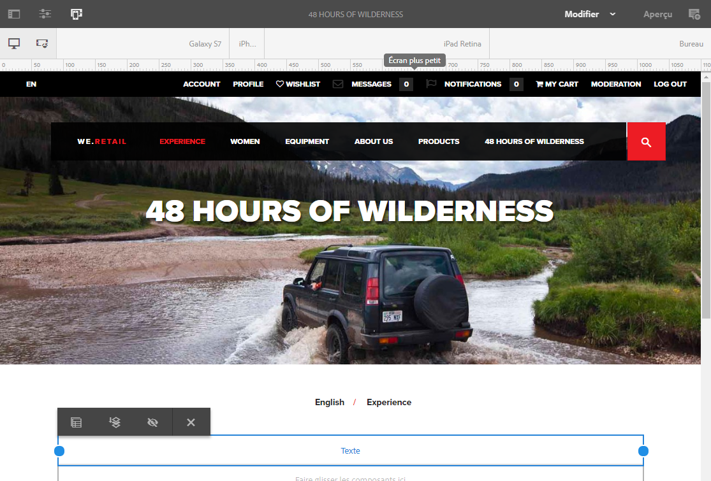

   Vous pouvez à présent modifier la mise en page du composant, comme vous le feriez dans le [mode de mise en page](/help/sites-authoring/responsive-layout.md#defining-layouts-layout-mode).

1. Après avoir effectué les modifications nécessaires au niveau de la mise en page, cliquez sur le bouton **Fermer** dans le menu des actions du composant pour arrêter la session de modification. La barre d’outils du composant revient à son état d’édition normal.

   

>[!NOTE]
>
>L’action de mise en page est limitée au composant sélectionné. Par exemple, si vous modifiez la mise en page d’un composant, puis cliquez sur un autre composant, la barre d’outils de modification standard (et non la barre d’outils de mise en page) s’affiche pour le nouveau composant sélectionné et les poignées de redimensionnement ainsi que la barre d’outils d’émulateur disparaissent.
>
>Si vous devez modifier la mise en page globale de la page et affecter ainsi plusieurs composants, basculez vers le [mode de mise en page](/help/sites-authoring/responsive-layout.md).

## Composants hérités {#inherited-components}

Les composants hérités peuvent être le produit de divers scénarios, notamment :

* [Gestion de plusieurs sites](/help/sites-administering/msm.md)
* [Lancements](/help/sites-authoring/launches.md) (quand basé sur une Live Copy).
* Des composants spécifiques ; par exemple, le système de paragraphes hérité dans Geometrixx.

Vous pouvez annuler (puis réactiver) l’héritage. En fonction du composant, cette option est disponible depuis :

* **Live Copy**

   La barre d’outils du composant, si celui-ci est situé sur une page qui fait partie d’une Live Copy ou d’un lancement (basé sur une Live Copy). Par exemple :

   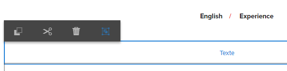

   L’option Annuler l’héritage est disponible :

   

   Ou réactivez l’héritage s’il a déjà été annulé :

   

   L’action de déploiement est également disponible dans le plan directeur ou la source Live Copy :

   

* **Un système de paragraphes hérité**

   La boîte de dialogue de configuration. Par exemple, comme avec le système de paragraphes hérité :

   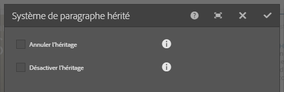

## Modification du modèle de page {#editing-the-page-template}

Si la page est basée sur un [modèle modifiable](/help/sites-authoring/templates.md#editable-and-static-templates), vous pouvez facilement basculer vers l’[éditeur de modèles](/help/sites-authoring/templates.md#editing-templates-template-authors) en sélectionnant **Éditer le modèle** dans le menu [Informations sur la page](/help/sites-authoring/author-environment-tools.md#page-information).

If the page is based on a [static template](/help/sites-authoring/templates.md#editable-and-static-templates), you can switch to [Design mode](/help/sites-authoring/default-components-designmode.md) using the [page mode selector](/help/sites-authoring/author-environment-tools.md#page-modes) on the toolbar to enable/disable components for use on the page.

Vous pouvez déterminer facilement le modèle sur lequel la page est basée en sélectionnant cette dernière en mode [Colonnes](/help/sites-authoring/basic-handling.md#column-view) ou [Liste](/help/sites-authoring/basic-handling.md#list-view).

## État de Live Copy {#live-copy-status}

Le [mode de page État de Live Copy](/help/sites-authoring/author-environment-tools.md#page-modes) donne un aperçu rapide de l’état de la live copy et des composants qui sont ou non hérités.

* Bordure verte : héritée
* Bordure rose : héritage annulé

Par exemple :

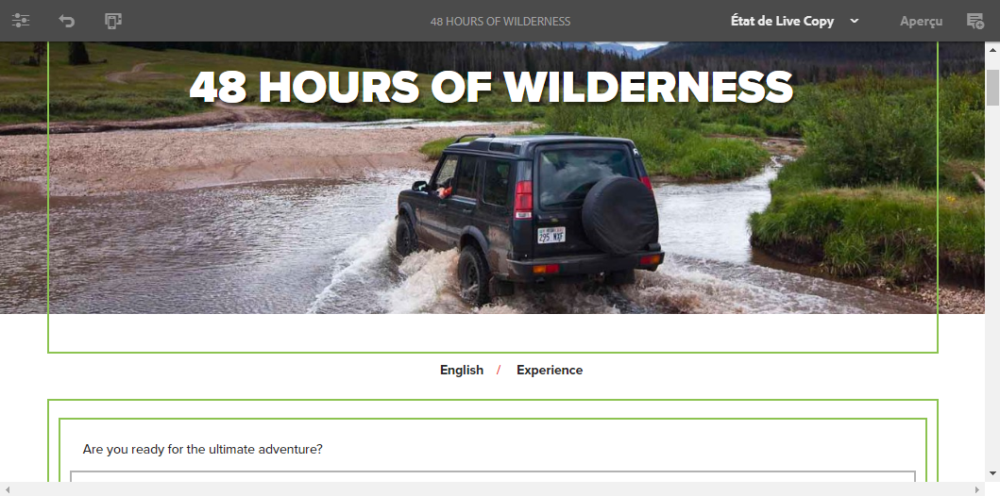

## Ajout d’annotations {#adding-annotations}

Les [Annotations](/help/sites-authoring/annotations.md) permettent aux réviseurs et aux autres créateurs de fournir des commentaires sur votre contenu. Elles sont souvent utilisées à des fins de révision et de validation.

## Aperçu des pages    {#previewing-pages}

Deux options sont disponibles pour prévisualiser une page :

* [Mode Aperçu](#preview-mode) : aperçu rapide et statique

* [Afficher comme publié(e)](#view-as-published) : prévisualisation complète, qui ouvre la page dans un nouvel onglet

>[!NOTE]
>
>* Les liens dans le contenu sont visibles, mais inaccessibles en mode Édition.
>* Si vous souhaitez naviguer à l’aide des liens, utilisez l’une des options d’aperçu.
>* Utilisez le [raccourci clavier](/help/sites-authoring/keyboard-shortcuts.md) `Ctrl-Shift-M` pour basculer entre le mode Aperçu et le dernier mode sélectionné.

>

>[!NOTE]
>
>Le cookie de mode WCM est défini pour les deux options.

### Mode Aperçu {#preview-mode}

Lorsque vous modifiez du contenu, vous pouvez prévisualiser la page grâce au [mode](/help/sites-authoring/author-environment-tools.md#page-modes) Aperçu. Ce mode :

* Masque les différents mécanismes de modification pour vous donner un aperçu rapide de l’apparence de la page publiée.
* Permet d’utiliser des liens de navigation.
* N’actualise **pas** le contenu de la page.

Lors de la création, le mode Aperçu est accessible par l’intermédiaire de l’icône située dans le coin supérieur droit de l’éditeur de pages :

### Afficher comme publié(e) {#view-as-published}

L’option **Afficher comme publié(e)** est disponible dans le menu [Informations sur la page](/help/sites-authoring/author-environment-tools.md#page-information). La page s’affiche sur un nouvel onglet, actualise le contenu et affiche la page telle qu’elle se présentera dans l’environnement de publication.

## Verrouillage d’une page {#locking-a-page}

AEM vous permet de verrouiller une page, de sorte que personne d’autre ne puisse en modifier le contenu. Cela s’avère utile lorsque vous apportez de nombreuses modifications à une page spécifique ou lorsque vous devez figer une page pendant quelque temps.

Il est possible de verrouiller une page depuis :

* La console **Sites**

   1. Sélectionnez la page à l’aide du [mode de sélection](/help/sites-authoring/basic-handling.md#viewing-and-selecting-resources).
   1. Sélectionnez l’icône de verrou.

   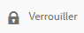

* **Éditeur de page**

   1. Sélectionnez l’icône **Informations sur la page** pour afficher le menu.
   1. Sélectionnez l’option **Verrouiller la page**.

Une fois la page verrouillée, les informations d’affichage de la console sont mises à jour et, lors de la modification, le symbole d’un verrou s’affiche dans la barre d’outils.

>[!CAUTION]
>
>Le verrouillage d’une page peut être réalisé lorsque vous [empruntez l’identité d’un utilisateur](/help/sites-administering/security.md#impersonating-another-user). Toutefois, une page verrouillée de cette manière peut uniquement être déverrouillée par l’utilisateur dont l’identité a été empruntée ou par un administrateur.
>
>Les pages ne peuvent pas être déverrouillées en empruntant l’identité de l’utilisateur qui les a verrouillées.

## Déverrouillage d’une page {#unlocking-a-page}

Le déverrouillage d’une page est une procédure très similaire au [verrouillage de la page](#locking-a-page) : une fois la page verrouillée, les options de verrouillage sont remplacées par des actions de déverrouillage.

Dans le menu Informations sur la page, **Déverrouiller** est répertorié comme une option et l’icône Verrouiller dans la console Sites est remplacée par l’icône **Déverrouiller**.

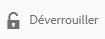

>[!CAUTION]
>
>Le verrouillage d’une page peut être réalisé lorsque vous [empruntez l’identité d’un utilisateur](/help/sites-administering/security.md#impersonating-another-user). Toutefois, une page verrouillée de cette manière peut uniquement être déverrouillée par l’utilisateur dont l’identité a été empruntée ou par un administrateur.
>
>Les pages ne peuvent pas être déverrouillées en empruntant l’identité de l’utilisateur qui les a verrouillées.

## Annulation et rétablissement des modifications de page {#undoing-and-redoing-page-edits}

Les icônes suivantes permettent d’annuler ou de rétablir une opération. Celles-ci s’affichent dans la barre d’outils le cas échéant :

>[!NOTE]
>
>The [keyboard shortcut](/help/sites-authoring/page-authoring-keyboard-shortcuts.md) `Ctrl-Z` is also availalbe to undo page edit actions.
>
>The keyboard shortcut `Ctrl-Y` is also availalbe to redo page edit actions.

>[!NOTE]
>
>Voir [Annulation et rétablissement des modifications de page : la théorie](#undoing-and-redoing-page-edits-the-theory) pour en savoir plus sur ce qu’il est possible de faire lorsque vous annulez ou rétablissez des modifications de page.

## Annulation et rétablissement des modifications de page : la théorie {#undoing-and-redoing-page-edits-the-theory}

>[!NOTE]
>
>L’administrateur système peut [configurer divers aspects des fonctions Annuler/Rétablir](/help/sites-administering/config-undo.md) en fonction des exigences de votre instance.

AEM stocke un historique des actions que vous réalisez, ainsi que la séquence selon laquelle vous les réalisez, de sorte que vous puissiez annuler plusieurs actions dans l’ordre dans lequel vous les avez réalisées. Vous pouvez également les rétablir pour appliquer à nouveau une ou plusieurs de ces actions.

Si un élément de la page de contenu est sélectionné (un composant de texte, par exemple), les commandes Annuler et Rétablir s’appliquent à celui-ci.

Les commandes Annuler et Rétablir fonctionnent de la même manière que dans les autres logiciels. Utilisez ces commandes pour rétablir l’état récent de votre page web lorsque vous prenez des décisions quant au contenu. Par exemple, si vous repositionnez un paragraphe de texte sur la page, vous pouvez utiliser la commande Annuler pour le remettre à son emplacement initial. Si vous estimez ensuite que la position précédente était préférable, utilisez la commande Rétablir pour « annuler l’annulation ».

>[!NOTE]
>
>Vous pouvez :
>
>* Rétablir des opérations pour autant qu’aucune modification de page n’ait été effectuée depuis la dernière utilisation de la commande Annuler.
>* Annuler jusqu’à 20 opérations de modification (paramètre par défaut).
>* Vous pouvez également utiliser les [raccourcis clavier](/help/sites-authoring/page-authoring-keyboard-shortcuts.md) pour annuler et rétablir des opérations.

>

Vous pouvez utiliser les commandes d’annulation et de rétablissement pour les types de modification suivants :

* Ajout, modification, suppression et déplacement de paragraphes
* Modification statique du contenu de paragraphe
* Copie, découpe et collage d’éléments sur une page

Aucune valeur n’est censée être spécifiée pour les champs de formulaire dont le rendu est effectué par les composants de formulaire lors de la création de pages. Les commandes Annuler et Rétablir n’affectent donc pas les modifications que vous apportez aux valeurs des composants de ce type. Par exemple, vous ne pouvez pas annuler la sélection d’une valeur dans une liste déroulante.

>[!NOTE]
>
>Des autorisations spéciales sont nécessaires pour annuler et rétablir des modifications affectant des fichiers et des images.

>[!NOTE]
>
>L’historique des modifications apportées aux fichiers et aux images a une durée de vie minimale de dix heures. Au-delà de cette limite, l’annulation des modifications n’est plus garantie. Votre administrateur peut modifier la durée par défaut de dix heures.

