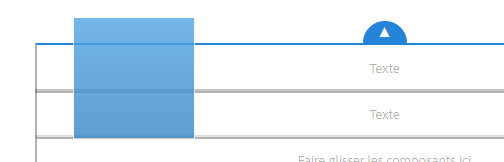

# Modification du contenu de la page{#editing-page-content}

Une fois votre page créée (nouvelle ou dans le cadre d’un lancement ou d’une Live Copy), vous pouvez modifier le contenu pour effectuer les mises à jour dont vous avez besoin.

Le contenu est ajouté à l’aide des [composants](/help/sites-authoring/default-components-console.md) (appropriés au type de contenu) qui peuvent être glissés sur la page. Ils peuvent ensuite être modifiés sur place, déplacés ou supprimés.

>[!NOTE]
>
>Vous devez disposer des [droits d’accès](/help/sites-administering/security.md) et des [autorisations](/help/sites-administering/security.md#permissions) appropriés pour modifier des pages.
>
>Si vous rencontrez des problèmes, Adobe vous invite à contacter votre administrateur système.

>[!NOTE]
>
>Si votre page, votre modèle ou les deux sont correctement configurés, vous pouvez utiliser une [disposition réactive](/help/sites-authoring/responsive-layout.md) lors de la modification.

>[!NOTE]
>
>En mode **Édition**, les liens dans votre contenu sont visibles, mais ils ne sont **pas accessibles**. Utilisez le [mode Aperçu](#previewingpagestouchoptimizedui) pour naviguer en suivant les liens.

## Barre d’outils Page {#page-toolbar}

La barre d’outils Page permet d’accéder à la fonctionnalité appropriée, en fonction de la configuration de la page.

La barre d’outils permet d’accéder à de nombreuses options. Selon votre contexte et votre configuration actuels, certaines options peuvent ne pas être disponibles.

* **Activer/désactiver le panneau latéral**

  Cette action ouvre/ferme le panneau latéral, qui contient l’[explorateur de ressources](/help/sites-authoring/author-environment-tools.md#assets-browser), l’[explorateur de composants](/help/sites-authoring/author-environment-tools.md#components-browser) et l’[arborescence de contenu](/help/sites-authoring/author-environment-tools.md#content-tree).

  

* **Informations sur la page**

  Il permet d’accéder au [Informations sur la page](/help/sites-authoring/author-environment-tools.md#page-information) menu comprenant les détails et les actions de page pouvant être effectués sur la page, notamment l’affichage et la modification des informations de page, l’affichage des propriétés de page et la publication/annulation de la publication de la page.

  

* **Emulateur**

  Fait basculer la [barre d’outils de l’émulateur](/help/sites-authoring/responsive-layout.md#selecting-a-device-to-emulate) utilisée pour émuler l’aspect de la page sur un autre dispositif. Cette option est automatiquement basculée en mode de mise en page.

  

* **ContextHub**

  Ouvre [ContextHub](/help/sites-authoring/ch-previewing.md). Uniquement disponible en mode Aperçu.

  

* **Titre de la page**

  Ceci est à titre purement informatif.

  

* **Sélecteur de mode**

  Elle affiche la variable actuelle [mode](/help/sites-authoring/author-environment-tools.md#page-modes) et vous permet de sélectionner un autre mode, tel que l’édition, la mise en page, la temporisation ou le ciblage.

  

* **Aperçu**

  Permet d’activer le [mode Aperçu](/help/sites-authoring/editing-content.md#preview-mode). Cette option affiche la page telle qu’elle apparaît une fois publiée.

  

* **Annoter**

  Il vous permet d’ajouter des [annotations](/help/sites-authoring/annotations.md) sur la page lors de la révision d’une page. Après la première annotation, l’icône prend la forme d’un nombre indiquant le nombre d’annotations sur la page.

  

### Notification de statut {#status-notification}

Si la page fait partie d’un ou de plusieurs [workflows](/help/sites-authoring/workflows.md), ces informations s’affichent dans une barre de notification située en haut de l’écran lorsque vous la modifiez.

>[!NOTE]
>
>La barre de statut n’est visible que pour les comptes d’utilisateurs ou d’utilisatrices disposant des privilèges appropriés.

La notification répertorie le workflow qui s’exécute sur la page. Si l’utilisateur ou l’utilisatrice est impliqué dans l’étape de workflow en cours, les options pour [affecter le statut du workflow](/help/sites-authoring/workflows-participating.md) et obtenir plus d’informations sur le workflow sont également disponibles, par exemple :

* **Terminer** : ouvre la boîte de dialogue **Terminer l’élément de travail**. box

* **Déléguer** - Ouvre la fenêtre **Terminer l’élément de travail** boîte de dialogue

* **Afficher les détails** : ouvre la fenêtre **Détails** du workflow

La réalisation et la délégation d’étapes de workflow par le biais de la barre de notification fonctionne de la même manière que lorsque [participation aux workflows](/help/sites-authoring/workflows-participating.md) dans la boîte de réception Notification .

Si la page est soumise à plusieurs workflows, le nombre de workflows s&#39;affiche à droite de la notification, avec des boutons fléchés pour vous permettre de les parcourir.

## Espace réservé du composant {#component-placeholder}

L’espace réservé du composant est un indicateur indiquant où est positionné un composant lorsque vous le déposez, au-dessus du composant que vous survolez actuellement.

* Lors de l’ajout d’un composant à la page (en le faisant glisser depuis l’explorateur de composants) :

  

* Lors du déplacement d’un composant existant :

  

## Insertion d’un composant {#inserting-a-component}

### Insertion d’un composant depuis l’explorateur de composants {#inserting-a-component-from-the-components-browser}

Vous pouvez ajouter un composant à l’aide de la méthode [explorateur de composants](/help/sites-authoring/author-environment-tools.md#components-browser). La variable [espace réservé du composant](#component-placeholder) affiche l’emplacement du composant :

1. Assurez-vous que votre page est en mode [**Modifier**](/help/sites-authoring/author-environment-tools.md#page-modes).
1. Ouvrez l’[explorateur de composants](/help/sites-authoring/author-environment-tools.md#components-browser).
1. Faites glisser le composant jusqu’à la [position requise](#component-placeholder).

1. [Modifiez](#editmovecopypastedelete) le composant.

>[!NOTE]
>
>Sur un appareil mobile, l’explorateur de composants remplit tout l’écran. Une fois que vous avez commencé à faire glisser un composant, le navigateur se ferme pour afficher à nouveau la page afin que vous puissiez placer le composant.

### Insertion d’un composant à partir du système de paragraphes {#inserting-a-component-from-the-paragraph-system}

Vous pouvez ajouter un composant à l’aide de la méthode **Faire glisser des composants ici** de la boîte du système de paragraphes :

1. Assurez-vous que votre page est en mode [**Modifier**](/help/sites-authoring/author-environment-tools.md#page-modes).
1. Il existe deux manières de sélectionner et d’ajouter un composant à partir du système de paragraphes :

   * Sélectionnez l’option **Insérer le composant** (+) depuis la barre d’outils d’un composant existant ou dans la zone **Faire glisser les composants ici**.

   

   * Si vous utilisez un ordinateur de bureau, vous pouvez double-cliquer sur le **Faire glisser des composants ici** de la boîte.

   La variable **Insérer un nouveau composant** La boîte de dialogue s’ouvre pour vous permettre de sélectionner le composant requis :

   

1. Le composant sélectionné est ajouté au bas de la page. [Modifier](#editmovecopypastedelete) le composant selon les besoins.

### Insertion d’un composant à partir de l’Explorateur de ressources {#inserting-a-component-using-the-assets-browser}

Vous pouvez également ajouter un composant à la page en faisant glisser une ressource depuis l’ [navigateur de ressources](/help/sites-authoring/author-environment-tools.md#assets-browser). Cela crée automatiquement un composant du type approprié (et contenant la ressource).

Ceci est valide pour les types de ressources suivants (certains dépendent du système de pages/paragraphes) :

<table>
 <tbody>
  <tr>
   <th><strong>Type de ressource</strong></th>
   <th><strong>Type de composant résultant</strong></th>
  </tr>
  <tr>
   <td>Image</td>
   <td>Image</td>
  </tr>
  <tr>
   <td>Document</td>
   <td>Télécharger</td>
  </tr>
  <tr>
   <td>Produit</td>
   <td>Produit</td>
  </tr>
  <tr>
   <td>Vidéo</td>
   <td>Flash</td>
  </tr>
  <tr>
   <td>Fragment de contenu</td>
   <td>Fragment de contenu  </td>
  </tr>
 </tbody>
</table>

>[!NOTE]
>
>Ce comportement peut être configuré pour votre installation. Voir [Configuration d’un système de paragraphe afin que le glissement d’une ressource crée une instance de composant](/help/sites-developing/developing-components.md#configuring-a-paragraph-system-so-that-dragging-an-asset-creates-a-component-instance) pour plus de détails.

Pour créer un composant en faisant glisser l’un des types de ressources ci-dessus, suivez ces étapes :

1. Assurez-vous que votre page est en mode [**Modifier**](/help/sites-authoring/author-environment-tools.md#page-modes).
1. Ouvrez l’[explorateur de ressources](/help/sites-authoring/author-environment-tools.md#assets-browser).
1. Faites glisser le composant jusqu’à la position requise. La variable [espace réservé du composant](#component-placeholder) vous indique l’emplacement du composant.

   Un composant, adapté au type de ressource, est créé à l’emplacement requis ; il contient la ressource sélectionnée.

1. [Modifier](#editmovecopypastedelete) le composant, si nécessaire.

>[!NOTE]
>
>Sur un appareil mobile, l’explorateur de ressources remplit tout l’écran. Lorsque vous commencez à faire glisser une ressource, le navigateur se ferme pour afficher à nouveau la page afin que vous puissiez la placer.

Lorsque vous parcourez les ressources, si vous constatez que vous devez apporter une modification rapide à une ressource, cliquez sur l’icône de modification en regard du nom de la ressource pour lancer la fonction [Éditeur de ressources](/help/assets/manage-assets.md).

## Modifier/Configurer/Copier/Couper/Supprimer/Coller {#edit-configure-copy-cut-delete-paste}

La sélection d’un composant ouvre la barre d’outils. Cela permet d’accéder à diverses actions qui peuvent être exécutées sur le composant.

Les actions disponibles pour l’utilisateur sont affichées comme il convient ; toutes les actions ne peuvent pas être décrites ici.

* **Modifier**

  [Dépend du type de composant.](/help/sites-authoring/default-components.md), vous pouvez ainsi : [modifier le contenu du composant ;](#edit-content). Souvent, une barre d’outils est fournie.

  

* **Configurer**

  [Dépend du type de composant.](/help/sites-authoring/default-components.md) vous pouvez ainsi modifier et configurer les propriétés du composant. Souvent, une boîte de dialogue s’ouvre.

  

* **Copier**

  Le composant est alors copié dans le Presse-papiers. Le composant d’origine reste après un collage.

  

* **Couper**

  Le composant est alors copié dans le Presse-papiers. Après l’action de collage, le composant d’origine est supprimé.

  

* **Supprimer**

  Cela supprime le composant de la page avec votre confirmation.

  

* **Insérer le composant**

  La boîte de dialogue s’ouvre alors pour [ajouter un composant](/help/sites-authoring/editing-content.md#inserting-a-component-from-the-paragraph-system).

  

* **Coller**

  Le composant est collé du Presse-papiers à la page. Le contenu d’origine reste ou non en fonction de l’utilisation de la copie ou de la coupure.

   * Vous pouvez coller les composants sur la même page ou sur une autre.
   * L’élément collé est collé au-dessus de l’élément dans lequel vous sélectionnez l’action de collage.
   * L’action Coller n’est affichée que si du contenu se trouve dans le Presse-papiers.

  

  >[!NOTE]
  >
  >Si vous effectuez un collage sur une autre page qui était déjà ouverte avant l’opération de couper/copier, vous devez actualiser la page pour afficher le contenu collé.

* **Groupe**

  Vous pouvez ainsi sélectionner plusieurs composants à la fois. Vous pouvez obtenir le même résultat sur un ordinateur de bureau à l’aide des commandes **Ctrl-clic** ou **Commande-clic**.

  

* **Parent**

  Vous pouvez ainsi sélectionner le composant parent du composant sélectionné.

  

* **Disposition**

  Vous pouvez ainsi modifier la variable [layout](/help/sites-authoring/editing-content.md#edit-component-layout) du composant sélectionné. Cela s’applique uniquement au composant sélectionné et n’active pas le [mode de disposition](/help/sites-authoring/author-environment-tools.md#page-modes) pour la page entière.

  

* **Convertir en variation de fragment d’expérience**

  Vous pouvez ainsi créer une [Fragment d’expérience](/help/sites-authoring/experience-fragments.md) du composant sélectionné ou ajoutez-le à un fragment d’expérience existant.

  

## Modifier le contenu {#edit-content}

Il existe deux méthodes pour ajouter ou modifier du contenu dans les composants :

* Ouvrez la [boîte de dialogue du composant pour la modification](#component-edit-dialog).
* [Faites glisser et déposez un élément](#draganddropintocomponent) depuis l’explorateur de ressources pour ajouter directement du contenu.

### Boîte de dialogue de modification du composant {#component-edit-dialog}

Vous pouvez ouvrir un composant pour modifier le contenu à l’aide de l’icône [Modifier (crayon) de la barre d’outils du composant](#edit-configure-copy-cut-delete-paste).

Les options de modification exactes dépendent du composant. Pour certains composants, [toutes les actions sont disponibles uniquement en mode plein écran.](#edit-content-full-screen-mode). Par exemple :

* [Composant textuel](/help/sites-authoring/rich-text-editor.md#main-pars-title-24)

  

* Composant d’image

  

  >[!NOTE]
  >
  >L’édition ne fonctionne pas sur un composant d’image vide.
  >
  >
  >[Faites glisser ou chargez une image (à l’aide de Configurer)](/help/sites-authoring/default-components-foundation.md#image) avant de commencer à le modifier.

* Composant d’image - Plein écran

  [Passage en mode Plein écran](/help/sites-authoring/editing-content.md#edit-content-full-screen-mode) pour le composant d’image , il permet de libérer de l’espace pour modifier l’image et d’afficher des options de modification supplémentaires, telles que **Lancer une Map** et **Réinitialiser le zoom**. En outre, le mode plein écran permet de sélectionner les paramètres prédéfinis de recadrage.

  

* Les composants construits à partir de plusieurs composants de base, tels que le [composant de base Texte et image](/help/sites-authoring/default-components-foundation.md#text-image), vous demandent tout d’abord de confirmer le jeu d’options de modification désiré :

  

### Faire glisser et déposer des éléments dans des composants {#drag-and-drop-assets-into-component}

Pour certains types de composants, vous pouvez effectuer un glisser-déposer des ressources depuis l’explorateur de ressources directement dans le composant pour mettre à jour le contenu :

| **Type de ressource** | **Type de composant** |
|---|---|
| Image | Image |
| Document | Télécharger |
| Produit | Produit |
| Vidéo | Flash |
| Fragment de contenu | Fragment de contenu |

## Modifier (du contenu) - Mode Plein écran {#edit-content-full-screen-mode}

Pour tous les composants, vous pouvez accéder au mode Plein écran (ou le quitter) avec :

Par exemple, le composant **Texte** :

>[!NOTE]
>
>Pour certains composants, le mode Plein écran comporte plus d’options disponibles que l’éditeur statique de base.

## Déplacement d’un composant {#moving-a-component}

Pour déplacer un composant de paragraphe :

1. Sélectionnez le paragraphe à déplacer en appuyant ou en cliquant longuement.
1. Faites glisser le paragraphe vers son nouvel emplacement. AEM indique où le paragraphe peut être déposé. Déposez-le à l’emplacement de votre choix.

   

1. Votre paragraphe est déplacé.

>[!NOTE]
>
>Vous pouvez également utiliser la technique du [couper/coller](/help/sites-authoring/editing-content.md#edit-configure-copy-cut-delete-paste) pour déplacer un composant.

## Modification de la disposition du composant {#edit-component-layout}

Au lieu de passer de manière répétée de la modification à [mode de mise en page](/help/sites-authoring/responsive-layout.md) pour ajuster un composant, vous pouvez sélectionner la variable **Disposition** action d’un composant pour modifier la disposition de ce composant. Cela permet de gagner du temps en n’ayant pas à quitter le mode d’édition.

1. Lorsque dans la variable **Modifier** dans la console sites, si vous sélectionnez un composant, la barre d’outils du composant s’affiche.

   

   Cliquez ou appuyez sur **Disposition** pour que vous puissiez ajuster la disposition du composant.

   

1. Une fois l’action de disposition sélectionnée :

   * Les poignées de redimensionnement du composant s’affichent.
   * La barre d’outils de l’émulateur s’affiche en haut de l’écran.
   * Les actions de disposition au lieu des actions de modification standard s’affichent dans la barre d’outils du composant.

   

   Vous pouvez à présent modifier la mise en page du composant, comme vous le feriez dans le [mode de mise en page](/help/sites-authoring/responsive-layout.md#defining-layouts-layout-mode).

1. Après avoir apporté les modifications nécessaires à la disposition, cliquez sur **Fermer** dans le menu action du composant pour arrêter la modification de la mise en page du composant. La barre d’outils du composant revient à son état d’édition normal.

   

>[!NOTE]
>
>L’action de mise en page est limitée au composant sélectionné. Par exemple, si vous modifiez la mise en page d’un composant, puis sélectionnez un autre composant, la barre d’outils d’édition standard (et non la barre d’outils de mise en page) s’affiche pour le nouveau composant sélectionné. Les poignées de redimensionnement et la barre d’outils de l’émulateur disparaissent.
>
>Si vous devez modifier la mise en page globale de la page et affecter plusieurs composants, passez à la section [mode de mise en page](/help/sites-authoring/responsive-layout.md).

## Composants hérités {#inherited-components}

Les composants hérités peuvent être le produit de divers scénarios :

* [Gestion multisite](/help/sites-administering/msm.md)
* [Lancements](/help/sites-authoring/launches.md) (quand basés sur une Live Copy)
* Des composants spécifiques ; par exemple, le système de paragraphes hérité dans Geometrixx

Vous pouvez annuler (puis réactiver) l’héritage. Selon le composant, vous pouvez effectuer cette opération depuis :

* **Live Copy**

  La barre d’outils du composant, si celui-ci est situé sur une page qui fait partie d’une Live Copy ou d’un lancement (basé sur une Live Copy). Par exemple :

  

  L’option Annuler l’héritage est disponible :

  

  Vous pouvez également réactiver l’héritage s’il a déjà été annulé :

  

  L’action de déploiement est également disponible dans le plan directeur ou la source de Live Copy :

  

* **Un système de paragraphes hérité**

  Boîte de dialogue de configuration. Par exemple, comme avec le système de paragraphes hérité :

  

## Modification du modèle de page {#editing-the-page-template}

Si la page est basée sur un [modèle modifiable](/help/sites-authoring/templates.md#editable-and-static-templates), vous pouvez facilement passer à l’[éditeur de modèles](/help/sites-authoring/templates.md#editing-templates-template-authors) en sélectionnant **Modifier le modèle** dans le [menu Informations sur la page](/help/sites-authoring/author-environment-tools.md#page-information).

Si la page est basée sur un [modèle statique](/help/sites-authoring/templates.md#editable-and-static-templates), vous pouvez basculer vers le [mode de création](/help/sites-authoring/default-components-designmode.md) à l’aide du [sélecteur du mode de page](/help/sites-authoring/author-environment-tools.md#page-modes) de la barre d’outils afin d’activer ou de désactiver les composants à utiliser sur la page.

Vous pouvez déterminer facilement le modèle sur lequel la page est basée en sélectionnant cette dernière dans la vue [Colonnes](/help/sites-authoring/basic-handling.md#column-view) ou [Liste](/help/sites-authoring/basic-handling.md#list-view).

## Statut de la Live Copy {#live-copy-status}

Le [mode de la page du statut de la Live Copy](/help/sites-authoring/author-environment-tools.md#page-modes) vous donne un aperçu rapide du statut de la Live Copy et des composants qui sont ou non hérités :

* Bordure verte : hérité
* Bordure rose : héritage annulé

Par exemple :

## Ajout d’annotations {#adding-annotations}

Les [Annotations](/help/sites-authoring/annotations.md) permettent aux réviseurs et aux autres créateurs de fournir des commentaires sur votre contenu. Elles sont souvent utilisées à des fins de révision et de validation.

## Aperçu des pages {#previewing-pages}

Deux options sont disponibles pour prévisualiser une page :

* [Mode Aperçu](#preview-mode) : aperçu rapide et statique

* [Afficher comme publié](#view-as-published) : aperçu complet qui ouvre la page dans un nouvel onglet

>[!NOTE]
>
>* Les liens dans le contenu sont visibles, mais ne sont pas accessibles en mode d’édition.
>* Si vous souhaitez naviguer à l’aide des liens, utilisez l’une des options d’aperçu.
>* Utilisez le [raccourci clavier](/help/sites-authoring/keyboard-shortcuts.md) `Ctrl-Shift-M` pour basculer entre le mode Aperçu et le dernier mode sélectionné.
>

>[!NOTE]
>
>Le cookie de mode WCM est défini pour les deux options.

### Mode Aperçu {#preview-mode}

Lorsque vous modifiez du contenu, vous pouvez prévisualiser la page à l’aide de l’aperçu. [mode](/help/sites-authoring/author-environment-tools.md#page-modes). Ce mode permet d&#39;effectuer les opérations suivantes :

* Masquez les différents mécanismes de modification afin de disposer d’un aperçu rapide de l’affichage de la page lors de sa publication.
* Utilisez les liens pour naviguer.
* C’est le cas. **not** actualisez le contenu de la page.

Lors de la création, le mode Aperçu est disponible à l’aide de l’icône située en haut à droite de l’éditeur de page :

### Afficher comme publié(e) {#view-as-published}

L’option **Afficher comme publié(e)** est disponible à partir du menu [Informations sur la page](/help/sites-authoring/author-environment-tools.md#page-information). La page s’ouvre alors dans un nouvel onglet, actualise le contenu et affiche la page telle qu’elle apparaît exactement lors de sa publication.

## Verrouillage d’une page {#locking-a-page}

AEM permet de verrouiller une page, de sorte que personne d’autre ne puisse en modifier le contenu. Cela s’avère utile lorsque vous apportez de nombreuses modifications à une page spécifique ou lorsque vous devez figer une page pendant quelque temps.

Une page peut être verrouillée à partir de :

* La console **Sites**

   1. Sélectionnez la page en [mode de sélection](/help/sites-authoring/basic-handling.md#viewing-and-selecting-resources).
   1. Sélectionnez l’icône de verrou.

  

* **Éditeur de page**

   1. Pour ouvrir le menu, sélectionnez la **Informations sur la page** Icône
   1. Sélectionnez l’option **Verrouiller la page**.

Une fois la page verrouillée, les informations d’affichage de la console sont mises à jour et, lors de la modification, le symbole d’un verrou s’affiche dans la barre d’outils.

>[!CAUTION]
>
>Le verrouillage d’une page peut être réalisé lorsque vous [empruntez l’identité d’un utilisateur](/help/sites-administering/security.md#impersonating-another-user). Cependant, une page verrouillée de cette manière peut ensuite uniquement être déverrouillée par l’utilisateur ou l’utilisatrice dont l’identité a été empruntée ou par l’utilisateur ou l’utilisatrice admin.
>
>Les pages ne peuvent pas être déverrouillées en empruntant l’identité de l’utilisateur ou de l’utilisatrice qui les a verrouillées.

## Déverrouillage d’une page {#unlocking-a-page}

Le déverrouillage d’une page est similaire à [verrouillage de la page](#locking-a-page). Lorsque la page est verrouillée, les options de verrouillage sont remplacées par des actions de déverrouillage.

Dans le menu Informations sur la page, **Déverrouiller** est répertorié comme une option et l’icône Verrouiller dans la console Sites est remplacée par l’icône **Déverrouiller**.

>[!CAUTION]
>
>Le verrouillage d’une page peut être réalisé lorsque vous [empruntez l’identité d’un utilisateur](/help/sites-administering/security.md#impersonating-another-user). Cependant, une page verrouillée de cette manière peut ensuite uniquement être déverrouillée par l’utilisateur ou l’utilisatrice dont l’identité a été empruntée ou par l’utilisateur ou l’utilisatrice admin.
>
>Les pages ne peuvent pas être déverrouillées en empruntant l’identité de l’utilisateur ou de l’utilisatrice qui les a verrouillées.

## Annulation et rétablissement des modifications de page {#undoing-and-redoing-page-edits}

Les icônes suivantes vous permettent d’annuler ou de rétablir une action. Elles s’affichent dans la barre d’outils, le cas échéant :

>[!NOTE]
>
>Le [raccourci clavier](/help/sites-authoring/page-authoring-keyboard-shortcuts.md) `Ctrl-Z` est également disponible pour annuler les actions d’édition de la page.
>
>Le raccourci clavier `Ctrl-Y` est également disponible pour annuler les actions d’édition de la page.

>[!NOTE]
>
>Consultez [Annulation et rétablissement des modifications de page : la théorie](#undoing-and-redoing-page-edits-the-theory) pour en savoir plus sur ce qu’il est possible de faire lorsque vous annulez ou rétablissez des modifications de page.

## Annulation et rétablissement des modifications de page : la théorie {#undoing-and-redoing-page-edits-the-theory}

>[!NOTE]
>
>L’administrateur système peut [configurer divers aspects des fonctions Annuler/Rétablir](/help/sites-administering/config-undo.md) en fonction des exigences de votre instance.

AEM conserve l’historique des actions que vous effectuez et la séquence selon laquelle vous les réalisez. Cette fonctionnalité signifie que vous pouvez annuler plusieurs actions dans l’ordre dans lequel vous les avez exécutées, puis les rétablir pour appliquer à nouveau une ou plusieurs de ces actions, si nécessaire.

Si un élément de la page de contenu est sélectionné (un composant de texte, par exemple), les commandes Annuler et Rétablir s’appliquent à celui-ci.

Le comportement des commandes Annuler et Rétablir est similaire à celui des autres logiciels. Utilisez les commandes pour restaurer l’état récent de votre page web lorsque vous décidez du contenu. Par exemple, si vous repositionnez un paragraphe de texte sur la page, vous pouvez utiliser la commande Annuler pour le remettre à son emplacement initial. Si vous décidez alors que la position précédente était meilleure, utilisez la commande Rétablir pour « annuler l’annulation ».

>[!NOTE]
>
>Vous pouvez :
>
>* Rétablir les actions tant que vous n’avez pas effectué de modification de page depuis que vous avez utilisé l’option Annuler.
>* Annuler un maximum de 20 actions de modification (paramètre par défaut).
>* Utilisez également les [raccourcis clavier](/help/sites-authoring/page-authoring-keyboard-shortcuts.md) pour annuler et rétablir.
>

Vous pouvez utiliser Annuler et Rétablir pour les types de modifications de page suivants :

* Ajout, modification, suppression et déplacement de paragraphes
* Modification sur place du contenu des paragraphes
* Copie, découpe et collage d’éléments dans une page

Les champs de formulaire dont le rendu des composants de formulaire est effectué ne sont pas censés contenir de valeurs spécifiées lors de la création de pages. Les commandes Annuler et Rétablir n’affectent donc pas les modifications que vous apportez aux valeurs des composants de ce type. Par exemple, vous ne pouvez pas annuler la sélection d’une valeur dans une liste déroulante.

>[!NOTE]
>
>Des autorisations spéciales sont nécessaires pour annuler et rétablir des modifications affectant des fichiers et des images.

>[!NOTE]
>
>L’historique des modifications apportées aux fichiers et aux images dure au moins dix heures. Au-delà de cette période, cependant, l&#39;inversion des changements n&#39;est pas garantie. Votre administrateur ou administratrice peut modifier la durée par défaut de dix heures.
