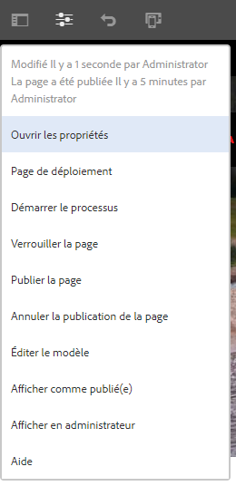
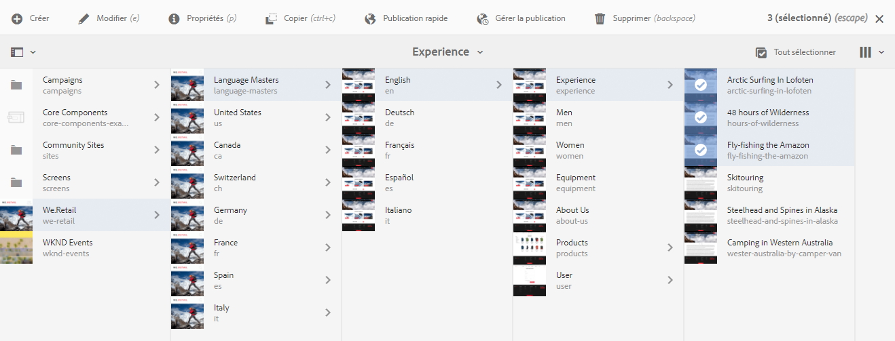
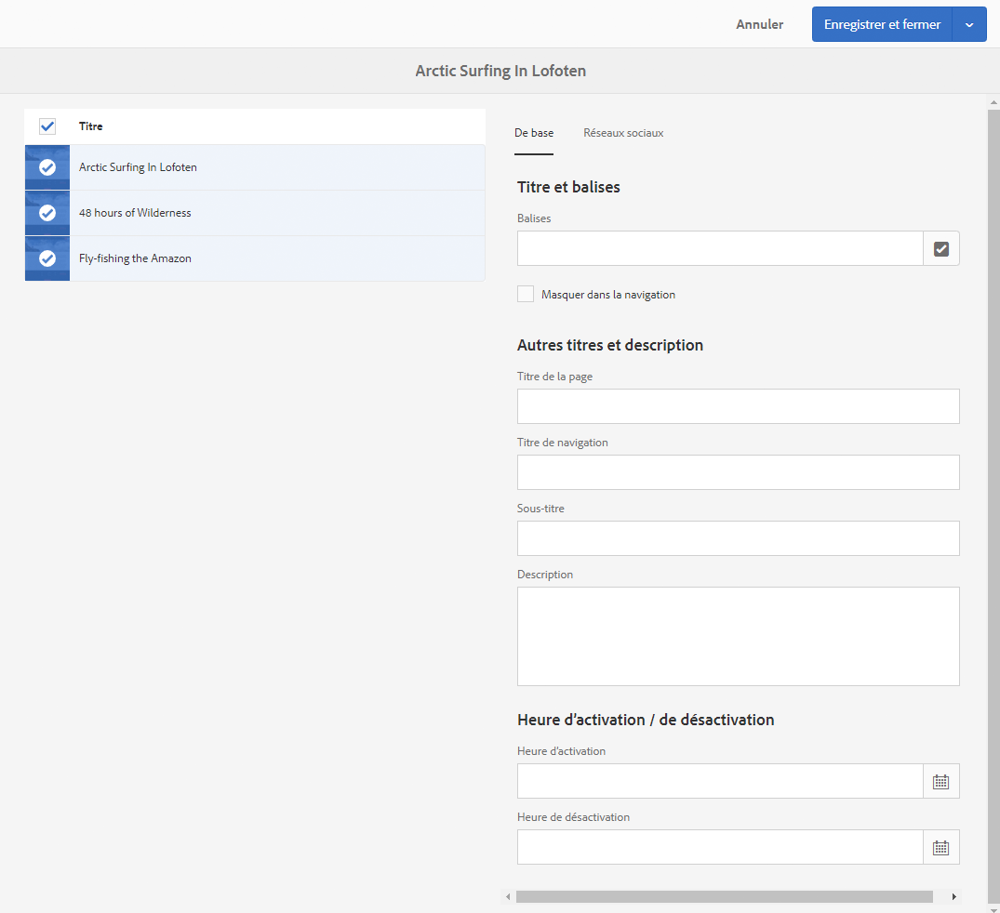

# Modification des propriétés de page{#editing-page-properties}

Vous pouvez définir les propriétés requises pour une page. Celles-ci peuvent varier selon la nature de la page. Par exemple, certaines pages peuvent être connectées à une Live Copy, et d’autres pas, et les informations Live Copy seront disponibles suivant le cas.

## Propriétés de page {#page-properties}

Les propriétés sont réparties sur plusieurs onglets.

### De base {#basic}

* **Titre**

   Le titre de la page s’affiche à divers endroits. Par exemple, la liste de l’onglet **Sites web** et les modes Carte/Liste des **Sites**.

   Ce champ est obligatoire.

* **Balises**

   Vous pouvez ajouter des balises sur la page, ou en supprimer, en mettant à jour la liste dans la zone de sélection:

   * La balise sélectionnée est alors répertoriée sous la zone de sélection. Vous pouvez supprimer une balise de cette liste à l’aide du symbole x.
   * Vous pouvez saisir une nouvelle balise en entrant son nom dans une zone de sélection vide.

      * La nouvelle balise est créée lorsque vous appuyez sur Entrée.
      * Elle s’affiche alors avec une petite étoile à droite indiquant qu’il s’agit d’une nouvelle balise.
   * Vous pouvez faire votre choix parmi les balises existantes dans la liste déroulante.
   * Un « x » apparaît lorsque vous passez le pointeur de la souris sur une entrée de balise dans la zone de sélection ; vous pouvez vous en servir pour supprimer cette balise de la page.

   Pour plus d’informations sur les balises, voir [Utilisation des balises](/help/sites-authoring/tags.md).

* **Masquer dans la navigation**

   Indique si la page doit être affichée ou masquée dans la navigation entre les pages du site qui en résulte.

* **Valorisation de marque**

   Appliquez une identité de marque cohérente sur plusieurs pages en ajoutant une limace de marque à chaque titre de page. Cette fonctionnalité nécessite l&#39;utilisation du composant de page de la version 2.14.0 ou ultérieure des [composants principaux.](https://experienceleague.adobe.com/docs/experience-manager-core-components/using/introduction.html?lang=fr)

   * **Remplacer**  : cochez la case pour définir la ligne-bloc de marque sur cette page.
      * La valeur sera héritée par toutes les pages enfants à moins que leurs valeurs **Override** ne soient également définies.
   * **Remplacer la valeur**  : texte de la ligne-bloc de marque à ajouter au titre de la page.
      * La valeur est ajoutée au titre de la page après un caractère barre verticale tel que &quot;Cycling Toscany&quot;. | Toujours prêt pour le WKND&quot;
* **Titre de la page**

   Titre à utiliser sur la page. Habituellement utilisé par les composants du titre. Si ce champ reste vide, le **titre** est utilisé.

* **Titre de navigation**

   Vous pouvez spécifier un titre distinct à utiliser dans la navigation (par exemple, si vous souhaitez qu’il soit plus concis). Si ce champ reste vide, le **titre** est utilisé.

* **Sous-titre**

   Sous-titre à utiliser sur la page.

* **Description**

   Votre description de la page, son objectif ou tout autre détail que vous souhaiteriez ajouter.

* **Heure d’activation**

   Date et heure auxquelles la page publiée sera activée. Une fois publiée, cette page restera dormante jusqu’à l’heure indiquée.

   Ne complétez pas ces champs pour les pages que vous souhaitez publier immédiatement (scénario normal).

* **Heure de désactivation**

   Heure à laquelle la page publiée sera désactivée.

   Ici encore, ne renseignez pas ces champs pour une action immédiate.

* **URL Vanity**

   Permet de saisir une URL Vanity pour cette page. Vous pouvez ainsi disposer d’une URL plus courte et/ou plus explicite.

   Par exemple, si l’URL de vanité est définie sur `welcome`pour la page identifiée par le chemin `/v1.0/startpage`pour le site Web `http://example.com,`, `http://example.com/welcome`serait l’URL de vanité de `http://example.com/content/v1.0/startpage`

   >[!CAUTION]
   >
   >L’URL Vanity :
   >
   >* doit être unique. Vous devez donc veiller à ce que la valeur ne soit pas déjà utilisée par une autre page.
   >* ne prend pas en charge les modèles d’expression régulière.
   >* ne doit pas être définie sur une page existante.

   Vous devez également configurer le répartiteur pour activer l’accès aux URL d’origine. Voir [Activation de l&#39;accès aux URL Vanity](https://docs.adobe.com/content/help/en/experience-manager-dispatcher/using/configuring/dispatcher-configuration.html#enabling-access-to-vanity-urls-vanity-urls) pour plus d&#39;informations.

* **Rediriger l’URL Vanity**

   Indique si vous souhaitez que la page utilise l’URL Vanity.

### Avancé {#advanced}

* **Langue**

   Langue de la page.

* **Racine de la langue**

   Cette option doit être activée si la page est la racine d’une copie de langue.

* **Rediriger**

   Indique la page vers laquelle cette page doit être automatiquement redirigée.

* **Conception**

   Indique la [conception](/help/sites-developing/designer.md) à utiliser pour cette page.

* **Alias**

   Indique un alias à utiliser avec cette page.

   >[!NOTE]
   >
   >L’alias définit la propriété `sling:alias` afin de définir un nom d’alias pour la ressource (cela n’affecte que la ressource, et non le chemin).
   >
   >Par exemple, si vous définissez l’alias `latin-lang` pour le nœud `/content/we-retail/spanish`, cette page est accessible via `/content/we-retail/latin-language`.
   >
   >Pour plus d’informations, voir [Noms de page localisés sous Optimisation du référencement et meilleures pratiques de gestion des URL](/help/managing/seo-and-url-management.md#localized-page-names).

* **Hérité de &lt;*chemin*>**

   Indique si la page est héritée. et de qui.

* **Configuration du cloud**

   Chemin d’accès à la configuration.

* **Modèles autorisés**

   [Définissez la liste des modèles qui seront disponibles](/help/sites-authoring/templates.md#allowingatemplate) dans cette sous-branche.

* **Activer** (exigence d’authentification)

   Activez (ou désactivez) l’utilisation de l’authentification pour accéder à la page.

   >[!NOTE]
   >
   >Les groupes d’utilisateurs fermés pour la page sont définis dans l’onglet **[Autorisations](/help/sites-authoring/editing-page-properties.md#permissions)**.

   >[!CAUTION]
   >
   >L&#39;onglet **[Permissions](/help/sites-authoring/editing-page-properties.md#main-pars-procedure-949394300)** permet de modifier les configurations CUG en fonction de la présence du mixin `granite:AuthenticationRequired`. Si les autorisations de page sont configurées à l&#39;aide de configurations CUG obsolètes, en fonction de la présence de la propriété `cq:cugEnabled`, un message d&#39;avertissement s&#39;affiche sous **Authentification requise** et l&#39;option ne sera pas modifiable, et les [Autorisations](/help/sites-authoring/editing-page-properties.md#permissions) ne seront pas modifiables.
   >
   >
   >Le cas échéant, les autorisations des groupes d’utilisateurs fermés doivent être modifiées dans l’[IU classique](/help/sites-classic-ui-authoring/classic-page-author-edit-page-properties.md).

* **Page de connexion**

   Page à utiliser pour la connexion.

* **Exporter la configuration**

   Indiquez une configuration d’exportation.

### Miniature  {#thumbnail}

Affiche l’image de la miniature de la page. Vous pouvez :

* **Générer l’aperçu**

   Génère un aperçu de la page à utiliser comme miniature.

* **Télécharger l’image**

   Télécharge une image à utiliser comme miniature.

* **Sélectionner une image**

   Sélectionne une ressource existante à utiliser comme vignette.

* **Rétablir**

   Cette option n’est disponible qu’après avoir effectué une modification de la vignette. Si vous ne souhaitez pas conserver votre modification, vous pouvez la rétablir avant de l’enregistrer.

### Réseaux sociaux {#social-media}

* **Partage sur les réseaux sociaux**

   Définit les options de partage disponibles sur la page. Affiche les options disponibles pour le [composant principal de partage](https://helpx.adobe.com/experience-manager/core-components/using/sharing.html).

   * **Activer le partage utilisateur pour Facebook**
   * **Activer le partage utilisateur pour Pinterest**
   * **Variation de fragment d’expérience préférée**
Définit la variation de fragment d’expérience utilisée pour générer les métadonnées de la page.

### Cloud Services {#cloud-services}

* **Cloud Services**

   Définissez les propriétés des [services cloud](/help/sites-developing/extending-cloud-config.md).

### Personnalisation  {#personalization}

* **Configurations ContextHub**

   Sélectionnez la [configuration ContextHub](/help/sites-developing/ch-configuring.md) et le [chemin d’accès aux segments](/help/sites-administering/segmentation.md).

* **Configuration du ciblage**

   Sélectionnez une [marque pour spécifier la portée du ciblage](/help/sites-authoring/target-adobe-campaign.md).

   >[!NOTE]
   >Cette option nécessite que le compte utilisateur figure dans le groupe `Target Adminstrators`.

### Autorisations {#permissions}

* **Autorisations**

   Sous cet onglet, vous pouvez :

   * [Ajouter des autorisations](/help/sites-administering/user-group-ac-admin.md)
   * [Modifier le groupe d’utilisateurs fermé](/help/sites-administering/cug.md#applying-your-closed-user-group-to-content-pages)

   * Afficher les [autorisations effectives](/help/sites-administering/user-group-ac-admin.md)
   >[!CAUTION]
   >
   >L&#39;onglet **Permissions** permet de modifier les configurations CUG en fonction de la présence du mixin `granite:AuthenticationRequired`. Si les autorisations de page sont configurées à l’aide de configurations des groupes d’utilisateurs fermés obsolètes, basées sur la présence de la propriété `cq:cugEnabled`, un message d’avertissement s’affiche et les autorisations des groupes d’utilisateurs fermés ne sont pas modifiables, non plus que l’option Exigence d’authentification de l’onglet [Avancé](/help/sites-authoring/editing-page-properties.md#advanced).
   >
   >
   >Le cas échéant, les autorisations des groupes d’utilisateurs fermés doivent être modifiées dans l’[IU classique](/help/sites-classic-ui-authoring/classic-page-author-edit-page-properties.md).

   >[!NOTE]
   >
   >L’onglet Autorisation ne permet pas la création de groupes d’utilisateurs fermés vides, ce qui peut être utile pour refuser l’accès à tous les utilisateurs de façon simple. Pour ce faire, vous devez utiliser l’explorateur CRX. Pour plus d&#39;informations, consultez le document [Administration des droits d&#39;utilisateur, de groupe et d&#39;accès](/help/sites-administering/user-group-ac-admin.md).

### Blueprint {#blueprint}

* **Blueprint**

   Définissez les propriétés d’une page Blueprint dans le cadre de la [gestion multi-site](/help/sites-administering/msm.md). Détermine les circonstances dans lesquelles les modifications seront diffusées à la Live Copy.

### Live Copy   {#live-copy}

* **Live Copy**

   Définissez les propriétés d’une page Live Copy dans le cadre de la [gestion multi-site](/help/sites-administering/msm.md). Détermine les circonstances dans lesquelles les modifications seront propagées à partir du plan directeur.

### Structure du site   {#site-structure}

* Diffusez des liens d’accès aux pages qui fournissent les fonctionnalités à l’échelle du site, comme la **page d’inscription** et la page **en mode hors ligne**, entre autres.

## Modification des propriétés de page {#editing-page-properties-1}

Vous pouvez définir des propriétés de page :

* Dans la console **Sites** :

   * [En créant une page](/help/sites-authoring/managing-pages.md#creating-a-new-page) (sous-ensemble des propriétés)

   * En cliquant ou en appuyant sur **Propriétés**

      * Pour une seule page
      * Pour plusieurs pages (un seul sous-ensemble des propriétés est disponible pour la modification en masse)

* Dans l’éditeur de page :

   * En sélectionnant **Informations sur la page** (puis **Ouvrir les propriétés**)

### À partir de la console Sites – Une seule page {#from-the-sites-console-single-page}

Cliquez ou appuyez sur **Propriétés** pour définir les propriétés de la page :

1. Dans la console **Sites**, accédez à l’emplacement de la page pour laquelle afficher et modifier les propriétés.

1. Sélectionnez l’option **Propriétés** pour la page requise, en utilisant :

   * [Actions rapides](/help/sites-authoring/basic-handling.md#quick-actions)
   * [mode de sélection](/help/sites-authoring/basic-handling.md#selectionmode)

   Les propriétés de la page affichées dans les onglets appropriés.

1. Affichez ou modifiez les propriétés selon les besoins.

1. Puis cliquez sur **Enregistrer** pour enregistrer vos modifications et sur **Fermer** pour revenir à la console.

### Lors de la modification d’une page {#when-editing-a-page}

Lorsque vous modifiez une page, utilisez les **Informations sur la page** pour définir ses propriétés :

1. Ouvrez la page dont vous souhaitez modifier les propriétés.

1. Sélectionnez l’icône **Informations sur la page** pour ouvrir le menu de sélection :

   

1. Sélectionnez **Ouvrir les propriétés** et une boîte de dialogue s&#39;ouvre pour vous permettre de modifier les propriétés, triées par l&#39;onglet approprié. Les boutons suivants sont également disponibles à droite de la barre d’outils :

   * **Annuler**
   * **Enregistrer et fermer**

1. Utilisez le bouton **Enregistrer et fermer** pour enregistrer les modifications.

### À partir de la console Sites – Plusieurs pages {#from-the-sites-console-multiple-pages}

Dans la console **Sites**, vous pouvez sélectionner plusieurs pages, puis utiliser **Afficher les propriétés** pour afficher et/ou modifier les propriétés de la page. On parle alors de modification en masse des propriétés de la page.

>[!NOTE]
>
>La modification en masse des propriétés est également disponible pour les ressources. La procédure est très semblable. Seuls quelques points sont différents. Pour plus d’informations, voir [Modification des propriétés de plusieurs ressources](/help/assets/metadata.md).
>
>Il existe également un [outil de modification en masse](/help/sites-administering/bulk-editor.md) qui vous permet de rechercher du contenu provenant de plusieurs pages à l’aide du langage GQL (Google Query Language), puis de le modifier directement avant d’enregistrer les modifications dans les pages d’origine.

Vous pouvez sélectionner plusieurs pages en vue d’une modification en masse de différentes façons :

* Lors de l’exploration de la console **Sites**
* Après avoir utilisé la fonction **Rechercher** pour localiser un ensemble de pages

Sélectionnez les pages et cliquez ou appuyez ensuite sur l’option **Propriétés** pour afficher les propriétés en bloc :

Vous ne pouvez modifier en masse que des pages qui :

* Partagent le même type de ressource.
* Ne font pas partie d’une Live Copy.

   * Si l’une de ces pages fait partie d’une Live Copy, un message s’affiche lorsque les propriétés sont ouvertes.

Une fois le mode de modification en bloc activé, vous pouvez effectuer les opérations suivantes :

* **Mode**

   Lors de l’affichage des propriétés de plusieurs pages, vous pouvez consulter :

   * La liste des pages affectées

      * Vous pouvez, au besoin, en sélectionner/désélectionner.
   * Onglets

      * Comme c’est le cas lors de l’affichage des propriétés d’une seule page, celles-ci sont organisées sous des onglets.
   * Un sous-ensemble de propriétés

      * Les propriétés qui sont disponibles sur toutes les pages sélectionnées, et qui ont été définies explicitement comme étant disponibles pour la modification en masse, sont visibles.
      * Si vous réduisez la sélection à une seule page, toutes les propriétés sont alors visibles.
   * Propriétés communes partageant une valeur commune

      * Seules les propriétés qui partagent une valeur commune sont visibles en mode Affichage.
      * Si le champ comporte plusieurs valeurs (Balises, par exemple), les valeurs ne sont visibles que lorsque *toutes* sont communes. Si seulement quelques-unes sont communes, elles sont visibles lors de la phase de modification.

   En l’absence de propriétés avec une valeur commune, un message s’affiche.

* **Modifier**

   En cas de modification des propriétés de plusieurs pages :

   * Vous pouvez mettre à jour les valeurs dans les champs disponibles.

      * Les nouvelles valeurs sont appliquées à toutes les pages sélectionnées lorsque vous appuyez sur **Terminé**.
      * Lorsque le champ comporte plusieurs valeurs (Balises, par exemple), vous pouvez ajouter une valeur ou supprimer une valeur commune.
   * Les champs qui sont communs, mais pour lesquels des valeurs différentes sont renseignées dans les différentes pages, sont signalés par une valeur spéciale, par exemple par le texte `<Mixed Entries>`. Vous devez être prudent lors de la modification de ces champs afin d’éviter toute perte de données.

>[!NOTE]
>
>Le composant de page peut être configuré pour spécifier les champs disponibles en vue de la modification en masse. Reportez-vous à la section [Configuration de votre page en vue de la modification en masse des propriétés](/help/sites-developing/bulk-editing.md).
