# Votre boîte de réception  {#your-inbox}

Vous pouvez recevoir des notifications de diverses sections d’AEM, y compris des workflows et des projets. Ces notifications peuvent par exemple concerner les éléments suivants :

* Tâches :

   * ces notifications peuvent également être créées à différents endroits de l’interface utilisateur AEM, par exemple, sous **Projets** ;
   * elles peuvent être générées par l’étape **Créer une tâche** ou **Créer une tâche de projet** d’un workflow.

* Workflows :

   * tâches correspondant à des opérations que vous devez exécuter sur le contenu de la page ;

      * ces notifications sont générées par l’étape **Participant** des workflows
   * éléments d’échec, pour permettre aux administrateurs de relancer l’étape qui a échoué.

Vous recevez ces notifications dans votre propre boîte de réception où vous pouvez les visualiser et effectuer des actions.

>[!NOTE]
>
>AEM est fourni avec des tâches administratives prêtes à l’emploi attribuées au groupe d’utilisateurs administrateurs. Voir [Tâches administratives prêtes à l’emploi](#out-of-the-box-administrative-tasks) pour plus d’informations.

>[!NOTE]
>
>Pour plus d’informations sur les types d’éléments, voir aussi :
>
>* [Projets](/help/sites-authoring/touch-ui-managing-projects.md)
>* [Projets – Utilisation des tâches](/help/sites-authoring/task-content.md)
>* [Workflows](/help/sites-authoring/workflows.md)
>* [Formulaires](/help/forms/home.md)

>

## Boîte de réception dans l’en-tête {#inbox-in-the-header}

Dans les deux consoles, le nombre actuel d’éléments présents dans votre boîte de réception est indiqué dans l’en-tête. Vous pouvez également ouvrir l’indicateur pour accéder rapidement aux pages nécessitant une ou plusieurs opérations ou pour accéder à la boîte de réception :

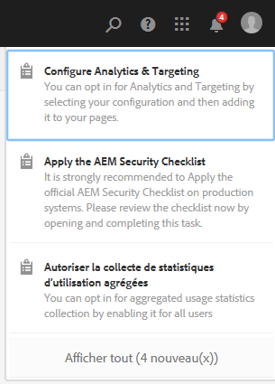

>[!NOTE]
>
>Certaines opérations sont également répertoriées en [mode Carte de la ressource appropriée](/help/sites-authoring/basic-handling.md#card-view).

## Tâches administratives prêtes à l’emploi  {#out-of-the-box-administrative-tasks}

AEM est fourni avec quatre tâches prêtes à l’emploi attribuées au groupe d’utilisateurs administrateurs.

* [Configurer Analytics et Targeting](/help/sites-administering/opt-in.md)
* [Appliquer la liste de contrôle de sécurité AEM](/help/sites-administering/security-checklist.md)
* Autoriser la collecte de statistiques d’utilisation agrégées
* [Configurer HTTPS](/help/sites-administering/ssl-by-default.md)

## Ouverture de la boîte de réception   {#opening-the-inbox}

Pour ouvrir la boîte de réception des notifications AEM :

1. Cliquez/appuyez sur l’indicateur dans la barre d’outils.

1. Sélectionnez **Afficher tout**. La **boîte de réception AEM** s’ouvre. La boîte de réception affiche les éléments des workflows, des projets et des tâches.
1. La vue par défaut est [Liste](#inbox-list-view), mais vous pouvez également passer à la [Vue Calendrier](#inbox-calendar-view). Pour ce faire, utilisez le sélecteur de vue (barre d’outils, en haut à droite).

   Vous pouvez également définir les [paramètres d’affichage](#inbox-view-settings) pour ces deux modes ; les options disponibles dépendent du mode actif.

   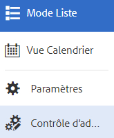

>[!NOTE]
>
>La boîte de réception fonctionne comme une console. Vous pouvez ainsi utiliser la [navigation globale](/help/sites-authoring/basic-handling.md#global-navigation) ou la fonction de [recherche](/help/sites-authoring/search.md) pour accéder à un autre emplacement lorsque vous avez terminé.

### Boîte de réception – Mode Liste {#inbox-list-view}

Ce mode affiche tous les éléments, ainsi que les principales informations clés :

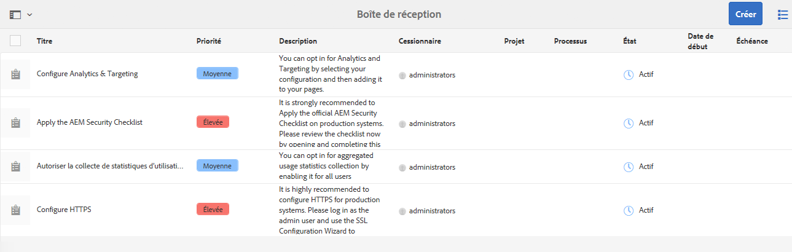

### Boîte de réception – Mode Calendrier {#inbox-calendar-view}

Ce mode affiche les éléments en fonction de leur position dans le calendrier et du mode d’affichage que vous avez sélectionné :

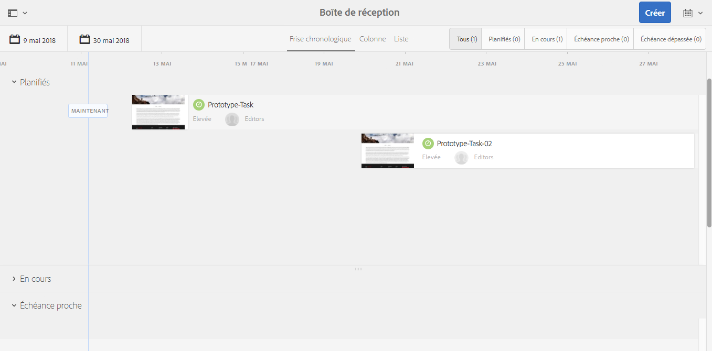

Vous pouvez :

* sélectionner un mode d’affichage spécifique (**Chronologie**, **Colonne**, **Liste**) ;

* spécifier les tâches à afficher (**Planification**, **Tous**, **Planifiés**, **En cours**, **Échéance proche** et **Échéance dépassée**) ;

* descendre dans la hiérarchie pour obtenir plus d’informations sur un élément ;
* sélectionner une période sur laquelle cibler la vue :

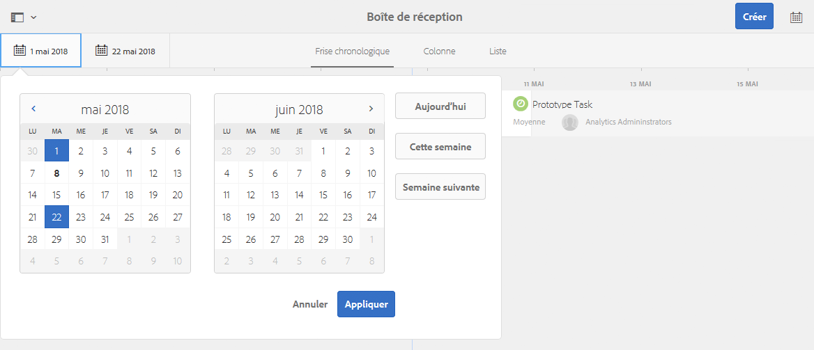

### Inbox - Settings {#inbox-view-settings}

Vous pouvez définir des paramètres d’affichage pour les deux modes (Liste et Calendrier) :

* **Vue Calendrier**

   Pour le **mode Calendrier**, vous pouvez configurer les paramètres suivants :

   * **Regrouper par**
   * **Planification** ou **Aucun**
   * **Taille des cartes**

   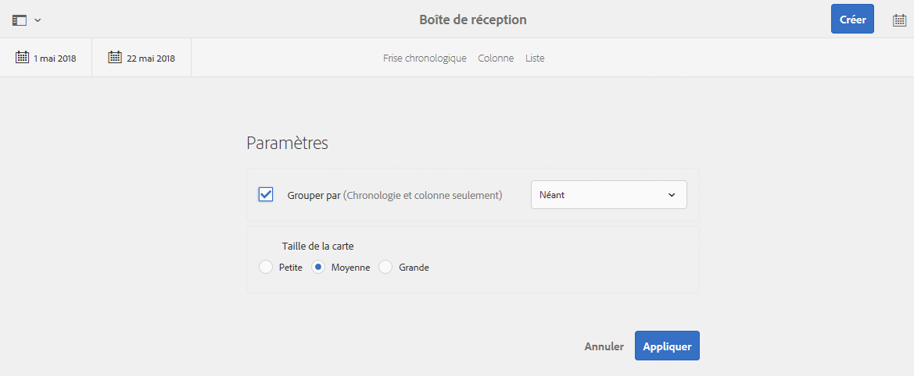

* **Mode Liste**

   Pour le **mode Liste**, vous pouvez configurer le mécanisme de tri :

   * **Champ de tri**
   * **Ordre de tri**

   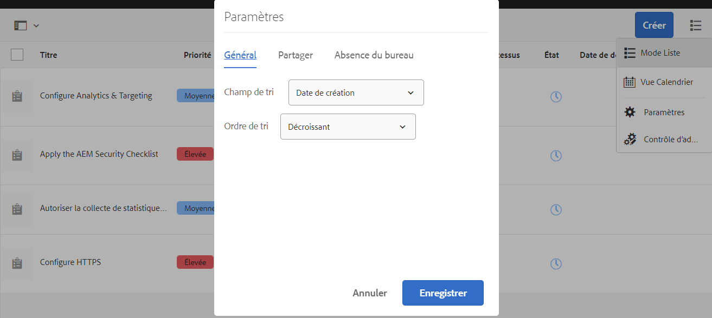

### Boîte de réception - Contrôle d’administration {#inbox-admin-control}

L’option Contrôle d’administration permet aux administrateurs d’effectuer les opérations suivantes :

* Personnalisation des colonnes de la boîte de réception AEM

* Personnaliser le texte et le logo de l&#39;en-tête

* Contrôler l&#39;affichage des liens de navigation disponibles dans l&#39;en-tête

L’option Contrôle d’administration n’est visible que pour les membres du `administrators` groupe ou `workflow-administrators` du groupe.

* **Personnalisation** des colonnes : Personnalisez une boîte de réception AEM pour modifier le titre par défaut d&#39;une colonne, réorganiser la position d&#39;une colonne et afficher des colonnes supplémentaires en fonction des données d&#39;un flux de travail.
   * **Ajouter la colonne**: Sélectionnez une colonne à ajouter dans AEM boîte de réception.
   * **Modifier la colonne**: Placez le pointeur de la souris sur le titre de la colonne et appuyez sur l’icône  pour entrer un nom d’affichage de colonne.
   * **Supprimer la colonne**: Appuyez sur l’icône  pour supprimer la colonne de AEM boîte de réception.
   * **Déplacer la colonne**: Faites glisser l’icône  pour déplacer une colonne vers un nouvel emplacement dans AEM boîte de réception.

   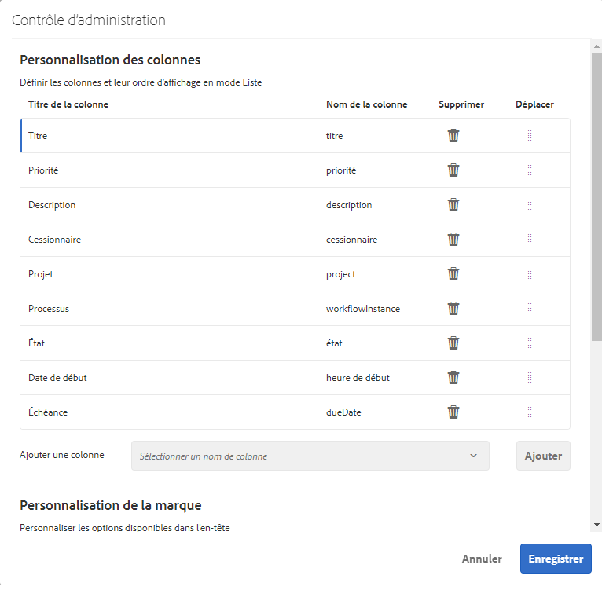

* **Personnalisation de l’identité graphique**

   * **Personnaliser le texte de l&#39;en-tête :** Spécifiez le texte à afficher dans l’en-tête pour remplacer le texte **Adobe Experience Manager** par défaut.

   * **Personnaliser le logo :** Spécifiez l’image à afficher dans l’en-tête sous forme de logo. Téléchargez une image dans le module de gestion des actifs numériques (DAM) et référencez-la dans le champ.

* **Navigation de l’utilisateur**
   * **Masquer les options de navigation :** Sélectionnez cette option pour masquer les options de navigation disponibles dans l’en-tête. Les options de navigation comprennent des liens vers d’autres solutions, des liens d’aide et les options de création disponibles lorsque vous appuyez sur le logo ou le texte Adobe Experience Manager.
* **Enregistrer :** Appuyez/cliquez sur cette option pour enregistrer les paramètres.

## Action sur un élément {#taking-action-on-an-item}

>[!NOTE]
>
>Bien qu’il soit possible de sélectionner plusieurs éléments, des actions ne peuvent être entreprises que sur un seul élément à la fois.

1. Pour agir sur un élément, sélectionnez la miniature de l’élément souhaité. Les icônes des actions applicables à cet élément apparaissent dans la barre d’outils :

   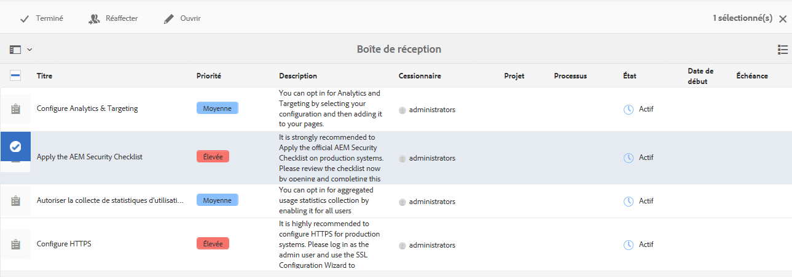

   Les actions disponibles varient selon l’élément et incluent les opérations suivantes :

   * **Terminer** l’action; par exemple, une tâche ou un élément de processus.
   * **Réaffecter**/**Déléguer** un élément.
   * **Ouvrir** un élément ; selon le type d’élément, cette action permet d’effectuer les opérations suivantes :

      * Afficher les propriétés de l’élément.
      * Ouvrir un tableau de bord ou un assistant pour effectuer d’autres actions.
      * Ouvrir la documentation associée.
   * **Revenir** à une étape précédente.
   * Afficher la charge utile pour un workflow.
   * Créer un projet à partir de l’élément.

   >[!NOTE]
   >
   >Pour plus d’informations, voir :
   >
   >* Éléments de workflow – [Participation aux workflows](/help/sites-authoring/workflows-participating.md)

1. Une action démarre en fonction de l’élément sélectionné ; par exemple :

   * Une boîte de dialogue correspondant à l’opération s’ouvre.
   * Un assistant d’action démarre.
   * Une page de documentation s’ouvre.

   Par exemple, **Réaffecter** ouvre une boîte de dialogue :

   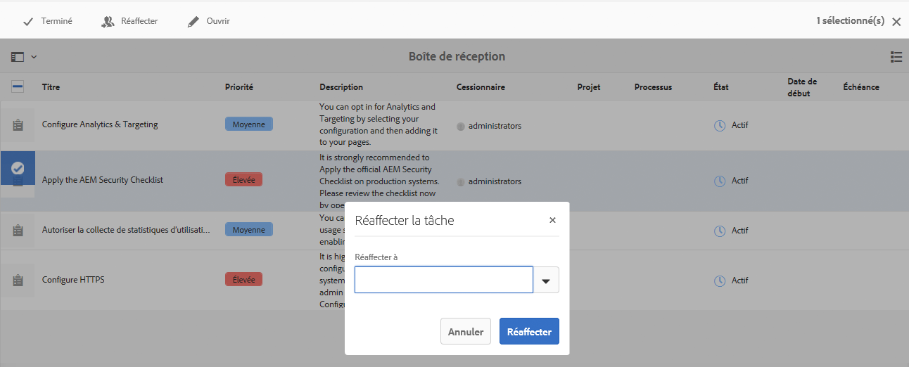

   Selon qu’une boîte de dialogue, une page de documentation ou un assistant a été ouvert, vous pouvez :

   * Confirmer l’action appropriée, par exemple Réaffecter.
   * Annuler l’action.
   * Cliquer sur la flèche Précédent ; par exemple, si une page de documentation ou un assistant d’action a été ouvert, vous pouvez revenir à la boîte de réception.

## Création d’une tâche {#creating-a-task}

Vous pouvez créer des tâches directement à partir de la boîte de réception :

1. Sélectionnez **Créer**, puis **Tâche**.
1. Renseignez les champs nécessaires dans les onglets **De base** et **Avancé** ; seul le champ **Titre** est obligatoire, tous les autres sont facultatifs :

   * **De base** :

      * **Titre**
      * **Projet**
      * **Cessionnaire**
      * **Contenu** : similaire à Charge utile ; il s’agit d’une référence de la tâche à un emplacement dans le référentiel
      * **Description**
      * **Priorité de la tâche**
      * **Date de début**
      * **Échéance**

   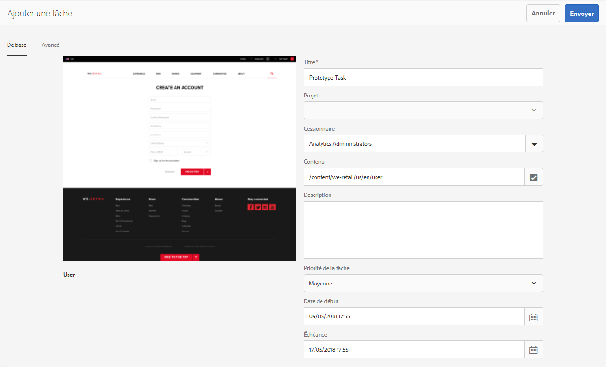

   * **Avancé**

      * **Nom** : ce champ est utilisé pour former l’URL ; s’il est vide, le nom est basé sur le champ **Titre**.

   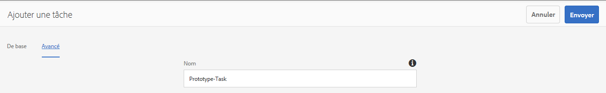

1. Sélectionnez **Envoyer**.

## Création d’un projet {#creating-a-project}

Pour certaines tâches, vous pouvez créer un [projet](/help/sites-authoring/projects.md) basé sur cette tâche :

1. Sélectionnez la tâche appropriée en appuyant/cliquant sur la miniature.

   >[!NOTE]
   >
   >Seules les tâches créées à l’aide de l’option **Créer** de la **boîte de réception** peuvent être utilisées pour créer un projet.
   >
   >Les éléments de travail (d’un workflow) ne peuvent pas être utilisés pour créer un projet.

1. Sélectionnez **Créer un projet** depuis la barre d’outils pour ouvrir l’assistant.
1. Sélectionnez le modèle approprié, puis **Suivant**.
1. Spécifiez les propriétés requises :

   * **De base**

      * **Titre**
      * **Description**
      * **Date de début**
      * **Échéance**
      * **Utilisateur** et rôle
   * **Avancé**

      * **Nom**
   >[!NOTE]
   >
   >Pour plus d’informations, voir [Création d’un projet](/help/sites-authoring/touch-ui-managing-projects.md#creating-a-project).

1. Sélectionnez **Créer** pour confirmer l’action.

## Filtrage des éléments dans la boîte de réception AEM {#filtering-items-in-the-aem-inbox}

Vous pouvez filtrer les éléments répertoriés :

1. Ouvrez la **boîte de réception AEM**.

1. Ouvrez le sélecteur de filtre :

   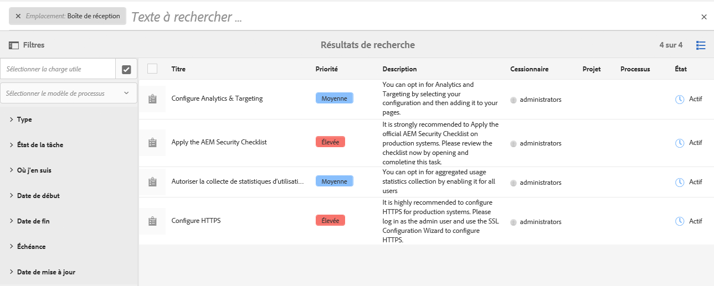

1. Vous pouvez filtrer les éléments répertoriés en fonction d’une série de critères, pouvant pour la plupart être affinés, par exemple :

   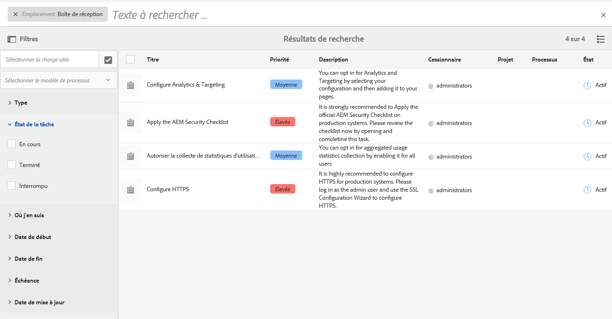

   >[!NOTE]
   >
   >En [mode Liste](#inbox-view-settings), vous pouvez également configurer l’ordre de tri dans les [paramètres d’affichage](#inbox-list-view).

