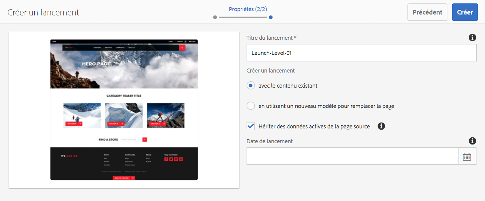

# Création de lancements{#creating-launches}

Créez un lancement pour permettre la mise à jour d’une nouvelle version des pages web existantes en vue d’une activation future. Lors de la création d’un lancement, vous devez spécifier un titre et la page source :

* Le titre apparaît dans le rail [Références](/help/sites-authoring/author-environment-tools.md#references), à partir duquel les auteurs peuvent accéder aux références afin de les modifier.
* Les pages enfants de la page source sont incluses, par défaut, dans le lancement. Si vous le souhaitez, vous pouvez n’utiliser que la page source.
* Par défaut, [Live Copy](/help/sites-administering/msm.md) met automatiquement à jour les pages de lancement à mesure que les pages source changent. Vous pouvez spécifier qu’une copie statique soit créée afin d’empêcher les modifications automatiques.

Vous pouvez éventuellement indiquer la **date de lancement** (et l’heure) pour définir le moment auquel les pages de lancement doivent être promues et activées. Toutefois, la **date de lancement** fonctionne uniquement en conjonction avec l’indicateur **Prêt pour la production** (voir [Modification d’une configuration de lancement](/help/sites-authoring/launches-editing.md#editing-a-launch-configuration)). Pour que les actions se produisent automatiquement, les deux doivent être définis.

## Création d’un lancement {#creating-a-launch}

Vous pouvez créer un lancement à partir de la console Sites ou Lancements :

1. Ouvrez la console **Sites** ou **Lancements**.

   >[!NOTE]
   >
   >Lorsque vous utilisez la console **Sites**, il est normal de naviguer jusqu’à l’emplacement de la page source, mais ce n’est pas obligatoire puisque vous pouvez naviguer en sélectionnant **Source de lancement** dans l’assistant.

1. Selon la console que vous utilisez :

   * **Lancements** :

      1. Sélectionnez **Créer un lancement** dans la barre d’outils pour ouvrir l’assistant.
   * **Sites** :

      1. Sélectionnez **Créer** dans la barre d’outils pour ouvrir la zone de sélection.
      1. Dans cette zone, sélectionnez **Créer un lancement** pour ouvrir l’assistant.

   >[!NOTE]
   >
   >Dans la console **Sites**, vous pouvez également utiliser le [mode de sélection](/help/sites-authoring/basic-handling.md#viewing-and-selecting-resources) pour choisir une page avant de sélectionner **Créer**.
   >
   >La page sélectionnée sera alors utilisée comme page source initiale.

1. À l’étape **Sélectionner la source**, vous devez **Ajouter des pages**. Vous pouvez sélectionner plusieurs pages en spécifiant un chemin pour chacune d’elles :

   * Accédez à l’emplacement qui vous intéresse.
   * Sélectionnez la page source et confirmez (case avec coche).

   Recommencez l’étape selon vos besoins.

   

   >[!NOTE]
   >
   >Pour ajouter des pages et/ou des branches à un lancement, elles doivent exister dans un site, c’est-à-dire sous la racine du niveau supérieur commun.
   >
   >Si le site contient des racines de langage en dessous du niveau supérieur, les pages et les branches d’un lancement doivent se trouver sous une racine de langage commun.

1. Pour chaque entrée vous pouvez indiquer s’il faut ou non :

   * **Inclure les sous-pages** :

      * Indiquez si vous souhaitez créer le lancement avec ou sans les pages enfants. Par défaut, ces sous-pages sont intégrées.

   Poursuivez en cliquant sur **Suivant**.

   

1. À l’étape **Propriétés** de l’assistant, vous pouvez définir les paramètres suivants :

   * **Titre du lancement** : nom du lancement. Ce nom doit être explicite pour les auteurs.
   * **avec le contenu existant** : le contenu d’origine sera utilisé pour créer le lancement.
   * **en utilisant un nouveau modèle pour remplacer la page** : voir [Création d’un lancement avec un nouveau modèle](#create-launch-with-new-template) pour plus de détails.
   * **Hériter des données actives de la page source** : sélectionnez cette option pour mettre automatiquement à jour le contenu des pages de lancement lors de la modification des pages source. Pour ce faire, cette option effectue le lancement d’une [copie dynamique](/help/sites-administering/msm.md).

      Par défaut, cette option est sélectionnée.

   * **Date de lancement** : date et heure d’activation de la copie de lancement (selon l’indicateur **Prêt pour la production**. Voir [Lancements – Ordre des événements](/help/sites-authoring/launches.md#launches-the-order-of-events)).

   

1. Cliquez sur **Créer** pour terminer le processus et créer le lancement. La boîte de dialogue de confirmation vous invite à ouvrir le lancement immédiatement :

   Si vous revenez à la console (en cliquant sur **Terminé**) vous pouvez afficher (et accéder à) votre lancement à partir de :

   * la console [**Lancements**](/help/sites-authoring/launches.md#the-launches-console)
   * les [**références** de la console **Sites**](/help/sites-authoring/launches.md#launches-in-references-sites-console)

### Création d’un lancement avec un nouveau modèle {#create-launch-with-new-template}

Lors de la [création d’un lancement](/help/sites-authoring/launches-creating.md#create-launch-with-new-template), vous pouvez utiliser un nouveau modèle :

**en utilisant un nouveau modèle pour remplacer la page**

>[!CAUTION]
>
>Cette option est uniquement disponible lors de la création d’un lancement à partir de la console **Sites**. Elle n’est pas disponible lors de la création d’un lancement depuis la console **Lancements**.

La sélection de cette option va :

* mettre à jour les autres options disponibles,
* inclure une nouvelle étape dans laquelle vous pouvez sélectionner le modèle requis.

>[!CAUTION]
>
>Si un autre modèle est utilisé, la nouvelle page est vide. Du fait de la structure de page différente, aucun contenu n’est copié.
>
>Ce mécanisme peut être utilisé pour modifier le modèle d’une [page existante](/help/sites-authoring/managing-pages.md#creating-a-new-page), bien que la perte du contenu doit être envisagée.

### Création d’un lancement imbriqué {#creating-a-nested-launch}

La création d’un lancement imbriqué (lancement dans un lancement) vous permet de créer un lancement à partir d’un lancement existant pour que les développeurs de contenu exploitent les modifications déjà apportées, au lieu de répercuter ces mêmes modifications à plusieurs reprises pour chaque lancement.

>[!NOTE]
>
>Voir aussi [Promotion d’un lancement imbriqué](/help/sites-authoring/launches-promoting.md#promoting-a-nested-launch).

#### Création d’un lancement imbriqué – Console Lancements {#creating-a-nested-launch-launches-console}

La création d’un lancement imbriqué à partir de la console **Lancements** est similaire à la création de tout autre type de lancement, si ce n’est que vous devez accéder à la branche de lancements `/content/launches` :

1. Dans la console **Lancements**, sélectionnez **Créer**.
1. Sélectionnez **Ajouter des pages**, puis accédez à la branche de lancements en spécifiant `/content/launches` dans le filtre. Sélectionnez la branche requise et confirmez avec **Sélectionner** :

   

1. Continuez avec **Suivant** et indiquez les **propriétés**, comme pour tout autre lancement.

   

#### Création d’un lancement imbriqué – Console Sites {#creating-a-nested-launch-sites-console}

Pour créer un lancement imbriqué à partir de la console **Sites**, sur la base d’un lancement existant :

1. Accédez à [Lancement à partir des références (console Sites)](/help/sites-authoring/launches.md#launches-in-references-sites-console) pour afficher les actions disponibles.
1. Sélectionnez **Créer un lancement** pour ouvrir l’assistant (puisque la source a déjà été sélectionnée, l’assistant ignore l’étape **Sélectionner la source**).

1. Entrez le **titre du lancement** et tous les autres détails demandés (comme s’il s’agissait d’un lancement normal).

1. Cliquez sur **Créer** pour terminer le processus et créer le lancement. La boîte de dialogue de confirmation vous invite à ouvrir le lancement immédiatement :

   Si vous sélectionnez **Terminé**, vous revenez au rail **Références** de la console **Sites**. Si vous sélectionnez la page appropriée, votre nouveau lancement est affiché.

### Suppression d’un lancement {#deleting-a-launch}

Vous pouvez supprimer un lancement à partir de la console [Lancements](/help/sites-authoring/launches.md#the-launches-console) :

* Sélectionnez le lancement en appuyant/cliquant sur la miniature.
* La barre d’outils s’affiche. Sélectionnez supprimer.
* Confirmez l’action.

>[!CAUTION]
>
>La suppression d’un lancement supprime le lancement lui-même et tous les lancements imbriqués qui en sont des descendants.

