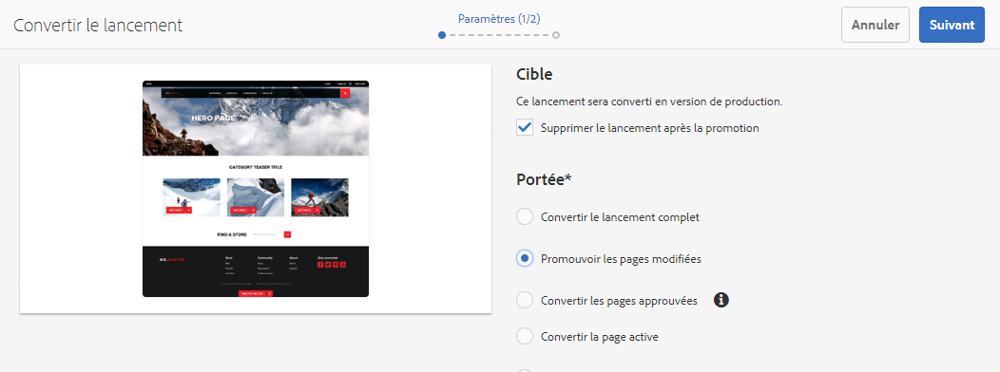
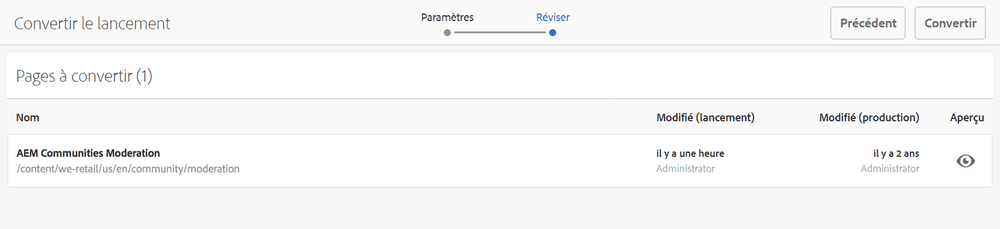
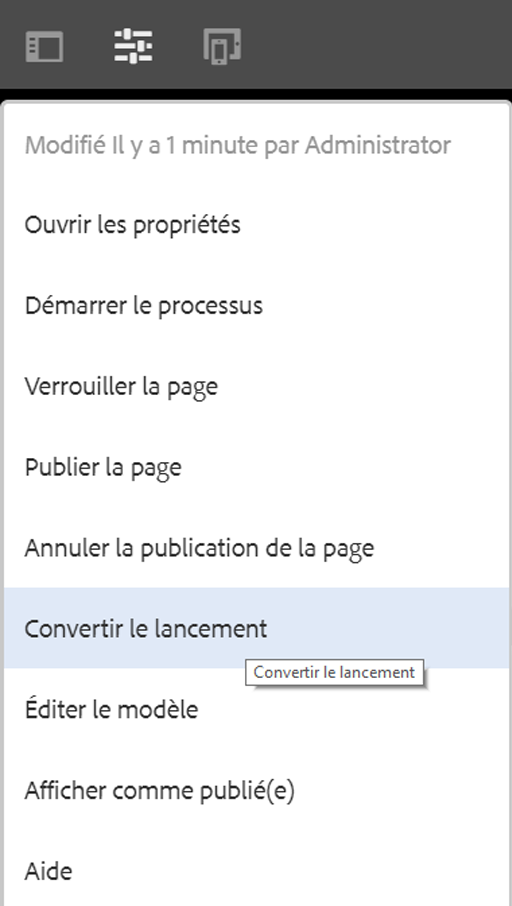
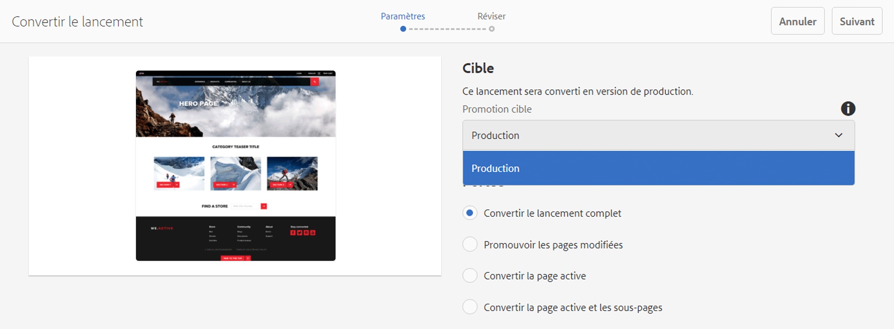
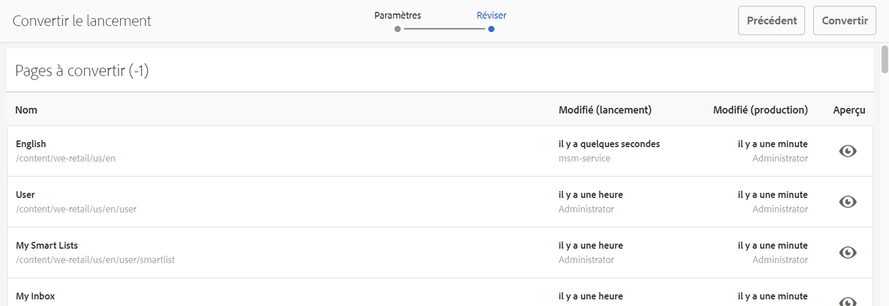
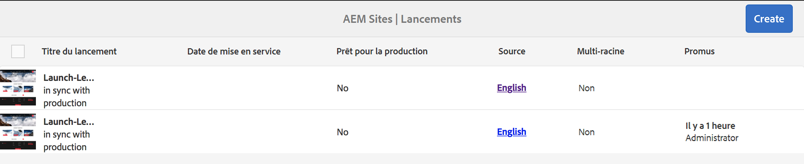
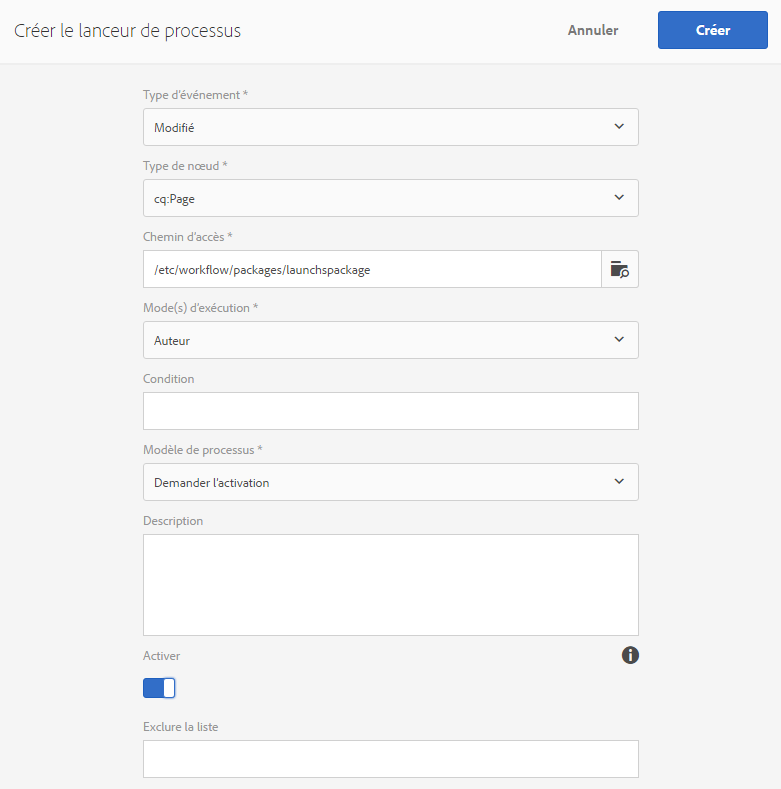

# Conversion de lancements{#promoting-launches}

Vous devez convertir des pages de lancement afin de renvoyer le contenu dans la source (production) avant de le publier. Lorsqu’une page de lancement est convertie, la page correspondante des pages sources est remplacée par la page convertie. Voici les options disponibles lors de la conversion d’une page de lancement :

* Faut-il convertir uniquement la page en cours ou l’intégralité du lancement ?
* Faut-il convertir les pages enfants de la page active ?
* Faut-il convertir l’intégralité du lancement ou uniquement des pages qui ont été modifiées ?
* Faut-il supprimer le lancement après la promotion ?

>[!NOTE]
>
>Après avoir promu les pages de lancement vers la cible (**Production**), vous pouvez activer les pages de **Production** en tant qu’entité (pour accélérer le processus). Ajoutez les pages à un package de workflow et utilisez-le comme payload pour un workflow qui active un package de pages. Vous devez créer le package de workflow avant de promouvoir le lancement. Voir [Traitement de pages converties à l’aide du workflow AEM](#processing-promoted-pages-using-aem-workflow).

>[!CAUTION]
>
>Un lancement unique ne peut pas être promu simultanément. Cela signifie que deux actions simultanées de conversion à partir du même lancement peuvent entraîner une erreur : `Launch could not be promoted` (ainsi que des erreurs de conflit dans le journal).

>[!CAUTION]
>
>Lors de la promotion du lancement des pages *modifiées*, les modifications des branches source et de lancement sont prises en compte.

## Conversion de pages de lancement {#promoting-launch-pages}

>[!NOTE]
>
>Cela concerne l’action manuelle de promotion des pages de lancement lorsqu’il n’y a qu’un seul niveau de lancement. Voir :
>
>* [Promotion d’un lancement imbriqué](#promoting-a-nested-launch) : lorsqu’il y a plusieurs lancements dans la structure.
>* [Lancements – Ordre des événements](/help/sites-authoring/launches.md#launches-the-order-of-events) pour en savoir plus sur la conversion et la publication automatiques.
>

Vous pouvez promouvoir des lancements à partir de la console **Sites** ou de la console **Lancements** :

1. Ouvrez :

   * la console **Sites** :

      1. Ouvrez le [rail de références](/help/sites-authoring/author-environment-tools.md#showingpagereferences) et sélectionnez la page source souhaitée à l’aide du [mode de sélection](/help/sites-authoring/basic-handling.md) (ou sélectionnez et ouvrez le rail de références, l’ordre n’a pas d’importance). Toutes les références s’affichent.

      1. Sélectionnez **Lancements** (par exemple Lancements (1)) pour afficher une liste de lancements particuliers.
      1. Sélectionnez le lancement pour afficher les actions disponibles.
      1. Sélectionnez **Convertir le lancement** pour ouvrir l’assistant.

   * la console **Lancements** :

      1. Sélectionnez votre lancement (appuyez/cliquez sur la miniature).
      1. Sélectionnez **Convertir**.

1. Dans la première étape, vous pouvez spécifier :

   * **Cible**

      * **Supprimer le lancement après la promotion**

   * **Portée**

      * **Convertir le lancement complet**
      * **Promouvoir les pages modifiées**
      * **Promouvoir la page active**
      * **Convertir la page active et les sous-pages**

   Par exemple, lorsque vous sélectionnez l’option visant à convertir uniquement les pages modifiées :

   

   >[!NOTE]
   >
   >Cela concerne un seul lancement, si vous avez imbriqué des lancements, voir [Promotion d’un lancement imbriqué](#promoting-a-nested-launch).

1. Sélectionnez **Suivant** pour continuer.
1. Vous pouvez passer en revue les pages à convertir. Elles dépendent de la plage de pages sélectionnée :

   

1. Sélectionnez **Convertir**.

## Conversion de pages de lancement lors de leur modification {#promoting-launch-pages-when-editing}

Lorsque vous modifiez une page de lancement, l’action **Promouvoir le lancement** est également disponible dans les **informations sur la page**. Cette action ouvre l’assistant pour collecter les informations nécessaires.

>[!NOTE]
>
>Cette option est disponible pour les lancements simples et [imbriqués](#promoting-a-nested-launch).

## Promotion d’un lancement imbriqué {#promoting-a-nested-launch}

Après avoir créé un lancement imbriqué, vous pouvez le convertir en pages source, y compris la source racine (en exploitation).

1. Comme pour la [création d’un lancement imbriqué](#creatinganestedlaunchlaunchwithinalaunch), recherchez et sélectionnez le lancement en question dans la console de **lancements** ou le rail de **références**.
1. Sélectionnez **Convertir le lancement** pour ouvrir l’assistant.

1. Saisissez les informations demandées :

   * **Cible**

      * **Convertir la cible**
Vous pouvez convertir un lancement vers n’importe quelle source.

      * **Supprimer le lancement après la conversion**
Après la conversion, le lancement sélectionné et les lancements imbriqués seront automatiquement supprimés.

   * **Portée**
Ici, vous pouvez indiquer s’il faut convertir l’intégralité du lancement ou uniquement les pages qui ont été modifiées. Dans ce dernier cas, vous pouvez choisir d’inclure ou d’exclure les sous-pages. La configuration par défaut consiste à promouvoir uniquement les modifications de la page active :

      * **Convertir le lancement complet**
      * **Promouvoir les pages modifiées**
      * **Promouvoir la page active**
      * **Convertir la page active et les sous-pages**

   

1. Sélectionnez **Suivant**.
1. Vérifiez les détails de la conversion avant de sélectionner **Convertir** :

   

   >[!NOTE]
   >
   >Les pages répertoriées dépendent de la **Portée** définie et éventuellement des pages modifiées.

1. Vos modifications prendront effet et seront reflétées dans la console **Lancements** :

   

## Traitement de pages converties à l’aide du workflow AEM {#processing-promoted-pages-using-aem-workflow}

Utilisez des modèles de processus pour effectuer le traitement en bloc des pages de lancement converties :

1. Créez un package de workflow.
1. Lorsque les personnes créant du contenu convertissent des pages de lancement, elles les stockent dans le package de workflow.
1. Démarrez un modèle de workflow en utilisant le package comme payload.

Pour démarrer automatiquement un workflow lors de la conversion des pages, [configurez un lanceur de workflows](/help/sites-administering/workflows-starting.md#workflows-launchers) pour le nœud du package.

Par exemple, vous pouvez générer automatiquement des requêtes d’activation de page lorsque les personnes créant du contenu convertissent des pages de lancement. Configurez un lanceur de workflows pour démarrer le workflow Demander l’activation lorsque le nœud du package est modifié.

