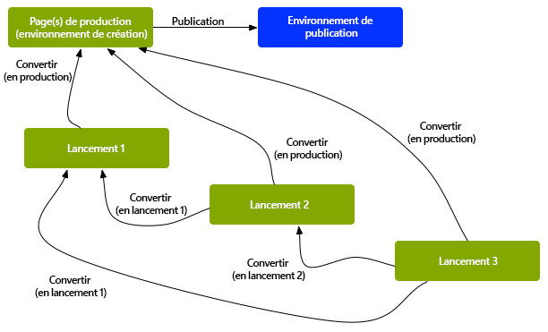

# Lancements{#launches}

Les lancements vous permettent de développer efficacement du contenu en vue d’une publication ultérieure.

Un lancement est créé afin de vous permettre d’activer des modifications pour une publication ultérieure (tout en conservant vos pages actives). Après avoir modifié et mis à jour vos pages de lancement, vous devez les promouvoir de nouveau dans la source, puis activer les pages source (de niveau supérieur). Le fait de promouvoir les pages duplique le contenu du lancement sur les pages source. Cette action peut être effectuée manuellement ou automatiquement (en fonction des champs définis lors de la création et de la modification du lancement).

Par exemple, les pages de produits saisonniers de votre boutique en ligne sont mises à jour chaque trimestre, afin que les produits présentés correspondent à la saison en cours. Pour préparer la prochaine mise à jour trimestrielle, vous pouvez créer un lancement des pages web appropriées. Tout au long du trimestre, les modifications suivantes sont cumulées dans la copie de lancement :

* Les modifications apportées aux pages source après des tâches de maintenance normales. Ces modifications sont automatiquement dupliquées dans les pages de lancement.
* Les modifications effectuées directement sur les pages de lancement en préparation du trimestre suivant.

À l’approche du trimestre suivant, vous convertissez les pages de lancement pour pouvoir modifier les pages source (contenant le contenu mis à jour). Vous pouvez convertir toutes les pages ou uniquement celles que vous avez modifiées.

Les lancements peuvent également être :

* Créés pour plusieurs branches racine. Bien que vous puissiez créer le lancement pour l’ensemble du site (et y apporter les modifications), cette action peut être inexploitable, car l’ensemble du site doit être copié. Lorsque des centaines, voire des milliers de pages sont utilisées, les configurations et les performances du système dépendent de l’action de copie et ultérieurement des comparaisons nécessaires pour les tâches de conversion.
* Imbriqués (un lancement dans un lancement) pour permettre de créer un lancement à partir d’un lancement existant, de sorte que les créateurs et créatrices de contenu puissent tirer parti des changements déjà effectués plutôt que de devoir refaire les mêmes changements pour plusieurs lancements.

Cette section explique comment créer, modifier et promouvoir (et, le cas échéant, [supprimer](/help/sites-authoring/launches-creating.md#deleting-a-launch)) les pages de lancement à partir de la console Sites ou de [la console Lancements](#the-launches-console) :

* [Création de lancements](/help/sites-authoring/launches-creating.md)
* [Modification de lancements](/help/sites-authoring/launches-editing.md)
* [Conversion de lancements](/help/sites-authoring/launches-promoting.md)

## Lancements – Ordre des événements {#launches-the-order-of-events}

Les lancements vous permettent de développer efficacement du contenu pour une prochaine publication d’une ou de plusieurs pages web activées.

Les lancements permettent d’effectuer les opérations suivantes :

* Créez une copie de vos pages source :

   * La copie est votre lancement.
   * Les pages source de niveau supérieur sont connues sous le nom de **Production**.

      * Les pages source peuvent provenir de plusieurs branches (distinctes).

  

* Modifier la configuration de lancement :

   * Ajoutez ou supprimez des pages et/ou des branches au/du lancement.
   * Modifiez des propriétés de lancement, comme le **titre**, la **date de lancement** et l’indicateur **Prêt pour la production**.

* Vous pouvez convertir et publier le contenu manuellement ou automatiquement :

   * Manuellement :

      * Effectuez la promotion de votre contenu de lancement dans la **cible** (pages source) lorsqu’elles sont prêtes à être publiées.
      * Publiez le contenu à partir des pages source (après leur promotion).
      * Effectuez la promotion de toutes les pages ou uniquement des pages modifiées.

   * Automatiquement, ce qui implique les étapes suivantes :

      * Le champ **Date de** **lancement** (**En direct**) : ce paramètre peut être défini lors de la création ou de la modification du lancement.

      * L’indicateur **Prêt pour la production** : cette option ne peut être définie que lors de la modification d’un lancement.
      * Si l’indicateur **Prêt pour la production** est défini, le lancement sera automatiquement converti en pages de production à la **date** de **lancement** (**En direct**) spécifiée. Après la promotion, les pages de production sont automatiquement publiées.\
        Si aucune date n’a été définie, l’indicateur n’a aucun effet.

* Mettez à jour vos pages source et de lancement en parallèle :

   * Les modifications apportées aux pages source sont automatiquement appliquées à la copie de lancement (si elle a été configurée avec un héritage, c’est-à-dire comme Live Copy).
   * Les modifications apportées à la copie de lancement peuvent l’être sans interrompre les mises à jour automatiques ou modifier les pages source.

  

* [Créer un lancement imbriqué](/help/sites-authoring/launches-creating.md#creating-a-nested-launch) (un lancement dans un autre lancement) :

   * La source est un lancement existant.
   * Vous pouvez [promouvoir un lancement imbriqué](/help/sites-authoring/launches-promoting.md#promoting-a-nested-launch) à toute cible ; il peut s’agir d’un lancement parent ou des pages source de niveau supérieur (production).

  

  >[!CAUTION]
  >
  >La suppression d’un lancement supprime le lancement lui-même et tous les lancements imbriqués qui en sont des descendants.

>[!NOTE]
>
>La création et la modification de lancements exigent des droits d’accès à `/content/launches`, comme avec le groupe par défaut `content-authors`.
>
>Si vous rencontrez des problèmes, contactez votre administration système.

>[!CAUTION]
>
>La réorganisation des composants sur une page Launch n’est pas prise en charge.
>
>Lorsque la page est promue, les modifications de contenu sont répercutées mais les positions du composant ne changent pas.

### Console Lancements {#the-launches-console}

La console de lancements fournit une vue d’ensemble de vos lancements et permet d’appliquer des actions sur les lancements répertoriés. Vous pouvez accéder à la console via :

* La console **Outils** : **Outils**, **Sites**, **Lancements**.

* Ou directement avec [https://localhost:4502/libs/launches/content/launches.html](https://localhost:4502/libs/launches/content/launches.html?lang=fr)

## Lancements dans les références (console Sites) {#launches-in-references-sites-console}

1. Dans la console **Sites**, accédez à la source du/des lancement(s).
1. Ouvrez le rail **Références** et sélectionnez la page source.
1. Sélectionner **Lancements**, le ou les lancements existants seront répertoriés :

   

1. Cliquez sur le lancement correspondant, la liste des actions possibles s&#39;affiche :

   
