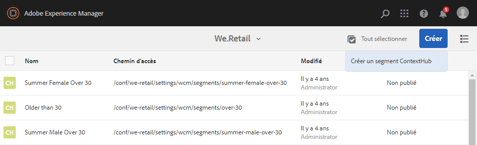
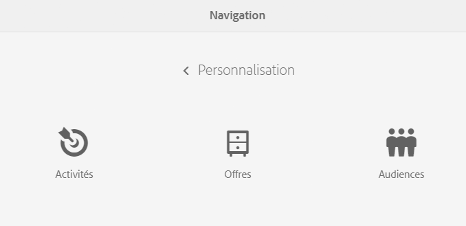
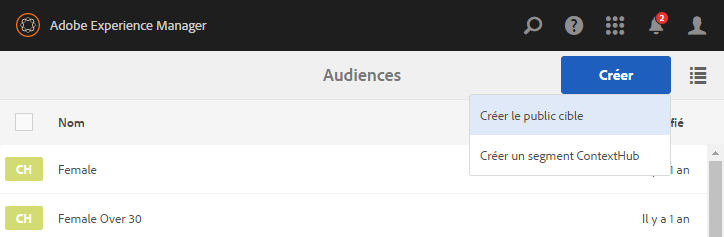

# Gestion des audiences{#managing-audiences}

La console Audiences vous permet de créer, d’organiser et de gérer des audiences pour votre compte Adobe Target ou de gérer des segments pour ContextHub ou ClientContext :

* Ajouter des audiences : audiences Adobe Target ou segments ContextHub.
* Gérer des audiences.

Une audience, appelée *segment* dans ContextHub et le contexte client, désigne une classe de visiteurs définie selon des critères spécifiques et qui détermine qui peut voir une activité ciblée. Lorsque vous ciblez une activité, vous pouvez sélectionner des audiences directement dans le processus de ciblage ou en créer d’autres dans la console Audiences.

Dans la console Audiences, les audiences sont organisées par marque.

Les audiences sont disponibles en mode ciblage pour [créer du contenu ciblé](/help/sites-authoring/content-targeting-touch.md) ou pour créer des audiences (mais vous devez créer des audiences Adobe Target dans la console Audiences). Les audiences que vous créez en mode ciblage apparaissent dans la console Audiences.

Les audiences s’affichent avec un libellé décrivant le type d’audience défini :

* CH - segment ContextHub
* CC - segment ClientContext
* AT - audience Adobe Target

## Création d’un segment ContextHub dans la console Audiences {#creating-a-contexthub-segment-in-the-audiences-console}

Vous pouvez créer un segment ContextHub dans la console Audiences ou durant le processus de ciblage.

Pour créer un segment ContextHub dans la console Audiences :

1. Dans la console Navigation, cliquez sur **Personnalisation**. Cliquez sur **Audiences**.
1. Cliquez sur **Créer un segment ContextHub**.

   

1. Dans la boîte de dialogue **Nouveau segment ContextHub**, saisissez un titre, ajustez l’amplification et cliquez sur **Créer**. Votre nouveau segment ContextHub apparaît dans la liste des audiences.

   >[!NOTE]
   >
   >Vous pouvez trier la liste modifiée en appuyant ou en cliquant sur **Modifié** pour la trier par ordre décroissant afin de voir toutes les audiences nouvellement créées.

Pour plus d’informations sur la création de segments à l’aide de ContextHub, voir la documentation [Configuration de la segmentation avec ContextHub](/help/sites-administering/segmentation.md).

## Création d’une audience Adobe Target dans la console Audiences {#creating-an-adobe-target-audience-using-the-audience-console}

Vous pouvez créer des audiences Adobe Target directement dans AEM à l’aide de la console Audiences.

Les audiences sont définies par des règles qui déterminent les personnes incluses dans une activité cible. Une définition d’audience peut inclure plusieurs règles et chaque règle peut inclure plusieurs paramètres.

Lorsque vous utilisez plusieurs règles, celles-ci sont combinées par l’opérateur booléen ET, ce qui signifie que les personnes pouvant potentiellement faire partie de l’audience doivent remplir toutes les conditions définies pour être incluses dans l’activité. Par exemple, si vous définissez une règle de système d’exploitation ET une règle de navigateur, seules les personnes utilisant le système d’exploitation défini ET le navigateur défini sont incluses dans l’activité.

>[!NOTE]
>
>Si vous ne voyez pas l’option **Créer le public cible** dans le menu **Créer**, cela signifie que vous ne disposez pas des autorisations nécessaires pour créer une audience. Vous avez besoin de droits d’accès en écriture sous **/etc/segmentation** pour pouvoir créer des audiences. Le groupe content-authors dispose par défaut d’autorisations d’écriture.

Pour créer une audience Adobe Target :

1. Dans la console Navigation, cliquez sur **Personnalisation**. Cliquez sur **Audiences**.

   

1. Dans la console Audiences, cliquez sur **Créer** puis**Créer une audience cible**.

   

1. Dans le **Configuration Adobe Target** , sélectionnez la configuration cible et cliquez sur **OK**.
1. Dans la zone Règle#1, cliquez sur le type d’attribut et saisissez les informations d’attribut dans les champs disponibles. Lorsque vous avez terminé, cochez la case située à droite de l’attribut pour l’enregistrer. Voir [Attributs et leurs options](#attributes-and-their-options) pour plus d’informations sur tous les attributs.
1. Cliquez sur **Ajouter une règle** pour ajouter une autre règle. Entrez autant de règles que nécessaire. Les règles sont combinées avec l’opérateur booléen ET, ce qui signifie que l’audience doit répondre à toutes les exigences de chaque règle pour être éligible à une activité.
1. Cliquez sur **Suivant**.
1. Saisissez le nom de l’audience et cliquez sur **Enregistrer**.
1. Cliquez sur **Enregistrer**. Votre audience est répertoriée dans la liste des audiences.

### Attributs et leurs options {#attributes-and-their-options}

Vous pouvez créer des règles de ciblage pour chacun des attributs suivants :

| **Attribut** | **Description** | **Pour plus d’informations** |
|---|---|---|
| **Mobile** | Appareils mobiles Target basés sur des paramètres tels que l’appareil mobile, le type d’appareil, le fabricant de l’appareil, les dimensions de l’écran (en pixels), etc. | Voir la [documentation mobile](https://experienceleague.adobe.com/docs/target/using/audiences/create-audiences/categories-audiences/mobile.html?lang=fr) dans Adobe Target. |
| **Personnalisé** | Les paramètres personnalisés sont des paramètres mbox. Si vous transférez des paramètres mbox à des mbox ou utilisez la fonction targetPageParams, ces paramètres apparaissent ici pour utilisation dans les audiences. | Voir la [documentation sur les paramètres personnalisés](https://experienceleague.adobe.com/docs/target/using/audiences/create-audiences/categories-audiences/custom-parameters.html?lang=fr) dans Adobe Target. |
| **Système d’exploitation** | Vous pouvez cibler les visiteurs et visiteuses qui utilisent un certain système d’exploitation. | Ciblez les utilisateurs et utilisatrices qui utilisent Linux®, Macintosh ou Windows. |
| **Pages du site** | Ciblez les visiteurs et visiteuses qui se trouvent sur une page spécifique ou qui possèdent un paramètre mBox spécifique. | Reportez-vous à la [documentation relative aux pages de site](https://experienceleague.adobe.com/docs/target/using/audiences/create-audiences/categories-audiences/site-pages.html?lang=fr) dans Adobe Target. |
| **Navigateur** | Vous pouvez cibler les utilisateurs et utilisatrices qui utilisent un navigateur spécifique ou des options de navigateur spécifiques lors de leur visite sur votre page. | Reportez-vous à la [documentation relative aux options de navigateur](https://experienceleague.adobe.com/docs/target/using/audiences/create-audiences/categories-audiences/browser.html?lang=fr) dans Adobe Target. |
| **Profil du visiteur ou de la visiteuse** | Ciblez les visiteurs et visiteuses qui respectent des paramètres de profil spécifiques. | Reportez-vous à la [documentation relative aux profils de visiteur](https://experienceleague.adobe.com/docs/target/using/audiences/visitor-profiles/visitor-profile.html?lang=fr) dans Adobe Target. |
| **Sources de trafic** | Ciblez les visiteurs et visiteuses en fonction du moteur de recherche ou de la page de destination qui les renvoie à votre site. | Reportez-vous à la [documentation relative aux sources de trafic](https://experienceleague.adobe.com/docs/target/using/audiences/create-audiences/categories-audiences/traffic-sources.html?lang=fr) dans Adobe Target. |

## Modification d’une audience dans la console Audiences {#modifying-an-audience-in-the-audiences-console}

>[!NOTE]
>
>Vous ne pouvez modifier que les audiences Adobe Target créées dans la même instance d’AEM que celle où vous effectuez des modifications. Les audiences cibles créées dans différents environnements d’AEM ne peuvent pas être modifiées.

Vous pouvez modifier n’importe quelle audience ContextHub ou ClientContext à partir de la console Audiences. Vous pouvez également modifier des audiences Adobe Target, à condition qu’elles aient été créées dans AEM :

1. Dans la console Navigation, cliquez sur **Personnalisation**. Cliquez sur **Audiences**.
1. Cliquez sur l’icône en regard du segment ContextHub ou ClientContext à modifier, puis cliquez sur **Modifier**.
1. Apportez toutes les modifications dans l’éditeur de segment. Voir la documentation [ClientContext](/help/sites-administering/campaign-segmentation.md) ou [ContextHub](/help/sites-developing/ch-configuring.md).
