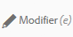
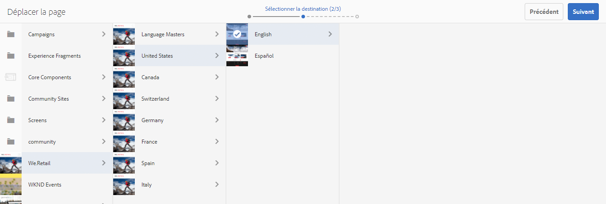

# Création et organisation des pages{#creating-and-organizing-pages}

Cette section décrit comment créer et gérer des pages avec Adobe Experience Manager (AEM) pour pouvoir ensuite [créer du contenu](/help/sites-authoring/editing-content.md) dans ces pages.

>[!NOTE]
>
>Vous devez disposer des [droits d’accès](/help/sites-administering/security.md) et [des autorisations appropriés](/help/sites-administering/security.md#permissions) sur votre compte pour agir sur les pages, notamment pour créer, copier, déplacer, modifier et supprimer du contenu.
>
>En cas de problème, contactez votre administrateur système.

>[!NOTE]
>
>Il existe un certain nombre de [raccourcis clavier](/help/sites-authoring/keyboard-shortcuts.md) à utiliser à partir de la console Sites web qui facilitent l’organisation des pages.

## Organisation du site web {#organizing-your-website}

En tant qu’auteur, vous devez organiser votre site web dans AEM. Cela implique de créer et de nommer vos pages de contenu de façon à ce que :

* vous puissiez les trouver facilement dans l’environnement de création ;
* les visiteurs sur votre site puissent facilement les parcourir dans l’environnement de publication.

Vous pouvez également vous aider de [dossiers](#creating-a-new-folder) pour organiser votre contenu.

La structure d’un site web peut être comparée à celle d’un arbre qui soutient vos pages de contenu. Les noms de ces pages de contenu sont utilisés pour former des URL qui indiquent les titres lorsque le contenu des pages est affiché.

The following shows an example from the We.Retail site, where a hiking shorts page ( `desert-sky-shorts`) is accessed:

* environnement d’auteur
   `https://localhost:4502/editor.html/content/we-retail/us/en/products/equipment/hiking/desert-sky-shorts.html`

* Environnement de publication
   `https://localhost:4503/content/we-retail/us/en/products/equipment/hiking/desert-sky-shorts.html`

Depending on the configuration of your instance, use of `/content` might be optional on the publish environment.

```xml
 /content
 /we-retail
  /us
   /en
    /products
     /equipment
      /hiking
       /desert-sky-shorts
       /hiking-poles
       /...
      /running...
      /surfing...
      /...
     /seasonal...
     /...
    /about-us
    /experience
    /...
   /es...
  /de...
  /fr...
  /...
 /...
```

Cette structure peut être visualisée à partir de la console **Sites**, dans laquelle vous pouvez [accéder aux pages de votre site web](/help/sites-authoring/basic-handling.md#navigating) et y effectuer des opérations. Vous pouvez également créer des sites et des [pages](#creating-a-new-page).

À n’importe quel point, la branche ascendante est visible à partir du chemin de navigation dans la barre d’en-tête :


### Conventions de dénomination des pages {#page-naming-conventions}

Lors de la création d’une page, il y a deux champs clés :

* **[Titre](#title)** :

   * Il s’affiche pour l’utilisateur dans la console et dans la partie supérieure du contenu de la page lors de la modification.
   * Ce champ est obligatoire.

* **[Nom](#name)** :

   * Il est utilisé pour générer l’URI.
   * L’entrée utilisateur pour ce champ est facultative. Si le nom n’est pas spécifié, il est dérivé du titre. Consultez la section [Restrictions de nom de page et bonnes pratiques](/help/sites-authoring/managing-pages.md#page-name-restrictions-and-best-practices) pour plus d’informations.

#### Restrictions de nom de page et bonnes pratiques {#page-name-restrictions-and-best-practices}

Le **Titre** et le **Nom** de la page peuvent être créés séparément, mais ils sont associés :

* lors de la création d’une page, seul le champ **Titre** est requis. Si aucun **nom** n’est indiqué lors de la création de la page, AEM génère un nom à partir des 64 premiers caractères du titre (examinez la validation présentée ci-dessous). Seuls les 64 premiers caractères sont utilisés dans le cadre de la bonne pratique définie pour les noms de pages courts.

* Si un nom de page est spécifié manuellement par l’auteur, la limite de 64 caractères ne s’applique pas, mais d’autres limitations techniques sur la longueur du nom de la page peuvent s’appliquer.

>[!NOTE]
>
>Lorsque vous définissez un nom de page, une règle de base à respecter consiste à faire en sorte que le nom de la page reste court, mais aussi significatif que possible pour faciliter la compréhension du lecteur. Consultez le [Guide de style W3C](https://www.w3.org/Provider/Style/TITLE.html) sur l’élément `title` pour obtenir des informations supplémentaires.

>N’oubliez pas que certains navigateurs (par exemple, les anciennes versions d’IE) n’acceptent que les URL n’excédant pas une certaine longueur. C’est pourquoi il existe également une raison technique de garder les noms de pages courts.
>
Lors de la création d’une page, AEM [valide le nom de la page en fonction des conventions](/help/sites-developing/naming-conventions.md) imposées par AEM et JCR.

Les caractères minimum autorisés sont :

* « a » à « z »
* « A » à « Z »
* « 0 » à « 9 »
* `_` (trait de soulignement)
* `-` (tiret/signe moins)

Vous trouverez la liste complète et détaillée des caractères autorisés dans les [conventions de dénomination](/help/sites-developing/naming-conventions.md).

>[!NOTE]
Si AEM est exécuté sur un [déploiement de gestionnaire de persistance MongoMK](/help/sites-deploying/recommended-deploys.md), les noms de page sont limités à 150 caractères.

#### Titre {#title}

Si vous n’indiquez qu’un **titre** de page lors de la création d’une page, AEM utilise le **nom**[ de la page de cette chaîne et valide le nom en fonction des conventions imposées par AEM et JCR. ](/help/sites-developing/naming-conventions.md) A **Title** field containing invalid characters will be accepted, but the name derived will have the invalid characters subsituted. Par exemple :

| Titre | Nom dérivé |
|---|---|
| Schön | schoen.html |
| SC%&amp;*ç+ | sc---c-.html |

#### Nom {#name}

Si vous indiquez un **nom** de page lors de la création d’une page, AEM valide le nom en fonction des conventions imposées par AEM et JCR. [](/help/sites-developing/naming-conventions.md) Vous ne pouvez pas utiliser de caractères non valides dans le champ **Nom**. Lorsqu’AEM détecte des caractères incorrects, le champ est mis en surbrillance avec un message d’explication.


>[!NOTE]
Vous devez éviter d’utiliser un code à deux lettres tel que défini par la norme ISO-639-1 comme nom de page, sauf s’il s’agit d’une racine de langue.
Pour plus d’informations, voir [Préparation du contenu pour la traduction](/help/sites-administering/tc-prep.md).

### Modèles {#templates}

Dans AEM, un modèle spécifie un type de page spécialisé. Un modèle sera utilisé comme base pour n’importe quelle page créée.

Le modèle définit la structure d’une page, notamment une miniature ainsi que d’autres propriétés. Par exemple, vous pouvez avoir des modèles distincts pour les pages de produits, les plans de sites et les informations de contact. Les modèles sont constitués de [composants](#components).

AEM comporte plusieurs modèles prêts à l’emploi. Les modèles proposés dépendent du site web individuel. Les champs clés sont les suivants :

* **Titre**
Titre affiché sur la page web obtenue.

* **Nom**
Utilisé lors de l’attribution du nom de la page.

* **Modèle**
Liste des modèles utilisables lors de la génération de la nouvelle page.

>[!NOTE]
Si cette option est configurée sur votre instance, [les auteurs de modèles peuvent créer des modèles avec l’éditeur de modèles](/help/sites-authoring/templates.md).

### Composants {#components}

Components are the elements provided by AEM so that you can add specific types of content. AEM comes with a range of [out-of-the-box components](/help/sites-authoring/default-components-console.md) that provide comprehensive functionality. These include:

* Texte
* Image
* Diaporama
* Vidéo
* Etc.

Une fois que vous avez créé et ouvert une page, vous pouvez [ajouter du contenu à l’aide des composants](/help/sites-authoring/editing-content.md#insertinganewparagraph), qui sont disponibles dans l’[explorateur de composants](/help/sites-authoring/author-environment-tools.md#componentbrowser).

>[!NOTE]
La [console Composants](/help/sites-authoring/default-components-console.md) affiche un aperçu des composants sur votre instance.

## Gestion des pages {#managing-pages}

### Création d’une page {#creating-a-new-page}

Vous devez créer une page avant de pouvoir commencer à créer du contenu, sauf si toutes les pages ont été créées au préalable :

1. Open the Sites console (for example, [https://localhost:4502/sites.html/content](https://localhost:4502/sites.html/content)).
1. Accédez à l’emplacement où créer la page.
1. Ouvrez le sélecteur de liste déroulante avec l’option **Créer** de la barre d’outils, puis sélectionnez **Page** dans la liste :

   

1. À la première étape de l’assistant, vous pouvez effectuer l’une des opérations suivantes :

   * Sélectionnez le modèle à utiliser pour créer la page, puis cliquez ou appuyez sur **Suivant** pour poursuivre.

   * Cliquez/appuyez sur **Annuler** pour interrompre le processus.
   

1. À l’étape finale de l’assistant, vous pouvez effectuer l’une des opérations suivantes :

   * Utilisez les trois onglets pour accéder aux [propriétés de la page](/help/sites-authoring/editing-page-properties.md) à attribuer à la nouvelle page, puis cliquez ou appuyez sur **Créer** pour réellement créer la page.

   * Cliquez ou appuyez sur **Précédent** pour revenir au choix du modèle.
   Les champs clés sont les suivants :

   * **Titre** :

      * Ce champ s’affiche pour l’utilisateur et est obligatoire.
   * **Nom** :

      * Il est utilisé pour générer l’URI. Si le nom n’est pas spécifié, il est dérivé du titre.
      * Si vous indiquez le **nom** d’une page lors de la création d’une page, AEM [valide le nom en fonction des conventions](/help/sites-developing/naming-conventions.md) imposées par AEM et JCR.

      * Vous **ne pouvez pas utiliser de caractères non valides** dans le champ **Nom**. Lorsque AEM détecte des caractères non valides, le champ est mis en surbrillance et un message d’explication s’affiche et indique les caractères à supprimer/remplacer.
   >[!NOTE]
   Voir [Conventions de dénomination des pages](#page-naming-conventions).

   Le **Titre** au moins doit être spécifié pour créer une page.

   

1. Cliquez ou appuyez sur **Créer** pour terminer le processus et créer la page. La boîte de dialogue de confirmation vous demande si vous souhaitez **ouvrir** immédiatement la page ou revenir à la console (**Terminé**) :

   

   >[!NOTE]
   Si vous créez une page en utilisant un nom qui existe déjà à cet emplacement, le système génère automatiquement une variante du nom en y ajoutant un numéro. Par exemple, si `winter` existe déjà, le nom de la nouvelle page sera `winter0`.

1. Si vous revenez à la console, la nouvelle page est présentée :

   

>[!CAUTION]
Une fois qu’une page a été créée, son modèle ne peut plus être modifié, à moins de [créer un lancement avec un nouveau modèle](/help/sites-authoring/launches-creating.md#create-launch-with-new-template) ; vous perdrez alors tout contenu déjà existant.

### Ouverture d’une page pour la modifier {#opening-a-page-for-editing}

Après avoir créé une page ou accédé à une page existante (dans la console), vous pouvez l’ouvrir pour la modifier :

1. Ouvrez la console **Sites**.
1. Accédez à la page que vous souhaitez modifier.
1. Sélectionnez votre page à l’aide de l’une des fonctionnalités suivantes :

   * [Actions rapides](/help/sites-authoring/basic-handling.md#quick-actions)
   * le [mode de sélection](/help/sites-authoring/basic-handling.md#navigatingandselectionmode) et la barre d’outils
   Sélectionnez ensuite l’icône **Modifier** :

   

1. La page s’ouvre ; vous pouvez [la modifier](/help/sites-authoring/editing-content.md#touchoptimizedui) selon vos besoins.

>[!NOTE]
L’accès à d’autres pages à partir de l’Éditeur de page n’est possible qu’en mode Aperçu, car les liens ne sont pas actifs dans le mode d’édition.

### Copier et coller une page  {#copying-and-pasting-a-page}

Vous pouvez copier une page ainsi que toutes ses sous-pages à un nouvel emplacement :

1. Dans la console **Sites**, accédez à la page que vous souhaitez copier.
1. Sélectionnez votre page à l’aide de l’une des options suivantes :

   * [Actions rapides](/help/sites-authoring/basic-handling.md#quick-actions)
   * le [mode de sélection](/help/sites-authoring/basic-handling.md#navigatingandselectionmode) et la barre d’outils
   Sélectionnez ensuite l’icône de page **Copier** :

   

   >[!NOTE]
   En mode de sélection, cette page est fermée dès qu’elle est copiée.

1. Accédez à l’emplacement destiné à la nouvelle copie de la page.
1. L’icône **Coller** est disponible avec une flèche déroulante directement à droite :

   

   Vous pouvez effectuer l’une des actions suivantes :
   * Sélectionner l’icône de page **Coller** : une copie de la page d’origine et de toutes les pages enfants sera créée à cet emplacement.
   * Sélectionner la flèche déroulante pour afficher l’option **Coller sans enfants**. Une copie de la page d’origine sera créée à cet emplacement ; les pages enfants ne seront pas copiées.
   >[!NOTE]
   L’option **Coller sans enfants** est disponible à partir d’ [AEM 6.5 Service Pack 5](https://helpx.adobe.com/experience-manager/update-releases-roadmap.html) à partir de.

   >[!NOTE]
   Si vous copiez la page à un emplacement où il existe une page du même nom que l’original, le système génère automatiquement une variante du nom en y ajoutant un numéro. Par exemple, si `winter` existe déjà, `winter` deviendra `winter1`.

### Déplacement ou changement de nom d’une page {#moving-or-renaming-a-page}

>[!NOTE]
L’attribution d’un nouveau nom à une page doit elle aussi respecter les [conventions de dénomination des pages](#page-naming-conventions) lors de la spécification du nouveau nom de la page.

>[!NOTE]
Une page peut uniquement être déplacée vers un emplacement où le modèle sur lequel la page est basée est autorisé. See [Template Availability](/help/sites-developing/templates.md#template-availability) for more information.

La procédure pour déplacer ou renommer une page est plus ou moins la même et est gérée par le même assistant. Cet assistant permet d’effectuer les opérations suivantes :

* Renommer une page sans la déplacer.
* Déplacer la page sans la renommer.
* Déplacer et renommer une page simultanément.

AEM vous offre la possibilité de mettre à jour des liens internes vers la page dont le déplacement ou le changement de nom est en cours. Vous pouvez procéder page par page afin de bénéficier d’un confort d’utilisation optimal.

1. Accédez à la page que vous souhaitez déplacer.
1. Sélectionnez votre page à l’aide de l’une des options suivantes :

   * [Actions rapides](/help/sites-authoring/basic-handling.md#quick-actions)
   * le [mode de sélection](/help/sites-authoring/basic-handling.md#navigatingandselectionmode) et la barre d’outils
   Sélectionnez ensuite l’icône de page **Déplacer** :

   

   L’assistant de déplacement des pages s’ouvre alors.

1. À l’étape **Renommer** de l’assistant, effectuez l’une des opérations suivantes :

   * Spécifiez le nom à attribuer à la page après son déplacement et cliquez/appuyez sur **Suivant** pour poursuivre.

   * Cliquez/appuyez sur **Annuler** pour interrompre le processus.
   

   Le nom de la page peut être conservé si vous déplacez uniquement la page.

   >[!NOTE]
   Si vous déplacez la page à un emplacement où il existe une page du même nom, le système génère automatiquement une variante du nom en y ajoutant un numéro. Par exemple, si `winter` existe déjà, `winter` deviendra `winter1`.

1. À l’étape **Sélectionner la destination** de l’assistant, effectuez l’une des opérations suivantes :

   * Utilisez le [mode Colonnes](/help/sites-authoring/basic-handling.md#column-view) pour accéder au nouvel emplacement de la page :

      * Sélectionnez la destination en cliquant sur sa miniature.
      * Cliquez sur **Suivant** pour continuer.
   * Utilisez la commande **Précédent** pour revenir à l’étape de spécification du nom de la page.
   >[!NOTE]
   Par défaut, le parent de la page que vous déplacez/renommez est sélectionné comme destination.

   

   >[!NOTE]
   Si vous déplacez la page à un emplacement où il existe une page du même nom, le système génère automatiquement une variante du nom en y ajoutant un numéro. Par exemple, si `winter` existe déjà, `winter` deviendra `winter1`.

1. Si la page est liée ou référencée, ou si elle a été publiée, les détails seront répertoriés dans l’étape **Ajuster/republier**.

   Vous pouvez indiquer quelles pages sont les pages à adapter et/ou à republier.

   >[!NOTE]
   Si la page n’est ni liée ni référencée, cette étape ne sera pas disponible.

   

1. Sélectionnez **Déplacer** pour terminer le processus et déplacer ou renommer votre page.

>[!NOTE]
Si la page a déjà été publiée, le déplacement de la page annule automatiquement la publication. Par défaut, la page est republiée une fois le déplacement terminé, mais ce comportement peut être modifié en désélectionnant le champ **Republier** de l’étape **Adapter/Republier**.

>[!NOTE]
Si la page n’est pas référencée, les étapes **Ajuster/republier** sont ignorées.

### Suppression d’une page {#deleting-a-page}

1. Accédez à la page que vous souhaitez supprimer.
1. En [mode de sélection](/help/sites-authoring/basic-handling.md#viewing-and-selecting-resources), sélectionnez la page requise, puis utilisez la commande **Supprimer** de la barre d’outils :

   

   >[!NOTE]
   Par mesure de sécurité, l’icône **Supprimer la page** n’est pas disponible en tant qu’action rapide.

1. Une boîte de dialogue de confirmation s’affiche. Utilisez :

   * **Annuler** pour abandonner l’action
   * **Supprimer** pour confirmer l’action :

      * Si la page ne comporte aucune référence, elle est supprimée.
      * Si la page comporte des références, un message vous informe qu’**une ou plusieurs pages sont référencées.** Vous pouvez sélectionner **Forcer la suppression** ou **Annuler**.

>[!NOTE]
Si une page est déjà publiée, la publication est automatiquement annulée avant la suppression.

### Verrouillage d’une page {#locking-a-page}

Vous pouvez [verrouiller ou déverrouiller une page](/help/sites-authoring/editing-content.md#locking-a-page) à partir d’une console ou lorsque vous modifiez une page. Les deux environnements indiquent également si une page est verrouillée ou non.

 

### Création d’un dossier {#creating-a-new-folder}

Vous pouvez créer des dossiers pour classer vos fichiers et vos pages.

>[!NOTE]
Les dossiers doivent eux aussi respecter les [conventions de dénomination des pages](#page-naming-conventions) lors de la spécification du nouveau nom du dossier.

>[!CAUTION]
* Les dossiers ne peuvent être créés que sous **Sites** ou sous d’autres dossiers. Ils ne peuvent pas être créés sous une page.
* Les opérations standard (déplacer, copier, coller, supprimer, publier, annuler la publication et afficher/modifier les propriétés) peuvent être effectuées sur un dossier.
* Dans une Live Copy, les dossiers ne peuvent pas être sélectionnés.


1. Ouvrez la console **Sites**, puis accédez à l’emplacement requis.
1. Pour ouvrir la liste d’options, sélectionnez **Créer** dans la barre d’outils.
1. Pour afficher la boîte de dialogue, sélectionnez **Dossier**. Vous pouvez y entrer le **nom** et le **titre** :

   

1. Pour créer le dossier, sélectionnez **Créer**.
