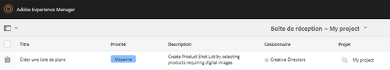

# Projet de création et intégration à PIM{#creative-project-and-pim-integration}

Si vous êtes spécialiste du marketing ou de la création, vous pouvez utiliser les outils de projet créatif de Adobe Experience Manager (AEM) pour gérer la photographie de produit liée au commerce électronique et les processus créatifs associés au sein de votre entreprise.

En particulier, vous pouvez utiliser la fonction Projet de création pour simplifier les tâches suivantes du worfklow de séance photo :

* Génération d’une demande de séance photo
* Transfert d’une séance photo
* Collaboration sur une séance photo
* Regroupement des ressources approuvées

>[!NOTE]
>
>Voir [Rôles d’utilisateur dans un projet](/help/sites-authoring/projects.md#user-roles-in-a-project) pour plus d’informations sur l’affectation des rôles d’utilisateur et des workflows à certains types d’utilisateurs.

## Exploration des workflows de séance photo de produit  {#exploring-product-photo-shoot-workflows}

La fonction Projet de création fournit divers modèles de projet pour satisfaire aux différentes exigences des projets. Le modèle **Projet de séance photo du produit** est prêt à l’emploi. Ce modèle inclut des workflows de séance photo qui permettent de lancer et de gérer des demandes de séance photo de produit. Il comprend également une série de tâches qui vous permettent d’obtenir des images numériques des produits par l’intermédiaire de processus de révision et d’approbation appropriés.

Le modèle comporte les workflows suivants :

* **Séance photo du produit (intégration de commerce)** : ce worfklow tire parti de l’intégration de commerce avec le système de gestion des informations produit (PIM) afin de générer automatiquement une liste de plans pour les produits sélectionnés (hiérarchie). Vous pouvez afficher les données de produit parmi les métadonnées des ressources une fois que le worfklow est terminé.
* **Séance photo du produit** : ce worfklow vous permet de fournir une liste de plans au lieu de dépendre de l’intégration de commerce. Il mappe les images transférées à un fichier CSV dans le dossier des ressources du projet.

>[!NOTE]
>
>Le fichier CSV transféré dans la tâche Transférer la liste de plans du worfklow Séance photo du produit doit avoir pour nom shotlist.csv.

## Création d’un projet de séance photo du produit {#create-a-product-photo-shoot-project}

1. Dans la console **Projets**, appuyez/cliquez sur **Créer**, puis sélectionnez **Créer un projet** dans la liste.

   

1. Sur la page **Créer un projet**, sélectionnez un modèle de projet de séance photo et appuyez/cliquez sur **Suivant**.

   

1. Saisissez les détails du projet, y compris le titre, la description et l’échéance. Ajoutez des utilisateurs et affectez-leur les différents rôles. Vous pouvez également ajouter une vignette au projet.

   

1. Cliquez/appuyez sur **Créer**. Un message de confirmation indique que le projet est créé.
1. Appuyez/cliquez sur **Terminé** pour revenir à la console **Projets**. Vous pouvez également appuyer/cliquer sur **Ouvrir** pour vue des ressources dans le projet de prise de vue.

## Commencer à travailler dans un projet de séance photo du produit {#starting-work-in-a-product-photo-shoot-project}

Pour lancer une demande de séance photo, appuyez ou cliquez sur un projet, puis sur **Ajouter un travail** dans la page des détails du projet afin de démarrer un worfklow.


Un projet de séance photo du produit comprend les workflows prêts à l’emploi suivants :

* Worfklow Séance photo du produit (Intégration de commerce)
* Worfklow Séance photo du produit

Utilisez le worfklow Séance photo du produit (Intégration de commerce) pour associer les ressources d’images aux produits d’AEM. Ce worfklow tire parti de l’intégration de commerce pour lier les images approuvées aux données de produit existantes à l’emplacement */etc/commerce*.

Le flux de travaux de prise de vue photo de produit (intégration commerciale) comprend les tâches suivantes :

* Créer une liste de plans
* Transférer la séance photo
* Retoucher la séance photo
* Réviser et approuver
* Déplacer vers la tâche de production

Si les informations produit ne sont pas disponibles dans AEM, utilisez le worfklow Séance photo du produit pour associer les ressources d’images aux produits en fonction des détails que vous transférez dans un fichier CSV. Le fichier CSV doit contenir des informations de base sur le produit, telles que l’ID de produit, la catégorie et la description. Le worfklow récupère les ressources approuvées pour les produits.

Ce worfklow implique les tâches suivantes :

* Transférer la liste de plans
* Transférer la séance photo
* Retoucher la séance photo
* Réviser et approuver
* Déplacer vers la tâche de production

Vous pouvez personnaliser ce worfklow à l’aide de l’option de configuration de workflows.

Les deux workflows incluent des étapes pour lier les produits à leurs ressources approuvées. Chaque worfklow comprend les étapes suivantes :

* Configuration de workflows : décrit les options pour personnaliser le worfklow.
* Lancement d’un worfklow de projet : explique comment lancer une séance photo du produit.
* Détails des tâches de worfklow : fournit le détail des tâches disponibles dans le worfklow.

## Suivi de la progression du projet    {#tracking-project-progress}

Vous pouvez effectuer le suivi de l’avancement d’un projet en consultant les tâches actives/terminées au sein d’un projet.

Utilisez les éléments suivants pour surveiller la progression d’un projet :

* **Carte des tâches**

* **Liste de tâches**

La carte de Tâche illustre l&#39;avancement général du projet. Elle s’affiche sur la page Détails du projet si celui-ci contient des tâches associées. La carte des tâches affiche l’état d’achèvement actuel du projet en fonction du nombre de tâches terminées. Elle n’inclut pas les tâches ultérieures.

La carte des tâches contient les informations suivantes :

* Pourcentage de tâches actives
* Pourcentage de tâches terminées


La liste de tâches fournit des informations détaillées sur la tâche active du worfklow pour le projet. Pour afficher la liste, appuyez/cliquez sur la carte des tâches. La liste de tâches affiche également des métadonnées telles que la date de début, l’échéance, le cessionnaire, la priorité et l’état de la tâche.



## Configuration du worfklow {#workflow-configuration}

Cette tâche consiste à affecter des étapes de worfklow aux utilisateurs en fonction de leurs rôles.

Pour configurer le worfklow **Séance photo du produit** :

1. Accédez à **Outils** > **Workflows**, puis appuyez sur la mosaïque **Modèles** pour ouvrir la page **Modèles de flux de travail**.
1. Sélectionnez le flux de travail **Début de la photo du produit**, puis appuyez sur l&#39;icône **Modifier** de la barre d&#39;outils pour l&#39;ouvrir en mode d&#39;édition.

   

1. Dans la page **Flux de travaux de prise de vue de photo du produit**, ouvrez une tâche de projet. Par exemple, ouvrez la tâche **Transférer la liste de plans**.

   

1. Cliquez sur l’onglet **Tâche** pour configurer ce qui suit :

   * Le nom de la tâche
   * L’utilisateur par défaut (rôle) qui reçoit la tâche
   * La priorité par défaut de la tâche, qui est affichée dans la liste de tâches de l’utilisateur
   * La description de la tâche à afficher lorsque le cessionnaire ouvre la tâche
   * L’échéance d’une tâche qui est calculée en fonction de l’heure de démarrage de la tâche

1. Cliquez sur **OK** pour enregistrer les paramètres de configuration.

   De même, vous pouvez configurer les tâches suivantes pour le worfklow **Séance photo du produit** :

   * Transférer la séance photo
   * Retoucher la séance photo
   * Critique de la séance photo
   * Déplacer vers la production

   Exécutez une procédure similaire pour configurer les tâches dans le workflow **Prise de vue de la photo du produit (intégration commerciale)**.

Cette section décrit comment intégrer la gestion des informations produit (PIM) à votre projet de création.

## Démarrage d’un worfklow de projet  {#starting-a-project-workflow}

1. Accédez à un projet de prise de vue photo d’un produit, puis appuyez/cliquez sur l’icône **Ajouter le travail** de la carte **Workflows**.
1. Sélectionnez le worfklow **Séance photo du produit (Intégration de commerce)** pour le démarrer. Si les informations sur le produit ne sont pas disponibles sous /etc/commerce, sélectionnez le flux de travail **Début de la photo du produit** et début le flux de travail Début de la photo du produit.

   

1. Appuyez/cliquez sur **Suivant** pour lancer le worfklow au sein du projet.
1. Saisissez les détails du worfklow sur la page suivante.

   

   Cliquez sur **Envoyer** pour démarrer le worfklow de séance photo. La page de détails du projet de séance photo s’affiche.

   

### Détails des tâches de worfklow {#workflow-tasks-details}

Le worfklow de séance photo comprend plusieurs tâches. Chaque tâche est affectée à un groupe d’utilisateurs en fonction de la configuration définie pour la tâche.

#### Tâche Créer une liste de plans  {#create-shot-list-task}

La tâche **Créer une liste de plans** permet au propriétaire du projet de sélectionner les produits pour lesquels des images sont requises. Selon l’option sélectionnée par l’utilisateur, un fichier CSV est généré avec les informations de base sur les produits.

1. Dans le dossier du projet, appuyez/cliquez sur les ellipses de la [carte de Tâches](#tracking-project-progress) pour vue de l’élément de tâche dans le processus.

   

1. Sélectionnez la tâche **Créer une Liste d’accès**, puis appuyez/cliquez sur l’icône **Ouvrir** de la barre d’outils.

   

1. Passez en revue les détails de la tâche, puis appuyez/cliquez sur le bouton **Créer une liste de plans**.

   

1. Sélectionnez les produits pour lesquels des données de produit existent sans images associées.

   

1. Appuyez/cliquez sur l’icône **Ajouter à la liste de sélection** pour créer un fichier CSV contenant une liste de tous ces produits. Un message confirme que la liste de plans est créée pour les produits sélectionnés. Cliquez sur **Fermer** pour terminer le worfklow.
1. Une fois la liste de plans créée, le lien **Afficher la liste de plans** apparaît. Pour ajouter d’autres produits à la liste de prise de vue, appuyez/cliquez sur **Ajouter à la Liste de prise de vue**. Dans ce cas, les données sont ajoutées à la liste de plans créée.

   

1. Appuyez/cliquez sur **Afficher la liste de plans** afin d’afficher la liste de plans qui vient d’être créée.

   

   Pour modifier les données existantes ou ajouter de nouvelles données, appuyez/cliquez sur **Modifier** dans la barre d’outils. Seuls les champs **Product **et **Description** sont modifiables.

   

   Après avoir mis à jour le fichier, appuyez/cliquez sur **Enregistrer** dans la barre d’outils pour enregistrer le fichier.

1. Après avoir ajouté les produits, appuyez/cliquez sur l&#39;icône **Terminer** dans la page **Créer une Liste de prise **détails de la tâche pour marquer la tâche comme terminée. Vous pouvez ajouter un commentaire (facultatif).

   La fin de la tâche apporte les modifications suivantes au sein du projet :

   * Les ressources correspondant à la hiérarchie de produit sont créées dans un dossier portant le même nom que le titre du worfklow.
   * Les métadonnées des ressources peuvent être modifiées depuis la console Ressources, avant même que le photographe ne fournisse les images.
   * Un dossier Séance photo est créé pour stocker les images fournies par le photographe. Ce dossier contient des sous-dossiers pour chaque entrée de produit figurant dans la liste de plans.

   Transférer la liste de plans est la première tâche du worfklow Séance photo du produit (sans intégration de commerce). Appuyez/cliquez sur **Transférer la liste de plans** pour transférer un fichier **shotlist.csv**. Le fichier CSV doit contenir l’ID du produit. Les autres champs sont facultatifs. Vous pouvez les utiliser pour mapper les ressources aux produits.

### Transférer une tâche de liste de plans  {#upload-shot-list-task}

Cette tâche fait partie du worfklow Séance photo du produit. Vous effectuez cette tâche si les informations produit ne sont pas disponibles dans AEM. Dans ce cas, vous transférez dans un fichier CSV la liste des produits pour lesquels des ressources d’images sont requises. En fonction des détails contenus dans le fichier CSV, vous mappez les fichiers d’image aux produits.

Utilisez le lien **Afficher la liste de plans** sous la carte du projet de la procédure précédente pour télécharger un exemple de fichier CSV. Consultez le fichier d’exemple pour connaître le contenu habituel d’un fichier CSV.

La liste de produits ou le fichier CSV peut contenir des champs, tels que **Catégorie, Produit, ID, Description** et **Chemin d’accès**. Le champ **ID** est obligatoire et contient l’ID du produit. Les autres champs sont facultatifs.

Un produit peut appartenir à une catégorie particulière. La catégorie du produit peut être indiquée dans le fichier CSV sous la colonne **Catégorie**. Le champ **Produit** contient le nom du produit. Dans le champ **Description**, saisissez la description du produit ou les instructions pour le photographe.

>[!NOTE]
>
>Le nom des images à télécharger doit être début avec &quot;**&lt;ProductId>_&quot;** où l’ID de produit est référencé à partir du champ **Id** du fichier *shotlist.csv*. Par exemple, pour un produit de la liste de capture avec **Id 397122**, vous pouvez télécharger des fichiers portant le nom **397122_highcontraste.jpg**, **397122_lowlight.png** et, etc.

1. Dans le dossier du projet, appuyez/cliquez sur les ellipses de la [carte de Tâches](#tracking-project-progress) pour vue la liste des tâches dans le processus.
1. Sélectionnez la tâche **Télécharger la Liste de prise**, puis appuyez/cliquez sur l’icône **Ouvrir** de la barre d’outils.

   

1. Vérifiez les détails de la tâche, puis appuyez/cliquez sur le bouton **Télécharger la Liste de prise**.

   

1. Appuyez/cliquez sur le bouton **Télécharger la Liste de prise de vue** pour télécharger le fichier CSV avec le nom de fichier shotlist.csv. Le worfklow identifie ce fichier comme la source à utiliser pour extraire les données de produit de la tâche suivante.
1. Transférez un fichier CSV contenant des informations sur les produits au format approprié. Le lien **Ressources téléchargées de la Vue** apparaît sous la carte une fois le fichier CSV téléchargé.

   

   Cliquez sur l’icône **Terminé** pour terminer la tâche.

1. Appuyez/cliquez sur l’icône **Terminer** pour terminer la tâche.

### Tâche Transférer la séance photo {#upload-photo-shoot-task}

Si vous êtes éditeur, vous pouvez télécharger des captures d’écran pour les produits répertoriés dans le fichier **shotlist.csv** créé ou chargé dans la tâche précédente.

Le nom des images à télécharger doit commencer par **&quot;&lt;productId>_&quot;** où l’ID de produit est référencé dans le champ **Id** du fichier **shotlist.csv**. Par exemple, pour un produit dans la liste de plans portant l’**ID 397122**, vous pouvez transférer des fichiers avec les noms **397122_fortcontraste.jpg**, **397122_faibleluminosité.png**, etc.

Vous pouvez transférer les images directement ou transférer un fichier ZIP contenant les images. En fonction de leurs noms, les images sont placées à l’intérieur des dossiers de leurs produits respectifs au sein du dossier **Séance photo**.

1. Sous le dossier du projet, appuyez/cliquez sur les points de suspension dans la [carte de Tâche](#tracking-project-progress) pour vue de l’élément de tâche dans le processus.
1. Sélectionnez la tâche **Télécharger la photo**, puis appuyez/cliquez sur l’icône **Ouvrir** de la barre d’outils.

   

1. Appuyez/cliquez sur **Télécharger la photo** et téléchargez les photos prises.
1. Appuyez/cliquez sur l’icône **Terminé** de la barre d’outils pour terminer la tâche.

### Tâche Retoucher la séance photo  {#retouch-photo-shoot-task}

Si vous disposez de droits de modification, effectuez la tâche Retoucher la séance photo afin de modifier les images transférées dans le dossier Séance photo.

1. Sous le dossier du projet, appuyez/cliquez sur les points de suspension dans la [carte de Tâche](#tracking-project-progress) pour vue de l’élément de tâche dans le processus.
1. Sélectionnez la tâche **Retoucher la photo prise**, puis appuyez/cliquez sur l’icône **Ouvrir** de la barre d’outils.

   

1. Appuyez/cliquez sur le lien **Ressources téléchargées de la Vue** dans la page **Retoucher la séance photo** pour parcourir les images téléchargées.

   

   Si nécessaire, modifiez les images à l’aide d’une application Adobe Creative Cloud.

   

1. Appuyez/cliquez sur l’icône **Terminé** de la barre d’outils pour terminer la tâche.

### Tâche Réviser et approuver {#review-and-approve-task}

Cette tâche consiste à réviser les images de la séance photo transférées par un photographe et à les marquer comme approuvées pour utilisation.

1. Sous le dossier du projet, appuyez/cliquez sur les points de suspension dans la [carte de Tâche](#tracking-project-progress) pour vue de l’élément de tâche dans le processus.
1. Sélectionnez la tâche **Réviser et approuver**, puis appuyez/cliquez sur l&#39;icône **Ouvrir** de la barre d&#39;outils.

   

1. Dans la page **Réviser et approuver**, affectez la tâche de révision au rôle, par exemple Réviseurs, puis appuyez/cliquez sur **Réviser **pour début de révision des images de produit téléchargées.

   

1. Sélectionnez une image de produit, puis appuyez/cliquez sur l’icône Approuver de la barre d’outils pour la marquer comme approuvée.

   

   Une fois que vous avez approuvé une image, une bannière « Approuvée » s’affiche par-dessus.

   >[!NOTE]
   Vous pouvez laisser certains produits sans image. Vous pouvez revenir ultérieurement sur la tâche et la marquer comme complète lorsque vous avez terminé.

1. Appuyez/cliquez sur **Terminé**. Les images approuvées sont liées aux ressources vides qui ont été créées.

Vous pouvez accéder aux ressources du projet à l’aide de l’interface utilisateur Ressources et vérifier les images approuvées.

Appuyez/cliquez sur Suivant pour visualiser les produits selon votre hiérarchie de données de produit.

La fonction Projet de création associe les ressources approuvées au produit référencé. Les métadonnées de la ressource sont mises à jour avec les informations de base et la référence du produit sous l’onglet **Données de produit** sous Propriétés de l’élément et elles apparaissent dans la section Métadonnées des ressources AEM.

>[!NOTE]
Dans le worfklow Séance photo du produit (sans intégration de commerce), les images approuvées n’ont aucune association avec des produits.

### Déplacer vers la tâche de production  {#move-to-production-task}

Cette tâche déplace les ressources approuvées dans le dossier Prêt pour la production de manière à pouvoir les utiliser.

1. Sous le dossier du projet, appuyez/cliquez sur les points de suspension dans la [carte de Tâche](#tracking-project-progress) pour vue de l’élément de tâche dans le processus.
1. Sélectionnez la tâche **Déplacer vers la production**, puis appuyez/cliquez sur l&#39;icône **Ouvrir** de la barre d&#39;outils.

   

1. Pour afficher les ressources approuvées pour la séance photo avant de les déplacer dans le dossier Prêt pour production, cliquez sur le lien **Afficher les ressources approuvées** situé au-dessous de la miniature du projet sur la page de la tâche **Déplacer vers la production**.

   

1. Entrez le chemin d’accès du dossier prêt pour la production dans le champ **Déplacer vers**.

   

   Appuyez/cliquez sur **Déplacer vers Production**. Fermez le message de confirmation. Les ressources sont déplacées dans le chemin spécifié et une visionneuse à 360° est créée automatiquement pour les ressources approuvées pour chaque produit en fonction de la hiérarchie des dossiers.

1. Appuyez/cliquez sur l’icône **Terminé** dans la barre d’outils. Le worfklow se termine et la dernière étape est marquée comme étant terminée.

## Affichage des métadonnées des ressources de gestion des actifs numériques  {#viewing-dam-asset-metadata}

Après votre approbation, les ressources sont liées aux produits correspondants. La [page des propriétés](/help/assets/manage-assets.md#editing-properties) des ressources approuvées comprend maintenant un nouvel onglet **Données du produit** (les informations sur les produits liés) Cet onglet affiche les détails du produit, le numéro SKU ainsi que d’autres détails relatifs au produit lié à la ressource. Appuyez/cliquez sur l’icône **Modifier** pour mettre à jour une propriété de ressource. Les informations relatives aux produits restent en lecture seule.

Appuyez/cliquez sur le lien qui s’affiche pour accéder à la page des détails du produit correspondante dans la console du produit à laquelle la ressource est associée.

## Personnalisation des worfklow de séance photo du projet  {#customizing-the-project-photo-shoot-workflows}

Vous pouvez personnaliser les workflows de travaux de séance photo du projet en fonction de vos besoins. Il s’agit d’une tâche facultative, et basée sur les rôles, que vous effectuez pour définir la valeur d’une variable au sein du projet. Vous pouvez ensuite utiliser ultérieurement la valeur configurée pour prendre une décision.

1. Cliquez/appuyez sur le logo AEM, puis accédez à **Outils** > **Workflow** > **Modèles** pour ouvrir la page Modèles de processus.
1. Sélectionnez le worfklow **Séance photo du produit (Intégration de commerce)** ou **Séance photo du produit**, et cliquez/appuyez sur **Modifier** dans la barre d’outils pour ouvrir le worfklow en mode d’édition.
1. Ouvrez les tâches **Projets** dans le sidekick, puis faites glisser l’étape **Créer une tâche de projet en fonction du rôle** dans le worfklow.

   

1. Ouvrez l’étape **Tâche basée sur le rôle**.
1. Sous l’onglet **Tâche**, saisissez le nom de la tâche qui s’affichera dans la liste **Tâche**. Vous pouvez également attribuer la tâche à un rôle, définir la priorité par défaut, fournir une description et spécifier l’heure d’échéance de la tâche.

   

1. Sous l’onglet **Acheminement**, spécifiez les actions pour la tâche. Pour ajouter plusieurs actions, appuyez/cliquez sur le lien **Ajouter l’élément **lien.

   

1. Après avoir ajouté les options, cliquez sur **OK** pour ajouter les modifications à l’étape.

   >[!NOTE]
   Appuyer/cliquer sur **OK** n’enregistre pas les modifications dans le flux de travail. Pour enregistrer les modifications dans le worfklow, appuyez/cliquez sur **Enregistrer**.

1. Ouvrez les tâches **Workflow** à partir d&#39;un pied latéral et ajoutez une tâche **Goto**.
1. Ouvrez la tâche **Atteindre** et appuyez/cliquez sur l’onglet **Processus**.
1. Saisissez le code suivant dans la zone **Script** :

```
   function check() {

   if (workflowData.getMetaDataMap().get("lastTaskAction","") == "Reject All") {

   return true

   }

   // set copywriter user in metadata

   var previousId = workflowData.getMetaDataMap().get("lastTaskCompletedBy", "");

   workflowData.getMetaDataMap().put("copywriter", previousId);

   return false;

   }
```

>[!NOTE]
Pour plus d’informations sur la création de scripts dans les étapes du processus, voir [Définition d’une règle pour un fractionnement OU](/help/sites-developing/workflows-models.md).


1. Appuyez/cliquez sur **OK**.

1. Appuyez/cliquez sur **Enregistrer** pour enregistrer le flux de travaux.

   

1. Une nouvelle tâche d&#39;acceptation du propriétaire du projet apparaît maintenant après l&#39;achèvement de la [tâche de transfert vers la production](#move-to-production-task) et son attribution au propriétaire.

   L’utilisateur avec le rôle de propriétaire peut terminer la tâche et sélectionner une action (parmi la liste des actions ajoutées dans les configurations d’étape de worfklow) à partir de la liste dans la fenêtre contextuelle de commentaires.

   

   Sélectionnez l’option appropriée et cliquez sur **Terminer** pour exécuter **Atteindre l’étape** dans le worfklow.

>[!NOTE]
Lorsque vous début un serveur, la servlet Project tâche liste met en cache les mappages entre les types de tâches et les URL définis sous `/libs/cq/core/content/projects/tasktypes`. Vous pouvez ensuite effectuer l’incrustation habituelle et ajouter des types de tâche personnalisés en les plaçant sous `/apps/cq/core/content/projects/tasktypes`.

