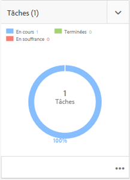

# Projet créatif et intégration à PIM {#creative-project-and-pim-integration}

Si vous êtes spécialiste du marketing ou professionnel de la création, vous pouvez utiliser les outils Projet de création d’Adobe Experience Manager (AEM) pour gérer la photographie de produits liés à l’e-commerce et les processus de création associés au sein de votre organisation.

Vous pouvez utiliser la fonction Projet de création pour simplifier les tâches suivantes du workflow de séance photo :

* Génération d’une demande de séance photo
* Téléchargement d’une séance photo
* Collaboration sur une séance photo
* Modules de ressources approuvées

>[!NOTE]
>
>Voir [Rôles utilisateur du projet pour plus d’informations](/help/sites-authoring/projects.md#user-roles-in-a-project) lors de l’affectation de rôles utilisateur et de workflows à certains types d’utilisateurs.

## Workflows de séance photo de produit  {#exploring-product-photo-shoot-workflows}

La fonction Projet de création fournit divers modèles de projet pour satisfaire aux différentes exigences des projets. Le modèle **Projet de séance photo du produit** est prêt à l’emploi. Ce modèle comprend des processus de séance photo qui vous permettent de lancer et de gérer des demandes de séance photo de produit. Il comprend également une série de tâches qui vous permettent d’obtenir des images numériques des produits par l’intermédiaire de processus de révision et d’approbation appropriés.

## Création d’un projet de séance photo de produit {#create-a-product-photo-shoot-project}

1. Dans le **Projets** console, cliquez sur **Créer** puis choisissez **Créer un projet** dans la liste.

   

1. Dans le **Créer un projet** , sélectionnez **Projet de séance photo du produit** modèle et cliquez sur **Suivant**.

   

1. Saisissez les détails du projet, notamment le titre, la description et l’échéance. Ajoutez des utilisateurs et attribuez-leur différents rôles. Vous pouvez également ajouter une miniature pour le projet.

   

1. Cliquez sur **Créer**. Un message de confirmation indique que le projet est créé.
1. Cliquez sur **Terminé** pour revenir au **Projets** console. Vous pouvez également cliquer sur **Ouvrir** pour afficher les ressources du projet.

## Commencer à travailler dans un projet de séance photo de produit {#starting-work-in-a-product-photo-shoot-project}

Pour lancer une demande de séance photo, cliquez sur un projet, puis sur **Ajouter un travail** dans la page des détails du projet pour démarrer un workflow.


Un **projet de séance photo de produit** comprend les workflows prêts à l’emploi suivants :

* **Workflow Séance photo du produit (Intégration de commerce)**: ce workflow utilise l’intégration commerciale au système de gestion de l’information sur les produits (PIM) pour générer automatiquement une liste de plans pour les produits sélectionnés (hiérarchie). Vous pouvez afficher les données de produit parmi les métadonnées des ressources une fois que le workflow est terminé.
* **Workflow de séance photo de produit** : ce workflow vous permet de fournir une liste de plans au lieu de dépendre de l’intégration de Commerce. Il mappe les images chargées à un fichier CSV dans le dossier des ressources du projet.

Utilisez le workflow **Séance photo de produit (intégration de Commerce)** pour mapper les ressources d’images aux produits dans AEM. Ce workflow utilise l’intégration commerciale pour lier les images approuvées aux données de produit existantes à l’emplacement `/etc/commerce`.

Le workflow de **séance photo de produit (intégration de Commerce)** comprend les tâches suivantes :

* Créer une liste de plans
* Charger la séance photo
* Retoucher la séance photo
* Réviser et approuver
* Déplacer vers la tâche de production

Si les informations produit ne sont pas disponibles dans AEM, utilisez le workflow **Séance photo de produit** pour associer les ressources d’images aux produits en fonction des détails que vous chargez dans un fichier CSV. Le fichier CSV doit contenir des informations de base sur le produit, telles que l’ID, la catégorie et la description du produit. Le workflow récupère les ressources approuvées pour les produits.

Ce workflow comprend les tâches suivantes :

* Chargement de la liste de plans
* Charger la séance photo
* Retoucher la séance photo
* Réviser et approuver
* Déplacer vers la tâche de production

Vous pouvez personnaliser ce workflow à l’aide de l’option de configuration des workflows.

Les deux workflows incluent des étapes pour lier les produits à leurs ressources approuvées. Chaque workflow comprend les étapes suivantes :

* Configuration du workflow : décrit les options de personnalisation du workflow.
* Lancement d’un workflow de projet : explique comment lancer une séance photo de produit.
* Détails des tâches de workflow : fournit des détails sur les tâches disponibles dans le workflow.

## Suivi de la progression du projet {#tracking-project-progress}

Vous pouvez suivre la progression d’un projet en surveillant les tâches actives/terminées au sein d’un projet.

Utilisez les éléments suivants pour surveiller la progression d’un projet :

* Carte des tâches
* Liste des tâches

La carte des tâches représente la progression globale du projet. Elle s’affiche sur la page Détails du projet si celui-ci contient des tâches associées. La carte des tâches affiche le statut d’achèvement actuel du projet en fonction du nombre de tâches terminées. Elle n’inclut pas les tâches ultérieures.

La carte des tâches contient les informations suivantes :

* Pourcentage de tâches actives
* Pourcentage de tâches terminées


La liste des tâches fournit des informations détaillées sur la tâche active du workflow pour le projet. Pour afficher la liste, cliquez sur la carte de la tâche. La liste des tâches affiche également des métadonnées telles que la date de début, l’échéance, le cessionnaire, la priorité et le statut de la tâche.


## Configuration du workflow {#workflow-configuration}

Cette tâche implique d’affecter des étapes de workflow aux utilisateurs en fonction de leur rôle.

Pour configurer la variable **Séance photo du produit** workflow :

1. Accédez à **Outils** > **Workflows**, puis sélectionnez la variable **Modèles** pour ouvrir la mosaïque **Modèles de processus** page.
1. Sélectionnez la variable **Séance photo du produit** et sélectionnez la variable **Modifier** dans la barre d’outils pour l’ouvrir en mode d’édition.

   

1. Dans la page du workflow **Séance photo de produit**, ouvrez une tâche de projet. Par exemple, ouvrez la tâche **Charger la liste de plans**.

   

1. Cliquez sur le bouton **Tâche** pour configurer les éléments suivants :

   * Nom de la tâche
   * Utilisateur par défaut (rôle) qui reçoit la tâche
   * Priorité par défaut de la tâche, affichée dans la liste des tâches de l’utilisateur
   * Description de la tâche à afficher lorsque la personne désignée ouvre la tâche
   * Date d’échéance d’une tâche, calculée en fonction de l’heure à laquelle la tâche a commencé

1. Cliquez sur **OK** pour enregistrer les paramètres de configuration.

Vous pouvez configurer de la même manière les tâches supplémentaires pour la **Séance photo de produit**.

Suivez la même procédure pour configurer les tâches dans le **workflow Séance photo de produit (intégration de Commerce)**.

## Démarrage d’un workflow de projet {#starting-a-project-workflow}

Cette section décrit comment intégrer la gestion des informations produit (PIM) à votre projet de création.

1. Accédez à un projet de séance photo de produit, puis cliquez sur le bouton **Ajouter un travail** sur l’icône **Workflows** carte.
1. Sélectionnez le workflow **Séance photo de produit (intégration de Commerce)** pour démarrer le workflow **Séance photo de produit (intégration de Commerce)**. Si les informations produit ne sont pas disponibles sous `/etc/commerce`, sélectionnez le workflow **Séance photo de produit** et lancez le workflow **Séance photo de produit**.

   

1. Cliquez sur **Suivant** pour lancer le workflow dans le projet.
1. Saisissez les détails du workflow sur la page suivante.

   

1. Cliquez sur **Envoyer** pour démarrer le processus de séance photo. La page de détails du projet de séance photo s’affiche.

   

### Détails des tâches de workflow {#workflow-tasks-details}

Le workflow de séance photo comprend plusieurs tâches. Chaque tâche est affectée à un groupe d’utilisateurs en fonction de la configuration définie pour la tâche.

#### Tâche Créer une liste de plans {#create-shot-list-task}

La tâche **Créer une liste de plans** permet au propriétaire du projet de sélectionner les produits pour lesquels des images sont requises. Selon l’option sélectionnée par l’utilisateur, un fichier CSV est généré avec les informations de base sur les produits.

1. Dans le dossier du projet, cliquez sur le bouton représentant des points de suspension en bas à droite de l’événement [Carte des tâches](#tracking-project-progress) pour afficher l’élément de tâche dans le workflow.

   

1. Sélectionnez la variable **Créer une liste de plans** , puis cliquez sur le bouton **Ouvrir** dans la barre d’outils.

   

1. Vérifiez les détails de la tâche, puis cliquez sur le bouton **Créer une liste de plans** bouton .

   

1. Sélectionnez les produits pour lesquels des données de produit existent sans images associées.

   

1. Cliquez sur le bouton **Ajouter à la liste de plans** pour créer un fichier CSV contenant la liste de tous ces produits. Un message confirme la création de la liste de plans pour les produits sélectionnés. Cliquez sur **Fermer** pour terminer le workflow.

1. Après avoir créé une liste de plans, la variable **Afficher la liste de plans** s’affiche. Pour ajouter d’autres produits à la liste de plans, cliquez sur **Ajouter à la liste de plans**. Dans ce cas, les données sont ajoutées à la liste de plans créée.

   

1. Cliquez sur **Afficher la liste de plans** pour afficher la nouvelle liste de plans.

   

   Pour modifier les données existantes ou ajouter de nouvelles données, cliquez sur **Modifier** dans la barre d’outils. Seuls les champs **Produit** et **Description** sont modifiables.

   

   Une fois le fichier mis à jour, cliquez sur **Enregistrer** sur la barre d’outils pour enregistrer le fichier.

1. Après avoir ajouté les produits, cliquez sur l’icône **Terminer** sur l’icône **Créer une liste de plans** page détails de la tâche pour marquer la tâche comme terminée. Vous pouvez ajouter un commentaire facultatif.

La fin de la tâche introduit les modifications suivantes dans le projet :

* Les ressources correspondant à la hiérarchie des produits sont créées dans un dossier portant le même nom que le titre du workflow.
* Les métadonnées des ressources peuvent être modifiées à l’aide de la console Ressources, avant même que le photographe ne fournisse les images.
* Un dossier Séance photo est créé pour stocker les images fournies par le photographe. Ce dossier de séance photo contient des sous-dossiers pour chaque entrée de produit figurant dans la liste de plans.

### Charger une tâche de liste de plans {#upload-shot-list-task}

Cette tâche fait partie du workflow Séance photo du produit . Vous effectuez cette tâche si les informations sur les produits ne sont pas disponibles dans AEM. Dans ce cas, vous téléchargez une liste de produits dans un fichier CSV pour lequel des ressources d’image sont requises. En fonction des détails du fichier CSV, vous mappez les ressources d’images aux produits. Le fichier doit être un fichier CSV nommé `shotlist.csv`.

Utilisez la variable **Afficher la liste de plans** lien sous la carte du projet dans la procédure précédente pour télécharger un exemple de fichier CSV. Consultez le fichier d’exemple pour connaître le contenu habituel d’un fichier CSV.

La liste de produits ou le fichier CSV peut contenir des champs, tels que **Catégorie, Produit, Id, Description**, et **Chemin**. Le champ **ID** est obligatoire et contient l’ID du produit. Les autres champs sont facultatifs.

Un produit peut appartenir à une catégorie particulière. La catégorie du produit peut être indiquée dans le fichier CSV sous la colonne **Catégorie**. Le champ **Produit** contient le nom du produit. Dans le champ **Description**, saisissez la description du produit ou les instructions pour le photographe.

1. Dans le dossier du projet, cliquez sur le bouton représentant des points de suspension en bas à droite de l’événement [Carte des tâches](#tracking-project-progress) pour afficher la liste des tâches du workflow.
1. Sélectionnez la variable **Transférer la liste de plans** , puis cliquez sur le bouton **Ouvrir** dans la barre d’outils.

   

1. Vérifiez les détails de la tâche, puis cliquez sur le bouton **Transférer la liste de plans** bouton .

   

1. Cliquez sur le bouton **Transférer la liste de plans** pour télécharger le fichier CSV. Le workflow reconnaît ce fichier comme une source à utiliser pour extraire les données de produit pour la tâche suivante.
1. Téléchargez un fichier CSV contenant les informations sur les produits au format approprié. Le lien **Afficher les ressources chargées** s’affiche sous la carte une fois le fichier CSV chargé.

   

   Cliquez sur l’icône **Terminé** pour terminer la tâche.

1. Cliquez sur l’icône **Terminé** pour terminer la tâche.

### Tâche Charger la séance photo {#upload-photo-shoot-task}

Si vous êtes un éditeur, vous pouvez charger des plans pour les produits répertoriés dans le fichier **shotlist.csv** créé ou chargé lors de la tâche précédente.

Les noms des images à charger doivent commencer par `<ProductId_>` où `ProductId` est référencé à partie du champ **Id** dans le fichier `shotlist.csv`. Par exemple, pour un produit dans la liste de plans portant l’**ID** `397122`, vous pouvez charger des fichiers avec les noms `397122_highcontrast.jpg`, `397122_lowlight.png`, etc.

Vous pouvez charger les images directement ou charger un fichier ZIP contenant les images. En fonction de leurs noms, les images sont placées à l’intérieur des dossiers de leurs produits respectifs au sein du dossier Séance photo.

1. Sous le dossier du projet, cliquez sur le bouton représentant des points de suspension en bas à droite de l’objet [Task Card](#tracking-project-progress) pour afficher l’élément de tâche dans le workflow.
1. Sélectionnez la variable **Télécharger la séance photo** , puis cliquez sur le bouton **Ouvrir** dans la barre d’outils.

   

1. Cliquez sur **Télécharger la séance photo** et téléchargez les photos.
1. Cliquez sur le bouton **Terminer** dans la barre d’outils pour terminer la tâche.

### Tâche Retoucher la séance photo {#retouch-photo-shoot-task}

Si vous disposez de droits de modification, effectuez la tâche **Retoucher la séance photo** afin de modifier les images chargées dans le dossier Séance photo.

1. Sous le dossier du projet, cliquez sur le bouton représentant des points de suspension en bas à droite de l’événement [Task Card](#tracking-project-progress) pour afficher l’élément de tâche dans le workflow.
1. Sélectionnez la variable **Retoucher la séance photo** , puis cliquez sur le bouton **Ouvrir** dans la barre d’outils.

   

1. Cliquez sur le bouton **Affichage des ressources téléchargées** dans le **Retoucher la séance photo** pour parcourir les images téléchargées.

   

   Si nécessaire, modifiez les images à l’aide d’une application Adobe Creative Cloud.

   

1. Cliquez sur le bouton **Terminer** dans la barre d’outils pour terminer la tâche.

### Tâche de révision et d’approbation {#review-and-approve-task}

Dans cette tâche, vous passez en revue les images de la séance photo téléchargées par un photographe et marquez les images comme approuvées pour utilisation.

1. Sous le dossier du projet, cliquez sur le bouton représentant des points de suspension en bas à droite de l’objet [Task Card](#tracking-project-progress) pour afficher l’élément de tâche dans le workflow.
1. Sélectionnez la variable **Réviser et approuver** , puis cliquez sur le bouton **Ouvrir** dans la barre d’outils.

   

1. Dans le **Réviser et approuver** , affectez la tâche de révision à un rôle, puis cliquez sur **Réviser** pour commencer à consulter les images de produit chargées.

   

1. Sélectionnez une image de produit, puis cliquez sur le bouton **Approuver** dans la barre d’outils pour la marquer comme approuvée. Une fois que vous avez approuvé une image, une bannière « Approuvée » s’affiche par-dessus.

   

1. Cliquez sur **Terminer**. Les images approuvées sont liées aux ressources vides qui ont été créées.

Vous pouvez laisser certains produits sans image. Vous pourrez ensuite revoir la tâche et la marquer comme terminée une fois terminée.

Vous pouvez accéder aux ressources du projet à l’aide de l’interface utilisateur Ressources et vérifier les images approuvées.

Cliquez sur le niveau suivant pour afficher les produits selon votre hiérarchie de données de produit.

La fonction Projet de création associe les ressources approuvées au produit référencé. Les métadonnées de la ressource sont mises à jour avec les informations de base et la référence du produit sous l’onglet **Données de produit** sous les Propriétés de la ressource, et elles apparaissent dans la section Métadonnées des ressources AEM.

>[!NOTE]
>
>Dans le **workflow Séance photo du produit** (sans intégration de Commerce), les images approuvées n’ont aucune association avec des produits.

### Déplacer vers la tâche de production {#move-to-production-task}

Cette tâche déplace les ressources approuvées dans le dossier Prêt pour la production afin de les rendre disponibles pour utilisation.

1. Sous le dossier du projet, cliquez sur le bouton représentant des points de suspension en bas à droite de l’objet [Task Card](#tracking-project-progress) pour afficher l’élément de tâche dans le workflow.
1. Sélectionnez la variable **Déplacer vers la production** , puis cliquez sur le bouton **Ouvrir** dans la barre d’outils.

   

1. Pour afficher les ressources approuvées pour la séance photo avant de les déplacer dans le dossier Prêt pour l’exploitation, cliquez sur le lien **Afficher les ressources approuvées** situé au-dessous de la miniature du projet sur la page de la tâche **Déplacer en exploitation**.

   

1. Saisissez le chemin du dossier Prêt pour l’exploitation dans le champ **Déplacer vers**.

   

1. Cliquez sur **Déplacer vers la production**. Fermez le message de confirmation. Les ressources sont déplacées dans le chemin spécifié et une visionneuse à 360° est créée automatiquement pour les ressources approuvées pour chaque produit en fonction de la hiérarchie des dossiers.

1. Cliquez sur le bouton **Terminer** dans la barre d’outils. Le workflow se termine lorsque la dernière étape est marquée comme étant terminée.

## Affichage des métadonnées des ressources de gestion des actifs numériques {#viewing-dam-asset-metadata}

Après votre approbation, les ressources sont liées aux produits correspondants. La [page des propriétés](/help/assets/manage-assets.md#editing-properties) des ressources approuvées comprend maintenant un nouvel onglet **Données du produit** (les informations sur les produits liés) Cet onglet affiche les détails du produit, le numéro de SKU ainsi que d’autres détails relatifs au produit lié à la ressource. Cliquez sur le bouton **Modifier** pour mettre à jour une propriété de ressource. Les informations relatives aux produits restent en lecture seule.

Cliquez sur le lien qui s’affiche pour accéder à la page des détails du produit correspondante dans la console du produit à laquelle la ressource est associée.

## Personnalisation des workflows de séance photo du projet {#customizing-the-project-photo-shoot-workflows}

Vous pouvez personnaliser les workflows de **séance photo du projet** en fonction de vos besoins. Il s’agit d’une tâche facultative, basée sur les rôles, que vous effectuez pour définir la valeur d’une variable dans le projet. Par la suite, vous pourrez utiliser la valeur configurée pour prendre une décision.

1. Cliquez sur le logo AEM, puis accédez à **Outils** > **Workflow** > **Modèles** pour ouvrir le **Modèles de processus** page.
1. Sélectionnez la variable **Séance photo du produit (intégration Commerce)** ou le workflow **Séance photo du produit** workflow et clic **Modifier** de la barre d’outils pour ouvrir le workflow en mode d’édition.
1. Ouvrez le panneau latéral et localisez l’étape **Créer une tâche de projet basée sur un rôle** et faites-la glisser sur le workflow.

   

1. Ouvrez l’étape **Tâche basée sur le rôle**.
1. Sous l’onglet **Tâche**, saisissez le nom de la tâche qui s’affichera dans la liste des tâches. Vous pouvez également affecter la tâche à un rôle, définir la priorité par défaut, fournir une description et spécifier l’échéance de la tâche.

   

1. Sous l’onglet **Transmission**, spécifiez les actions pour la tâche. Pour ajouter plusieurs actions, cliquez sur le bouton **Ajouter un élément** lien.

   

1. Après avoir ajouté les options, cliquez sur **OK** pour ajouter les modifications à l’étape.

1. De retour dans le **Modèle de workflow** clic sur la fenêtre **Synchronisation** pour enregistrer les modifications de l’ensemble du workflow. Appuyer ou cliquer sur **OK** pour cette étape n’enregistre pas les modifications dans le workflow. Pour enregistrer les modifications dans le workflow, cliquez sur **Synchronisation**.

1. Ouvrez le panneau latéral et localisez le workflow **Atteindre l’étape** et faites-le glisser sur le workflow.

1. Ouvrez le **Atteindre** et cliquez sur le bouton **Processus** .

1. Sélectionnez l’**Étape cible** souhaitée et spécifier que l’**Expression de transmission** est un script ECMA. Indiquez ensuite le code suivant dans le champ **Script** :

   ```javascript
   function check() {
   
   if (workflowData.getMetaDataMap().get("lastTaskAction","") == "Reject All") {
   
   return true
   
   }
   
   // set copywriter user in metadata
   
   var previousId = workflowData.getMetaDataMap().get("lastTaskCompletedBy", "");
   
   workflowData.getMetaDataMap().put("copywriter", previousId);
   
   return false;
   
   }
   ```

   >[!TIP]
   >
   >Pour plus d’informations sur la création de scripts dans les étapes d’un workflow, consultez la section [Définition d’une règle de division OU](/help/sites-developing/workflows-models.md).

   

1. Cliquez sur **OK**.

1. Cliquez sur **Synchronisation** pour enregistrer le workflow.

Une nouvelle tâche apparaît une fois la tâche [Déplacer en exploitation](#move-to-production-task) terminée et est affectée au propriétaire.

L’utilisateur avec le rôle de **propriétaire** peut terminer la tâche et sélectionner une action (parmi la liste des actions ajoutées dans les configurations d’étape de workflow) à partir de la liste dans la fenêtre contextuelle de commentaires.

>[!NOTE]
>
>Lorsque vous démarrez un serveur, le servlet de liste des tâches du projet met en cache les mappages entre les types de tâches et les URL définis sous `/libs/cq/core/content/projects/tasktypes`. Vous pouvez ensuite exécuter le recouvrement habituel et ajouter des types de tâches personnalisés en les plaçant sous `/apps/cq/core/content/projects/tasktypes`.
