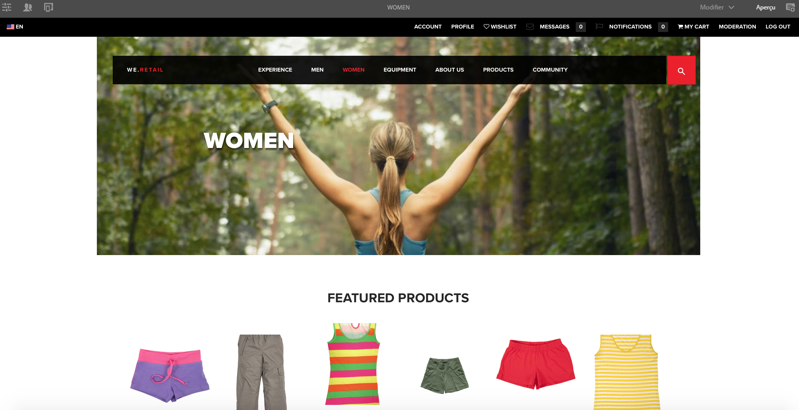

# Création d’une page pour les appareils mobiles{#authoring-a-page-for-mobile-devices}

Lorsque vous créez une page mobile, celle-ci est affichée d’une manière qui émule le périphérique mobile. Lorsque vous créez une page, vous pouvez basculer entre plusieurs émulateurs pour voir ce que l’utilisateur voit lorsqu’il accède à la page.

Les périphériques sont regroupés en fonction des catégories : fonction, intelligent et tactile, selon les fonctionnalités des périphériques pour effectuer le rendu d’une page. Lorsque l’utilisateur final accède à une page mobile, AEM détecte le périphérique et envoie la représentation qui correspond à son groupe de périphériques.

>[!NOTE]
>
>Pour créer un site mobile en fonction d’un site standard existant, créez une Live Copy du site standard. (See [Creating a Live Copy for Different Channels](/help/sites-administering/msm-livecopy.md).)
>
>Les développeurs d’AEM peuvent créer de nouveaux groupes d’appareils. (See [Creating Device Group Filters](/help/sites-developing/groupfilters.md).)

Utilisez la procédure suivante pour créer une page mobile :

1. À partir de la navigation globale, ouvrez la console **Sites**.
1. Open the page **We.Retail** -> **United States** -> **English**.

1. Switch to **Preview** mode.
1. Basculez vers l’émulateur de votre choix en cliquant sur l’icône de périphérique située en haut de la page.
1. Faites glisser les composants à partir du navigateur de composants et déposez-les sur la page.

La page ressemble à ce qui suit :

>[!NOTE]
>
>Les émulateurs sont désactivés lorsqu’une page de l’instance de création est demandée à partir d’un appareil mobile.

