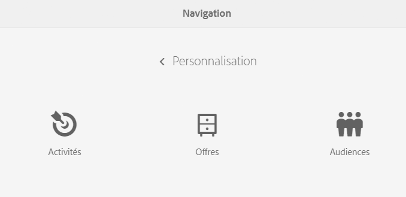
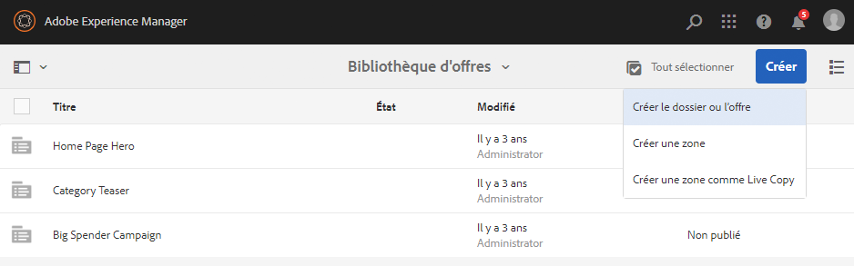
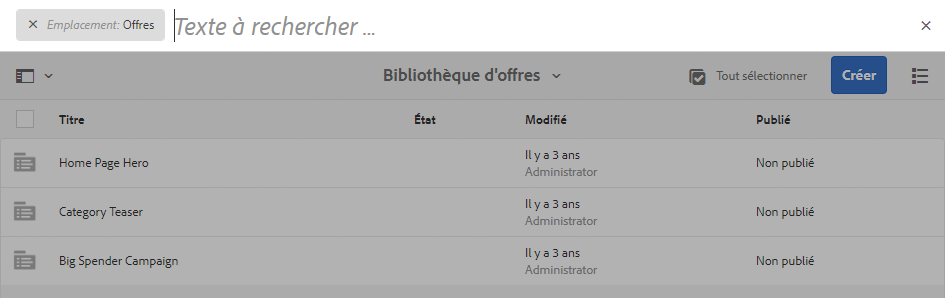

# Création et gestion d’offres  {#creating-and-managing-offers}

Utilisez la console Offres pour créer des offres que vous pourrez [utiliser dans le cadre d’expériences associées à des activités](/help/sites-authoring/content-targeting-touch.md). La création d’offres dans la console Offres permet de gagner du temps lorsque plusieurs expériences nécessitent la même offre :

* Créez l’offre une fois dans la bibliothèque et utilisez-la pour plusieurs expériences associées aux activités de votre marque.
* Modifiez l’offre dans la bibliothèque. Les modifications se répercutent sur toutes les expériences qui l’utilisent.

La console Offres trie les offres par marque. Chaque marque contient une bibliothèque d’offres qui peuvent être utilisées dans les expériences d’une marque. Utilisez des dossiers pour organiser hiérarchiquement les offres dans chaque bibliothèque. Une structure de dossiers logique permet aux auteurs de retrouver facilement des offres en les parcourant. Les outils de balisage et de recherche permettent également aux auteurs de retrouver des offres pertinentes.

## Ajout d’une marque dans la console Offres   {#add-a-brand-using-the-offers-console}

Créez une marque à laquelle vos offres sont associées. Ouvrez une marque dans la console Offres pour accéder à la bibliothèque d’offres dans laquelle vous pouvez créer des dossiers et des offres.

Lorsque vous créez une marque à l’aide de la console Offres, elle s’affiche également dans la console [Activités](/help/sites-authoring/activitylib.md) où vous pouvez ajouter et gérer des activités relatives à la marque.

1. Dans la console de navigation, cliquez ou appuyez sur **Personnalisation** > **Offres**.

   

1. Cliquez ou appuyez sur **Créer**, puis sur **Créer** **une marque**.
1. Sélectionnez un modèle de marque et cliquez ou appuyez sur **Suivant**.
1. Saisissez un titre pour la marque tel qu’il doit apparaître dans les consoles Offres et Activités. Si vous le souhaitez, saisissez ou sélectionnez une ou plusieurs balises à associer à la marque.
1. Cliquez ou appuyez sur **Créer**.

## Ajout d’un fichier à une bibliothèque d’offres   {#add-a-folder-to-an-offer-library}

Ajoutez un dossier à la bibliothèque d’offres d’une marque pour y organiser et y stocker les offres. Vous pouvez créer un dossier sous la marque ou sous d’autres dossiers.

1. Dans la console Offres, ouvrez l’emplacement où vous souhaitez créer le dossier. Par exemple, ouvrez la marque pour créer un dossier de niveau supérieur ou ouvrez un autre dossier de la bibliothèque.
1. Cliquez ou appuyez sur **Créer** > **Créer le dossier ou l’offre**.

   

1. Sélectionnez **Dossier**, puis cliquez sur **Suivant**.
1. Entrez un titre pour le dossier tel qu’il doit apparaître dans la bibliothèque d’offres et saisissez ou sélectionnez des balises.

   

1. Cliquez ou appuyez sur **Créer**.

## Ajout d’une offre à une bibliothèque d’offres   {#add-an-offer-to-an-offer-library}

Ajoutez une offre à la bibliothèque d’offres d’une marque afin de pouvoir l’ajouter à des expériences liées à cette marque. Lorsque vous ajoutez une offre, il convient de saisir un titre. Vous pouvez également associer l’offre à une ou plusieurs balises pour optimiser la recherche.

Après avoir créé l’offre, vous pouvez l’ouvrir pour en modifier le contenu.

1. Dans la console Offres, ouvrez l’emplacement où vous souhaitez créer l’offre. Par exemple, ouvrez la marque pour créer une offre de niveau supérieur ou ouvrez un dossier de la bibliothèque.
1. Cliquez ou appuyez sur **Créer** > **Créer le dossier ou l’offre**.

   

1. Sélectionnez le modèle **Page d’offre**, puis cliquez ou appuyez sur **Suivant**.
1. Saisissez le titre de l’offre et, le cas échéant, sélectionnez ou entrez une ou plusieurs balises à associer à l’offre, puis cliquez ou appuyez sur **Créer**.
1. Dans la boîte de dialogue de confirmation, pour ouvrir l’offre à modifier, cliquez ou appuyez sur **Ouvrir la page**.

## Modification d’une offre {#editing-an-offer}

Ouvrez une offre et modifiez le contenu tel qu’il doit apparaître dans les expériences qui l’utilisent. Lorsque vous modifiez une offre utilisée dans des expériences, les modifications se répercutent dans les expériences.

Vous pouvez ouvrir une offre à partir d’un dossier d’une bibliothèque d’offres ou à partir des résultats d’une recherche. Vous pouvez le faire à partir d’une expérience qui utilise l’offre en question.

1. Dans la console Offres, cliquez ou appuyez sur l’icône située en regard de l’offre, puis sur **Modifier**.
1. Ajoutez des composants à l’offre et publiez le contenu en suivant la procédure habituelle.

## Suppression d’une offre   {#deleting-an-offer}

Supprimez une offre lorsqu’elle n’est plus nécessaire. Si vous essayez de supprimer une offre utilisée dans une expérience, vous êtes invité à confirmer la suppression. La confirmation supprime l’offre et la retire également des expériences.

Vous pouvez supprimer une offre tout en affichant le contenu des dossiers de la bibliothèque d’offres ou les résultats d’une recherche.

1. Dans la console Offres, cliquez ou appuyez sur l’icône située en regard de l’offre, puis sur **Supprimer**.

   Sélectionnez l’offre et cliquez ou appuyez sur **Supprimer**.

1. Dans la boîte de dialogue qui s’affiche, cliquez ou appuyez sur **Supprimer** pour confirmer la suppression.
1. Si l’offre est utilisée dans une ou plusieurs expériences, une boîte de dialogue s’ouvre pour indiquer que l’offre est référencée :

   * Pour supprimer l’offre et la retirer des expériences, cliquez ou appuyez sur **Forcer la suppression**.
   * Pour conserver l’offre, cliquez ou appuyez sur **Annuler**.

## Recherche d’offres   {#searching-for-offers}

Recherchez les offres d’une marque quelconque à l’aide de mots-clés correspondant à leur titre.

Les critères de recherche actuels sont visibles en regard des résultats de la recherche. Vous pouvez également trier les résultats par colonne, dans l’ordre croissant ou décroissant. Vous pouvez effectuer une recherche à partir de n’importe quel dossier, dans n’importe quelle bibliothèque d’offres. Les résultats de la recherche restent les mêmes, quel que soit le dossier actif.

Pour rechercher des offres :

1. En haut de la console Offres, cliquez ou appuyez sur l’icône en forme de loupe. Par défaut, la recherche se limite aux offres.
1. Entrez un mot-clé pour rechercher des offres. Faites votre choix parmi les résultats.
