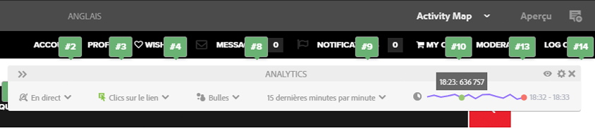

# Affichage des données d’analyse de page{#seeing-page-analytics-data}

Utilisez les données d’analyse de page pour évaluer l’efficacité du contenu de la page.

## Analytics visible à partir de la console {#analytics-visible-from-the-console}

Les données d’analyse de page s’affichent dans [Mode Liste](/help/sites-authoring/basic-handling.md#list-view) de la console Sites. Lorsque les pages sont affichées au format liste, les colonnes suivantes sont disponibles par défaut :

* Pages vues
* Visiteurs uniques
* Temps sur la page

Chaque colonne indique une valeur pour la période de création de rapports actuelle et indique également si la valeur a augmenté ou diminué depuis la période de création de rapports précédente. Les données que vous voyez sont mises à jour toutes les 12 heures.

>[!NOTE]
>
>Pour modifier la période de mise à jour, [configuration de l’intervalle d’importation](/help/sites-administering/adobeanalytics-connect.md#configuring-the-import-interval).

1. Ouvrez la console **Sites** (par exemple, [http://localhost:4502/sites.html/content](http://localhost:4502/sites.html/content)).
1. À l’extrême droite de la barre d’outils (dans le coin supérieur droit), appuyez ou cliquez sur l’icône pour sélectionner **Vue Liste** (l’icône affichée dépendra de la [vue actuelle](/help/sites-authoring/basic-handling.md#viewing-and-selecting-resources)).

1. Encore une fois, à l’extrémité droite de la barre d’outils (coin supérieur droit), cliquez ou appuyez sur l’icône, puis sélectionnez **Paramètres d’affichage**. Le **Configuration des colonnes** s’ouvre. Apportez les modifications requises et confirmez-les avec la commande **Mettre à jour**.

   

### Sélection de la période de création de rapports {#selecting-the-reporting-period}

Sélectionnez la période de création de rapports pour laquelle les données Analytics apparaissent sur la console Sites :

* Données des 30 derniers jours
* Données des 90 derniers jours
* Données de cette année

La période de création de rapports actuelle apparaît sur la barre d’outils de la console Sites (à droite dans la barre d’outils supérieure). Utilisez le menu déroulant pour sélectionner la période de création de rapports requise.

### Configuration des colonnes de données disponibles {#configuring-available-data-columns}

Les membres du groupe d’utilisateurs analytics-administrateurs peuvent configurer la console Sites pour permettre aux auteurs d’afficher des colonnes Analytics supplémentaires.

>[!NOTE]
>
>Lorsqu’une arborescence de pages contient des enfants associés à différentes configurations de cloud Adobe Analytics, vous ne pouvez pas configurer les colonnes de données disponibles pour les pages.

1. Dans la vue Liste, utilisez les sélecteurs de vue (à droite de la barre d’outils), sélectionnez **Afficher les paramètres**, puis **Ajouter des données d’analyse personnalisées**.

   

1. Sélectionnez les mesures à présenter aux auteurs dans la console Sites, puis cliquez sur **Ajouter**.

   Les colonnes affichées sont obtenues à partir d’Adobe Analytics.

   

### Ouverture de Content Insights à partir de la console Sites {#opening-content-insights-from-sites}

Ouvrez [Content Insight](/help/sites-authoring/content-insights.md) à partir de la console Sites pour continuer à évaluer en détail l’efficacité des pages.

1. Dans la console Sites, sélectionnez la page pour laquelle vous souhaitez afficher Content Insights.
1. Dans la barre d’outils, cliquez sur l’icône Analytics et Recommendations .

   

## Les données d’analyse sont visibles dans l’éditeur de page (Activity Map) {#analytics-visible-from-the-page-editor-activity-map}

>[!NOTE]
>
>Elles s’affichent si la [Activity Map a été configurée](/help/sites-administering/adobeanalytics-connect.md#configuring-for-the-activity-map) pour votre site web.

>[!NOTE]
>
>Les données de l’Activity Map proviennent d’Adobe Analytics.

Si votre site web a été [configuré pour Adobe Analytics](/help/sites-administering/adobeanalytics-connect.md), vous pouvez utiliser le [mode Activity Map](/help/sites-authoring/author-environment-tools.md#page-modes) pour afficher les données pertinentes. Par exemple :

### Accès à l’Activity Map {#accessing-the-activity-map}

Après avoir sélectionné le mode [Activity Map](/help/sites-authoring/author-environment-tools.md#page-modes), vous devrez saisir vos données d’identification Adobe Analytics.

Le **Analytics** la barre d’outils flottante s’affiche ; vous pouvez y :

* modifier le format de la barre d’outils à l’aide des deux flèches (**&quot;**)
* Activation ou désactivation des détails de la page (icône représentant un œil)
* Configuration des paramètres d’Activity Map (icône représentant un engrenage)
* Sélection des analyses à afficher (plusieurs sélecteurs de liste déroulante)
* Fermeture d’Activity Map et de la barre d’outils (x)

### Sélection des analyses à afficher {#selecting-the-analytics-to-show}

Vous pouvez sélectionner les données analytiques à afficher et leur mode d&#39;affichage, selon les différents critères :

* **Standard**/**En direct**

* type d’événement
* Groupe d’utilisateurs
* **Bulles**/**Dégradé**/**Gagnants et perdants**/**Off**

* période à afficher

### Configuration du Activity Map {#configuring-the-activity-map}

Utilisez la variable **Afficher les paramètres** pour ouvrir la **Paramètres du Activity Map** boîte de dialogue.

La boîte de dialogue **Paramètres de l’Activity Map** propose plusieurs options, sur trois onglets :

* Général

   * Suite de rapports
   * Nom de page
   * Langue
   * Étiqueter les superpositions avec
   * Taille de police de l’étiquette
   * Couleur du dégradé
   * Couleur de bulle
   * Couleur du dégradé basée sur
   * Transparence du dégradé

* Standard

   * Affichage (type et nombre de liens)
   * Masquer les superpositions pour les liens qui n’ont reçu aucune visite

* En direct

   * Affichage en haut (gagnants ou perdants)
   * Exclure le % inférieur
   * Mise à jour automatique (données et période)
