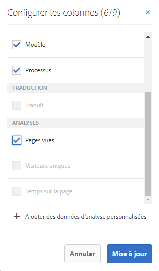
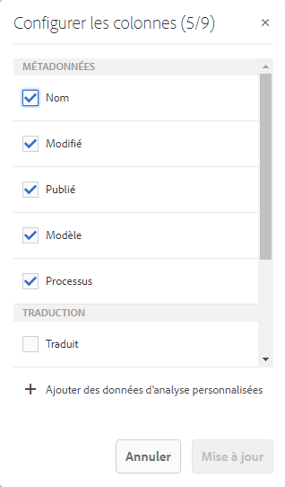

# Affichage des données d’analyse de page{#seeing-page-analytics-data}

Utilisez les données d’analyse de page pour évaluer l’efficacité du contenu de page.

## Analyse visible à partir de la console {#analytics-visible-from-the-console}

Les données d’analyse de page s’affichent dans la [vue liste](/help/sites-authoring/basic-handling.md#list-view) de la console Sites. Lorsque les pages sont affichées au format liste, les colonnes suivantes sont disponibles par défaut :

* Pages vues
* Visiteurs uniques
* Temps sur la page

Chaque colonne indique une valeur pour la période de création de rapports actuelle et indique également si la valeur a augmenté ou diminué depuis la période de création de rapports précédente. Les données affichées sont mises à jour toutes les 12 heures.

>[!NOTE]
>
>Pour modifier la période de mise à jour, [configurez l’intervalle d’importation](/help/sites-administering/adobeanalytics-connect.md#configuring-the-import-interval).

1. Ouvrez le **Sites** console, par exemple : [https://localhost:4502/sites.html/content](https://localhost:4502/sites.html/content)
1. À l’extrême droite de la barre d’outils (coin supérieur droit), cliquez ou appuyez sur l’icône à sélectionner **Mode Liste** (l’icône affichée dépend de la variable [vue actuelle](/help/sites-authoring/basic-handling.md#viewing-and-selecting-resources)).

1. Encore une fois, à l’extrême droite de la barre d’outils (coin supérieur droit), cliquez ou appuyez sur l’icône, puis sélectionnez **Paramètres d’affichage**. La variable **Configuration des colonnes** s’ouvre. Apportez les modifications requises et confirmez-les avec la commande **Mettre à jour**.

   

### Sélectionner la période de création de rapports {#selecting-the-reporting-period}

Sélectionnez la période de création de rapports pour laquelle les données Analytics apparaissent sur la console Sites :

* Données des 30 derniers jours
* Données des 90 derniers jours
* Données de cette année

La période de création de rapports actuelle apparaît sur la barre d’outils de la console Sites (à droite dans la barre d’outils supérieure). Utilisez la liste déroulante pour sélectionner la période de création de rapports requise.

### Configurer les colonnes de données disponibles {#configuring-available-data-columns}

Les membres du groupe d’utilisateurs et d’utilisatrices d’administration d’Analytics peuvent configurer la console Sites pour permettre aux auteurs et aux autrices d’afficher des colonnes Analytics supplémentaires.

>[!NOTE]
>
>Lorsqu’une arborescence de pages contient des enfants associés à différentes configurations d’Adobe Analytics Cloud, vous ne pouvez pas configurer les colonnes de données disponibles pour les pages.

1. Dans la vue Liste, utilisez les sélecteurs de vue (à droite de la barre d’outils), sélectionnez **Afficher les paramètres**, puis **Ajouter des données d’analyse personnalisées**.

   

1. Sélectionnez les mesures à présenter aux auteurs dans la console Sites, puis cliquez sur **Ajouter**.

   Les colonnes affichées sont obtenues à partir d’Adobe Analytics.

   

### Ouverture de Content Insights à partir de la console Sites {#opening-content-insights-from-sites}

Ouvrez [Content Insight](/help/sites-authoring/content-insights.md) à partir de la console Sites pour continuer à évaluer en détail l’efficacité des pages.

1. Dans la console Sites, sélectionnez la page pour laquelle vous souhaitez afficher des Insights sur le contenu.
1. Dans la barre d’outils, cliquez sur l’icône Analytics et Recommendations.

   

## Les données d’analyse sont visibles dans l’éditeur de page (Activity Map) {#analytics-visible-from-the-page-editor-activity-map}

>[!CAUTION]
>
>En raison de modifications de sécurité dans l’API Adobe Analytics, il n’est plus possible d’utiliser la version d’Activity Map incluse dans AEM.
>
>Le [plug-in Activity Map fourni par Adobe Analytics](https://experienceleague.adobe.com/docs/analytics/analyze/activity-map/getting-started/get-started-users/activitymap-install.html?lang=fr) doit désormais être utilisé.
